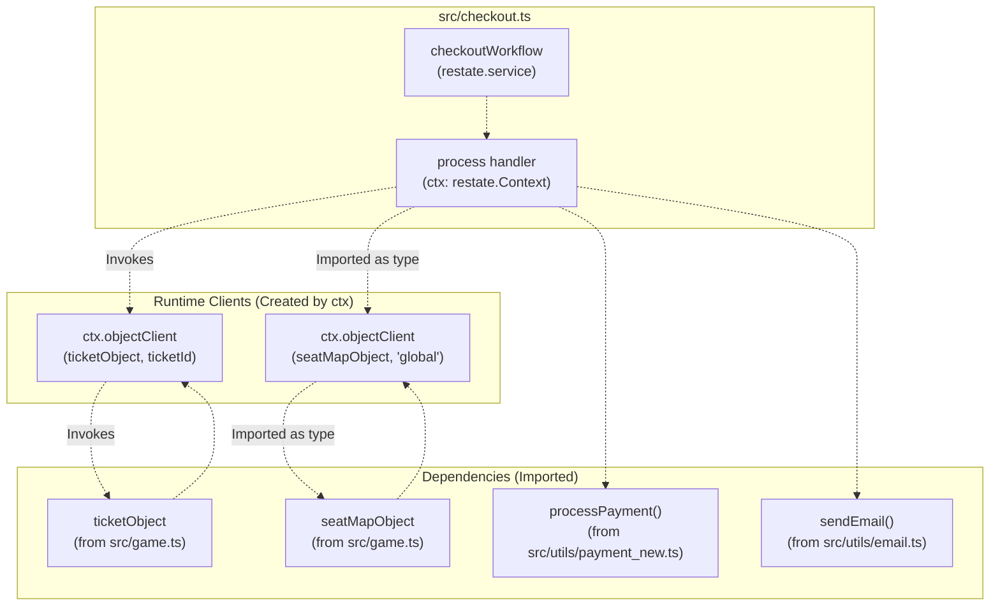
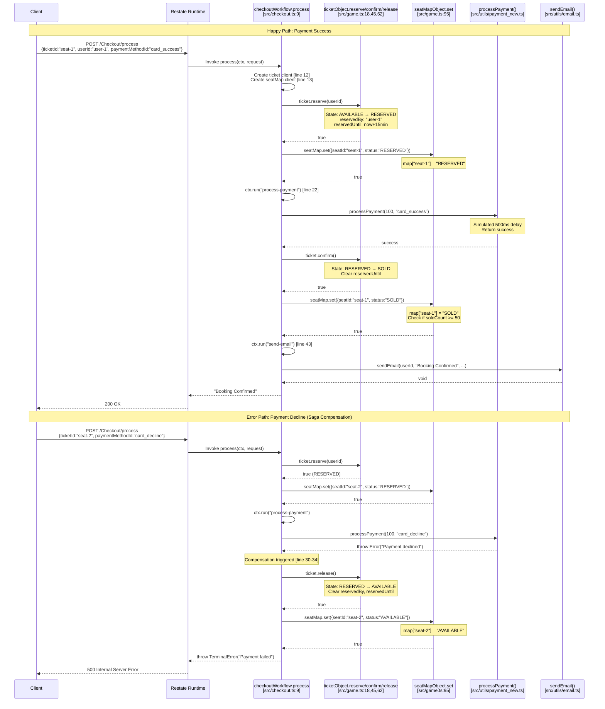
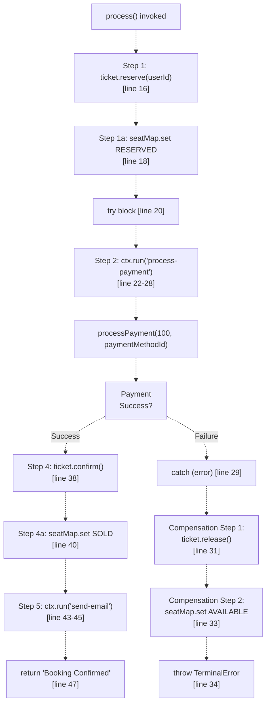
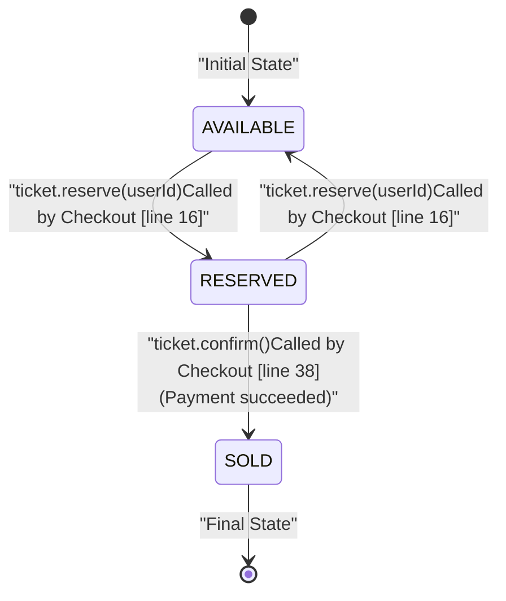

# Checkout Workflow

> **Relevant source files**
> * [README.md](https://github.com/philipz/restate-cloudflare-workers-poc/blob/513fd0f5/README.md)
> * [src/checkout.ts](https://github.com/philipz/restate-cloudflare-workers-poc/blob/513fd0f5/src/checkout.ts)
> * [src/game.ts](https://github.com/philipz/restate-cloudflare-workers-poc/blob/513fd0f5/src/game.ts)

## Purpose and Scope

The Checkout Workflow is a Restate Durable Workflow service that orchestrates the complete ticket purchase process using the Saga pattern. It coordinates seat reservation, payment processing, and final confirmation while ensuring automatic compensation (rollback) if any step fails. This workflow is implemented as a stateless orchestrator that delegates state management to Virtual Objects and wraps external operations in durable execution contexts.

For details on the Virtual Objects managed by this workflow, see [Ticket Virtual Object](/philipz/restate-cloudflare-workers-poc/2.1-ticket-virtual-object) and [SeatMap Virtual Object](/philipz/restate-cloudflare-workers-poc/2.2-seatmap-virtual-object). For payment processing implementation, see [Payment Simulation](/philipz/restate-cloudflare-workers-poc/4.1-payment-simulation). For conceptual background on the Saga pattern, see [Saga Pattern & Compensation](/philipz/restate-cloudflare-workers-poc/8.3-saga-pattern-and-compensation). For durable execution mechanics, see [Durable Execution & ctx.run](/philipz/restate-cloudflare-workers-poc/8.2-durable-execution-and-ctx.run).

**Sources:** [src/checkout.ts L1-L51](https://github.com/philipz/restate-cloudflare-workers-poc/blob/513fd0f5/src/checkout.ts#L1-L51)

 [README.md L14-L16](https://github.com/philipz/restate-cloudflare-workers-poc/blob/513fd0f5/README.md#L14-L16)

---

## Service Definition

The Checkout workflow is defined as a Restate service (not a Virtual Object) in [src/checkout.ts L6-L50](https://github.com/philipz/restate-cloudflare-workers-poc/blob/513fd0f5/src/checkout.ts#L6-L50)

 Unlike Virtual Objects which maintain state per instance, this is a stateless orchestrator that coordinates operations across multiple Virtual Object instances.

```javascript
// Service definition structure
const checkoutWorkflow = restate.service({
    name: "Checkout",
    handlers: {
        process: async (ctx: restate.Context, request: { ... }) => { ... }
    }
});
```

### Service Characteristics

| Characteristic | Value | Description |
| --- | --- | --- |
| **Service Type** | `restate.service` | Stateless orchestrator (not `restate.object`) |
| **Service Name** | `"Checkout"` | Invoked as `/Checkout/process` via Restate |
| **Primary Handler** | `process` | Single entry point for checkout flow |
| **Context Type** | `restate.Context` | Standard workflow context (not `ObjectContext`) |
| **State Management** | Delegated | Does not maintain own state; delegates to Ticket and SeatMap |

The `process` handler accepts a request object containing:

* `ticketId`: The seat identifier (e.g., `"seat-1"`)
* `userId`: The user attempting to purchase
* `paymentMethodId`: Optional payment method, defaults to `"card_success"` for testing

**Sources:** [src/checkout.ts L6-L11](https://github.com/philipz/restate-cloudflare-workers-poc/blob/513fd0f5/src/checkout.ts#L6-L11)

---

## Workflow Architecture

The following diagram shows the actual code entities and their relationships in the Checkout workflow:



**Key Code Entities:**

* **Service Registration**: `checkoutWorkflow` exported from [src/checkout.ts L6](https://github.com/philipz/restate-cloudflare-workers-poc/blob/513fd0f5/src/checkout.ts#L6-L6)
* **Client Creation**: `ctx.objectClient<TicketObject>(ticketObject, ticketId)` at [src/checkout.ts L12](https://github.com/philipz/restate-cloudflare-workers-poc/blob/513fd0f5/src/checkout.ts#L12-L12)
* **Client Creation**: `ctx.objectClient(seatMapObject, "global")` at [src/checkout.ts L13](https://github.com/philipz/restate-cloudflare-workers-poc/blob/513fd0f5/src/checkout.ts#L13-L13)
* **Durable Execution**: `ctx.run("process-payment", async () => ...)` at [src/checkout.ts L22](https://github.com/philipz/restate-cloudflare-workers-poc/blob/513fd0f5/src/checkout.ts#L22-L22)
* **Durable Execution**: `ctx.run("send-email", async () => ...)` at [src/checkout.ts L43](https://github.com/philipz/restate-cloudflare-workers-poc/blob/513fd0f5/src/checkout.ts#L43-L43)

**Sources:** [src/checkout.ts L1-L50](https://github.com/philipz/restate-cloudflare-workers-poc/blob/513fd0f5/src/checkout.ts#L1-L50)

 [src/game.ts L15-L84](https://github.com/philipz/restate-cloudflare-workers-poc/blob/513fd0f5/src/game.ts#L15-L84)

 [src/game.ts L92-L138](https://github.com/philipz/restate-cloudflare-workers-poc/blob/513fd0f5/src/game.ts#L92-L138)

---

## Workflow Steps Breakdown

The Checkout workflow executes five sequential steps. The following table details each step with its purpose, code location, and failure behavior:

| Step | Operation | Code Location | Purpose | Failure Behavior |
| --- | --- | --- | --- | --- |
| **1** | Reserve Ticket | [src/checkout.ts L16](https://github.com/philipz/restate-cloudflare-workers-poc/blob/513fd0f5/src/checkout.ts#L16-L16) | Call `ticket.reserve(userId)` to transition seat from `AVAILABLE` → `RESERVED` | Throws `TerminalError` if already reserved/sold; entire workflow aborts |
| **1a** | Update SeatMap | [src/checkout.ts L18](https://github.com/philipz/restate-cloudflare-workers-poc/blob/513fd0f5/src/checkout.ts#L18-L18) | Call `seatMap.set({seatId, status: "RESERVED"})` to reflect reservation in aggregate view | Synchronous update; rare failure aborts workflow |
| **2** | Process Payment | [src/checkout.ts L22-L28](https://github.com/philipz/restate-cloudflare-workers-poc/blob/513fd0f5/src/checkout.ts#L22-L28) | Execute `processPayment()` within `ctx.run()` for idempotency | Payment failure triggers compensation (Step 3) |
| **3** | Compensation (on error) | [src/checkout.ts L31-L33](https://github.com/philipz/restate-cloudflare-workers-poc/blob/513fd0f5/src/checkout.ts#L31-L33) | Call `ticket.release()` and `seatMap.set(..., "AVAILABLE")` to rollback reservation | Reverts state changes; throws `TerminalError` with failure reason |
| **4** | Confirm Ticket | [src/checkout.ts L38](https://github.com/philipz/restate-cloudflare-workers-poc/blob/513fd0f5/src/checkout.ts#L38-L38) | Call `ticket.confirm()` to transition seat from `RESERVED` → `SOLD` | Only reached if payment succeeds; failure is unexpected |
| **4a** | Update SeatMap | [src/checkout.ts L40](https://github.com/philipz/restate-cloudflare-workers-poc/blob/513fd0f5/src/checkout.ts#L40-L40) | Call `seatMap.set({seatId, status: "SOLD"})` to mark seat as sold in aggregate view | Synchronous; may trigger auto-reset at 50 sold |
| **5** | Send Email | [src/checkout.ts L43-L45](https://github.com/philipz/restate-cloudflare-workers-poc/blob/513fd0f5/src/checkout.ts#L43-L45) | Execute `sendEmail()` within `ctx.run()` for exactly-once delivery | Failure retried automatically by Restate; does not block response |

**Sources:** [src/checkout.ts L15-L47](https://github.com/philipz/restate-cloudflare-workers-poc/blob/513fd0f5/src/checkout.ts#L15-L47)

---

## Saga Pattern Flow

The workflow implements a distributed Saga with local transactions and compensating actions. The following sequence diagram shows the actual method calls and state transitions:



**Sources:** [src/checkout.ts L9-L50](https://github.com/philipz/restate-cloudflare-workers-poc/blob/513fd0f5/src/checkout.ts#L9-L50)

 [src/game.ts L18-L43](https://github.com/philipz/restate-cloudflare-workers-poc/blob/513fd0f5/src/game.ts#L18-L43)

 [src/game.ts L45-L60](https://github.com/philipz/restate-cloudflare-workers-poc/blob/513fd0f5/src/game.ts#L45-L60)

 [src/game.ts L62-L74](https://github.com/philipz/restate-cloudflare-workers-poc/blob/513fd0f5/src/game.ts#L62-L74)

---

## Compensation Logic Implementation

The compensation logic (Saga rollback) is implemented in the `try-catch` block at [src/checkout.ts L20-L35](https://github.com/philipz/restate-cloudflare-workers-poc/blob/513fd0f5/src/checkout.ts#L20-L35)

 The following diagram shows the control flow:



### Compensation Guarantees

The compensation logic ensures the following invariants:

| Invariant | Implementation | Code Location |
| --- | --- | --- |
| **Atomicity** | Both Ticket and SeatMap are reverted together | [src/checkout.ts L31-L33](https://github.com/philipz/restate-cloudflare-workers-poc/blob/513fd0f5/src/checkout.ts#L31-L33) |
| **Idempotency** | `ticket.release()` is idempotent; can be safely retried | [src/game.ts L62-L74](https://github.com/philipz/restate-cloudflare-workers-poc/blob/513fd0f5/src/game.ts#L62-L74) |
| **Error Propagation** | `TerminalError` thrown to signal permanent failure (no retry) | [src/checkout.ts L34](https://github.com/philipz/restate-cloudflare-workers-poc/blob/513fd0f5/src/checkout.ts#L34-L34) |
| **State Consistency** | Ticket transitions `RESERVED → AVAILABLE`, SeatMap synchronized | [src/checkout.ts L33](https://github.com/philipz/restate-cloudflare-workers-poc/blob/513fd0f5/src/checkout.ts#L33-L33) <br>  [src/game.ts L69-L71](https://github.com/philipz/restate-cloudflare-workers-poc/blob/513fd0f5/src/game.ts#L69-L71) |

**Sources:** [src/checkout.ts L20-L35](https://github.com/philipz/restate-cloudflare-workers-poc/blob/513fd0f5/src/checkout.ts#L20-L35)

 [src/game.ts L62-L74](https://github.com/philipz/restate-cloudflare-workers-poc/blob/513fd0f5/src/game.ts#L62-L74)

---

## Durable Execution with ctx.run

The workflow uses `ctx.run()` to wrap non-deterministic operations (payment processing and email sending), ensuring exactly-once execution semantics even across failures and retries. The following table compares the two `ctx.run` usages:

| Operation | Name | Code Location | Purpose | Failure Behavior | Execution Guarantee |
| --- | --- | --- | --- | --- | --- |
| **Payment Processing** | `"process-payment"` | [src/checkout.ts L22-L28](https://github.com/philipz/restate-cloudflare-workers-poc/blob/513fd0f5/src/checkout.ts#L22-L28) | Execute `processPayment()` and handle errors | Catches exceptions, wraps in `TerminalError`, triggers compensation | Exactly-once: If workflow replays after crash, payment not re-executed |
| **Email Sending** | `"send-email"` | [src/checkout.ts L43-L45](https://github.com/philipz/restate-cloudflare-workers-poc/blob/513fd0f5/src/checkout.ts#L43-L45) | Send confirmation email to user | Failure automatically retried by Restate | Exactly-once: Email sent only once even if workflow retries |

### ctx.run Idempotency Example

When a workflow is replayed (e.g., after a crash), `ctx.run` operations are not re-executed if they already completed:

```sql
Initial Execution:
1. Reserve ticket ✓
2. Update SeatMap ✓
3. ctx.run("process-payment") → Executes processPayment() → Success ✓
4. [CRASH before confirm]

Replay Execution (After Recovery):
1. Reserve ticket → SKIPPED (already done)
2. Update SeatMap → SKIPPED (already done)
3. ctx.run("process-payment") → SKIPPED (journal shows success)
4. Confirm ticket → EXECUTES
5. Update SeatMap → EXECUTES
6. ctx.run("send-email") → EXECUTES
```

This is achieved through Restate's journaling mechanism (see [Durable Execution & ctx.run](/philipz/restate-cloudflare-workers-poc/8.2-durable-execution-and-ctx.run) for details).

**Sources:** [src/checkout.ts L22-L28](https://github.com/philipz/restate-cloudflare-workers-poc/blob/513fd0f5/src/checkout.ts#L22-L28)

 [src/checkout.ts L43-L45](https://github.com/philipz/restate-cloudflare-workers-poc/blob/513fd0f5/src/checkout.ts#L43-L45)

---

## State Transition Mapping

The following table shows how the Checkout workflow drives state transitions across Ticket and SeatMap Virtual Objects:

| Workflow Step | Ticket State Transition | SeatMap Entry Change | Virtual Object Method |
| --- | --- | --- | --- |
| **Initial State** | `AVAILABLE` | `seat-X: "AVAILABLE"` | (initial state) |
| **Step 1: Reserve** | `AVAILABLE → RESERVED``reservedBy: userId``reservedUntil: now+15min` | `seat-X: "AVAILABLE" → "RESERVED"` | `ticket.reserve(userId)` [line 16](https://github.com/philipz/restate-cloudflare-workers-poc/blob/513fd0f5/line 16) |
| **Step 2: Payment** | (no change) | (no change) | (external operation) |
| **Step 3a: Compensation (if payment fails)** | `RESERVED → AVAILABLE``reservedBy: null``reservedUntil: null` | `seat-X: "RESERVED" → "AVAILABLE"` | `ticket.release()` [line 31](https://github.com/philipz/restate-cloudflare-workers-poc/blob/513fd0f5/line 31) |
| **Step 4: Confirm (if payment succeeds)** | `RESERVED → SOLD``reservedUntil: null` | `seat-X: "RESERVED" → "SOLD"` | `ticket.confirm()` [line 38](https://github.com/philipz/restate-cloudflare-workers-poc/blob/513fd0f5/line 38) |

### State Machine Diagram



**Sources:** [src/checkout.ts L16-L47](https://github.com/philipz/restate-cloudflare-workers-poc/blob/513fd0f5/src/checkout.ts#L16-L47)

 [src/game.ts L18-L84](https://github.com/philipz/restate-cloudflare-workers-poc/blob/513fd0f5/src/game.ts#L18-L84)

---

## Integration with Virtual Objects

The Checkout workflow interacts with two Virtual Objects using strongly-typed client interfaces:

### Ticket Object Integration

```javascript
// Client creation [src/checkout.ts:12]
const ticket = ctx.objectClient<TicketObject>(ticketObject, ticketId);

// Method calls
await ticket.reserve(userId);    // [line 16]
await ticket.confirm();          // [line 38]
await ticket.release();          // [line 31] (compensation)
```

**Key Points:**

* Each `ticketId` (e.g., `"seat-1"`) maps to a separate Virtual Object instance
* Restate serializes concurrent requests to the same `ticketId`, preventing race conditions
* Type-safe RPC calls use the `TicketObject` type exported from [src/game.ts L86](https://github.com/philipz/restate-cloudflare-workers-poc/blob/513fd0f5/src/game.ts#L86-L86)

### SeatMap Object Integration

```javascript
// Client creation [src/checkout.ts:13]
const seatMap = ctx.objectClient(seatMapObject, "global");

// Method calls
await seatMap.set({ seatId: ticketId, status: "RESERVED" });  // [line 18]
await seatMap.set({ seatId: ticketId, status: "SOLD" });      // [line 40]
await seatMap.set({ seatId: ticketId, status: "AVAILABLE" }); // [line 33] (compensation)
```

**Key Points:**

* SeatMap uses a singleton pattern with key `"global"` (single instance for all seats)
* Maintains an aggregate view of all ticket statuses in `Record<seatId, status>`
* Auto-reset mechanism triggers at 50 sold tickets (see [SeatMap Virtual Object](/philipz/restate-cloudflare-workers-poc/2.2-seatmap-virtual-object))

**Sources:** [src/checkout.ts L12-L13](https://github.com/philipz/restate-cloudflare-workers-poc/blob/513fd0f5/src/checkout.ts#L12-L13)

 [src/checkout.ts L16-L47](https://github.com/philipz/restate-cloudflare-workers-poc/blob/513fd0f5/src/checkout.ts#L16-L47)

 [src/game.ts L15-L84](https://github.com/philipz/restate-cloudflare-workers-poc/blob/513fd0f5/src/game.ts#L15-L84)

 [src/game.ts L92-L138](https://github.com/philipz/restate-cloudflare-workers-poc/blob/513fd0f5/src/game.ts#L92-L138)

---

## Error Handling Strategy

The workflow employs a multi-layered error handling approach:

| Error Source | Handling Mechanism | Code Location | Result |
| --- | --- | --- | --- |
| **Ticket already reserved** | `ticket.reserve()` throws `TerminalError` | [src/game.ts L26-L31](https://github.com/philipz/restate-cloudflare-workers-poc/blob/513fd0f5/src/game.ts#L26-L31) | Workflow aborts, returns error to client |
| **Ticket already sold** | `ticket.reserve()` throws `TerminalError` | [src/game.ts L25-L26](https://github.com/philipz/restate-cloudflare-workers-poc/blob/513fd0f5/src/game.ts#L25-L26) | Workflow aborts, returns error to client |
| **Payment declined** | `processPayment()` throws, caught in `ctx.run` | [src/checkout.ts L24-L27](https://github.com/philipz/restate-cloudflare-workers-poc/blob/513fd0f5/src/checkout.ts#L24-L27) | Wrapped in `TerminalError`, triggers compensation |
| **Payment gateway timeout** | `processPayment()` throws, caught in `ctx.run` | [src/checkout.ts L24-L27](https://github.com/philipz/restate-cloudflare-workers-poc/blob/513fd0f5/src/checkout.ts#L24-L27) | Wrapped in `TerminalError`, triggers compensation |
| **Workflow crash mid-execution** | Restate automatically replays from journal | (Restate runtime) | Workflow resumes from last durable checkpoint |

### TerminalError Usage

The `TerminalError` class is used to signal **permanent failures** that should not be automatically retried by Restate:

```python
// Example from payment failure [src/checkout.ts:26]
throw new restate.TerminalError(`Payment declined: ${(e as Error).message}`);

// Example from compensation [src/checkout.ts:34]
throw new restate.TerminalError(`Payment failed: ${(error as Error).message}`);
```

This prevents infinite retry loops for business logic errors (e.g., insufficient funds) while still allowing Restate to retry transient infrastructure failures (e.g., network timeouts).

**Sources:** [src/checkout.ts L26](https://github.com/philipz/restate-cloudflare-workers-poc/blob/513fd0f5/src/checkout.ts#L26-L26)

 [src/checkout.ts L34](https://github.com/philipz/restate-cloudflare-workers-poc/blob/513fd0f5/src/checkout.ts#L34-L34)

 [src/game.ts L26](https://github.com/philipz/restate-cloudflare-workers-poc/blob/513fd0f5/src/game.ts#L26-L26)

 [src/game.ts L30](https://github.com/philipz/restate-cloudflare-workers-poc/blob/513fd0f5/src/game.ts#L30-L30)

---

## Testing the Workflow

The Checkout workflow is exercised by multiple test scenarios:

| Test Scenario | Input | Expected Behavior | Validation Script |
| --- | --- | --- | --- |
| **Happy Path** | `paymentMethodId: "card_success"` | Returns `"Booking Confirmed"`, ticket state = `SOLD` | [test-all.sh](https://github.com/philipz/restate-cloudflare-workers-poc/blob/513fd0f5/test-all.sh) <br>  [test-cloud.sh](https://github.com/philipz/restate-cloudflare-workers-poc/blob/513fd0f5/test-cloud.sh) |
| **Payment Decline** | `paymentMethodId: "card_decline"` | Compensation triggered, ticket state = `AVAILABLE` | [test-all.sh](https://github.com/philipz/restate-cloudflare-workers-poc/blob/513fd0f5/test-all.sh) <br>  [test-cloud.sh](https://github.com/philipz/restate-cloudflare-workers-poc/blob/513fd0f5/test-cloud.sh) |
| **Gateway Timeout** | `paymentMethodId: "card_error"` | Compensation triggered, error returned | [test-all.sh](https://github.com/philipz/restate-cloudflare-workers-poc/blob/513fd0f5/test-all.sh) <br>  [test-cloud.sh](https://github.com/philipz/restate-cloudflare-workers-poc/blob/513fd0f5/test-cloud.sh) |
| **Double Booking** | Two sequential requests for same seat | First succeeds, second fails with "already sold" | [test-all.sh](https://github.com/philipz/restate-cloudflare-workers-poc/blob/513fd0f5/test-all.sh) |
| **High Concurrency** | 10 concurrent requests for same seat | Exactly one succeeds, others fail | [load-test.js](https://github.com/philipz/restate-cloudflare-workers-poc/blob/513fd0f5/load-test.js) <br>  [load-test-local.js](https://github.com/philipz/restate-cloudflare-workers-poc/blob/513fd0f5/load-test-local.js) |

For detailed testing procedures, see [Local Testing](/philipz/restate-cloudflare-workers-poc/5.1-local-testing), [Cloud Validation](/philipz/restate-cloudflare-workers-poc/5.2-cloud-validation), and [Load Testing](/philipz/restate-cloudflare-workers-poc/5.3-load-testing).

**Sources:** [README.md L70-L84](https://github.com/philipz/restate-cloudflare-workers-poc/blob/513fd0f5/README.md#L70-L84)

 [README.md L110-L143](https://github.com/philipz/restate-cloudflare-workers-poc/blob/513fd0f5/README.md#L110-L143)