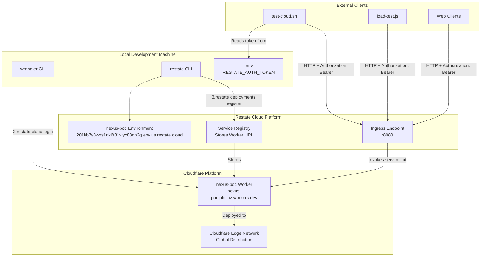
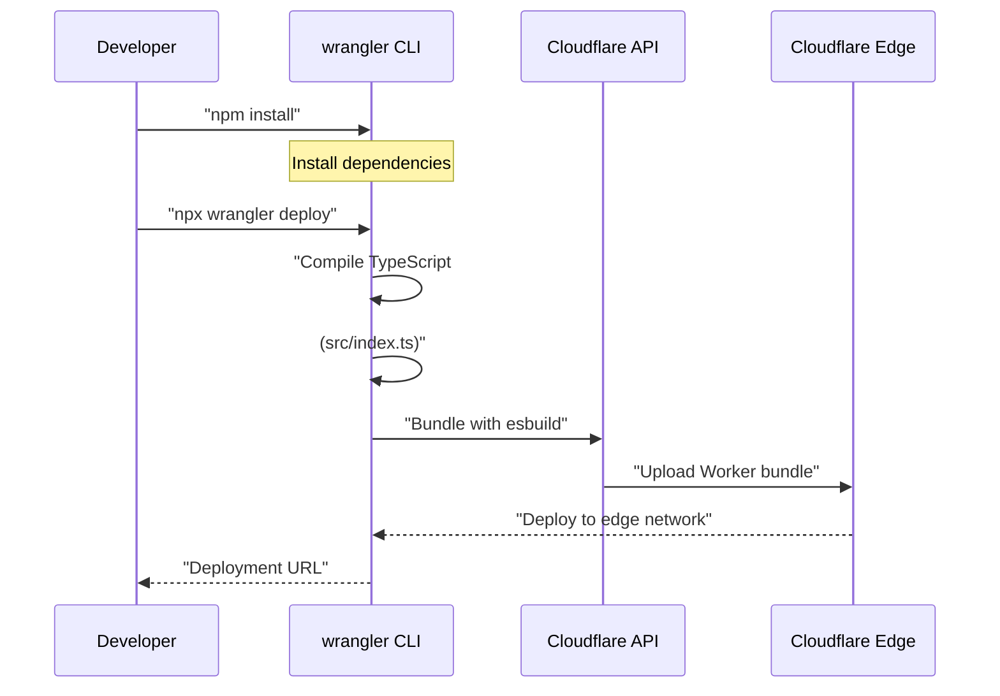
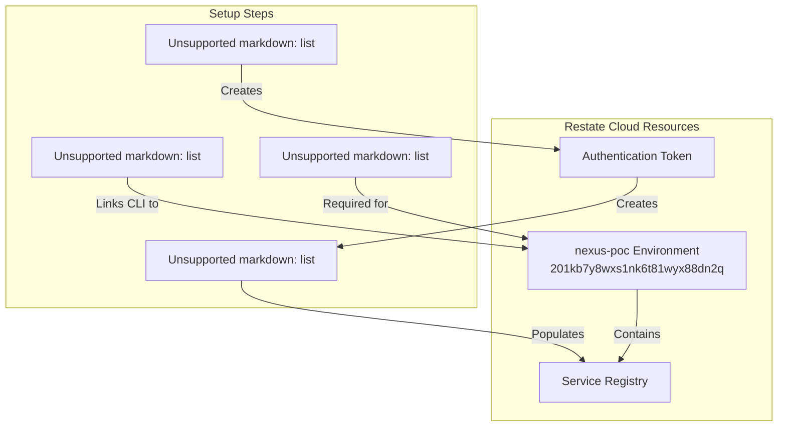
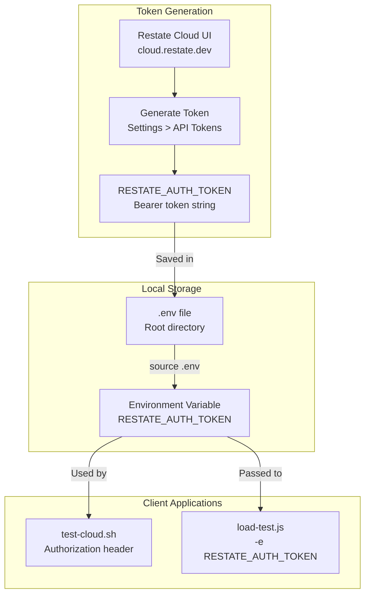
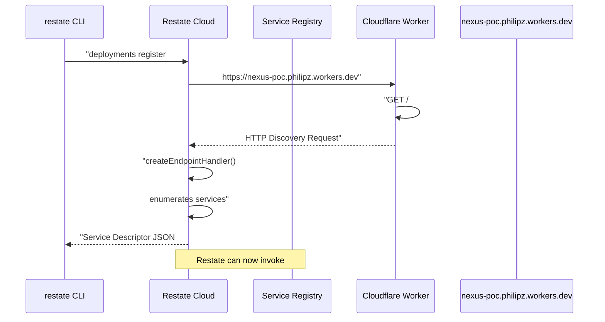
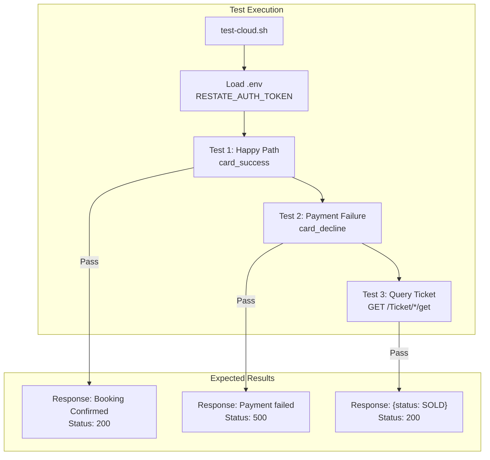

# Cloud Deployment

> **Relevant source files**
> * [README.md](https://github.com/philipz/restate-cloudflare-workers-poc/blob/513fd0f5/README.md)
> * [test-cloud.sh](https://github.com/philipz/restate-cloudflare-workers-poc/blob/513fd0f5/test-cloud.sh)
> * [wrangler.toml](https://github.com/philipz/restate-cloudflare-workers-poc/blob/513fd0f5/wrangler.toml)

This document covers deploying the nexus-poc system to production cloud environments. It includes Cloudflare Workers deployment using `wrangler`, Restate Cloud environment setup, service registration, and authentication configuration. For local development setup, see [Local Development Setup](/philipz/restate-cloudflare-workers-poc/6.1-local-development-setup).

---

## Overview

The cloud deployment architecture consists of two independent platforms that must be configured to communicate:

1. **Cloudflare Workers**: Hosts the application code (`src/index.ts`) as a serverless function
2. **Restate Cloud**: Provides the durable execution runtime and orchestration layer

The deployment process involves deploying the Worker to Cloudflare's edge network, creating a Restate Cloud environment, and registering the Worker's public URL with Restate so it can invoke the services.

### Deployment Architecture



**Sources**: [README.md L50-L64](https://github.com/philipz/restate-cloudflare-workers-poc/blob/513fd0f5/README.md#L50-L64)

 [test-cloud.sh L16-L17](https://github.com/philipz/restate-cloudflare-workers-poc/blob/513fd0f5/test-cloud.sh#L16-L17)

 [wrangler.toml L1-L8](https://github.com/philipz/restate-cloudflare-workers-poc/blob/513fd0f5/wrangler.toml#L1-L8)

---

## Cloudflare Workers Deployment

### Configuration

The Worker deployment is configured through `wrangler.toml`:

| Configuration Key | Value | Purpose |
| --- | --- | --- |
| `name` | `"nexus-poc"` | Worker deployment name, becomes subdomain |
| `main` | `"src/index.ts"` | Entry point file |
| `compatibility_date` | `"2024-04-01"` | Cloudflare runtime version |
| `compatibility_flags` | `["nodejs_compat"]` | Enables Node.js compatibility (required for Restate SDK) |
| `observability.enabled` | `true` | Enables metrics and logging |

**Sources**: [wrangler.toml L1-L8](https://github.com/philipz/restate-cloudflare-workers-poc/blob/513fd0f5/wrangler.toml#L1-L8)

### Deployment Process



**Sources**: [README.md L36-L41](https://github.com/philipz/restate-cloudflare-workers-poc/blob/513fd0f5/README.md#L36-L41)

### Deployment Steps

1. **Install dependencies**: ``` npm install ```
2. **Deploy Worker**: ``` npx wrangler deploy ```
3. **Verify deployment**: The command outputs the public URL where the Worker is accessible: ```yaml https://nexus-poc.philipz.workers.dev ```

The Worker is now deployed but **not yet functional** because it requires Restate to invoke its services. Direct HTTP requests to the Worker URL will fail because the services are only accessible through Restate's endpoint handler.

**Sources**: [README.md L36-L41](https://github.com/philipz/restate-cloudflare-workers-poc/blob/513fd0f5/README.md#L36-L41)

---

## Restate Cloud Setup

### Environment Configuration

The Restate Cloud environment provides the durable execution runtime that invokes the deployed Worker. This deployment uses:

| Parameter | Value |
| --- | --- |
| Environment Name | `nexus-poc` |
| Organization | `philipz` |
| Region | `us` (United States) |
| Ingress URL | `https://201kb7y8wxs1nk6t81wyx88dn2q.env.us.restate.cloud:8080` |
| Environment ID | `201kb7y8wxs1nk6t81wyx88dn2q` |

**Sources**: [README.md L54-L55](https://github.com/philipz/restate-cloudflare-workers-poc/blob/513fd0f5/README.md#L54-L55)

 [test-cloud.sh L17](https://github.com/philipz/restate-cloudflare-workers-poc/blob/513fd0f5/test-cloud.sh#L17-L17)

### Setup Process



**Sources**: [README.md L57-L64](https://github.com/philipz/restate-cloudflare-workers-poc/blob/513fd0f5/README.md#L57-L64)

### Detailed Steps

#### 1. Login to Restate Cloud

Authenticate the Restate CLI with your Restate Cloud account:

```
restate cloud login
```

This opens a browser window for authentication and stores credentials locally.

#### 2. Create Environment

Navigate to [https://cloud.restate.dev/](https://cloud.restate.dev/) and create a new environment:

* Environment name: `nexus-poc`
* Region: Select `us` for United States
* Note the generated ingress URL

#### 3. Configure CLI Environment

Link the local CLI to the cloud environment:

```
restate cloud environments configure philipz/nexus-poc
```

This command sets `nexus-poc` as the active environment for subsequent `restate` commands with the `-e` flag.

#### 4. Register Worker Deployment

Register the Cloudflare Worker URL with Restate Cloud:

```
restate -e nexus-poc deployments register https://nexus-poc.philipz.workers.dev
```

This command:

* Performs HTTP discovery against the Worker URL
* Detects available services (`Ticket`, `SeatMap`, `Checkout`) via `createEndpointHandler()` at [src/index.ts L12-L19](https://github.com/philipz/restate-cloudflare-workers-poc/blob/513fd0f5/src/index.ts#L12-L19)
* Stores the deployment URL in the Restate service registry
* Enables Restate to invoke service methods on the Worker

**Sources**: [README.md L57-L64](https://github.com/philipz/restate-cloudflare-workers-poc/blob/513fd0f5/README.md#L57-L64)

---

## Authentication Configuration

Restate Cloud requires authentication for all HTTP requests to the ingress endpoint. This prevents unauthorized access to the deployed services.

### Token Management



**Sources**: [README.md L97-L101](https://github.com/philipz/restate-cloudflare-workers-poc/blob/513fd0f5/README.md#L97-L101)

 [test-cloud.sh L8-L14](https://github.com/philipz/restate-cloudflare-workers-poc/blob/513fd0f5/test-cloud.sh#L8-L14)

### Configuration Steps

#### 1. Generate Token

In the Restate Cloud UI:

1. Navigate to environment settings
2. Go to **API Tokens** section
3. Generate a new token with appropriate permissions
4. Copy the token value

#### 2. Create .env File

Create a `.env` file in the project root directory:

```
RESTATE_AUTH_TOKEN=your_token_here
```

**Important**: This file is in `.gitignore` and should **never** be committed to version control.

#### 3. Load Environment Variables

The test scripts automatically load `.env`:

```python
if [ -f .env ]; then
    echo "Loading environment variables from .env file..."
    set -a
    source .env
    set +a
fi
```

**Sources**: [test-cloud.sh L8-L14](https://github.com/philipz/restate-cloudflare-workers-poc/blob/513fd0f5/test-cloud.sh#L8-L14)

### HTTP Authentication

All HTTP requests to Restate Cloud must include the `Authorization` header:

```
curl -X POST "$RESTATE_CLOUD_URL/Checkout/process" \
    -H "Content-Type: application/json" \
    -H "Authorization: Bearer $RESTATE_AUTH_TOKEN" \
    -d '{"ticketId": "seat-1", "userId": "user-1", "paymentMethodId": "card_success"}'
```

**Sources**: [test-cloud.sh L31-L34](https://github.com/philipz/restate-cloudflare-workers-poc/blob/513fd0f5/test-cloud.sh#L31-L34)

---

## Service Registration Details

### Registration Process



**Sources**: [README.md L44-L48](https://github.com/philipz/restate-cloudflare-workers-poc/blob/513fd0f5/README.md#L44-L48)

 [README.md L61-L64](https://github.com/philipz/restate-cloudflare-workers-poc/blob/513fd0f5/README.md#L61-L64)

### Discovered Services

When registration completes, Restate discovers the following services from [src/index.ts L12-L19](https://github.com/philipz/restate-cloudflare-workers-poc/blob/513fd0f5/src/index.ts#L12-L19)

:

| Service Type | Service Name | Key | Methods |
| --- | --- | --- | --- |
| Virtual Object | `Ticket` | `seatId` | `reserve`, `confirm`, `release`, `get` |
| Virtual Object | `SeatMap` | `"global"` | `set`, `resetAll`, `get` |
| Workflow | `Checkout` | N/A | `process` |

### Endpoint Routing

Restate Cloud routes requests to the Worker based on service name:

| Request URL Pattern | Target Service | Implementation |
| --- | --- | --- |
| `/Ticket/{key}/reserve` | Ticket Virtual Object | [src/game.ts L20-L44](https://github.com/philipz/restate-cloudflare-workers-poc/blob/513fd0f5/src/game.ts#L20-L44) |
| `/Ticket/{key}/confirm` | Ticket Virtual Object | [src/game.ts L46-L59](https://github.com/philipz/restate-cloudflare-workers-poc/blob/513fd0f5/src/game.ts#L46-L59) |
| `/Ticket/{key}/release` | Ticket Virtual Object | [src/game.ts L61-L67](https://github.com/philipz/restate-cloudflare-workers-poc/blob/513fd0f5/src/game.ts#L61-L67) |
| `/Ticket/{key}/get` | Ticket Virtual Object | [src/game.ts L69-L71](https://github.com/philipz/restate-cloudflare-workers-poc/blob/513fd0f5/src/game.ts#L69-L71) |
| `/SeatMap/global/set` | SeatMap Virtual Object | [src/game.ts L99-L110](https://github.com/philipz/restate-cloudflare-workers-poc/blob/513fd0f5/src/game.ts#L99-L110) |
| `/SeatMap/global/get` | SeatMap Virtual Object | [src/game.ts L136-L138](https://github.com/philipz/restate-cloudflare-workers-poc/blob/513fd0f5/src/game.ts#L136-L138) |
| `/Checkout/process` | Checkout Workflow | [src/checkout.ts L14-L61](https://github.com/philipz/restate-cloudflare-workers-poc/blob/513fd0f5/src/checkout.ts#L14-L61) |

**Sources**: [README.md L44-L48](https://github.com/philipz/restate-cloudflare-workers-poc/blob/513fd0f5/README.md#L44-L48)

---

## Verification

### Test Suite Execution

After deployment, verify the system using `test-cloud.sh`:



**Sources**: [test-cloud.sh L1-L78](https://github.com/philipz/restate-cloudflare-workers-poc/blob/513fd0f5/test-cloud.sh#L1-L78)

### Running Tests

```markdown
# Ensure .env file exists with RESTATE_AUTH_TOKEN
./test-cloud.sh
```

Expected output:

```yaml
========================================
Restate Cloud 部署驗證
========================================
Cloud URL: https://201kb7y8wxs1nk6t81wyx88dn2q.env.us.restate.cloud:8080

測試 1: 成功訂票 (card_success)
Response: Booking Confirmed
✓ PASS: 雲端訂票成功

測試 2: 支付失敗 (card_decline)
Response: Payment failed
✓ PASS: 支付失敗正確回應

測試 3: 查詢票券狀態
Response: {"status":"SOLD","reservedBy":"cloud-user-100",...}
✓ PASS: 票券狀態正確
```

**Sources**: [test-cloud.sh L24-L77](https://github.com/philipz/restate-cloudflare-workers-poc/blob/513fd0f5/test-cloud.sh#L24-L77)

### Load Testing

Verify system performance under load using K6:

```markdown
# Load environment variables
source .env

# Run load test
k6 run -e RESTATE_AUTH_TOKEN=$RESTATE_AUTH_TOKEN load-test.js

# Custom parameters
k6 run -e RESTATE_AUTH_TOKEN=$RESTATE_AUTH_TOKEN \
       -e VUS=10 \
       -e DURATION=60s \
       load-test.js
```

The load test simulates realistic traffic:

* Random seat selection (1-50)
* 80% `card_success`, 10% `card_decline`, 10% `card_error`
* Concurrent users creating contention

**Sources**: [README.md L108-L128](https://github.com/philipz/restate-cloudflare-workers-poc/blob/513fd0f5/README.md#L108-L128)

---

## Deployment URLs Reference

| Component | URL | Purpose |
| --- | --- | --- |
| Cloudflare Worker | `https://nexus-poc.philipz.workers.dev` | Worker deployment endpoint |
| Restate Cloud Ingress | `https://201kb7y8wxs1nk6t81wyx88dn2q.env.us.restate.cloud:8080` | Public API endpoint |
| Checkout Service | `$RESTATE_CLOUD_URL/Checkout/process` | Workflow invocation |
| Ticket Query | `$RESTATE_CLOUD_URL/Ticket/{seatId}/get` | Virtual Object state query |
| SeatMap Query | `$RESTATE_CLOUD_URL/SeatMap/global/get` | Aggregate state query |

**Sources**: [README.md L41](https://github.com/philipz/restate-cloudflare-workers-poc/blob/513fd0f5/README.md#L41-L41)

 [README.md L55](https://github.com/philipz/restate-cloudflare-workers-poc/blob/513fd0f5/README.md#L55-L55)

 [test-cloud.sh L17](https://github.com/philipz/restate-cloudflare-workers-poc/blob/513fd0f5/test-cloud.sh#L17-L17)

 [test-cloud.sh L31](https://github.com/philipz/restate-cloudflare-workers-poc/blob/513fd0f5/test-cloud.sh#L31-L31)

 [test-cloud.sh L62](https://github.com/philipz/restate-cloudflare-workers-poc/blob/513fd0f5/test-cloud.sh#L62-L62)

---

## Troubleshooting

### Common Issues

| Issue | Cause | Solution |
| --- | --- | --- |
| `401 Unauthorized` | Missing or invalid `RESTATE_AUTH_TOKEN` | Verify `.env` file contains correct token |
| `404 Not Found` on service invocation | Service not registered | Run `restate -e nexus-poc deployments register` |
| `502 Bad Gateway` | Worker not accessible | Verify `wrangler deploy` completed successfully |
| Worker compilation errors | Missing dependencies | Run `npm install` before `wrangler deploy` |
| `nodejs_compat` errors | Incorrect compatibility flag | Ensure `wrangler.toml` has `compatibility_flags = ["nodejs_compat"]` |

### Re-registration

If services are not responding after Worker redeployment, re-register the deployment:

```markdown
# List current deployments
restate -e nexus-poc deployments list

# Re-register Worker URL
restate -e nexus-poc deployments register https://nexus-poc.philipz.workers.dev --force
```

**Sources**: [wrangler.toml L4](https://github.com/philipz/restate-cloudflare-workers-poc/blob/513fd0f5/wrangler.toml#L4-L4)

 [README.md L61-L64](https://github.com/philipz/restate-cloudflare-workers-poc/blob/513fd0f5/README.md#L61-L64)