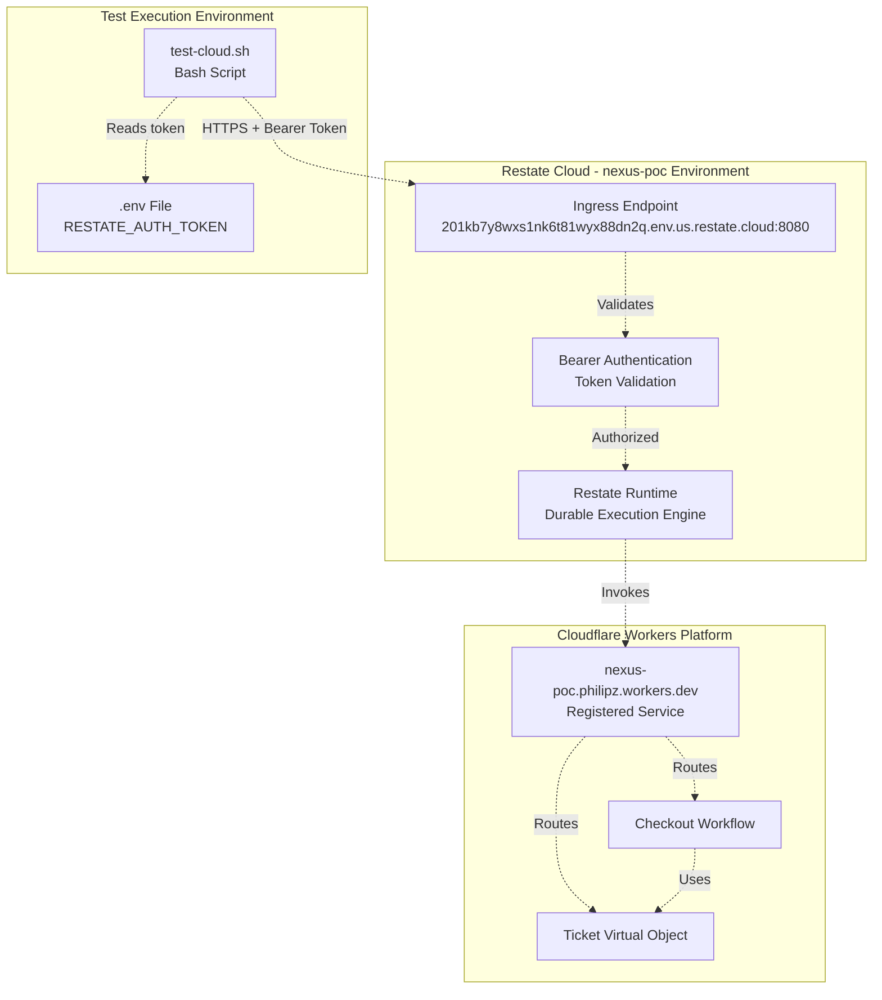
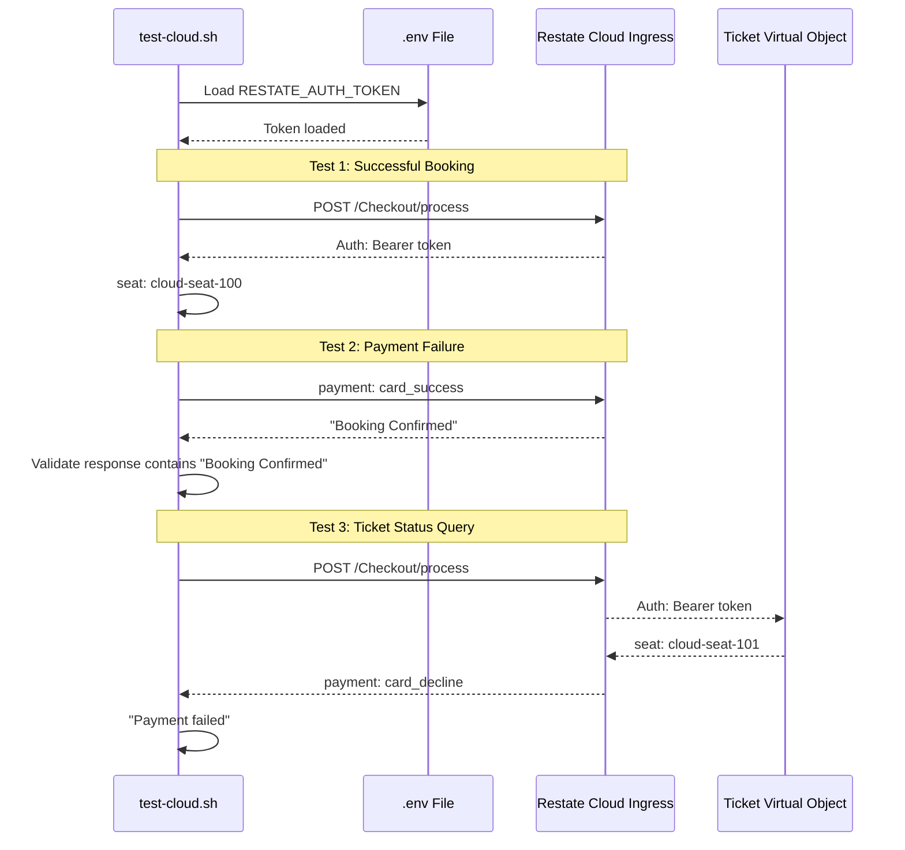
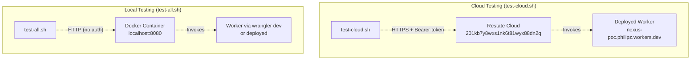

# Cloud Validation

> **Relevant source files**
> * [README.md](https://github.com/philipz/restate-cloudflare-workers-poc/blob/513fd0f5/README.md)
> * [test-cloud.sh](https://github.com/philipz/restate-cloudflare-workers-poc/blob/513fd0f5/test-cloud.sh)

## Purpose

This document describes the cloud validation testing process for the nexus-poc system. Cloud validation ensures that the deployed Cloudflare Workers service integrates correctly with the managed Restate Cloud environment, validating authentication, service registration, and end-to-end functionality in the production infrastructure.

For information about local testing setup, see [Local Testing](/philipz/restate-cloudflare-workers-poc/5.1-local-testing). For load testing strategies, see [Load Testing](/philipz/restate-cloudflare-workers-poc/5.3-load-testing).

---

## Overview

Cloud validation uses the `test-cloud.sh` script to execute functional tests against the Restate Cloud deployment. Unlike local testing which targets a Docker-based Restate server at `localhost:8080`, cloud validation targets the managed Restate Cloud ingress endpoint and requires authentication tokens.

The validation process serves three primary purposes:

1. **Deployment Verification**: Confirms that the Cloudflare Worker is correctly registered with Restate Cloud
2. **Authentication Validation**: Ensures that Bearer token authentication is properly configured
3. **Functional Parity**: Validates that core business logic behaves identically in the cloud environment

**Sources:** [README.md L50-L65](https://github.com/philipz/restate-cloudflare-workers-poc/blob/513fd0f5/README.md#L50-L65)

 [test-cloud.sh L1-L78](https://github.com/philipz/restate-cloudflare-workers-poc/blob/513fd0f5/test-cloud.sh#L1-L78)

---

## Restate Cloud Environment Configuration

The nexus-poc system deploys to a dedicated Restate Cloud environment with the following configuration:

| Configuration Item | Value |
| --- | --- |
| **Environment Name** | `nexus-poc` |
| **Organization** | `philipz` |
| **Ingress URL** | `https://201kb7y8wxs1nk6t81wyx88dn2q.env.us.restate.cloud:8080` |
| **Authentication** | Bearer token (required) |
| **Registered Service** | `https://nexus-poc.philipz.workers.dev` |

### Environment Architecture



**Diagram: Cloud validation architecture showing test script, Restate Cloud authentication, and Cloudflare Workers service invocation**

The ingress URL format `https://<env-id>.env.<region>.restate.cloud:8080` indicates:

* `201kb7y8wxs1nk6t81wyx88dn2q`: Unique environment identifier
* `us`: Geographic region (United States)
* Port `8080`: Standard Restate ingress port for service invocations

**Sources:** [README.md L54-L56](https://github.com/philipz/restate-cloudflare-workers-poc/blob/513fd0f5/README.md#L54-L56)

 [test-cloud.sh L16-L17](https://github.com/philipz/restate-cloudflare-workers-poc/blob/513fd0f5/test-cloud.sh#L16-L17)

---

## Authentication Configuration

Cloud validation requires a Restate Cloud authentication token stored in a `.env` file at the project root.

### .env File Structure

```
RESTATE_AUTH_TOKEN=your_token_here
```

The token is obtained from the Restate Cloud dashboard after environment creation and is used to authenticate all HTTP requests to the cloud ingress endpoint.

### Token Loading Mechanism

[test-cloud.sh L8-L14](https://github.com/philipz/restate-cloudflare-workers-poc/blob/513fd0f5/test-cloud.sh#L8-L14)

 implements conditional environment loading:

```python
if [ -f .env ]; then
    echo "Loading environment variables from .env file..."
    set -a
    source .env
    set +a
fi
```

The `set -a` flag exports all variables defined in `.env`, making `RESTATE_AUTH_TOKEN` available to the script. All HTTP requests include the header:

```yaml
Authorization: Bearer $RESTATE_AUTH_TOKEN
```

### Security Considerations

| Aspect | Implementation |
| --- | --- |
| **Token Storage** | `.env` file excluded from version control (not committed) |
| **Token Scope** | Environment-specific; each Restate Cloud environment requires its own token |
| **Token Rotation** | Manually managed through Restate Cloud dashboard |
| **Request Security** | HTTPS-only; token transmitted in Authorization header |

**Sources:** [README.md L97-L101](https://github.com/philipz/restate-cloudflare-workers-poc/blob/513fd0f5/README.md#L97-L101)

 [test-cloud.sh L8-L14](https://github.com/philipz/restate-cloudflare-workers-poc/blob/513fd0f5/test-cloud.sh#L8-L14)

---

## Test Script Structure

The `test-cloud.sh` script executes three validation tests using `curl` to send HTTP requests to the Restate Cloud ingress endpoint.

### Script Flow Diagram



**Diagram: test-cloud.sh execution flow showing three sequential validation tests**

### Request Template

All requests follow this structure [test-cloud.sh L31-L34](https://github.com/philipz/restate-cloudflare-workers-poc/blob/513fd0f5/test-cloud.sh#L31-L34)

:

```
curl -s -X POST "$RESTATE_CLOUD_URL/Checkout/process" \
    -H "Content-Type: application/json" \
    -H "Authorization: Bearer $RESTATE_AUTH_TOKEN" \
    -d '{"ticketId": "cloud-seat-100", "userId": "cloud-user-100", "paymentMethodId": "card_success"}'
```

Key components:

* `-s`: Silent mode (suppress curl progress output)
* `-X POST`: HTTP method
* `$RESTATE_CLOUD_URL`: Expands to ingress URL
* `Authorization: Bearer`: Token authentication
* `-d`: JSON request body

**Sources:** [test-cloud.sh L29-L78](https://github.com/philipz/restate-cloudflare-workers-poc/blob/513fd0f5/test-cloud.sh#L29-L78)

---

## Test Scenarios

The cloud validation suite executes three test scenarios to validate critical system behaviors.

### Test Scenario Matrix

| Test # | Scenario | Seat ID | Payment Method | Expected Outcome | Validation Check |
| --- | --- | --- | --- | --- | --- |
| 1 | Successful booking | `cloud-seat-100` | `card_success` | "Booking Confirmed" | `grep -q "Booking Confirmed"` |
| 2 | Payment failure & compensation | `cloud-seat-101` | `card_decline` | "Payment failed" | `grep -q "Payment failed"` |
| 3 | Ticket status query | `cloud-seat-100` | N/A | State: "SOLD" | `grep -q "SOLD"` |

### Test 1: Successful Booking (Happy Path)

[test-cloud.sh L29-L43](https://github.com/philipz/restate-cloudflare-workers-poc/blob/513fd0f5/test-cloud.sh#L29-L43)

 validates the complete checkout workflow:

**Request:**

```json
{
  "ticketId": "cloud-seat-100",
  "userId": "cloud-user-100",
  "paymentMethodId": "card_success"
}
```

**Expected Flow:**

1. Ticket reserved via `Ticket.reserve()`
2. SeatMap updated to `RESERVED`
3. Payment processed successfully (simulated 500ms delay)
4. Ticket confirmed via `Ticket.confirm()` → state becomes `SOLD`
5. SeatMap updated to `SOLD`
6. Email sent (simulated)

**Validation:** Response body contains the string `"Booking Confirmed"`

### Test 2: Payment Failure with Saga Compensation

[test-cloud.sh L45-L58](https://github.com/philipz/restate-cloudflare-workers-poc/blob/513fd0f5/test-cloud.sh#L45-L58)

 validates compensation logic when payment fails:

**Request:**

```json
{
  "ticketId": "cloud-seat-101",
  "userId": "cloud-user-101",
  "paymentMethodId": "card_decline"
}
```

**Expected Flow:**

1. Ticket reserved via `Ticket.reserve()`
2. SeatMap updated to `RESERVED`
3. Payment fails with `TerminalError("Payment declined")`
4. **Compensation triggered:** * `Ticket.release()` → state reverts to `AVAILABLE` * SeatMap updated back to `AVAILABLE`
5. Error propagated to client

**Validation:** Response body contains the string `"Payment failed"`

### Test 3: State Query Verification

[test-cloud.sh L60-L73](https://github.com/philipz/restate-cloudflare-workers-poc/blob/513fd0f5/test-cloud.sh#L60-L73)

 validates that Virtual Object state persists correctly:

**Request:**

```
POST /Ticket/cloud-seat-100/get
{}
```

**Expected Response:**

```json
{
  "status": "SOLD",
  "reservedBy": "cloud-user-100",
  "reservedUntil": null
}
```

This test confirms that Test 1's successful booking persisted the ticket state to `SOLD` in the Restate Cloud environment.

**Validation:** Response body contains the string `"SOLD"`

### Color-Coded Output

[test-cloud.sh L19-L22](https://github.com/philipz/restate-cloudflare-workers-poc/blob/513fd0f5/test-cloud.sh#L19-L22)

 defines terminal color codes for test results:

```xml
COLOR_GREEN='\033<FileRef file-url="https://github.com/philipz/restate-cloudflare-workers-poc/blob/513fd0f5/0;32m'   # ✓ PASS\nCOLOR_RED='\\033[0;31m'     # ✗ FAIL\nCOLOR_BLUE='\\033[0;34m'    # Test headers\nCOLOR_NC='\\033[0m'         # Reset\n```\n\n**Sources#LNaN-LNaN" NaN  file-path="0;32m'   # ✓ PASS\nCOLOR_RED='\\033[0;31m'     # ✗ FAIL\nCOLOR_BLUE='\\033[0;34m'    # Test headers\nCOLOR_NC='\\033[0m'         # Reset\n```\n\n**Sources">Hii</FileRef>

---

## Execution and Results

### Running Cloud Validation

**Prerequisites:**
1. `.env` file exists with `RESTATE_AUTH_TOKEN`
2. Cloudflare Worker deployed to `nexus-poc.philipz.workers.dev`
3. Service registered with Restate Cloud `nexus-poc` environment

**Execution:**
```bash
./test-cloud.sh
```

### Expected Output

```yaml
========================================
Restate Cloud 部署驗證
========================================
Cloud URL: https://201kb7y8wxs1nk6t81wyx88dn2q.env.us.restate.cloud:8080

測試 1: 成功訂票 (card_success)
Response: Booking Confirmed
✓ PASS: 雲端訂票成功

測試 2: 支付失敗 (card_decline)
Response: Payment failed
✓ PASS: 支付失敗正確回應

測試 3: 查詢票券狀態
Response: {"status":"SOLD","reservedBy":"cloud-user-100",...}
✓ PASS: 票券狀態正確

========================================
測試完成
========================================
```

### Failure Modes

| Failure Type | Symptom | Common Cause | Resolution |
| --- | --- | --- | --- |
| **Authentication Error** | `401 Unauthorized` | Invalid/missing `RESTATE_AUTH_TOKEN` | Verify token in `.env` file |
| **Connection Error** | `curl: (6) Could not resolve host` | Network/DNS issue | Check internet connectivity |
| **Service Not Registered** | `404 Not Found` | Worker not registered with Restate Cloud | Run `restate deployments register` |
| **Timeout** | `curl: (28) Operation timed out` | Cloudflare Worker cold start or error | Retry; check Worker logs in Cloudflare dashboard |

**Sources:** [test-cloud.sh L24-L77](https://github.com/philipz/restate-cloudflare-workers-poc/blob/513fd0f5/test-cloud.sh#L24-L77)

---

## Differences from Local Testing

Cloud validation differs from local testing ([Local Testing](/philipz/restate-cloudflare-workers-poc/5.1-local-testing)) in several key aspects:

### Environment Comparison



**Diagram: Architectural differences between local and cloud testing environments**

### Key Differences Table

| Aspect | Local Testing (`test-all.sh`) | Cloud Testing (`test-cloud.sh`) |
| --- | --- | --- |
| **Target URL** | `http://localhost:8080` | `https://201kb7y8wxs1nk6t81wyx88dn2q.env.us.restate.cloud:8080` |
| **Authentication** | None required | Bearer token in `Authorization` header |
| **Restate Server** | Docker container (`restatedev/restate:latest`) | Managed Restate Cloud service |
| **Worker Execution** | Local (`wrangler dev`) or deployed | Production Cloudflare Workers |
| **State Persistence** | Docker volume (ephemeral) | Restate Cloud persistent storage |
| **Seat IDs** | `seat-1`, `seat-2`, `seat-3`, etc. | `cloud-seat-100`, `cloud-seat-101`, etc. |
| **Test Count** | 6 scenarios (includes concurrency tests) | 3 scenarios (deployment validation) |
| **Setup Complexity** | Requires Docker, local service registration | Requires `.env` file, cloud service registration |
| **Cold Start** | Minimal (local Docker) | Potential delay (Cloudflare Worker cold start) |
| **Network** | Localhost (no external dependency) | Internet connectivity required |

### Test Scope Differences

**Local Testing** ([test-all.sh](https://github.com/philipz/restate-cloudflare-workers-poc/blob/513fd0f5/test-all.sh)

) includes:

* Happy path booking
* Payment failure compensation
* Double booking prevention
* **Concurrency control** (multiple simultaneous requests)
* Gateway timeout handling (`card_error`)
* SeatMap query

**Cloud Testing** ([test-cloud.sh](https://github.com/philipz/restate-cloudflare-workers-poc/blob/513fd0f5/test-cloud.sh)

) focuses on:

* Basic happy path validation
* Payment failure compensation
* State query verification
* **Deployment validation** (service registration, authentication)

The cloud test suite is narrower in scope because it assumes functional correctness was validated locally. Its primary goal is deployment verification, not comprehensive functional testing.

### Seat ID Namespacing

To prevent cross-environment state conflicts, cloud tests use a `cloud-` prefix for seat IDs:

* Local: `seat-1`, `seat-2`, `seat-3`
* Cloud: `cloud-seat-100`, `cloud-seat-101`

This namespacing ensures that local and cloud tests can run concurrently without interfering with each other's Virtual Object state.

**Sources:** [test-cloud.sh L1-L78](https://github.com/philipz/restate-cloudflare-workers-poc/blob/513fd0f5/test-cloud.sh#L1-L78)

 [README.md L87-L106](https://github.com/philipz/restate-cloudflare-workers-poc/blob/513fd0f5/README.md#L87-L106)

---

## Integration with Deployment Pipeline

Cloud validation is typically executed after service deployment to verify the deployment succeeded:

```markdown
# 1. Deploy Worker to Cloudflare
npx wrangler deploy

# 2. Register service with Restate Cloud (if not already registered)
restate -e nexus-poc deployments register https://nexus-poc.philipz.workers.dev

# 3. Run cloud validation
./test-cloud.sh
```

If cloud validation fails, the deployment should be considered unsuccessful and investigated before proceeding to load testing (see [Load Testing](/philipz/restate-cloudflare-workers-poc/5.3-load-testing)).

**Sources:** [README.md L57-L65](https://github.com/philipz/restate-cloudflare-workers-poc/blob/513fd0f5/README.md#L57-L65)

```

```