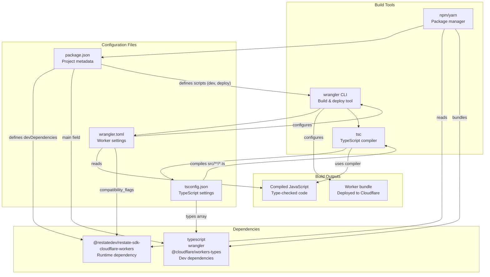
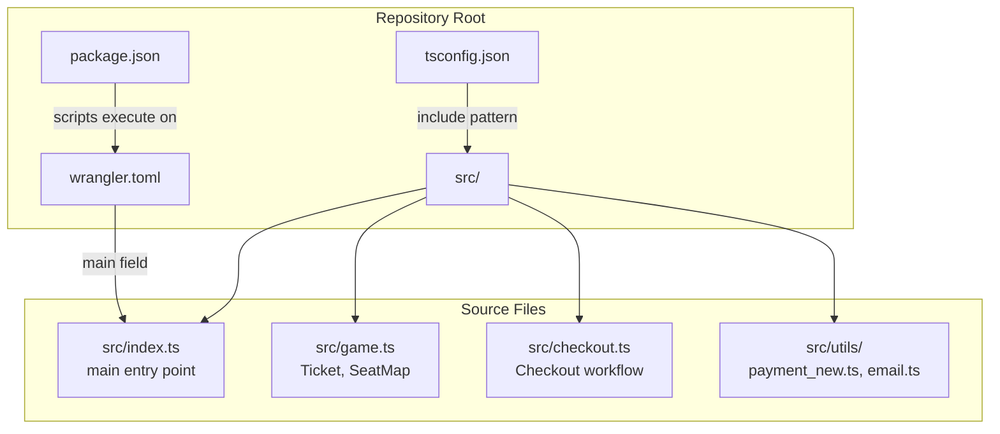

# Configuration Reference

> **Relevant source files**
> * [package.json](https://github.com/philipz/restate-cloudflare-workers-poc/blob/513fd0f5/package.json)
> * [tsconfig.json](https://github.com/philipz/restate-cloudflare-workers-poc/blob/513fd0f5/tsconfig.json)
> * [wrangler.toml](https://github.com/philipz/restate-cloudflare-workers-poc/blob/513fd0f5/wrangler.toml)

This document provides a complete reference for all configuration files in the nexus-poc codebase. These files control TypeScript compilation, Cloudflare Workers deployment, and project dependencies. For local development setup procedures, see [Local Development Setup](/philipz/restate-cloudflare-workers-poc/6.1-local-development-setup). For deployment procedures, see [Cloud Deployment](/philipz/restate-cloudflare-workers-poc/6.2-cloud-deployment).

The configuration is distributed across three primary files:

* `tsconfig.json` - TypeScript compiler settings
* `wrangler.toml` - Cloudflare Workers deployment configuration
* `package.json` - Node.js project metadata and dependency management

## Configuration Files Overview

The following table summarizes the purpose and key settings in each configuration file:

| File | Purpose | Key Responsibilities | Consumed By |
| --- | --- | --- | --- |
| `tsconfig.json` | TypeScript compilation settings | Target ES version, module system, type checking strictness, Cloudflare Workers type definitions | TypeScript compiler (`tsc`), Wrangler build process |
| `wrangler.toml` | Worker deployment configuration | Worker name, entry point, compatibility settings, Node.js compatibility, observability | Wrangler CLI (`wrangler dev`, `wrangler deploy`) |
| `package.json` | Project metadata and dependencies | Scripts definition, runtime dependencies (Restate SDK), development dependencies (TypeScript, Wrangler) | npm/yarn package managers, Wrangler |

Sources: [package.json L1-L18](https://github.com/philipz/restate-cloudflare-workers-poc/blob/513fd0f5/package.json#L1-L18)

 [tsconfig.json L1-L19](https://github.com/philipz/restate-cloudflare-workers-poc/blob/513fd0f5/tsconfig.json#L1-L19)

 [wrangler.toml L1-L8](https://github.com/philipz/restate-cloudflare-workers-poc/blob/513fd0f5/wrangler.toml#L1-L8)

## Configuration Relationships



**Diagram: Configuration File Dependencies and Build Process**

This diagram illustrates how configuration files interact during development and deployment. The `package.json` defines dependencies and scripts. The TypeScript compiler uses `tsconfig.json` for compilation rules and type definitions from `@cloudflare/workers-types`. Wrangler reads both `wrangler.toml` for deployment settings and uses the TypeScript compiler to produce the final worker bundle.

Sources: [package.json L1-L18](https://github.com/philipz/restate-cloudflare-workers-poc/blob/513fd0f5/package.json#L1-L18)

 [tsconfig.json L1-L19](https://github.com/philipz/restate-cloudflare-workers-poc/blob/513fd0f5/tsconfig.json#L1-L19)

 [wrangler.toml L1-L8](https://github.com/philipz/restate-cloudflare-workers-poc/blob/513fd0f5/wrangler.toml#L1-L8)

## TypeScript Configuration (tsconfig.json)

The TypeScript configuration file controls compilation behavior and type checking. Key settings include:

| Setting | Value | Purpose |
| --- | --- | --- |
| `compilerOptions.target` | `"esnext"` | Compile to latest ECMAScript standard |
| `compilerOptions.module` | `"esnext"` | Use ES modules syntax |
| `compilerOptions.moduleResolution` | `"bundler"` | Resolve modules for bundler (Wrangler) |
| `compilerOptions.lib` | `["esnext"]` | Include latest JavaScript API typings |
| `compilerOptions.types` | `["@cloudflare/workers-types/2023-07-01"]` | Cloudflare Workers runtime API types |
| `compilerOptions.strict` | `true` | Enable all strict type checking |
| `compilerOptions.skipLibCheck` | `true` | Skip type checking of declaration files |
| `compilerOptions.noEmit` | `true` | Do not emit compiled output (Wrangler handles bundling) |
| `include` | `["src/**/*.ts"]` | Type check all TypeScript files in `src/` |

The configuration uses `"moduleResolution": "bundler"` [tsconfig.json L5](https://github.com/philipz/restate-cloudflare-workers-poc/blob/513fd0f5/tsconfig.json#L5-L5)

 to match Wrangler's bundling behavior, ensuring correct module resolution during development. The `"noEmit": true` setting [tsconfig.json L14](https://github.com/philipz/restate-cloudflare-workers-poc/blob/513fd0f5/tsconfig.json#L14-L14)

 prevents the TypeScript compiler from generating output files, delegating bundling to Wrangler.

For detailed explanation of TypeScript compilation settings, see [TypeScript Configuration](/philipz/restate-cloudflare-workers-poc/7.1-typescript-configuration).

Sources: [tsconfig.json L1-L19](https://github.com/philipz/restate-cloudflare-workers-poc/blob/513fd0f5/tsconfig.json#L1-L19)

## Wrangler Configuration (wrangler.toml)

The Wrangler configuration defines deployment settings for the Cloudflare Worker:

| Setting | Value | Purpose |
| --- | --- | --- |
| `name` | `"nexus-poc"` | Worker name in Cloudflare |
| `main` | `"src/index.ts"` | Entry point file path |
| `compatibility_date` | `"2024-04-01"` | Cloudflare runtime compatibility date |
| `compatibility_flags` | `["nodejs_compat"]` | Enable Node.js compatibility layer |
| `observability.enabled` | `true` | Enable logging and tracing |

The `nodejs_compat` flag [wrangler.toml L4](https://github.com/philipz/restate-cloudflare-workers-poc/blob/513fd0f5/wrangler.toml#L4-L4)

 is required for the Restate SDK to function correctly, as it enables Node.js standard library APIs (e.g., `Buffer`, `process`) in the Cloudflare Workers runtime. The `main` field [wrangler.toml L2](https://github.com/philipz/restate-cloudflare-workers-poc/blob/513fd0f5/wrangler.toml#L2-L2)

 points directly to the TypeScript source file; Wrangler automatically invokes the TypeScript compiler during builds.

For detailed explanation of Wrangler settings and deployment process, see [Wrangler Configuration](/philipz/restate-cloudflare-workers-poc/7.2-wrangler-configuration).

Sources: [wrangler.toml L1-L8](https://github.com/philipz/restate-cloudflare-workers-poc/blob/513fd0f5/wrangler.toml#L1-L8)

## Package Configuration (package.json)

The `package.json` defines project metadata, scripts, and dependencies:

### Scripts

| Script | Command | Purpose |
| --- | --- | --- |
| `deploy` | `wrangler deploy` | Deploy worker to Cloudflare |
| `dev` | `wrangler dev` | Start local development server |
| `start` | `wrangler dev` | Alias for `dev` script |

Sources: [package.json L5-L8](https://github.com/philipz/restate-cloudflare-workers-poc/blob/513fd0f5/package.json#L5-L8)

### Runtime Dependencies

```
"dependencies": {
  "@restatedev/restate-sdk-cloudflare-workers": "^1.0.0"
}
```

The Restate SDK [package.json L15-L17](https://github.com/philipz/restate-cloudflare-workers-poc/blob/513fd0f5/package.json#L15-L17)

 provides the core functionality for durable execution, Virtual Objects, and Workflows. This is the only runtime dependency, as it bundles all necessary Restate primitives for Cloudflare Workers.

### Development Dependencies

```
"devDependencies": {
  "@cloudflare/workers-types": "^4.20240405.0",
  "typescript": "^5.4.5",
  "wrangler": "^4.51.0"
}
```

Development dependencies [package.json L10-L13](https://github.com/philipz/restate-cloudflare-workers-poc/blob/513fd0f5/package.json#L10-L13)

 include:

* `@cloudflare/workers-types` - Type definitions for Cloudflare Workers runtime APIs
* `typescript` - TypeScript compiler
* `wrangler` - Cloudflare Workers CLI for local development and deployment

For detailed explanation of dependency versions and upgrade considerations, see [Dependencies](/philipz/restate-cloudflare-workers-poc/7.3-dependencies).

Sources: [package.json L1-L18](https://github.com/philipz/restate-cloudflare-workers-poc/blob/513fd0f5/package.json#L1-L18)

## Configuration File Locations



**Diagram: Configuration File Locations and Source Code References**

All three configuration files reside in the repository root directory. The `tsconfig.json` includes pattern `"src/**/*.ts"` [tsconfig.json L16-L18](https://github.com/philipz/restate-cloudflare-workers-poc/blob/513fd0f5/tsconfig.json#L16-L18)

 matches all TypeScript source files. The `wrangler.toml` main field `"src/index.ts"` [wrangler.toml L2](https://github.com/philipz/restate-cloudflare-workers-poc/blob/513fd0f5/wrangler.toml#L2-L2)

 specifies the entry point for the Worker bundle.

Sources: [package.json L1-L18](https://github.com/philipz/restate-cloudflare-workers-poc/blob/513fd0f5/package.json#L1-L18)

 [tsconfig.json L1-L19](https://github.com/philipz/restate-cloudflare-workers-poc/blob/513fd0f5/tsconfig.json#L1-L19)

 [wrangler.toml L1-L8](https://github.com/philipz/restate-cloudflare-workers-poc/blob/513fd0f5/wrangler.toml#L1-L8)

## Environment-Specific Configuration

The configuration files are environment-agnostic and apply to both local development and production deployments:

| Environment | Configuration Override | Notes |
| --- | --- | --- |
| Local Development | Wrangler uses `wrangler dev` with miniflare runtime | Automatically uses localhost binding for Restate Server at `localhost:8080` |
| Production (Cloudflare) | Wrangler uses `wrangler deploy` | Publishes to `nexus-poc.philipz.workers.dev` |
| Production (Restate Cloud) | No configuration changes needed | Worker connects to Restate Cloud environment via registration |

Environment-specific settings (e.g., Restate Cloud authentication tokens) are managed through environment variables and deployment commands, not configuration files. See [Local Development Setup](/philipz/restate-cloudflare-workers-poc/6.1-local-development-setup) and [Cloud Deployment](/philipz/restate-cloudflare-workers-poc/6.2-cloud-deployment) for environment-specific procedures.

Sources: [wrangler.toml L1-L8](https://github.com/philipz/restate-cloudflare-workers-poc/blob/513fd0f5/wrangler.toml#L1-L8)

## Configuration Validation

The following table describes how to validate each configuration file:

| File | Validation Command | Expected Outcome |
| --- | --- | --- |
| `package.json` | `npm install` | Dependencies install without errors |
| `tsconfig.json` | `npx tsc --noEmit` | No type errors in `src/**/*.ts` files |
| `wrangler.toml` | `wrangler dev` | Worker starts successfully on `localhost:8787` |

All three configuration files are validated automatically during the build process when running `wrangler dev` or `wrangler deploy`. The TypeScript compiler validates `tsconfig.json` settings, npm validates `package.json` syntax and dependency resolution, and Wrangler validates `wrangler.toml` fields.

Sources: [package.json L1-L18](https://github.com/philipz/restate-cloudflare-workers-poc/blob/513fd0f5/package.json#L1-L18)

 [tsconfig.json L1-L19](https://github.com/philipz/restate-cloudflare-workers-poc/blob/513fd0f5/tsconfig.json#L1-L19)

 [wrangler.toml L1-L8](https://github.com/philipz/restate-cloudflare-workers-poc/blob/513fd0f5/wrangler.toml#L1-L8)