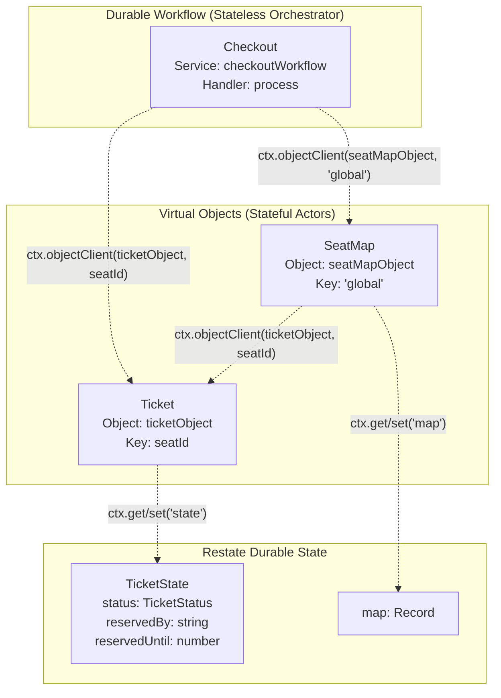
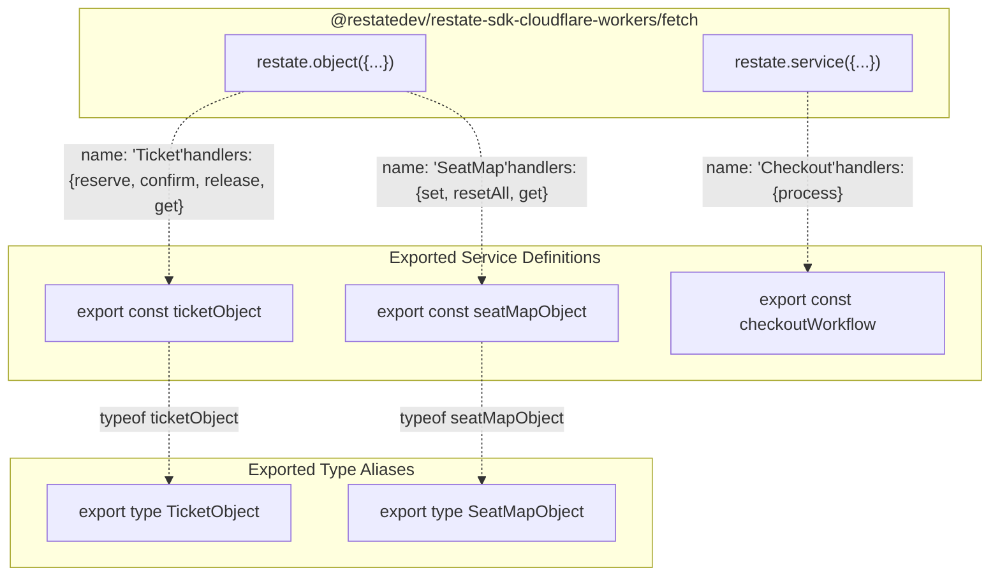

# Core Services

> **Relevant source files**
> * [README.md](https://github.com/philipz/restate-cloudflare-workers-poc/blob/513fd0f5/README.md)
> * [src/checkout.ts](https://github.com/philipz/restate-cloudflare-workers-poc/blob/513fd0f5/src/checkout.ts)
> * [src/game.ts](https://github.com/philipz/restate-cloudflare-workers-poc/blob/513fd0f5/src/game.ts)

This document provides an overview of the three core Restate services that implement the ticketing system's business logic: the `Ticket` Virtual Object, the `SeatMap` Virtual Object, and the `Checkout` Workflow. These services are defined in [src/game.ts](https://github.com/philipz/restate-cloudflare-workers-poc/blob/513fd0f5/src/game.ts)

 and [src/checkout.ts](https://github.com/philipz/restate-cloudflare-workers-poc/blob/513fd0f5/src/checkout.ts)

 and are registered with Restate through the endpoint handler in [src/index.ts](https://github.com/philipz/restate-cloudflare-workers-poc/blob/513fd0f5/src/index.ts)

For detailed information about individual services, see [Ticket Virtual Object](/philipz/restate-cloudflare-workers-poc/2.1-ticket-virtual-object), [SeatMap Virtual Object](/philipz/restate-cloudflare-workers-poc/2.2-seatmap-virtual-object), and [Checkout Workflow](/philipz/restate-cloudflare-workers-poc/2.3-checkout-workflow). For information about how these services are registered and routed, see [Request Routing & Entry Point](/philipz/restate-cloudflare-workers-poc/3-request-routing-and-entry-point).

## Service Overview

The system implements three distinct Restate services, each with a specific responsibility:

| Service Name | Service Type | Implementation File | Primary Responsibility |
| --- | --- | --- | --- |
| `Ticket` | Virtual Object | [src/game.ts L15-L84](https://github.com/philipz/restate-cloudflare-workers-poc/blob/513fd0f5/src/game.ts#L15-L84) | Per-seat state management and state machine enforcement |
| `SeatMap` | Virtual Object | [src/game.ts L92-L138](https://github.com/philipz/restate-cloudflare-workers-poc/blob/513fd0f5/src/game.ts#L92-L138) | Aggregate view of all seat statuses and auto-reset orchestration |
| `Checkout` | Durable Workflow | [src/checkout.ts L6-L50](https://github.com/philipz/restate-cloudflare-workers-poc/blob/513fd0f5/src/checkout.ts#L6-L50) | Saga orchestration for reserve → payment → confirmation flow |

**Sources:** [src/game.ts L1-L141](https://github.com/philipz/restate-cloudflare-workers-poc/blob/513fd0f5/src/game.ts#L1-L141)

 [src/checkout.ts L1-L51](https://github.com/philipz/restate-cloudflare-workers-poc/blob/513fd0f5/src/checkout.ts#L1-L51)

## Service Architecture Pattern

The system employs a deliberate architectural separation between **stateful Virtual Objects** and **stateless orchestration Workflows**:



**Virtual Objects** implement the Actor Model pattern with automatic serialization by key:

* Each `Ticket` instance is keyed by `seatId` (e.g., `"seat-1"`, `"seat-2"`), ensuring that concurrent requests for the same seat execute sequentially
* The `SeatMap` uses a singleton key `"global"` to maintain a centralized aggregate view
* Both objects use `ctx.get()` and `ctx.set()` to interact with durable state stored by Restate

**Durable Workflows** are stateless orchestrators that coordinate multi-step business processes:

* The `Checkout` workflow does not maintain its own state; instead, it delegates all state mutations to Virtual Objects
* Communication occurs via `ctx.objectClient()` for awaited RPC calls and `ctx.objectSendClient()` for fire-and-forget async invocations

**Sources:** [src/game.ts L15-L16](https://github.com/philipz/restate-cloudflare-workers-poc/blob/513fd0f5/src/game.ts#L15-L16)

 [src/game.ts L92-L93](https://github.com/philipz/restate-cloudflare-workers-poc/blob/513fd0f5/src/game.ts#L92-L93)

 [src/checkout.ts L6-L7](https://github.com/philipz/restate-cloudflare-workers-poc/blob/513fd0f5/src/checkout.ts#L6-L7)

## Service Type Definitions

Each service is registered using the Restate SDK's type-safe builder functions:



The type exports (`TicketObject`, `SeatMapObject`) enable type-safe client invocations using `ctx.objectClient<TicketObject>(ticketObject, key)`.

**Sources:** [src/game.ts L15-L16](https://github.com/philipz/restate-cloudflare-workers-poc/blob/513fd0f5/src/game.ts#L15-L16)

 [src/game.ts L86](https://github.com/philipz/restate-cloudflare-workers-poc/blob/513fd0f5/src/game.ts#L86-L86)

 [src/game.ts L92-L93](https://github.com/philipz/restate-cloudflare-workers-poc/blob/513fd0f5/src/game.ts#L92-L93)

 [src/game.ts L140](https://github.com/philipz/restate-cloudflare-workers-poc/blob/513fd0f5/src/game.ts#L140-L140)

 [src/checkout.ts L6-L7](https://github.com/philipz/restate-cloudflare-workers-poc/blob/513fd0f5/src/checkout.ts#L6-L7)

## Inter-Service Communication

The services communicate using distinct patterns optimized for their respective use cases:

```mermaid
sequenceDiagram
  participant Client
  participant Checkout Workflow
  participant (checkoutWorkflow)
  participant Ticket Object
  participant (ticketObject)
  participant SeatMap Object
  participant (seatMapObject)

  note over Client,(seatMapObject): Workflow-to-Object Communication (Awaited RPC)
  Client->>Checkout Workflow: "process({ticketId, userId, paymentMethodId})"
  Checkout Workflow->>Ticket Object: "ctx.objectClient(ticketObject, ticketId).reserve(userId)"
  note over Ticket Object,(ticketObject): "Serialized execution<br/>for this seatId"
  Ticket Object-->>Checkout Workflow: "true or TerminalError"
  Checkout Workflow->>SeatMap Object: "ctx.objectClient(seatMapObject, 'global').set({seatId, status: 'RESERVED'})"
  SeatMap Object-->>Checkout Workflow: "true"
  note over Checkout Workflow,(checkoutWorkflow): "Payment processing..."
  Checkout Workflow->>Ticket Object: "ctx.objectClient(ticketObject, ticketId).confirm()"
  Ticket Object-->>Checkout Workflow: "true"
  Checkout Workflow->>SeatMap Object: "ctx.objectClient(seatMapObject, 'global').set({seatId, status: 'SOLD'})"
  SeatMap Object-->>Checkout Workflow: "true"
  note over Client,(seatMapObject): Object-to-Object Communication (Fire-and-Forget + Awaited)
  SeatMap Object->>SeatMap Object: "ctx.objectSendClient(seatMapObject, 'global').resetAll()"
  note over SeatMap Object,(seatMapObject): "Async invocation<br/>returns immediately"
  SeatMap Object->>Ticket Object: "ctx.objectClient(ticketObject, seatId).release()"
  note over Ticket Object,(seatMapObject): "Inside resetAll handler<br/>awaited RPC call"
  Ticket Object-->>SeatMap Object: "true"
```

### Communication Patterns Table

| Pattern | Method | Use Case | Example |
| --- | --- | --- | --- |
| **Awaited RPC** | `ctx.objectClient(obj, key).method()` | Synchronous state mutation requiring response | Checkout → Ticket.reserve() |
| **Fire-and-Forget** | `ctx.objectSendClient(obj, key).method()` | Async background task without blocking caller | SeatMap.set() → SeatMap.resetAll() |
| **Self-Invocation** | `ctx.objectSendClient(sameObject, key)` | Async continuation within same object type | SeatMap auto-reset trigger |

The `Checkout` workflow exclusively uses awaited RPC calls (`ctx.objectClient`) because it implements a saga pattern requiring sequential step confirmation. The `SeatMap` uses fire-and-forget (`ctx.objectSendClient`) at [src/game.ts L113](https://github.com/philipz/restate-cloudflare-workers-poc/blob/513fd0f5/src/game.ts#L113-L113)

 to avoid blocking the client response when triggering the auto-reset mechanism.

**Sources:** [src/checkout.ts L12-L13](https://github.com/philipz/restate-cloudflare-workers-poc/blob/513fd0f5/src/checkout.ts#L12-L13)

 [src/checkout.ts L16-L18](https://github.com/philipz/restate-cloudflare-workers-poc/blob/513fd0f5/src/checkout.ts#L16-L18)

 [src/game.ts L113](https://github.com/philipz/restate-cloudflare-workers-poc/blob/513fd0f5/src/game.ts#L113-L113)

 [src/game.ts L130](https://github.com/philipz/restate-cloudflare-workers-poc/blob/513fd0f5/src/game.ts#L130-L130)

## State Management Strategy

Each service manages state with different scopes and consistency guarantees:

| Service | State Scope | State Key Strategy | Consistency Model |
| --- | --- | --- | --- |
| `Ticket` | Per-seat isolation | `seatId` (e.g., `"seat-1"`) | Serializable per key; eventual across keys |
| `SeatMap` | Global aggregate | `"global"` (singleton) | Serializable for entire map; may lag behind Ticket states |
| `Checkout` | No persistent state | N/A (stateless orchestrator) | Derives consistency from delegated objects |

### State Schema Definitions

The `Ticket` object defines its state schema at [src/game.ts L7-L13](https://github.com/philipz/restate-cloudflare-workers-poc/blob/513fd0f5/src/game.ts#L7-L13)

:

```typescript
export type TicketStatus = "AVAILABLE" | "RESERVED" | "SOLD";

export interface TicketState {
    status: TicketStatus;
    reservedBy: string | null;
    reservedUntil: number | null;
}
```

The `SeatMap` object uses an untyped `Record<string, string>` at [src/game.ts L96](https://github.com/philipz/restate-cloudflare-workers-poc/blob/513fd0f5/src/game.ts#L96-L96)

 to store seat statuses, keyed by `seatId`.

The `Checkout` workflow does not define a state schema because it is stateless—all state mutations occur in the delegated Virtual Objects.

**Sources:** [src/game.ts L7-L13](https://github.com/philipz/restate-cloudflare-workers-poc/blob/513fd0f5/src/game.ts#L7-L13)

 [src/game.ts L96](https://github.com/philipz/restate-cloudflare-workers-poc/blob/513fd0f5/src/game.ts#L96-L96)

 [src/checkout.ts L6-L50](https://github.com/philipz/restate-cloudflare-workers-poc/blob/513fd0f5/src/checkout.ts#L6-L50)

## Service Handler Inventory

### Ticket Object Handlers

Defined in [src/game.ts L17-L83](https://github.com/philipz/restate-cloudflare-workers-poc/blob/513fd0f5/src/game.ts#L17-L83)

:

| Handler | Parameters | Return Type | State Transition |
| --- | --- | --- | --- |
| `reserve` | `userId: string` | `boolean` | `AVAILABLE` → `RESERVED` |
| `confirm` | None | `boolean` | `RESERVED` → `SOLD` |
| `release` | None | `boolean` | Any → `AVAILABLE` |
| `get` | None | `TicketState` | No mutation (read-only) |

### SeatMap Object Handlers

Defined in [src/game.ts L94-L137](https://github.com/philipz/restate-cloudflare-workers-poc/blob/513fd0f5/src/game.ts#L94-L137)

:

| Handler | Parameters | Return Type | Side Effects |
| --- | --- | --- | --- |
| `set` | `{seatId: string, status: string}` | `boolean` | May trigger auto-reset at 50 sold |
| `resetAll` | None | `void` | Releases all 50 tickets asynchronously |
| `get` | None | `Array<{id: string, status: string}>` | No mutation (read-only) |

### Checkout Workflow Handlers

Defined in [src/checkout.ts L8-L48](https://github.com/philipz/restate-cloudflare-workers-poc/blob/513fd0f5/src/checkout.ts#L8-L48)

:

| Handler | Parameters | Return Type | Orchestration Steps |
| --- | --- | --- | --- |
| `process` | `{ticketId: string, userId: string, paymentMethodId?: string}` | `string` | Reserve → Pay → Confirm (with compensation) |

**Sources:** [src/game.ts L17-L83](https://github.com/philipz/restate-cloudflare-workers-poc/blob/513fd0f5/src/game.ts#L17-L83)

 [src/game.ts L94-L137](https://github.com/philipz/restate-cloudflare-workers-poc/blob/513fd0f5/src/game.ts#L94-L137)

 [src/checkout.ts L8-L48](https://github.com/philipz/restate-cloudflare-workers-poc/blob/513fd0f5/src/checkout.ts#L8-L48)

## Key Design Decisions

### Separation of State and Orchestration

The architecture deliberately separates state management (Virtual Objects) from workflow orchestration (Durable Workflow). This provides:

* **Reusability**: Virtual Objects can be invoked by multiple workflows or external clients
* **Composability**: The `Checkout` workflow composes `Ticket` and `SeatMap` operations without duplicating state logic
* **Testability**: Each service can be tested independently

### Eventual Consistency Between Ticket and SeatMap

The `SeatMap` is an aggregate view that may temporarily lag behind individual `Ticket` states. For example:

1. A `Checkout` workflow reserves a ticket at [src/checkout.ts L16](https://github.com/philipz/restate-cloudflare-workers-poc/blob/513fd0f5/src/checkout.ts#L16-L16)
2. It then updates the `SeatMap` at [src/checkout.ts L18](https://github.com/philipz/restate-cloudflare-workers-poc/blob/513fd0f5/src/checkout.ts#L18-L18)
3. If step 2 fails (e.g., Worker crash), the `Ticket` is `RESERVED` but the `SeatMap` still shows `AVAILABLE`

This is acceptable because:

* The `Ticket` is the source of truth for seat availability
* The `SeatMap` is an optimization for read queries (e.g., displaying the seating chart)
* Restate's durable execution ensures step 2 will eventually execute when the workflow replays

### Auto-Reset as Asynchronous Background Process

The `SeatMap` auto-reset mechanism at [src/game.ts L100-L114](https://github.com/philipz/restate-cloudflare-workers-poc/blob/513fd0f5/src/game.ts#L100-L114)

 uses a two-phase approach:

1. **Immediate local update** ([src/game.ts L105-L109](https://github.com/philipz/restate-cloudflare-workers-poc/blob/513fd0f5/src/game.ts#L105-L109) ): Update the map state synchronously so the client immediately sees available seats
2. **Deferred ticket release** ([src/game.ts L113](https://github.com/philipz/restate-cloudflare-workers-poc/blob/513fd0f5/src/game.ts#L113-L113) ): Trigger `resetAll()` asynchronously to release individual `Ticket` objects without blocking the response

This prioritizes user experience (fast response) over strict consistency, relying on Restate's durable execution to ensure the background task completes.

**Sources:** [src/checkout.ts L16-L18](https://github.com/philipz/restate-cloudflare-workers-poc/blob/513fd0f5/src/checkout.ts#L16-L18)

 [src/game.ts L100-L114](https://github.com/philipz/restate-cloudflare-workers-poc/blob/513fd0f5/src/game.ts#L100-L114)

 [src/game.ts L105-L109](https://github.com/philipz/restate-cloudflare-workers-poc/blob/513fd0f5/src/game.ts#L105-L109)

 [src/game.ts L113](https://github.com/philipz/restate-cloudflare-workers-poc/blob/513fd0f5/src/game.ts#L113-L113)