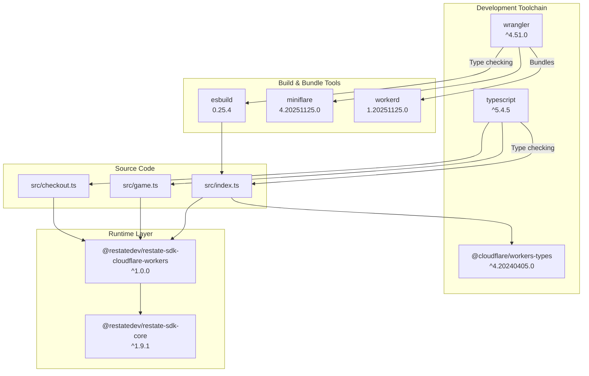
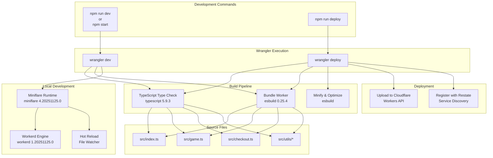
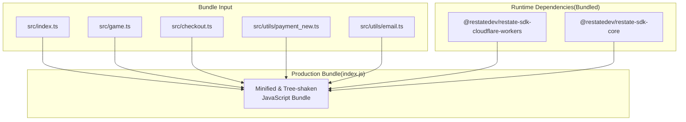

# Dependencies

> **Relevant source files**
> * [package-lock.json](https://github.com/philipz/restate-cloudflare-workers-poc/blob/513fd0f5/package-lock.json)
> * [package.json](https://github.com/philipz/restate-cloudflare-workers-poc/blob/513fd0f5/package.json)

This page documents all project dependencies defined in [package.json](https://github.com/philipz/restate-cloudflare-workers-poc/blob/513fd0f5/package.json)

 and their resolved versions in [package-lock.json](https://github.com/philipz/restate-cloudflare-workers-poc/blob/513fd0f5/package-lock.json)

 These dependencies comprise the Restate SDK for runtime execution and development tooling for building and deploying Cloudflare Workers. For information about TypeScript compiler configuration that affects dependency usage, see [TypeScript Configuration](/philipz/restate-cloudflare-workers-poc/7.1-typescript-configuration). For Wrangler settings that utilize these dependencies, see [Wrangler Configuration](/philipz/restate-cloudflare-workers-poc/7.2-wrangler-configuration).

---

## Overview

The nexus-poc project has a minimal dependency footprint with one runtime dependency and three development dependencies. This lean dependency structure is intentional for Cloudflare Workers deployment, where bundle size directly impacts cold start performance.

**Sources:** [package.json L1-L18](https://github.com/philipz/restate-cloudflare-workers-poc/blob/513fd0f5/package.json#L1-L18)

---

## Direct Dependencies

The project declares four direct dependencies across runtime and development scopes:

| Dependency | Version | Scope | Purpose |
| --- | --- | --- | --- |
| `@restatedev/restate-sdk-cloudflare-workers` | `^1.0.0` | Runtime | Provides Restate orchestration primitives for durable execution, Virtual Objects, and Workflows |
| `@cloudflare/workers-types` | `^4.20240405.0` | Development | TypeScript type definitions for Cloudflare Workers runtime APIs |
| `typescript` | `^5.4.5` | Development | TypeScript compiler for type checking and transpilation |
| `wrangler` | `^4.51.0` | Development | Cloudflare Workers CLI for local development, deployment, and testing |

**Sources:** [package.json L10-L17](https://github.com/philipz/restate-cloudflare-workers-poc/blob/513fd0f5/package.json#L10-L17)

---

## Dependency Architecture



**Diagram: Dependency relationships across runtime, development, and build layers**

This architecture shows three distinct layers. The **Runtime Layer** contains the Restate SDK and its core dependency, which are bundled into the final Worker. The **Development Toolchain** provides type checking and deployment capabilities. The **Build & Bundle Tools** are transitive dependencies of Wrangler used for local development and production bundling.

**Sources:** [package.json L10-L17](https://github.com/philipz/restate-cloudflare-workers-poc/blob/513fd0f5/package.json#L10-L17)

 [package-lock.json L1026-L1045](https://github.com/philipz/restate-cloudflare-workers-poc/blob/513fd0f5/package-lock.json#L1026-L1045)

---

## Runtime Dependency: Restate SDK

### @restatedev/restate-sdk-cloudflare-workers

The sole runtime dependency provides integration between Restate's durable execution framework and Cloudflare Workers runtime.

**Package Details:**

| Property | Value |
| --- | --- |
| Installed Version | `1.9.1` |
| Declared Version | `^1.0.0` |
| License | MIT |
| Registry | `@restatedev/restate-sdk-cloudflare-workers` |
| Node Requirement | `>= 20.19` |

**Core Dependency:**

The SDK depends on `@restatedev/restate-sdk-core` version `^1.9.1`, which provides platform-agnostic Restate functionality. The Cloudflare Workers package adapts this core for the Workers runtime environment.

**Exported Constructs:**

The SDK provides the following key exports used throughout the codebase:

| Export | Usage Location | Purpose |
| --- | --- | --- |
| `createEndpointHandler()` | [src/index.ts](https://github.com/philipz/restate-cloudflare-workers-poc/blob/513fd0f5/src/index.ts) | Creates the Worker's fetch handler bound to Restate services |
| `object()` | [src/game.ts](https://github.com/philipz/restate-cloudflare-workers-poc/blob/513fd0f5/src/game.ts) | Defines Virtual Objects (Ticket, SeatMap) with serialized state |
| `workflow()` | [src/checkout.ts](https://github.com/philipz/restate-cloudflare-workers-poc/blob/513fd0f5/src/checkout.ts) | Defines Durable Workflows for saga orchestration |
| `ObjectContext` | [src/game.ts](https://github.com/philipz/restate-cloudflare-workers-poc/blob/513fd0f5/src/game.ts) | Context API for Virtual Object handlers |
| `WorkflowContext` | [src/checkout.ts](https://github.com/philipz/restate-cloudflare-workers-poc/blob/513fd0f5/src/checkout.ts) | Context API for Workflow handlers with `ctx.run()`, `ctx.objectClient()` |

**Sources:** [package.json L15-L16](https://github.com/philipz/restate-cloudflare-workers-poc/blob/513fd0f5/package.json#L15-L16)

 [package-lock.json L1026-L1045](https://github.com/philipz/restate-cloudflare-workers-poc/blob/513fd0f5/package-lock.json#L1026-L1045)

---

## Development Dependencies

### @cloudflare/workers-types

Provides TypeScript type definitions for Cloudflare Workers global APIs including `Request`, `Response`, `ExecutionContext`, and Workers-specific bindings.

**Package Details:**

| Property | Value |
| --- | --- |
| Installed Version | `4.20251128.0` |
| Declared Version | `^4.20240405.0` |
| License | MIT OR Apache-2.0 |

**Usage in TypeScript Configuration:**

Referenced in [tsconfig.json](https://github.com/philipz/restate-cloudflare-workers-poc/blob/513fd0f5/tsconfig.json)

 via the `types` compiler option to enable type checking for Workers-specific APIs. This allows code to use `fetch()`, environment variables, and Workers runtime features with full type safety.

**Sources:** [package.json L11](https://github.com/philipz/restate-cloudflare-workers-poc/blob/513fd0f5/package.json#L11-L11)

 [package-lock.json L133-L139](https://github.com/philipz/restate-cloudflare-workers-poc/blob/513fd0f5/package-lock.json#L133-L139)

### typescript

The TypeScript compiler used for type checking and transpilation during development.

**Package Details:**

| Property | Value |
| --- | --- |
| Installed Version | `5.9.3` |
| Declared Version | `^5.4.5` |
| License | Apache-2.0 |

**Compiler Integration:**

While TypeScript is installed, the actual bundling is performed by `esbuild` (via Wrangler). TypeScript is primarily used for:

* Type checking via `tsc --noEmit`
* IDE integration for IntelliSense
* Enforcing strict type safety configured in [tsconfig.json](https://github.com/philipz/restate-cloudflare-workers-poc/blob/513fd0f5/tsconfig.json)

**Sources:** [package.json L12](https://github.com/philipz/restate-cloudflare-workers-poc/blob/513fd0f5/package.json#L12-L12)

 [package-lock.json L1418-L1431](https://github.com/philipz/restate-cloudflare-workers-poc/blob/513fd0f5/package-lock.json#L1418-L1431)

### wrangler

The Cloudflare Workers CLI tool handling the complete development and deployment workflow.

**Package Details:**

| Property | Value |
| --- | --- |
| Installed Version | `4.51.0` |
| Declared Version | `^4.51.0` |
| License | MIT OR Apache-2.0 |
| Node Requirement | `>= 20.0.0` |

**Bundled Tooling:**

Wrangler includes several critical tools as direct dependencies:

| Tool | Version | Purpose |
| --- | --- | --- |
| `esbuild` | `0.25.4` | JavaScript bundler for production builds |
| `miniflare` | `4.20251125.0` | Local Workers runtime simulator |
| `workerd` | `1.20251125.0` | Open-source Workers runtime (powers miniflare) |

**NPM Scripts:**

The project defines three scripts that invoke Wrangler:

```json
{
  "deploy": "wrangler deploy",
  "dev": "wrangler dev",
  "start": "wrangler dev"
}
```

These scripts correspond to:

* `deploy`: Builds and deploys to Cloudflare Workers production
* `dev`/`start`: Starts local development server with hot reload

**Sources:** [package.json L5-L13](https://github.com/philipz/restate-cloudflare-workers-poc/blob/513fd0f5/package.json#L5-L13)

 [package-lock.json L1473-L1507](https://github.com/philipz/restate-cloudflare-workers-poc/blob/513fd0f5/package-lock.json#L1473-L1507)

---

## Transitive Dependency Tree

```mermaid
flowchart TD

SDK["@restatedev/restate-sdk-cloudflare-workers<br>1.9.1"]
Wrangler["wrangler<br>4.51.0"]
TS["typescript<br>5.9.3"]
Types["@cloudflare/workers-types<br>4.20251128.0"]
Esbuild["esbuild<br>0.25.4"]
Miniflare["miniflare<br>4.20251125.0"]
Workerd["workerd<br>1.20251125.0"]
KVHandler["@cloudflare/kv-asset-handler<br>0.4.1"]
UnenvPreset["@cloudflare/unenv-preset<br>2.7.11"]
Blake3["blake3-wasm<br>2.1.5"]
PathRegexp["path-to-regexp<br>6.3.0"]
Unenv["unenv<br>2.0.0-rc.24"]
CoreSDK["@restatedev/restate-sdk-core<br>1.9.1"]
SourceMap["@cspotcode/source-map-support<br>0.8.1"]
Acorn["acorn<br>8.14.0"]
AcornWalk["acorn-walk<br>8.3.2"]
ExitHook["exit-hook<br>2.2.1"]
GlobRegexp["glob-to-regexp<br>0.4.1"]
Sharp["sharp<br>0.33.5"]
Stoppable["stoppable<br>1.1.0"]
Undici["undici<br>7.14.0"]
WS["ws<br>8.18.0"]
Youch["youch<br>4.1.0-beta.10"]
Zod["zod<br>3.22.3"]

SDK --> CoreSDK
Wrangler --> Esbuild
Wrangler --> Miniflare
Wrangler --> Workerd
Wrangler --> KVHandler
Wrangler --> UnenvPreset
Wrangler --> Blake3
Wrangler --> PathRegexp
Wrangler --> Unenv
Miniflare --> SourceMap
Miniflare --> Acorn
Miniflare --> AcornWalk
Miniflare --> ExitHook
Miniflare --> GlobRegexp
Miniflare --> Sharp
Miniflare --> Stoppable
Miniflare --> Undici
Miniflare --> WS
Miniflare --> Youch
Miniflare --> Zod

subgraph subGraph3 ["Miniflare Transitive Dependencies"]
    SourceMap
    Acorn
    AcornWalk
    ExitHook
    GlobRegexp
    Sharp
    Stoppable
    Undici
    WS
    Youch
    Zod
end

subgraph subGraph2 ["SDK Transitive Dependencies"]
    CoreSDK
end

subgraph subGraph1 ["Wrangler Transitive Dependencies"]
    Esbuild
    Miniflare
    Workerd
    KVHandler
    UnenvPreset
    Blake3
    PathRegexp
    Unenv
end

subgraph subGraph0 ["Direct Dependencies"]
    SDK
    Wrangler
    TS
    Types
end
```



**Diagram: Complete transitive dependency tree from direct dependencies**

The project's 4 direct dependencies expand to over 50 transitive dependencies. The majority are platform-specific native binaries (for `sharp`, `esbuild`, and `workerd`) that are conditionally installed based on the host operating system and architecture.

**Sources:** [package-lock.json L1-L1566](https://github.com/philipz/restate-cloudflare-workers-poc/blob/513fd0f5/package-lock.json#L1-L1566)

---

## Platform-Specific Dependencies

Several transitive dependencies include platform-specific native binaries installed conditionally using npm's `optionalDependencies` mechanism:

### workerd Native Binaries

The open-source Workers runtime has separate binaries for each platform:

| Package | Platforms | Purpose |
| --- | --- | --- |
| `@cloudflare/workerd-darwin-64` | macOS x64 | Native Workers runtime for Intel Macs |
| `@cloudflare/workerd-darwin-arm64` | macOS ARM64 | Native Workers runtime for Apple Silicon |
| `@cloudflare/workerd-linux-64` | Linux x64 | Native Workers runtime for Linux |
| `@cloudflare/workerd-linux-arm64` | Linux ARM64 | Native Workers runtime for Linux ARM |
| `@cloudflare/workerd-windows-64` | Windows x64 | Native Workers runtime for Windows |

Only the binary matching the host platform is installed, reducing disk usage.

**Sources:** [package-lock.json L48-L132](https://github.com/philipz/restate-cloudflare-workers-poc/blob/513fd0f5/package-lock.json#L48-L132)

### esbuild Native Binaries

The bundler includes 25 platform-specific packages covering architectures like:

* Darwin (macOS): arm64, x64
* Linux: arm, arm64, ia32, loong64, mips64el, ppc64, riscv64, s390x, x64
* Windows: ia32, arm64, x64
* FreeBSD, NetBSD, OpenBSD, SunOS, AIX

**Sources:** [package-lock.json L164-L588](https://github.com/philipz/restate-cloudflare-workers-poc/blob/513fd0f5/package-lock.json#L164-L588)

### sharp Native Binaries

The image processing library (used by miniflare for asset handling) includes binaries for:

* Darwin: arm64, x64
* Linux: arm, arm64, s390x, x64
* Linux musl: arm64, x64
* Windows: ia32, x64
* WebAssembly: wasm32

**Sources:** [package-lock.json L589-L968](https://github.com/philipz/restate-cloudflare-workers-poc/blob/513fd0f5/package-lock.json#L589-L968)

---

## Development Workflow Integration



**Diagram: How dependencies integrate into development and deployment workflows**

This diagram shows how dependencies are invoked through npm scripts. The `wrangler` CLI orchestrates both workflows, using `typescript` for type checking and `esbuild` for bundling. Local development additionally spins up `miniflare` (powered by `workerd`) for a local runtime environment with hot reload.

**Sources:** [package.json L5-L8](https://github.com/philipz/restate-cloudflare-workers-poc/blob/513fd0f5/package.json#L5-L8)

 [wrangler.toml](https://github.com/philipz/restate-cloudflare-workers-poc/blob/513fd0f5/wrangler.toml)

---

## Lock File Integrity

The [package-lock.json](https://github.com/philipz/restate-cloudflare-workers-poc/blob/513fd0f5/package-lock.json)

 file uses `lockfileVersion: 3`, which ensures:

1. **Deterministic Installs**: Exact versions of all transitive dependencies are locked
2. **Integrity Hashes**: SHA-512 integrity checksums validate package authenticity
3. **Tree Optimization**: Flat dependency structure minimizes duplication

**Lock File Metadata:**

| Property | Value |
| --- | --- |
| Package Name | `nexus-poc` |
| Version | `0.0.1` |
| Lock File Version | 3 |
| Total Packages | 97+ (including platform-specific optionals) |

**Recommended Workflow:**

* Commit [package-lock.json](https://github.com/philipz/restate-cloudflare-workers-poc/blob/513fd0f5/package-lock.json)  to version control
* Use `npm ci` in CI/CD pipelines for reproducible builds
* Update dependencies with `npm update` to refresh lock file

**Sources:** [package-lock.json L1-L6](https://github.com/philipz/restate-cloudflare-workers-poc/blob/513fd0f5/package-lock.json#L1-L6)

---

## Dependency Update Strategy

Given the project's minimal dependencies, updates should focus on:

### Critical Updates

| Dependency | Update Trigger | Risk Level |
| --- | --- | --- |
| `@restatedev/restate-sdk-cloudflare-workers` | Security patches, new Restate features | Medium (breaking API changes possible) |
| `wrangler` | Cloudflare Workers runtime updates, new features | Low (usually backward compatible) |
| `typescript` | Major version releases | Low (compiler flags isolate breaking changes) |
| `@cloudflare/workers-types` | Workers runtime API changes | Low (additive changes only) |

### Update Commands

```sql
# Check for outdated packages
npm outdated

# Update to latest compatible versions within semver range
npm update

# Update to latest major versions (breaking changes)
npm install @restatedev/restate-sdk-cloudflare-workers@latest
```

**Sources:** [package.json L10-L17](https://github.com/philipz/restate-cloudflare-workers-poc/blob/513fd0f5/package.json#L10-L17)

---

## Bundle Size Considerations

The final Worker bundle includes only the runtime dependency and source code. Development dependencies are excluded from production builds.

**Production Bundle Contents:**



**Diagram: Production bundle composition showing what gets included in the deployed Worker**

The bundler performs tree-shaking to eliminate unused code from the Restate SDK, keeping the final bundle size minimal. Cloudflare Workers have a 1MB uncompressed limit, which this project comfortably stays under.

**Sources:** [package.json L15-L16](https://github.com/philipz/restate-cloudflare-workers-poc/blob/513fd0f5/package.json#L15-L16)

 [wrangler.toml](https://github.com/philipz/restate-cloudflare-workers-poc/blob/513fd0f5/wrangler.toml)