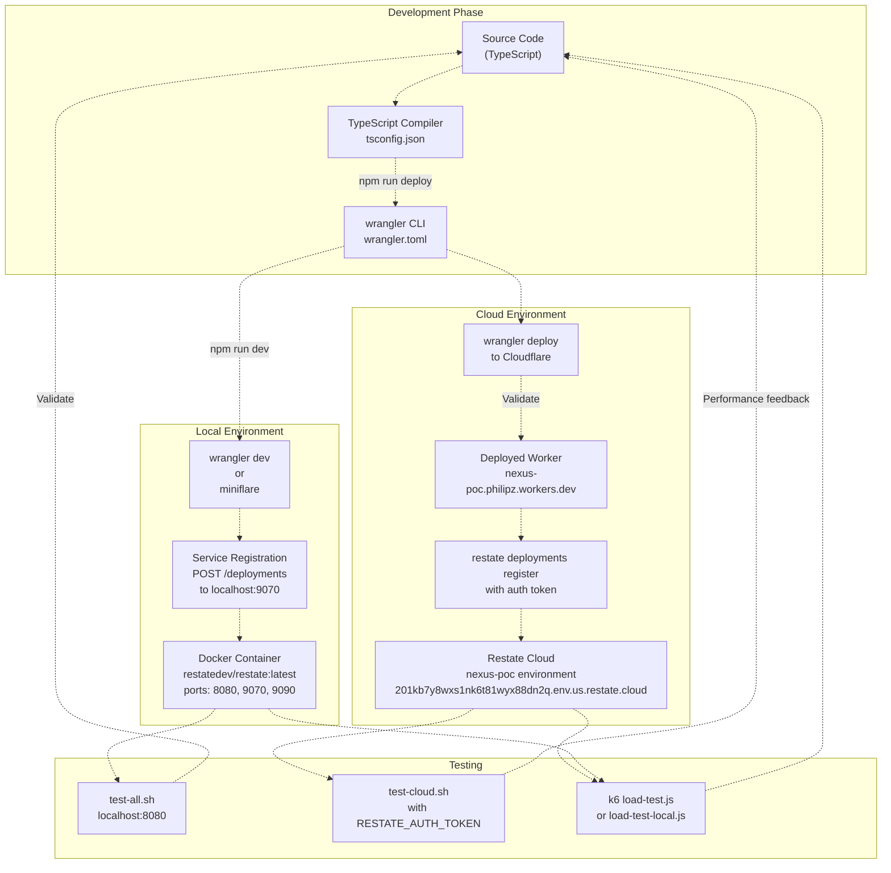
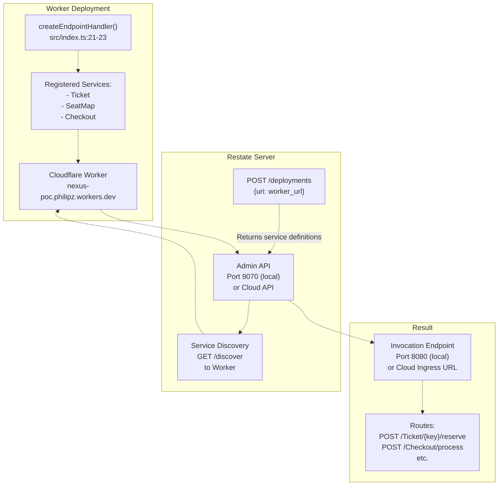
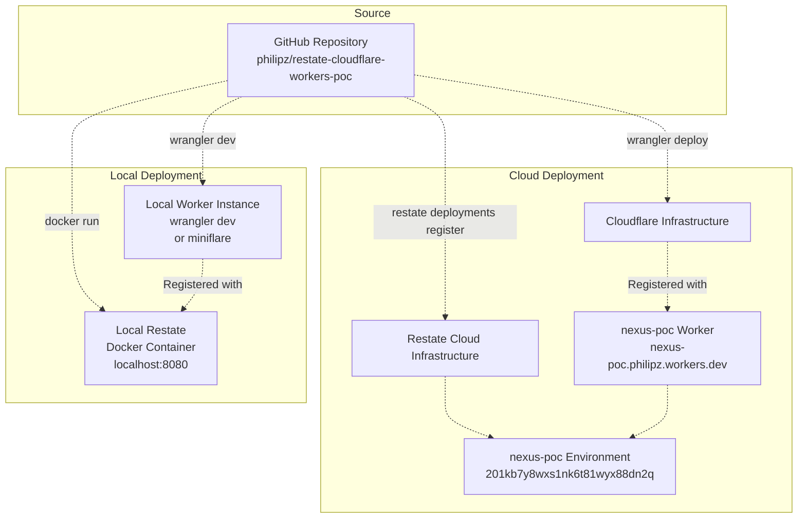

# Development & Deployment

> **Relevant source files**
> * [README.md](https://github.com/philipz/restate-cloudflare-workers-poc/blob/513fd0f5/README.md)
> * [package.json](https://github.com/philipz/restate-cloudflare-workers-poc/blob/513fd0f5/package.json)
> * [wrangler.toml](https://github.com/philipz/restate-cloudflare-workers-poc/blob/513fd0f5/wrangler.toml)

This page provides an overview of the development workflow and deployment process for the nexus-poc system. It covers the tools, prerequisites, and high-level steps required to run the application locally and deploy it to production environments.

For detailed instructions on local development setup, see [Local Development Setup](/philipz/restate-cloudflare-workers-poc/6.1-local-development-setup). For cloud deployment procedures, see [Cloud Deployment](/philipz/restate-cloudflare-workers-poc/6.2-cloud-deployment). For information about testing strategies, see [Testing Strategy](/philipz/restate-cloudflare-workers-poc/5-testing-strategy).

## Scope

This page covers:

* Prerequisites and toolchain overview
* Development-to-production workflow
* Key npm scripts and wrangler commands
* Environment configuration requirements
* Service registration process

It does not cover specific testing procedures (see [Testing Strategy](/philipz/restate-cloudflare-workers-poc/5-testing-strategy)) or detailed configuration file formats (see [Configuration Reference](/philipz/restate-cloudflare-workers-poc/7-configuration-reference)).

## Development Workflow Overview

The nexus-poc project follows a standard Cloudflare Workers development workflow enhanced with Restate service registration. The process involves local development with `wrangler dev`, deployment to Cloudflare Workers with `wrangler deploy`, and registration with either a local Restate server or Restate Cloud.

### Development-to-Production Pipeline



**Sources:** [README.md L24-L65](https://github.com/philipz/restate-cloudflare-workers-poc/blob/513fd0f5/README.md#L24-L65)

 [package.json L5-L8](https://github.com/philipz/restate-cloudflare-workers-poc/blob/513fd0f5/package.json#L5-L8)

 [wrangler.toml L1-L7](https://github.com/philipz/restate-cloudflare-workers-poc/blob/513fd0f5/wrangler.toml#L1-L7)

## Prerequisites

The following tools and accounts are required for development and deployment:

| Tool/Service | Purpose | Installation |
| --- | --- | --- |
| **Node.js & npm** | JavaScript runtime and package manager | Download from nodejs.org |
| **Docker** | Run local Restate server | Download from docker.com |
| **Restate CLI** | Manage Restate Cloud environments | `brew install restatedev/tap/restate` |
| **wrangler** | Cloudflare Workers CLI | Installed via `npm install` (dev dependency) |
| **k6** (optional) | Load testing tool | Download from k6.io |
| **Cloudflare Account** | Deploy Workers | Sign up at cloudflare.com |
| **Restate Cloud Account** (optional) | Managed Restate environment | Sign up at cloud.restate.dev |

**Sources:** [README.md L26-L29](https://github.com/philipz/restate-cloudflare-workers-poc/blob/513fd0f5/README.md#L26-L29)

 [package.json L10-L17](https://github.com/philipz/restate-cloudflare-workers-poc/blob/513fd0f5/package.json#L10-L17)

## Key Commands Reference

The project provides several npm scripts and CLI commands for development and deployment:

### NPM Scripts

| Command | Description | Defined In |
| --- | --- | --- |
| `npm run dev` | Start local development server with wrangler | [package.json L7](https://github.com/philipz/restate-cloudflare-workers-poc/blob/513fd0f5/package.json#L7-L7) |
| `npm run start` | Alias for `npm run dev` | [package.json L8](https://github.com/philipz/restate-cloudflare-workers-poc/blob/513fd0f5/package.json#L8-L8) |
| `npm run deploy` | Deploy to Cloudflare Workers | [package.json L6](https://github.com/philipz/restate-cloudflare-workers-poc/blob/513fd0f5/package.json#L6-L6) |

### Wrangler Commands

| Command | Description | Usage |
| --- | --- | --- |
| `npx wrangler dev` | Run Worker locally with hot reload | Local development |
| `npx wrangler deploy` | Deploy Worker to Cloudflare | Production deployment |
| `npx wrangler tail` | Stream Worker logs | Debugging deployed Workers |

### Restate CLI Commands

| Command | Description | Usage |
| --- | --- | --- |
| `restate cloud login` | Authenticate with Restate Cloud | Initial cloud setup |
| `restate cloud environments configure` | Configure CLI for environment | After creating environment |
| `restate -e <env> deployments register <url>` | Register Worker with Restate Cloud | After deploying Worker |

**Sources:** [package.json L5-L8](https://github.com/philipz/restate-cloudflare-workers-poc/blob/513fd0f5/package.json#L5-L8)

 [README.md L58-L64](https://github.com/philipz/restate-cloudflare-workers-poc/blob/513fd0f5/README.md#L58-L64)

## Service Registration Process

Both local and cloud deployments require registering the Cloudflare Worker endpoint with a Restate server. This registration tells Restate where to invoke the services defined in the Worker.

### Registration Architecture



**Sources:** [README.md L43-L48](https://github.com/philipz/restate-cloudflare-workers-poc/blob/513fd0f5/README.md#L43-L48)

 [README.md L61-L64](https://github.com/philipz/restate-cloudflare-workers-poc/blob/513fd0f5/README.md#L61-L64)

 [src/index.ts L21-L23](https://github.com/philipz/restate-cloudflare-workers-poc/blob/513fd0f5/src/index.ts#L21-L23)

### Local Registration

For local development, the Restate Admin API is accessible at `http://localhost:9070`. Registration is performed with a `curl` command:

```
curl -X POST http://localhost:9070/deployments \
  -H "Content-Type: application/json" \
  -d '{"uri": "https://nexus-poc.philipz.workers.dev"}'
```

The Worker URL must be publicly accessible, even for local development, because the Restate server needs to perform service discovery by sending a `GET` request to the `/discover` endpoint exposed by `createEndpointHandler()`.

**Sources:** [README.md L43-L48](https://github.com/philipz/restate-cloudflare-workers-poc/blob/513fd0f5/README.md#L43-L48)

### Cloud Registration

For Restate Cloud, registration uses the Restate CLI with environment authentication:

```
restate -e nexus-poc deployments register https://nexus-poc.philipz.workers.dev
```

This command requires:

* Prior authentication via `restate cloud login`
* Environment configuration via `restate cloud environments configure philipz/nexus-poc`
* The Worker to be deployed and publicly accessible

**Sources:** [README.md L58-L64](https://github.com/philipz/restate-cloudflare-workers-poc/blob/513fd0f5/README.md#L58-L64)

## Environment Configuration

The project uses environment-specific configuration stored in `.env` files for cloud deployments:

| Variable | Purpose | Required For |
| --- | --- | --- |
| `RESTATE_AUTH_TOKEN` | Authenticate requests to Restate Cloud | `test-cloud.sh`, `load-test.js` |

The `.env` file is **not committed** to version control and must be created manually:

```
RESTATE_AUTH_TOKEN=your_token_here
```

Test scripts source this file using `source .env` before executing tests against Restate Cloud.

**Sources:** [README.md L97-L101](https://github.com/philipz/restate-cloudflare-workers-poc/blob/513fd0f5/README.md#L97-L101)

 [README.md L118-L119](https://github.com/philipz/restate-cloudflare-workers-poc/blob/513fd0f5/README.md#L118-L119)

## Wrangler Configuration

The Worker is configured through `wrangler.toml`, which specifies:

| Setting | Value | Purpose |
| --- | --- | --- |
| `name` | `"nexus-poc"` | Worker name in Cloudflare dashboard |
| `main` | `"src/index.ts"` | Entry point file |
| `compatibility_date` | `"2024-04-01"` | Runtime compatibility version |
| `compatibility_flags` | `["nodejs_compat"]` | Enable Node.js compatibility layer |
| `observability.enabled` | `true` | Enable Cloudflare observability features |

The `nodejs_compat` flag is critical because it enables Node.js APIs required by the Restate SDK for Cloudflare Workers.

**Sources:** [wrangler.toml L1-L7](https://github.com/philipz/restate-cloudflare-workers-poc/blob/513fd0f5/wrangler.toml#L1-L7)

## Development Modes

### Local Development Mode

Local development uses either `wrangler dev` or `miniflare` to run the Worker locally, connected to a Dockerized Restate server. This mode provides:

* Hot reload on code changes
* Local debugging capabilities
* Fast iteration without deployment overhead
* Isolated testing environment

See [Local Development Setup](/philipz/restate-cloudflare-workers-poc/6.1-local-development-setup) for detailed instructions.

### Cloud Development Mode

Cloud development deploys the Worker to Cloudflare's production infrastructure while connecting to a managed Restate Cloud environment. This mode provides:

* Production-like environment
* Distributed execution across Cloudflare's edge network
* Managed Restate with high availability
* Realistic performance characteristics

See [Cloud Deployment](/philipz/restate-cloudflare-workers-poc/6.2-cloud-deployment) for detailed instructions.

## Deployment Targets



**Sources:** [README.md L24-L65](https://github.com/philipz/restate-cloudflare-workers-poc/blob/513fd0f5/README.md#L24-L65)

## Next Steps

* For setting up your local development environment, proceed to [Local Development Setup](/philipz/restate-cloudflare-workers-poc/6.1-local-development-setup)
* For deploying to production, see [Cloud Deployment](/philipz/restate-cloudflare-workers-poc/6.2-cloud-deployment)
* For validating deployments, refer to [Testing Strategy](/philipz/restate-cloudflare-workers-poc/5-testing-strategy)

**Sources:** [README.md L1-L154](https://github.com/philipz/restate-cloudflare-workers-poc/blob/513fd0f5/README.md#L1-L154)