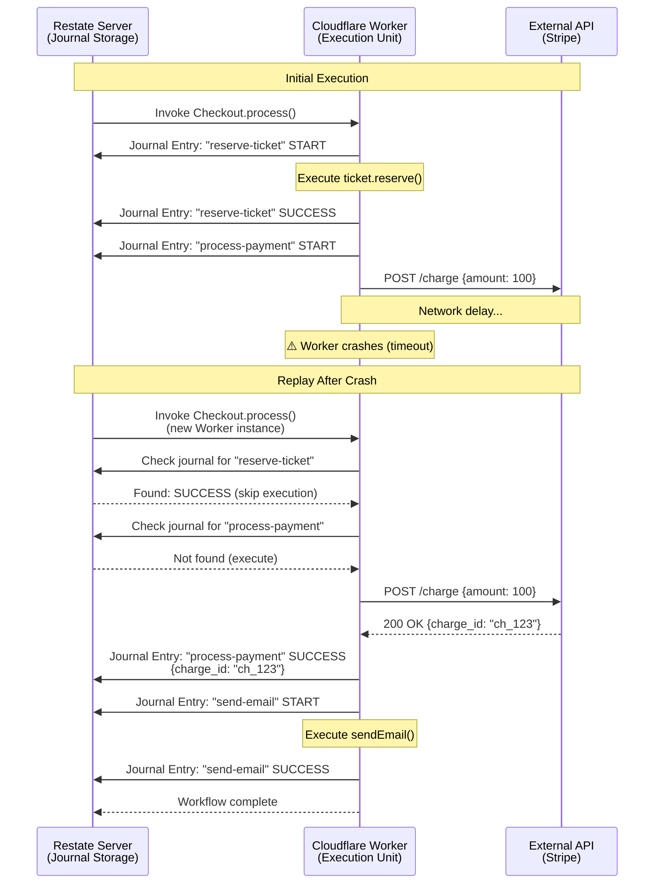
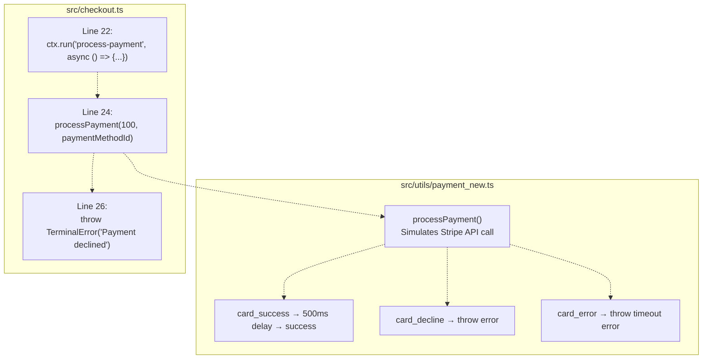
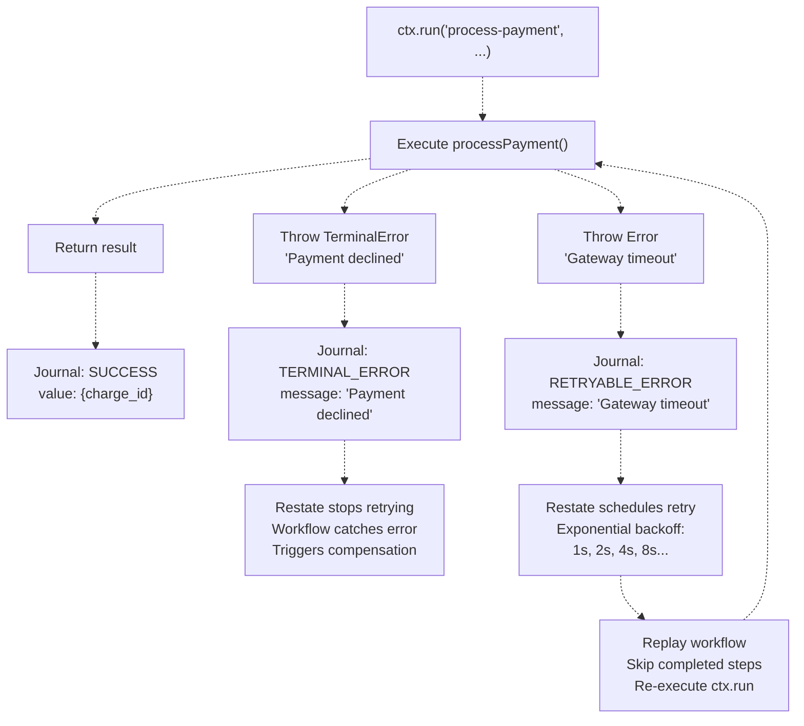
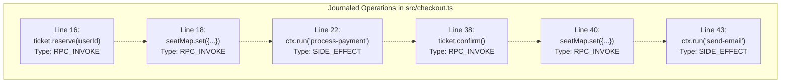

# Durable Execution & ctx.run

> **Relevant source files**
> * [PoC.md](https://github.com/philipz/restate-cloudflare-workers-poc/blob/513fd0f5/PoC.md)
> * [README.md](https://github.com/philipz/restate-cloudflare-workers-poc/blob/513fd0f5/README.md)
> * [src/checkout.ts](https://github.com/philipz/restate-cloudflare-workers-poc/blob/513fd0f5/src/checkout.ts)

## Purpose and Scope

This page explains Restate's durable execution model and the `ctx.run` API, which provides exactly-once execution guarantees for non-deterministic operations in Cloudflare Workers. This page focuses on how the system journals execution progress and replays workflows to achieve fault tolerance and consistent side effects.

For information about state management through Virtual Objects, see [Virtual Objects & Serialization](/philipz/restate-cloudflare-workers-poc/8.1-virtual-objects-and-serialization). For information about transaction orchestration and compensation logic, see [Saga Pattern & Compensation](/philipz/restate-cloudflare-workers-poc/8.3-saga-pattern-and-compensation).

---

## What is Durable Execution?

Durable execution is Restate's mechanism for making Cloudflare Workers behave like long-running, fault-tolerant processes despite their inherently stateless and ephemeral nature. The system achieves this through **execution journaling**—recording every significant step of a workflow's execution so it can be replayed after failures.

### Core Principles

| Principle | Description | Benefit |
| --- | --- | --- |
| **Execution Journaling** | Every RPC call, side effect, and result is logged to a persistent journal | Enables crash recovery without losing progress |
| **Deterministic Replay** | On restart, the workflow code re-executes, but uses journaled results instead of re-running side effects | Prevents duplicate operations (e.g., double charges) |
| **Transparent Recovery** | The application code doesn't need explicit checkpointing logic | Simplifies development—write synchronous-looking code |
| **Exactly-Once Semantics** | Non-deterministic operations wrapped in `ctx.run` execute exactly once, even across retries | Guarantees correctness for external API calls |

```mermaid
flowchart TD

DE1["Step 1: Reserve seat<br>✓ Journaled"]
DE2["Step 2: Charge payment<br>✓ Journaled"]
DE3["Worker crashes<br>during email send"]
DE4["Restate detects failure<br>Replays journal"]
DE5["Step 1: Skip (use journal)<br>Step 2: Skip (use journal)<br>Step 3: Resume from email"]
SW1["Request 1:<br>Reserve seat"]
SW2["Request 2:<br>Charge payment"]
SW3["Worker crashes<br>during payment"]
SW4["State lost<br>Seat reserved but<br>payment unknown"]

subgraph subGraph1 ["Restate Durable Execution"]
    DE1
    DE2
    DE3
    DE4
    DE5
    DE1 -.-> DE2
    DE2 -.-> DE3
    DE3 -.-> DE4
    DE4 -.-> DE5
end

subgraph subGraph0 ["Traditional Stateless Worker"]
    SW1
    SW2
    SW3
    SW4
    SW1 -.-> SW2
    SW2 -.-> SW3
    SW3 -.-> SW4
end
```



**Diagram: Traditional vs. Durable Execution Recovery**

**Sources:** [PoC.md L15-L17](https://github.com/philipz/restate-cloudflare-workers-poc/blob/513fd0f5/PoC.md#L15-L17)

 [README.md L10](https://github.com/philipz/restate-cloudflare-workers-poc/blob/513fd0f5/README.md#L10-L10)

 [README.md L14-L16](https://github.com/philipz/restate-cloudflare-workers-poc/blob/513fd0f5/README.md#L14-L16)

---

## The ctx.run API

The `ctx.run` function is the primary API for wrapping non-deterministic operations (external API calls, random number generation, timestamp retrieval) to ensure they execute exactly once within a durable workflow.

### Signature

```javascript
ctx.run<T>(name: string, action: () => Promise<T> | T): Promise<T>
```

### Parameters

| Parameter | Type | Purpose |
| --- | --- | --- |
| `name` | `string` | Unique identifier for this operation within the workflow (used as the journal key) |
| `action` | `() => Promise<T> \| T` | The non-deterministic function to execute—only runs once per workflow execution |

### Return Value

Returns a `Promise<T>` that resolves to:

* The result of `action()` on first execution
* The journaled result on replay (without re-executing `action`)

**Sources:** [src/checkout.ts L22-L28](https://github.com/philipz/restate-cloudflare-workers-poc/blob/513fd0f5/src/checkout.ts#L22-L28)

 [src/checkout.ts L43-L45](https://github.com/philipz/restate-cloudflare-workers-poc/blob/513fd0f5/src/checkout.ts#L43-L45)

---

## Journaling and Replay Mechanism

When a workflow executes, Restate builds an **execution journal**—a log of all deterministic decisions and side effect results. This journal enables replay semantics: if the Worker crashes mid-execution, Restate restarts it from the beginning, but uses the journal to skip already-completed steps.



**Diagram: Execution Journal and Crash Recovery Flow**

### Journal Entry Structure

Each `ctx.run` call creates a journal entry with:

| Field | Content | Purpose |
| --- | --- | --- |
| **Entry Name** | The `name` parameter (e.g., `"process-payment"`) | Identifies the operation during replay |
| **Entry Type** | `RUN` (side effect) vs. `INVOKE` (RPC call) | Determines replay behavior |
| **Result** | The value returned by `action()` | Used as the return value during replay |
| **Error** | Exception thrown by `action()`, if any | Replayed to maintain control flow |

**Sources:** [PoC.md L176-L191](https://github.com/philipz/restate-cloudflare-workers-poc/blob/513fd0f5/PoC.md#L176-L191)

 [README.md L14-L16](https://github.com/philipz/restate-cloudflare-workers-poc/blob/513fd0f5/README.md#L14-L16)

---

## Use Cases in the Codebase

The Checkout workflow ([src/checkout.ts](https://github.com/philipz/restate-cloudflare-workers-poc/blob/513fd0f5/src/checkout.ts)

) demonstrates two canonical uses of `ctx.run`:

### Payment Processing (Non-Idempotent External API)



**Diagram: Payment Processing with ctx.run**

**Code Location:** [src/checkout.ts L22-L28](https://github.com/philipz/restate-cloudflare-workers-poc/blob/513fd0f5/src/checkout.ts#L22-L28)

The payment step uses `ctx.run` because:

1. **Non-deterministic:** External API responses vary by network, provider state
2. **Non-idempotent:** Charging a credit card twice causes double billing
3. **Failure-prone:** Network timeouts, gateway errors require retries

**How it works:**

* First execution: Calls `processPayment(100, paymentMethodId)` which simulates a Stripe API call
* On success: Result is journaled, returned immediately on replay
* On error: Error is journaled, re-thrown on replay to trigger compensation (see [Saga Pattern & Compensation](/philipz/restate-cloudflare-workers-poc/8.3-saga-pattern-and-compensation))

### Email Notification (Idempotent but External)

**Code Location:** [src/checkout.ts L43-L45](https://github.com/philipz/restate-cloudflare-workers-poc/blob/513fd0f5/src/checkout.ts#L43-L45)

```javascript
await ctx.run("send-email", async () => {
    await sendEmail(userId, "Booking Confirmed", `You have successfully purchased ticket ${ticketId}.`);
});
```

Although the email utility ([src/utils/email.ts](https://github.com/philipz/restate-cloudflare-workers-poc/blob/513fd0f5/src/utils/email.ts)

) is a mock, in production this would call an external SMTP service. Using `ctx.run` ensures:

* Email is sent exactly once, even if the workflow is replayed after the confirmation step
* If the email service is temporarily down, Restate retries automatically without re-executing payment

**Sources:** [src/checkout.ts L22-L28](https://github.com/philipz/restate-cloudflare-workers-poc/blob/513fd0f5/src/checkout.ts#L22-L28)

 [src/checkout.ts L43-L45](https://github.com/philipz/restate-cloudflare-workers-poc/blob/513fd0f5/src/checkout.ts#L43-L45)

 [src/utils/payment_new.ts L1-L50](https://github.com/philipz/restate-cloudflare-workers-poc/blob/513fd0f5/src/utils/payment_new.ts#L1-L50)

 [src/utils/email.ts](https://github.com/philipz/restate-cloudflare-workers-poc/blob/513fd0f5/src/utils/email.ts)

---

## Exactly-Once Execution Guarantees

### Replay Behavior Table

| Scenario | First Execution | After Crash (Replay) | Guarantee |
| --- | --- | --- | --- |
| `ctx.run("step-1", ...)` succeeds | Executes `action()`, journals result | Returns journaled result, **does not** re-execute | Exactly-once |
| `ctx.run("step-1", ...)` throws error | Executes `action()`, journals exception | Re-throws journaled exception, **does not** re-execute | Exactly-once (failure) |
| `ctx.run("step-1", ...)` times out | Executes `action()`, crashes before journaling | Re-executes `action()` (no journal entry exists yet) | At-least-once* |
| RPC call `ticket.reserve()` | Invokes, journals request/response | Returns journaled response | Exactly-once |

*Note: The at-least-once scenario only occurs if the Worker crashes between starting `action()` and Restate receiving the result. In practice, this window is very small (microseconds), and the `action()` itself should use idempotency keys for external APIs.

### Idempotency Keys Best Practice

For maximum safety, include a unique execution identifier in external API calls:

```javascript
await ctx.run("charge-card", async () => {
    // ctx.id() provides a unique, stable ID for this workflow invocation
    return await stripe.charges.create({
        amount: 100,
        idempotency_key: ctx.id() + "-payment"  // Prevents duplicate charges
    });
});
```

**Sources:** [PoC.md L176-L191](https://github.com/philipz/restate-cloudflare-workers-poc/blob/513fd0f5/PoC.md#L176-L191)

 [README.md L14-L16](https://github.com/philipz/restate-cloudflare-workers-poc/blob/513fd0f5/README.md#L14-L16)

---

## Error Handling and Retries

Errors thrown inside `ctx.run` are journaled and affect retry behavior differently based on error type:

### TerminalError vs. Retryable Error



**Diagram: Error Handling in ctx.run**

### Implementation in Checkout Workflow

**Code Location:** [src/checkout.ts L20-L35](https://github.com/philipz/restate-cloudflare-workers-poc/blob/513fd0f5/src/checkout.ts#L20-L35)

```javascript
try {
    // Step 2: Process Payment
    await ctx.run("process-payment", async () => {
        try {
            return await processPayment(100, paymentMethodId);
        } catch (e) {
            // Convert payment failures to TerminalError (no retries)
            throw new restate.TerminalError(`Payment declined: ${(e as Error).message}`);
        }
    });
} catch (error) {
    // Step 3: Compensation (Saga pattern)
    await ticket.release();
    await seatMap.set({ seatId: ticketId, status: "AVAILABLE" });
    throw new restate.TerminalError(`Payment failed: ${(error as Error).message}`);
}
```

**Analysis:**

1. Inner `try-catch` (line 23-27): Catches errors from `processPayment()` and wraps them in `TerminalError`
2. This prevents Restate from infinitely retrying a card that was legitimately declined
3. Outer `try-catch` (line 20-35): Catches the `TerminalError` to trigger compensation logic
4. Without `TerminalError`, Restate would retry indefinitely using exponential backoff

**Sources:** [src/checkout.ts L20-L35](https://github.com/philipz/restate-cloudflare-workers-poc/blob/513fd0f5/src/checkout.ts#L20-L35)

 [PoC.md L207-L211](https://github.com/philipz/restate-cloudflare-workers-poc/blob/513fd0f5/PoC.md#L207-L211)

---

## Interaction with Virtual Objects

While `ctx.run` handles non-deterministic side effects, RPC calls to Virtual Objects (e.g., `ticket.reserve()`) use a different journaling mechanism:

| Operation | API | Journaling Behavior | Replay Behavior |
| --- | --- | --- | --- |
| **Side Effect** (external API) | `ctx.run("name", ...)` | Journals `name` + result | Skips execution, returns journaled result |
| **RPC Call** (Virtual Object) | `ctx.objectClient(...).method()` | Journals invocation ID + response | Skips execution, returns journaled response |
| **Fire-and-Forget** | `ctx.objectSendClient(...).method()` | Journals send (no response) | Skips sending on replay |

### Example from Checkout Workflow



**Diagram: Journal Entry Types in Checkout Flow**

**Key Distinction:**

* `ctx.run` is for **non-deterministic external operations**
* Object calls are **deterministic RPC** (serialized by Restate, but not external)
* Both are journaled, but `ctx.run` provides exactly-once semantics for side effects

**Sources:** [src/checkout.ts L16-L45](https://github.com/philipz/restate-cloudflare-workers-poc/blob/513fd0f5/src/checkout.ts#L16-L45)

 [src/game.ts](https://github.com/philipz/restate-cloudflare-workers-poc/blob/513fd0f5/src/game.ts)

---

## Best Practices

### When to Use ctx.run

✅ **Required for:**

* HTTP calls to external APIs (payment gateways, notification services)
* Database writes (if using external DB instead of Restate state)
* Non-deterministic functions (`Math.random()`, `Date.now()`, `crypto.randomUUID()`)
* File system operations
* Third-party SDK calls

❌ **Not needed for:**

* Calls to other Restate services/objects (use `ctx.objectClient` or `ctx.serviceClient`)
* Pure functions (deterministic computations)
* Reading from `ctx.get()` (Restate state is already journaled)

### Naming Convention

Use descriptive, unique names that reflect the operation:

```javascript
// ✅ Good: Describes the operation and is unique
await ctx.run("charge-stripe-card", async () => { ... });
await ctx.run("send-confirmation-email", async () => { ... });

// ❌ Bad: Generic names can conflict if used multiple times
await ctx.run("api-call", async () => { ... });  
await ctx.run("step1", async () => { ... });
```

### Error Handling Strategy

```javascript
await ctx.run("external-operation", async () => {
    try {
        const result = await externalAPI.call();
        return result;
    } catch (error) {
        // Distinguish business logic failures from transient errors
        if (error.code === 'INSUFFICIENT_FUNDS') {
            // Don't retry - this is a terminal business condition
            throw new restate.TerminalError(`Insufficient funds: ${error.message}`);
        }
        // Let transient errors propagate - Restate will retry
        throw error;
    }
});
```

**Sources:** [src/checkout.ts L22-L28](https://github.com/philipz/restate-cloudflare-workers-poc/blob/513fd0f5/src/checkout.ts#L22-L28)

 [PoC.md L207-L211](https://github.com/philipz/restate-cloudflare-workers-poc/blob/513fd0f5/PoC.md#L207-L211)

 [README.md L19-L22](https://github.com/philipz/restate-cloudflare-workers-poc/blob/513fd0f5/README.md#L19-L22)

---

## Performance Considerations

### Execution Overhead

Each `ctx.run` adds a round-trip to the Restate server to journal the result. In the local development environment ([test-all.sh](https://github.com/philipz/restate-cloudflare-workers-poc/blob/513fd0f5/test-all.sh)

), this is ~1-5ms. In production (Restate Cloud), this is typically <10ms.

**Optimization:** Batch multiple side effects into a single `ctx.run` if they logically form an atomic unit:

```javascript
// Less efficient: 3 round-trips
const userId = await ctx.run("get-user-id", () => generateUserId());
const orderId = await ctx.run("get-order-id", () => generateOrderId());
const timestamp = await ctx.run("get-timestamp", () => Date.now());

// More efficient: 1 round-trip
const { userId, orderId, timestamp } = await ctx.run("generate-ids", () => ({
    userId: generateUserId(),
    orderId: generateOrderId(),
    timestamp: Date.now()
}));
```

### Memory Footprint

The journal is stored in Restate's key-value store and held in memory during workflow execution. Large results from `ctx.run` (e.g., multi-MB API responses) can increase memory usage. Consider:

* Storing large data in Restate state instead of journaling it
* Processing streaming responses in chunks
* Compressing/summarizing results before returning from `ctx.run`

**Sources:** [README.md L31-L34](https://github.com/philipz/restate-cloudflare-workers-poc/blob/513fd0f5/README.md#L31-L34)

 [wrangler.toml](https://github.com/philipz/restate-cloudflare-workers-poc/blob/513fd0f5/wrangler.toml)

---

## Testing Durable Execution

The test suite validates crash recovery and replay behavior:

### Load Test Scenarios

**File:** [load-test.js](https://github.com/philipz/restate-cloudflare-workers-poc/blob/513fd0f5/load-test.js)

 [load-test-local.js](https://github.com/philipz/restate-cloudflare-workers-poc/blob/513fd0f5/load-test-local.js)

The load tests simulate various payment outcomes to exercise retry logic:

| Payment Method | Probability | Expected Behavior |
| --- | --- | --- |
| `card_success` | 80% | Single execution, journals success |
| `card_decline` | 10% | Journals `TerminalError`, triggers compensation |
| `card_error` | 10% | Retries with backoff until timeout |

**Validation:**

* **Exactly-once:** Even under high concurrency (5-10 VUs), each successful payment executes only once
* **Compensation:** Failed payments correctly release seats (verifiable via `GET /Ticket/{id}/get`)
* **Idempotency:** Replayed workflows return identical results

**Sources:** [load-test.js](https://github.com/philipz/restate-cloudflare-workers-poc/blob/513fd0f5/load-test.js)

 [load-test-local.js](https://github.com/philipz/restate-cloudflare-workers-poc/blob/513fd0f5/load-test-local.js)

 [README.md L108-L143](https://github.com/philipz/restate-cloudflare-workers-poc/blob/513fd0f5/README.md#L108-L143)

---

## Related Concepts

* **Virtual Objects:** See [Virtual Objects & Serialization](/philipz/restate-cloudflare-workers-poc/8.1-virtual-objects-and-serialization) for how state is managed with serialization guarantees
* **Saga Pattern:** See [Saga Pattern & Compensation](/philipz/restate-cloudflare-workers-poc/8.3-saga-pattern-and-compensation) for how `ctx.run` enables transaction orchestration
* **Request Routing:** See [Request Routing & Entry Point](/philipz/restate-cloudflare-workers-poc/3-request-routing-and-entry-point) for how workflows are invoked through the Restate endpoint

**Sources:** [README.md L1-L154](https://github.com/philipz/restate-cloudflare-workers-poc/blob/513fd0f5/README.md#L1-L154)

 [PoC.md L1-L402](https://github.com/philipz/restate-cloudflare-workers-poc/blob/513fd0f5/PoC.md#L1-L402)

 [src/checkout.ts L1-L51](https://github.com/philipz/restate-cloudflare-workers-poc/blob/513fd0f5/src/checkout.ts#L1-L51)