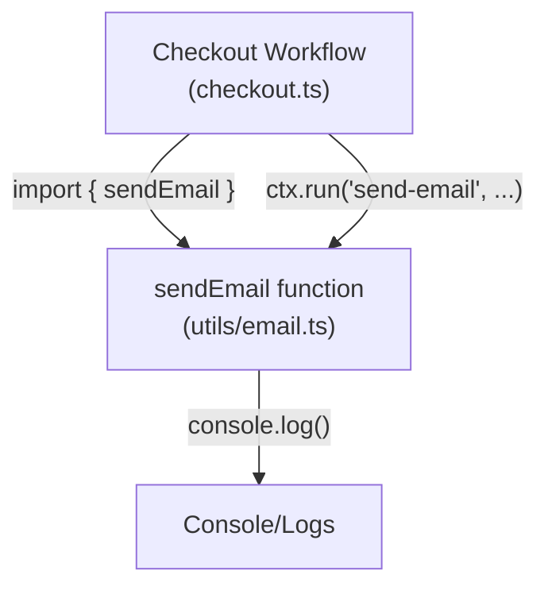

# Email Service

> **Relevant source files**
> * [src/checkout.ts](https://github.com/philipz/restate-cloudflare-workers-poc/blob/513fd0f5/src/checkout.ts)
> * [src/utils/email.ts](https://github.com/philipz/restate-cloudflare-workers-poc/blob/513fd0f5/src/utils/email.ts)

## Purpose and Scope

This document describes the email notification utility used in the nexus-poc system for sending booking confirmation messages. The email service is a simulated implementation that logs email details to the console rather than sending actual emails. It is invoked by the Checkout workflow as part of the final step after successful payment and ticket confirmation.

For information about the Checkout workflow that uses this service, see [Checkout Workflow](/philipz/restate-cloudflare-workers-poc/2.3-checkout-workflow). For the payment simulation utility, see [Payment Simulation](/philipz/restate-cloudflare-workers-poc/4.1-payment-simulation).

**Sources:** [src/utils/email.ts L1-L11](https://github.com/philipz/restate-cloudflare-workers-poc/blob/513fd0f5/src/utils/email.ts#L1-L11)

 [src/checkout.ts L42-L45](https://github.com/philipz/restate-cloudflare-workers-poc/blob/513fd0f5/src/checkout.ts#L42-L45)

---

## Function Signature

The email service exports a single asynchronous function:

```
sendEmail(to: string, subject: string, body: string): Promise<void>
```

| Parameter | Type | Description |
| --- | --- | --- |
| `to` | `string` | Recipient identifier (typically a `userId`) |
| `subject` | `string` | Email subject line |
| `body` | `string` | Email message content |
| **Returns** | `Promise<void>` | Resolves after simulated send operation completes |

**Sources:** [src/utils/email.ts L1](https://github.com/philipz/restate-cloudflare-workers-poc/blob/513fd0f5/src/utils/email.ts#L1-L1)

---

## Implementation Details

### Simulation Behavior

The `sendEmail` function simulates email delivery through the following steps:

1. **Log recipient and content** - Outputs the `to`, `subject`, and `body` parameters to the console [src/utils/email.ts L2-L4](https://github.com/philipz/restate-cloudflare-workers-poc/blob/513fd0f5/src/utils/email.ts#L2-L4)
2. **Simulate network latency** - Introduces a 200ms delay using `setTimeout` to mimic real email gateway latency [src/utils/email.ts L7](https://github.com/philipz/restate-cloudflare-workers-poc/blob/513fd0f5/src/utils/email.ts#L7-L7)
3. **Log success confirmation** - Outputs "Email sent successfully" message [src/utils/email.ts L9](https://github.com/philipz/restate-cloudflare-workers-poc/blob/513fd0f5/src/utils/email.ts#L9-L9)

The function always succeeds and never throws errors, making it suitable for fire-and-forget notification scenarios.

**Sources:** [src/utils/email.ts L1-L11](https://github.com/philipz/restate-cloudflare-workers-poc/blob/513fd0f5/src/utils/email.ts#L1-L11)

---

## Integration with Durable Execution

### Usage in Checkout Workflow

The email service is invoked within the Checkout workflow as the final step after ticket confirmation. It is wrapped in a `ctx.run()` call to ensure exactly-once execution semantics:

```javascript
// Step 5: Send Email
await ctx.run("send-email", async () => {
    await sendEmail(userId, "Booking Confirmed", `You have successfully purchased ticket ${ticketId}.`);
});
```

The `ctx.run()` wrapper provides the following guarantees:

* **Idempotency** - If the workflow is replayed after a crash, the email sending step is journaled and not re-executed
* **Ordering** - The email is only sent after the ticket state has been successfully set to `SOLD`
* **Durability** - The email send operation is recorded in Restate's journal

**Sources:** [src/checkout.ts L42-L45](https://github.com/philipz/restate-cloudflare-workers-poc/blob/513fd0f5/src/checkout.ts#L42-L45)

### Message Content Structure

The Checkout workflow constructs email messages with the following pattern:

| Field | Value |
| --- | --- |
| **Recipient** | `userId` (from checkout request) |
| **Subject** | `"Booking Confirmed"` |
| **Body** | `"You have successfully purchased ticket {ticketId}."` |

Example invocation for `userId: "user-123"` and `ticketId: "seat-5"`:

```yaml
To: user-123
Subject: Booking Confirmed
Body: You have successfully purchased ticket seat-5.
```

**Sources:** [src/checkout.ts L44](https://github.com/philipz/restate-cloudflare-workers-poc/blob/513fd0f5/src/checkout.ts#L44-L44)

---

## Email Service Flow Diagram

```mermaid
sequenceDiagram
  participant Checkout Workflow
  participant (checkout.ts)
  participant Restate Context
  participant ctx.run()
  participant sendEmail Function
  participant (utils/email.ts)
  participant Console Output

  note over Checkout Workflow,Console Output: Email Notification Step (after payment and confirmation)
  Checkout Workflow->>Restate Context: ctx.run("send-email", async () => {...})
  note over Restate Context,ctx.run(): Check journal for
  alt Email not sent yet (first execution)
    Restate Context->>sendEmail Function: sendEmail(userId, "Booking Confirmed", message)
    sendEmail Function->>Console Output: Log: "Sending email to {userId}"
    sendEmail Function->>Console Output: Log: "Subject: Booking Confirmed"
    sendEmail Function->>Console Output: Log: "Body: {message}"
    sendEmail Function->>sendEmail Function: await new Promise(resolve => setTimeout(resolve, 200))
    note over sendEmail Function,(utils/email.ts): Simulate 200ms
    sendEmail Function->>Console Output: Log: "Email sent successfully"
    sendEmail Function-->>Restate Context: Return void
    Restate Context->>Restate Context: Journal "send-email" completion
    Restate Context-->>Checkout Workflow: Return void
  else Email already sent (replay after crash)
    Restate Context->>Restate Context: Read "send-email" from journal
    note over Restate Context,ctx.run(): Skip execution,
    Restate Context-->>Checkout Workflow: Return void (from journal)
  end
  Checkout Workflow->>Checkout Workflow: Return "Booking Confirmed"
```

**Sources:** [src/checkout.ts L42-L45](https://github.com/philipz/restate-cloudflare-workers-poc/blob/513fd0f5/src/checkout.ts#L42-L45)

 [src/utils/email.ts L1-L11](https://github.com/philipz/restate-cloudflare-workers-poc/blob/513fd0f5/src/utils/email.ts#L1-L11)

---

## Execution Context and Error Handling

### Fire-and-Forget Semantics

Although the email send operation is awaited in the workflow code, it is effectively a fire-and-forget operation because:

1. **No error handling** - The `sendEmail` function never throws errors, so workflow execution always continues
2. **Post-confirmation** - The email is sent after the ticket has already been marked as `SOLD`, so email failure does not affect booking validity
3. **Non-critical notification** - The email serves as a confirmation convenience, not a required transactional step

This design prioritizes workflow completion over notification delivery.

**Sources:** [src/utils/email.ts L1-L11](https://github.com/philipz/restate-cloudflare-workers-poc/blob/513fd0f5/src/utils/email.ts#L1-L11)

 [src/checkout.ts L42-L48](https://github.com/philipz/restate-cloudflare-workers-poc/blob/513fd0f5/src/checkout.ts#L42-L48)

### Simulated Network Delay

The 200ms delay in the email function serves two purposes:

1. **Realistic testing** - Simulates real-world email gateway latency for load testing scenarios
2. **Observability** - Makes the email step visible in timing analysis and logs, confirming it executed

For comparison, the payment simulation uses 500ms delay [src/utils/payment_new.ts], making email approximately 2.5x faster than payment processing.

**Sources:** [src/utils/email.ts L7](https://github.com/philipz/restate-cloudflare-workers-poc/blob/513fd0f5/src/utils/email.ts#L7-L7)

---

## Module Structure and Dependencies

### Import Path

The email service is imported by the Checkout workflow using a relative path:

```javascript
import { sendEmail } from "./utils/email";
```

This places the email utility in the `src/utils/` directory alongside other supporting services like payment simulation.

**Sources:** [src/checkout.ts L4](https://github.com/philipz/restate-cloudflare-workers-poc/blob/513fd0f5/src/checkout.ts#L4-L4)

### Dependency Graph



**Sources:** [src/checkout.ts L4](https://github.com/philipz/restate-cloudflare-workers-poc/blob/513fd0f5/src/checkout.ts#L4-L4)

 [src/utils/email.ts L1-L11](https://github.com/philipz/restate-cloudflare-workers-poc/blob/513fd0f5/src/utils/email.ts#L1-L11)

---

## Console Output Format

### Example Log Output

When `sendEmail("user-123", "Booking Confirmed", "You have successfully purchased ticket seat-5.")` is invoked, the console output is:

```yaml
Sending email to user-123
Subject: Booking Confirmed
Body: You have successfully purchased ticket seat-5.
Email sent successfully
```

This four-line format provides clear visibility into email operations during testing and debugging.

**Sources:** [src/utils/email.ts L2-L9](https://github.com/philipz/restate-cloudflare-workers-poc/blob/513fd0f5/src/utils/email.ts#L2-L9)

---

## Future Considerations

### Production Email Gateway Integration

To replace the simulated email service with a real email provider, the following changes would be required:

1. **Add email provider SDK** - Install a library like SendGrid, Mailgun, or AWS SES SDK
2. **Update `sendEmail` implementation** - Replace console logs with actual API calls
3. **Add error handling** - Wrap email sending in try-catch to handle API failures gracefully
4. **Preserve `ctx.run` wrapper** - Keep the durable execution wrapper to ensure exactly-once delivery attempts
5. **Configure credentials** - Add email provider API keys to Cloudflare Workers secrets

The current function signature (`to`, `subject`, `body`) is compatible with most email providers, minimizing refactoring.

**Sources:** [src/utils/email.ts L1-L11](https://github.com/philipz/restate-cloudflare-workers-poc/blob/513fd0f5/src/utils/email.ts#L1-L11)