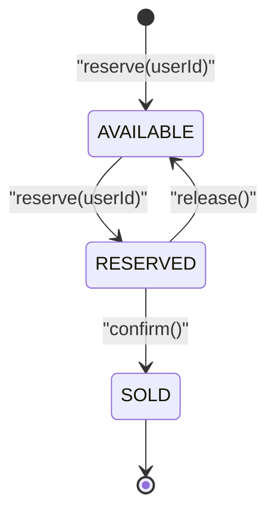
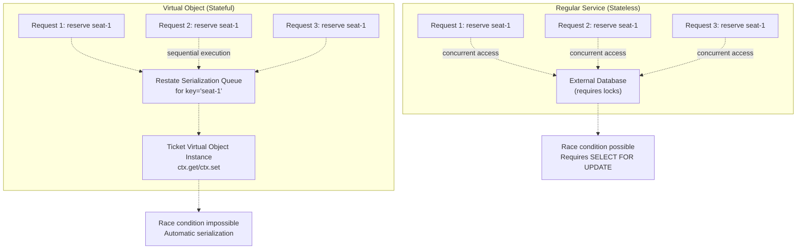
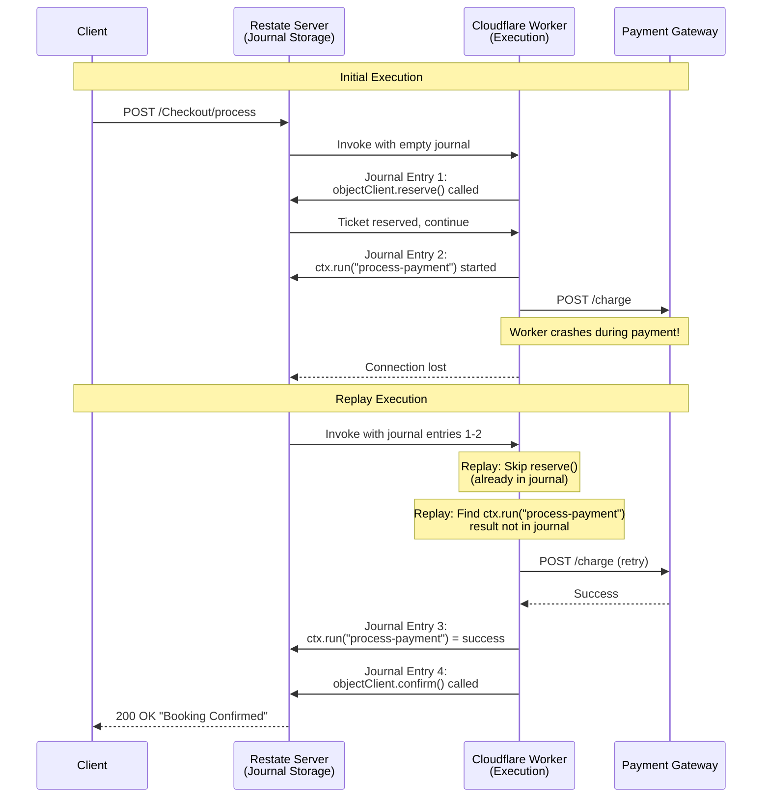
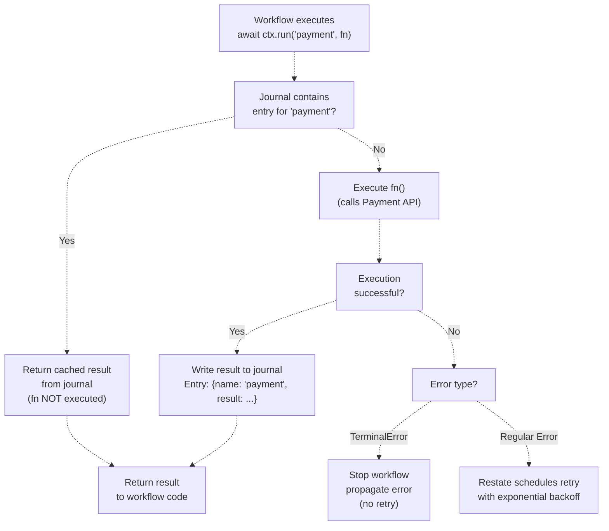
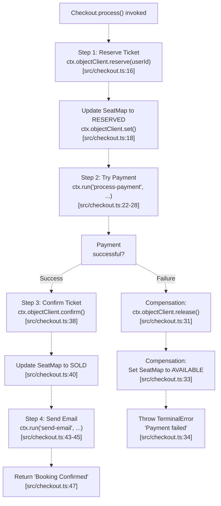
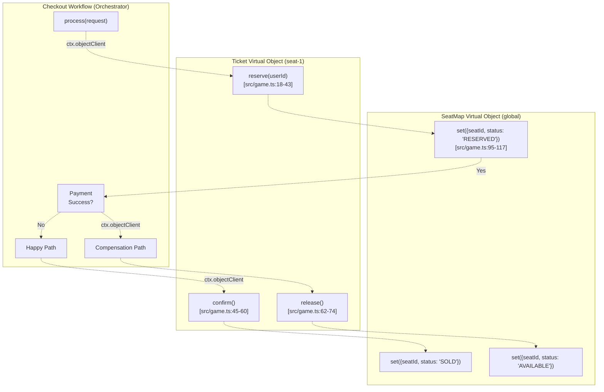

# Key Concepts

> **Relevant source files**
> * [PoC.md](https://github.com/philipz/restate-cloudflare-workers-poc/blob/513fd0f5/PoC.md)
> * [README.md](https://github.com/philipz/restate-cloudflare-workers-poc/blob/513fd0f5/README.md)
> * [src/checkout.ts](https://github.com/philipz/restate-cloudflare-workers-poc/blob/513fd0f5/src/checkout.ts)
> * [src/game.ts](https://github.com/philipz/restate-cloudflare-workers-poc/blob/513fd0f5/src/game.ts)

## Purpose and Scope

This document explains the foundational Restate concepts that enable the nexus-poc system to achieve high-concurrency ticket booking with strong consistency guarantees. The three core concepts covered are:

1. **Virtual Objects and Serialization** - Actor-based state management preventing race conditions
2. **Durable Execution and `ctx.run`** - Fault-tolerant execution with exactly-once semantics
3. **Saga Pattern and Compensation** - Distributed transaction management without database locks

For information about the specific service implementations that use these concepts, see [Core Services](/philipz/restate-cloudflare-workers-poc/2-core-services). For deployment and configuration details, see [Development & Deployment](/philipz/restate-cloudflare-workers-poc/6-development-and-deployment).

---

## Virtual Objects and Serialization

### Concept Overview

Virtual Objects implement the Actor Model pattern within Restate. Each Virtual Object instance is uniquely identified by a key (e.g., `"seat-1"`, `"seat-2"`) and maintains its own isolated state. Restate guarantees that all requests targeting the same object key are processed **sequentially**, eliminating race conditions without requiring explicit locks or database transactions.

In the nexus-poc system, the `Ticket` object is a Virtual Object where each seat has its own instance. When 1000 concurrent users attempt to reserve `"seat-1"`, Restate automatically queues these requests and processes them one at a time against the same state instance.

**Sources:** [src/game.ts L15-L84](https://github.com/philipz/restate-cloudflare-workers-poc/blob/513fd0f5/src/game.ts#L15-L84)

 [README.md L11-L13](https://github.com/philipz/restate-cloudflare-workers-poc/blob/513fd0f5/README.md#L11-L13)

 [PoC.md L93-L97](https://github.com/philipz/restate-cloudflare-workers-poc/blob/513fd0f5/PoC.md#L93-L97)

### State Machine Implementation

The `Ticket` object implements a strict state machine with three states:

| State | Description | Transitions To | Triggered By |
| --- | --- | --- | --- |
| `AVAILABLE` | Seat is open for booking | `RESERVED` | `reserve()` handler |
| `RESERVED` | Seat is locked for a user | `SOLD` or `AVAILABLE` | `confirm()` or `release()` |
| `SOLD` | Seat is permanently sold | None | `confirm()` handler |

The state structure is defined in [src/game.ts L9-L13](https://github.com/philipz/restate-cloudflare-workers-poc/blob/513fd0f5/src/game.ts#L9-L13)

:

```
interface TicketState {
    status: TicketStatus;
    reservedBy: string | null;
    reservedUntil: number | null;
}
```

**Sources:** [src/game.ts L7-L13](https://github.com/philipz/restate-cloudflare-workers-poc/blob/513fd0f5/src/game.ts#L7-L13)

### Ticket Object State Machine Diagram



**Sources:** [src/game.ts L15-L84](https://github.com/philipz/restate-cloudflare-workers-poc/blob/513fd0f5/src/game.ts#L15-L84)

### Serialization Guarantee in Code

The `reserve` handler demonstrates how serialization prevents overselling. When processing concurrent requests, each handler execution sees the state written by the previous execution:

[src/game.ts L18-L43](https://github.com/philipz/restate-cloudflare-workers-poc/blob/513fd0f5/src/game.ts#L18-L43)

 shows the reserve logic:

1. **Line 19**: Retrieve current state via `ctx.get<TicketState>("state")`
2. **Line 25-27**: If state is `SOLD`, throw `TerminalError` - subsequent requests see this state
3. **Line 29-31**: If state is `RESERVED` by another user, throw `TerminalError`
4. **Line 33-40**: If state is `AVAILABLE`, transition to `RESERVED` and persist via `ctx.set("state", state)`

Because Restate serializes requests by object key (`ticketId`), only the first request can find `status === "AVAILABLE"`. All subsequent requests execute against the updated state where `status === "RESERVED"` or `status === "SOLD"`.

**Sources:** [src/game.ts L18-L43](https://github.com/philipz/restate-cloudflare-workers-poc/blob/513fd0f5/src/game.ts#L18-L43)

### Virtual Object vs Regular Service Comparison



**Sources:** [src/game.ts L15-L84](https://github.com/philipz/restate-cloudflare-workers-poc/blob/513fd0f5/src/game.ts#L15-L84)

 [PoC.md L95-L97](https://github.com/philipz/restate-cloudflare-workers-poc/blob/513fd0f5/PoC.md#L95-L97)

### State Access Patterns

Virtual Objects in this codebase use two primary state operations:

| Operation | Syntax | When Executed | Example Location |
| --- | --- | --- | --- |
| **Read State** | `await ctx.get<T>("key")` | Asynchronously fetches state from Restate | [src/game.ts L19](https://github.com/philipz/restate-cloudflare-workers-poc/blob/513fd0f5/src/game.ts#L19-L19) |
| **Write State** | `ctx.set("key", value)` | Batches write, persisted atomically on handler success | [src/game.ts L39](https://github.com/philipz/restate-cloudflare-workers-poc/blob/513fd0f5/src/game.ts#L39-L39) <br>  [src/game.ts L58](https://github.com/philipz/restate-cloudflare-workers-poc/blob/513fd0f5/src/game.ts#L58-L58) |

The write operation (`ctx.set`) does not immediately persist to storage. Instead, Restate batches all state updates and writes them atomically when the handler completes successfully. If the handler throws an error, no state changes are persisted.

**Sources:** [src/game.ts L19](https://github.com/philipz/restate-cloudflare-workers-poc/blob/513fd0f5/src/game.ts#L19-L19)

 [src/game.ts L39](https://github.com/philipz/restate-cloudflare-workers-poc/blob/513fd0f5/src/game.ts#L39-L39)

 [src/game.ts L58](https://github.com/philipz/restate-cloudflare-workers-poc/blob/513fd0f5/src/game.ts#L58-L58)

 [PoC.md L153-L156](https://github.com/philipz/restate-cloudflare-workers-poc/blob/513fd0f5/PoC.md#L153-L156)

### SeatMap Singleton Pattern

While `Ticket` uses per-seat keys, `SeatMap` implements a singleton pattern by always using the key `"global"`. This aggregates all seat statuses in a single object instance:

[src/game.ts L92-L141](https://github.com/philipz/restate-cloudflare-workers-poc/blob/513fd0f5/src/game.ts#L92-L141)

 defines `SeatMap` with:

* **Key**: Always `"global"` (referenced in [src/checkout.ts L13](https://github.com/philipz/restate-cloudflare-workers-poc/blob/513fd0f5/src/checkout.ts#L13-L13) )
* **State**: `Record<string, string>` mapping seat IDs to statuses ([src/game.ts L96](https://github.com/philipz/restate-cloudflare-workers-poc/blob/513fd0f5/src/game.ts#L96-L96) )
* **Auto-reset**: When 50 seats are sold, asynchronously resets all seats ([src/game.ts L101-L114](https://github.com/philipz/restate-cloudflare-workers-poc/blob/513fd0f5/src/game.ts#L101-L114) )

**Sources:** [src/game.ts L92-L141](https://github.com/philipz/restate-cloudflare-workers-poc/blob/513fd0f5/src/game.ts#L92-L141)

 [src/checkout.ts L13](https://github.com/philipz/restate-cloudflare-workers-poc/blob/513fd0f5/src/checkout.ts#L13-L13)

---

## Durable Execution and ctx.run

### Concept Overview

Durable Execution ensures that workflow code executes reliably even in the presence of crashes, timeouts, or infrastructure failures. Restate achieves this by journaling every executed step. When a Cloudflare Worker crashes or times out, Restate replays the workflow from its journal, skipping already-completed steps and resuming from the interruption point.

The `ctx.run` primitive is critical for wrapping non-deterministic operations (external API calls, random number generation, timestamps). It ensures exactly-once execution semantics: even if a workflow is replayed multiple times, the code inside `ctx.run` executes only once, and its result is memoized in the journal.

**Sources:** [src/checkout.ts L22-L28](https://github.com/philipz/restate-cloudflare-workers-poc/blob/513fd0f5/src/checkout.ts#L22-L28)

 [src/checkout.ts L43-L45](https://github.com/philipz/restate-cloudflare-workers-poc/blob/513fd0f5/src/checkout.ts#L43-L45)

 [PoC.md L177-L191](https://github.com/philipz/restate-cloudflare-workers-poc/blob/513fd0f5/PoC.md#L177-L191)

### ctx.run in Payment Processing

The checkout workflow uses `ctx.run` to wrap payment processing at [src/checkout.ts L22-L28](https://github.com/philipz/restate-cloudflare-workers-poc/blob/513fd0f5/src/checkout.ts#L22-L28)

:

```javascript
await ctx.run("process-payment", async () => {
    try {
        return await processPayment(100, paymentMethodId);
    } catch (e) {
        throw new restate.TerminalError(`Payment declined: ${(e as Error).message}`);
    }
});
```

**Key characteristics:**

1. **Name parameter**: `"process-payment"` uniquely identifies this step in the journal
2. **Idempotency**: If the worker crashes after `processPayment` succeeds but before returning, the replay will skip re-executing the lambda and return the memoized result
3. **Terminal errors**: Wrapping exceptions in `TerminalError` prevents automatic retries for business logic failures

**Sources:** [src/checkout.ts L22-L28](https://github.com/philipz/restate-cloudflare-workers-poc/blob/513fd0f5/src/checkout.ts#L22-L28)

### Execution Journal and Replay Mechanism



**Sources:** [src/checkout.ts L9-L49](https://github.com/philipz/restate-cloudflare-workers-poc/blob/513fd0f5/src/checkout.ts#L9-L49)

 [PoC.md L177-L191](https://github.com/philipz/restate-cloudflare-workers-poc/blob/513fd0f5/PoC.md#L177-L191)

### Non-deterministic Operations Requiring ctx.run

The following operations are non-deterministic and must be wrapped in `ctx.run`:

| Operation Type | Example in Codebase | Location | Why ctx.run is Needed |
| --- | --- | --- | --- |
| External API calls | `processPayment(100, paymentMethodId)` | [src/checkout.ts L24](https://github.com/philipz/restate-cloudflare-workers-poc/blob/513fd0f5/src/checkout.ts#L24-L24) | Network calls may fail/timeout |
| Email sending | `sendEmail(userId, ...)` | [src/checkout.ts L44](https://github.com/philipz/restate-cloudflare-workers-poc/blob/513fd0f5/src/checkout.ts#L44-L44) | External service dependency |
| Current timestamp | `Date.now()` | [src/game.ts L37](https://github.com/philipz/restate-cloudflare-workers-poc/blob/513fd0f5/src/game.ts#L37-L37) | Would produce different values on replay |

Without `ctx.run`, these operations would re-execute during replay, potentially causing duplicate charges, multiple emails, or inconsistent timestamps.

**Sources:** [src/checkout.ts L22-L28](https://github.com/philipz/restate-cloudflare-workers-poc/blob/513fd0f5/src/checkout.ts#L22-L28)

 [src/checkout.ts L43-L45](https://github.com/philipz/restate-cloudflare-workers-poc/blob/513fd0f5/src/checkout.ts#L43-L45)

 [src/game.ts L37](https://github.com/philipz/restate-cloudflare-workers-poc/blob/513fd0f5/src/game.ts#L37-L37)

### ctx.run Execution Flow



**Sources:** [src/checkout.ts L22-L28](https://github.com/philipz/restate-cloudflare-workers-poc/blob/513fd0f5/src/checkout.ts#L22-L28)

 [PoC.md L184-L191](https://github.com/philipz/restate-cloudflare-workers-poc/blob/513fd0f5/PoC.md#L184-L191)

### Deterministic vs Non-Deterministic Code

```javascript
// ❌ INCORRECT: Non-deterministic without ctx.run
async function checkout(ctx, request) {
    await ticket.reserve(userId);
    const now = Date.now(); // Different on replay!
    await processPayment(); // May execute twice!
}

// ✅ CORRECT: Deterministic with ctx.run
async function checkout(ctx, request) {
    await ticket.reserve(userId); // RPC calls are automatically journaled
    const now = await ctx.run("get-timestamp", () => Date.now());
    await ctx.run("payment", () => processPayment());
}
```

**Sources:** [src/game.ts L37](https://github.com/philipz/restate-cloudflare-workers-poc/blob/513fd0f5/src/game.ts#L37-L37)

 [src/checkout.ts L22-L28](https://github.com/philipz/restate-cloudflare-workers-poc/blob/513fd0f5/src/checkout.ts#L22-L28)

 [PoC.md L177-L191](https://github.com/philipz/restate-cloudflare-workers-poc/blob/513fd0f5/PoC.md#L177-L191)

---

## Saga Pattern and Compensation

### Concept Overview

The Saga pattern manages distributed transactions across multiple services without requiring a global two-phase commit. In the nexus-poc system, a booking involves:

1. Reserving a seat in the `Ticket` object
2. Processing payment via external gateway
3. Confirming the seat as sold

If payment fails after the seat is reserved, the system must execute a **compensation action** to release the seat. The Checkout workflow implements this pattern using try-catch blocks.

**Sources:** [src/checkout.ts L9-L49](https://github.com/philipz/restate-cloudflare-workers-poc/blob/513fd0f5/src/checkout.ts#L9-L49)

 [README.md L14-L16](https://github.com/philipz/restate-cloudflare-workers-poc/blob/513fd0f5/README.md#L14-L16)

 [PoC.md L162-L166](https://github.com/philipz/restate-cloudflare-workers-poc/blob/513fd0f5/PoC.md#L162-L166)

### Saga Implementation in Checkout Workflow

The [src/checkout.ts L9-L49](https://github.com/philipz/restate-cloudflare-workers-poc/blob/513fd0f5/src/checkout.ts#L9-L49)

 file implements a Saga with three local transactions:

| Step | Action | Code Location | Compensation on Failure |
| --- | --- | --- | --- |
| **T1: Reserve** | Lock the seat | [src/checkout.ts L16-L18](https://github.com/philipz/restate-cloudflare-workers-poc/blob/513fd0f5/src/checkout.ts#L16-L18) | Automatic (seat not yet confirmed) |
| **T2: Payment** | Charge payment method | [src/checkout.ts L22-L28](https://github.com/philipz/restate-cloudflare-workers-poc/blob/513fd0f5/src/checkout.ts#L22-L28) | Manual via catch block |
| **T3: Confirm** | Finalize the sale | [src/checkout.ts L38-L40](https://github.com/philipz/restate-cloudflare-workers-poc/blob/513fd0f5/src/checkout.ts#L38-L40) | No compensation (terminal state) |

**Sources:** [src/checkout.ts L9-L49](https://github.com/philipz/restate-cloudflare-workers-poc/blob/513fd0f5/src/checkout.ts#L9-L49)

### Compensation Logic Flow



**Sources:** [src/checkout.ts L9-L49](https://github.com/philipz/restate-cloudflare-workers-poc/blob/513fd0f5/src/checkout.ts#L9-L49)

### Compensation Code Structure

The compensation logic uses a try-catch block at [src/checkout.ts L20-L35](https://github.com/philipz/restate-cloudflare-workers-poc/blob/513fd0f5/src/checkout.ts#L20-L35)

:

```javascript
try {
    // Step 2: Process Payment
    await ctx.run("process-payment", async () => {
        try {
            return await processPayment(100, paymentMethodId);
        } catch (e) {
            throw new restate.TerminalError(`Payment declined: ${(e as Error).message}`);
        }
    });
} catch (error) {
    // Step 3: Compensation
    await ticket.release();
    // Revert SeatMap (View)
    await seatMap.set({ seatId: ticketId, status: "AVAILABLE" });
    throw new restate.TerminalError(`Payment failed: ${(error as Error).message}`);
}
```

**Key aspects:**

1. **Inner try-catch**: Converts payment failures to `TerminalError` to stop retries
2. **Outer catch**: Executes compensation actions (`release()`, revert SeatMap)
3. **Re-throw**: Propagates error to caller after compensation completes

**Sources:** [src/checkout.ts L20-L35](https://github.com/philipz/restate-cloudflare-workers-poc/blob/513fd0f5/src/checkout.ts#L20-L35)

### Terminal Errors vs Retryable Errors

Restate distinguishes between two error types:

| Error Type | When to Use | Restate Behavior | Example in Code |
| --- | --- | --- | --- |
| `TerminalError` | Business logic failures (invalid input, declined payment) | Stop execution, no retry | [src/checkout.ts L26](https://github.com/philipz/restate-cloudflare-workers-poc/blob/513fd0f5/src/checkout.ts#L26-L26) <br>  [src/checkout.ts L34](https://github.com/philipz/restate-cloudflare-workers-poc/blob/513fd0f5/src/checkout.ts#L34-L34) |
| Regular `Error` | Infrastructure failures (timeout, network error) | Automatic retry with exponential backoff | Not explicitly used (defaults to retry) |

The `processPayment` function ([src/utils/payment_new.ts](https://github.com/philipz/restate-cloudflare-workers-poc/blob/513fd0f5/src/utils/payment_new.ts)

) simulates three scenarios:

* `card_success`: Returns success (no error)
* `card_decline`: Throws error → wrapped in `TerminalError` → triggers compensation
* `card_error`: Throws error → could trigger retries if not wrapped in `TerminalError`

**Sources:** [src/checkout.ts L26](https://github.com/philipz/restate-cloudflare-workers-poc/blob/513fd0f5/src/checkout.ts#L26-L26)

 [src/checkout.ts L34](https://github.com/philipz/restate-cloudflare-workers-poc/blob/513fd0f5/src/checkout.ts#L34-L34)

 [PoC.md L207-L211](https://github.com/philipz/restate-cloudflare-workers-poc/blob/513fd0f5/PoC.md#L207-L211)

### Saga Coordination Across Objects



**Sources:** [src/checkout.ts L9-L49](https://github.com/philipz/restate-cloudflare-workers-poc/blob/513fd0f5/src/checkout.ts#L9-L49)

 [src/game.ts L15-L141](https://github.com/philipz/restate-cloudflare-workers-poc/blob/513fd0f5/src/game.ts#L15-L141)

### Compensation Guarantees

The Saga implementation ensures:

1. **Atomicity per step**: Each `ctx.objectClient` call is atomic (either fully succeeds or fully fails)
2. **Durability**: Compensation actions are journaled and will complete even if the worker crashes mid-compensation
3. **Idempotency**: If compensation is replayed, calling `release()` on an already-available seat is safe ([src/game.ts L62-L74](https://github.com/philipz/restate-cloudflare-workers-poc/blob/513fd0f5/src/game.ts#L62-L74)  always sets state to AVAILABLE)
4. **No orphaned reservations**: If payment fails, the seat is guaranteed to be released due to durable execution

**Sources:** [src/checkout.ts L29-L35](https://github.com/philipz/restate-cloudflare-workers-poc/blob/513fd0f5/src/checkout.ts#L29-L35)

 [src/game.ts L62-L74](https://github.com/philipz/restate-cloudflare-workers-poc/blob/513fd0f5/src/game.ts#L62-L74)