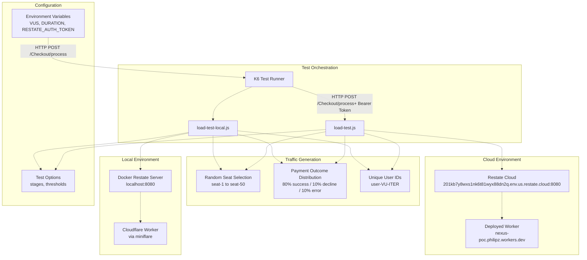
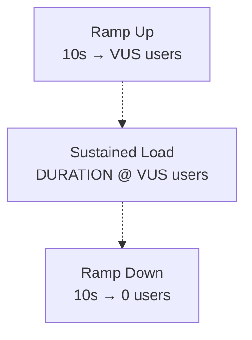
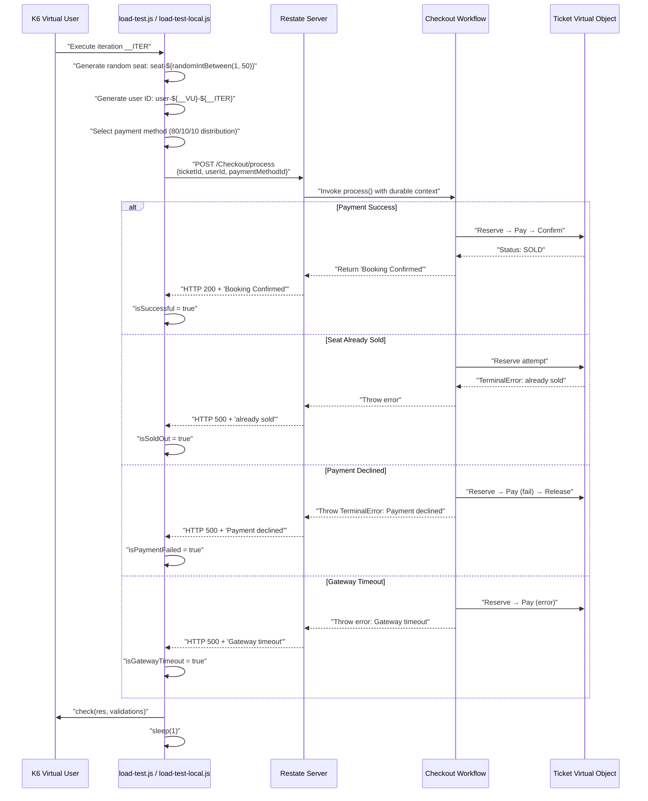

# Load Testing

> **Relevant source files**
> * [README.md](https://github.com/philipz/restate-cloudflare-workers-poc/blob/513fd0f5/README.md)
> * [load-test-local.js](https://github.com/philipz/restate-cloudflare-workers-poc/blob/513fd0f5/load-test-local.js)
> * [load-test.js](https://github.com/philipz/restate-cloudflare-workers-poc/blob/513fd0f5/load-test.js)

## Purpose

This page documents the K6-based load testing infrastructure used to validate the nexus-poc system's performance and concurrency handling under high-traffic conditions. Load testing simulates realistic user behavior with concurrent virtual users (VUs) competing for limited seat inventory while exercising all payment outcome scenarios (success, decline, error).

For functional correctness testing, see [Local Testing](/philipz/restate-cloudflare-workers-poc/5.1-local-testing) and [Cloud Validation](/philipz/restate-cloudflare-workers-poc/5.2-cloud-validation). For details on the services being tested, see [Core Services](/philipz/restate-cloudflare-workers-poc/2-core-services).

**Sources:** [README.md L108-L143](https://github.com/philipz/restate-cloudflare-workers-poc/blob/513fd0f5/README.md#L108-L143)

---

## Test Architecture

The load testing infrastructure supports two deployment targets: local Docker-based Restate servers for rapid iteration and cloud-hosted Restate environments for production validation.



**Sources:** [load-test.js L1-L72](https://github.com/philipz/restate-cloudflare-workers-poc/blob/513fd0f5/load-test.js#L1-L72)

 [load-test-local.js L1-L68](https://github.com/philipz/restate-cloudflare-workers-poc/blob/513fd0f5/load-test-local.js#L1-L68)

 [README.md L108-L143](https://github.com/philipz/restate-cloudflare-workers-poc/blob/513fd0f5/README.md#L108-L143)

---

## Test Scripts Overview

The system provides two K6 test scripts implementing identical test logic but targeting different environments.

### Cloud Load Test Script

**File:** `load-test.js`

The cloud load test targets the production Restate Cloud environment at `https://201kb7y8wxs1nk6t81wyx88dn2q.env.us.restate.cloud:8080` and requires authentication via the `RESTATE_AUTH_TOKEN` environment variable [load-test.js L20-L21](https://github.com/philipz/restate-cloudflare-workers-poc/blob/513fd0f5/load-test.js#L20-L21)

 The script includes an authorization header in all HTTP requests [load-test.js L44-L47](https://github.com/philipz/restate-cloudflare-workers-poc/blob/513fd0f5/load-test.js#L44-L47)

### Local Load Test Script

**File:** `load-test-local.js`

The local load test targets a Docker-based Restate server at `http://localhost:8080` [load-test-local.js L21](https://github.com/philipz/restate-cloudflare-workers-poc/blob/513fd0f5/load-test-local.js#L21-L21)

 No authorization header is required for local testing [load-test-local.js L43-L48](https://github.com/philipz/restate-cloudflare-workers-poc/blob/513fd0f5/load-test-local.js#L43-L48)

 The performance threshold is more aggressive (95th percentile under 2s vs 5s for cloud) reflecting reduced network latency [load-test-local.js L15](https://github.com/philipz/restate-cloudflare-workers-poc/blob/513fd0f5/load-test-local.js#L15-L15)

**Sources:** [load-test.js L20-L48](https://github.com/philipz/restate-cloudflare-workers-poc/blob/513fd0f5/load-test.js#L20-L48)

 [load-test-local.js L20-L48](https://github.com/philipz/restate-cloudflare-workers-poc/blob/513fd0f5/load-test-local.js#L20-L48)

---

## Configuration Parameters

Both test scripts accept runtime configuration through environment variables and define identical test execution stages.

| Parameter | Environment Variable | Default | Purpose |
| --- | --- | --- | --- |
| Virtual Users | `VUS` | `5` | Number of concurrent users simulating traffic |
| Test Duration | `DURATION` | `30s` | Duration of sustained load phase |
| Auth Token (cloud only) | `RESTATE_AUTH_TOKEN` | Required | Bearer token for Restate Cloud authentication |

### Test Execution Stages

Both scripts define a three-phase load pattern [load-test.js L9-L13](https://github.com/philipz/restate-cloudflare-workers-poc/blob/513fd0f5/load-test.js#L9-L13)

:



**Sources:** [load-test.js L5-L13](https://github.com/philipz/restate-cloudflare-workers-poc/blob/513fd0f5/load-test.js#L5-L13)

 [load-test-local.js L5-L13](https://github.com/philipz/restate-cloudflare-workers-poc/blob/513fd0f5/load-test-local.js#L5-L13)

---

## Traffic Patterns & Scenarios

The load tests simulate realistic ticketing scenarios with contention, random payment outcomes, and unique user identification.

### Seat Contention Simulation

Each virtual user randomly selects from 50 available seats (`seat-1` to `seat-50`) using the K6 `randomIntBetween` utility [load-test.js L25](https://github.com/philipz/restate-cloudflare-workers-poc/blob/513fd0f5/load-test.js#L25-L25)

 This creates high contention scenarios where multiple concurrent users compete for the same seat, validating the Virtual Object serialization guarantees documented in [Virtual Objects & Serialization](/philipz/restate-cloudflare-workers-poc/8.1-virtual-objects-and-serialization).

```javascript
const seatId = `seat-${randomIntBetween(1, 50)}`;
```

### User Identification

Each request generates a unique user ID combining the K6 virtual user number (`__VU`) and iteration count (`__ITER`) [load-test.js L26](https://github.com/philipz/restate-cloudflare-workers-poc/blob/513fd0f5/load-test.js#L26-L26)

:

```javascript
const userId = `user-${__VU}-${__ITER}`;
```

### Payment Outcome Distribution

The test implements a probabilistic payment method selection [load-test.js L28-L35](https://github.com/philipz/restate-cloudflare-workers-poc/blob/513fd0f5/load-test.js#L28-L35)

:

| Probability | Payment Method | Expected Outcome |
| --- | --- | --- |
| 80% | `card_success` | Successful booking (HTTP 200, "Booking Confirmed") |
| 10% | `card_decline` | Payment failure with saga compensation (HTTP 500, "Payment declined") |
| 10% | `card_error` | Gateway timeout error (HTTP 500, "Gateway timeout") |

This distribution ensures all code paths are exercised during load testing, including the compensation logic detailed in [Saga Pattern & Compensation](/philipz/restate-cloudflare-workers-poc/8.3-saga-pattern-and-compensation).

**Sources:** [load-test.js L23-L41](https://github.com/philipz/restate-cloudflare-workers-poc/blob/513fd0f5/load-test.js#L23-L41)

 [load-test-local.js L23-L41](https://github.com/philipz/restate-cloudflare-workers-poc/blob/513fd0f5/load-test-local.js#L23-L41)

 [README.md L113-L114](https://github.com/philipz/restate-cloudflare-workers-poc/blob/513fd0f5/README.md#L113-L114)

---

## Performance Thresholds

Both scripts define strict performance and reliability thresholds using K6's threshold mechanism.

### Cloud Environment Thresholds

[load-test.js L14-L17](https://github.com/philipz/restate-cloudflare-workers-poc/blob/513fd0f5/load-test.js#L14-L17)

| Metric | Threshold | Requirement |
| --- | --- | --- |
| `http_req_duration` | `p(95)<5000` | 95% of requests complete within 5 seconds |
| `http_req_failed` | `rate<0.1` | Failure rate below 10% (excluding business logic errors) |

### Local Environment Thresholds

[load-test-local.js L14-L17](https://github.com/philipz/restate-cloudflare-workers-poc/blob/513fd0f5/load-test-local.js#L14-L17)

| Metric | Threshold | Requirement |
| --- | --- | --- |
| `http_req_duration` | `p(95)<2000` | 95% of requests complete within 2 seconds |
| `http_req_failed` | `rate<0.1` | Failure rate below 10% |

The local threshold is more stringent (2s vs 5s) due to the absence of network latency between the test runner and Docker Restate server.

**Sources:** [load-test.js L14-L17](https://github.com/philipz/restate-cloudflare-workers-poc/blob/513fd0f5/load-test.js#L14-L17)

 [load-test-local.js L14-L17](https://github.com/philipz/restate-cloudflare-workers-poc/blob/513fd0f5/load-test-local.js#L14-L17)

---

## Response Validation

Both scripts implement identical response validation logic to classify outcomes and detect anomalies.

### Expected Response Categories

The test validates four expected outcome categories [load-test.js L56-L59](https://github.com/philipz/restate-cloudflare-workers-poc/blob/513fd0f5/load-test.js#L56-L59)

:

```javascript
const isSuccessful = res.status === 200 && res.body.includes('Booking Confirmed');
const isSoldOut = res.status === 500 && res.body.includes('already sold');
const isPaymentFailed = res.status === 500 && res.body.includes('Payment declined');
const isGatewayTimeout = res.status === 500 && res.body.includes('Gateway timeout');
```

| Status Code | Response Body Pattern | Scenario |
| --- | --- | --- |
| 200 | `Booking Confirmed` | Successful checkout workflow completion |
| 500 | `already sold` | Seat already reserved/sold (concurrency conflict) |
| 500 | `Payment declined` | Payment failure with saga compensation |
| 500 | `Gateway timeout` | Payment gateway error simulation |

### Error Detection

Responses not matching any of the four expected categories are logged for investigation [load-test.js L66-L68](https://github.com/philipz/restate-cloudflare-workers-poc/blob/513fd0f5/load-test.js#L66-L68)

:

```javascript
if (!isSuccessful && !isSoldOut && !isPaymentFailed && !isGatewayTimeout) {
    console.log(`Failed Request: Status=${res.status}, Body=${res.body}`);
}
```

This logging mechanism helps identify unexpected errors, such as network failures or Restate runtime issues.

**Sources:** [load-test.js L50-L68](https://github.com/philipz/restate-cloudflare-workers-poc/blob/513fd0f5/load-test.js#L50-L68)

 [load-test-local.js L50-L67](https://github.com/philipz/restate-cloudflare-workers-poc/blob/513fd0f5/load-test-local.js#L50-L67)

---

## Execution Guide

### Local Load Test Execution

**Prerequisites:**

* Local Restate Docker container running on `localhost:8080` (see [Local Development Setup](/philipz/restate-cloudflare-workers-poc/6.1-local-development-setup))
* K6 installed (`brew install k6` or equivalent)

**Default Execution (5 VUs, 30s):**

```
k6 run load-test-local.js
```

**Custom Parameters:**

```
k6 run -e VUS=10 -e DURATION=60s load-test-local.js
```

### Cloud Load Test Execution

**Prerequisites:**

* Worker deployed to Cloudflare Workers (see [Cloud Deployment](/philipz/restate-cloudflare-workers-poc/6.2-cloud-deployment))
* Service registered with Restate Cloud
* `RESTATE_AUTH_TOKEN` environment variable set

**Environment Configuration:**
Create a `.env` file in the project root [README.md L98-L101](https://github.com/philipz/restate-cloudflare-workers-poc/blob/513fd0f5/README.md#L98-L101)

:

```
RESTATE_AUTH_TOKEN=your_token_here
```

**Default Execution:**

```
source .env
k6 run -e RESTATE_AUTH_TOKEN=$RESTATE_AUTH_TOKEN load-test.js
```

**Custom Parameters:**

```
k6 run -e RESTATE_AUTH_TOKEN=$RESTATE_AUTH_TOKEN -e VUS=20 -e DURATION=120s load-test.js
```

**Sources:** [README.md L108-L143](https://github.com/philipz/restate-cloudflare-workers-poc/blob/513fd0f5/README.md#L108-L143)

 [load-test.js L1-L72](https://github.com/philipz/restate-cloudflare-workers-poc/blob/513fd0f5/load-test.js#L1-L72)

 [load-test-local.js L1-L68](https://github.com/philipz/restate-cloudflare-workers-poc/blob/513fd0f5/load-test-local.js#L1-L68)

---

## Test Flow Diagram

The following diagram illustrates the end-to-end flow of a single load test iteration.



**Sources:** [load-test.js L23-L70](https://github.com/philipz/restate-cloudflare-workers-poc/blob/513fd0f5/load-test.js#L23-L70)

 [load-test-local.js L23-L67](https://github.com/philipz/restate-cloudflare-workers-poc/blob/513fd0f5/load-test-local.js#L23-L67)

---

## Results Interpretation

### Successful Test Run

A successful load test run exhibits:

* All K6 checks passing with 100% success rate
* HTTP request duration thresholds met (p95 < 2s local, p95 < 5s cloud)
* HTTP failure rate below 10%
* All responses matching one of the four expected categories

### Common Failure Scenarios

| Symptom | Likely Cause | Resolution |
| --- | --- | --- |
| `http_req_failed` threshold exceeded | Network issues or Restate server down | Verify Restate server health, check network connectivity |
| `http_req_duration` threshold exceeded | Insufficient resources or cold starts | Increase Worker concurrency limits, warm up the system |
| Unexpected response bodies logged | Code errors or Restate runtime issues | Review console logs, check Worker deployment status |
| All requests fail with authentication errors | Invalid or missing `RESTATE_AUTH_TOKEN` | Verify `.env` configuration, regenerate token if needed |

### Performance Metrics

K6 outputs detailed metrics at the end of each test run:

* **http_req_duration**: Percentile breakdown (p50, p90, p95, p99) of request latency
* **http_req_failed**: Percentage of HTTP-level failures (network errors, 4xx/5xx excluding business logic)
* **http_reqs**: Total request count and throughput (requests/second)
* **vus**: Virtual user count over time
* **iterations**: Total completed iterations across all VUs

**Sources:** [load-test.js L14-L17](https://github.com/philipz/restate-cloudflare-workers-poc/blob/513fd0f5/load-test.js#L14-L17)

 [load-test-local.js L14-L17](https://github.com/philipz/restate-cloudflare-workers-poc/blob/513fd0f5/load-test-local.js#L14-L17)

 [README.md L108-L143](https://github.com/philipz/restate-cloudflare-workers-poc/blob/513fd0f5/README.md#L108-L143)