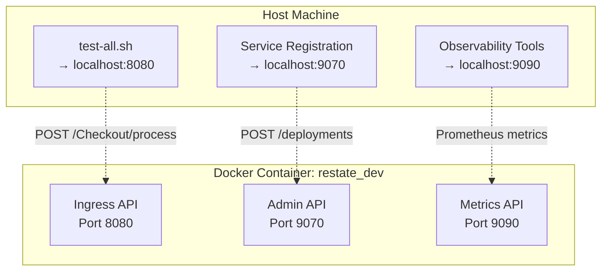
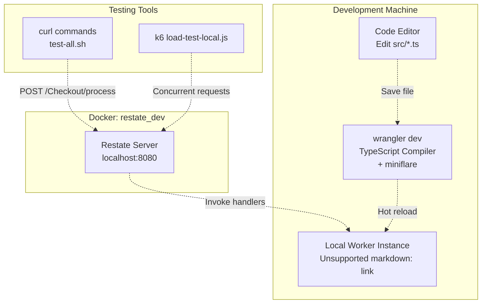
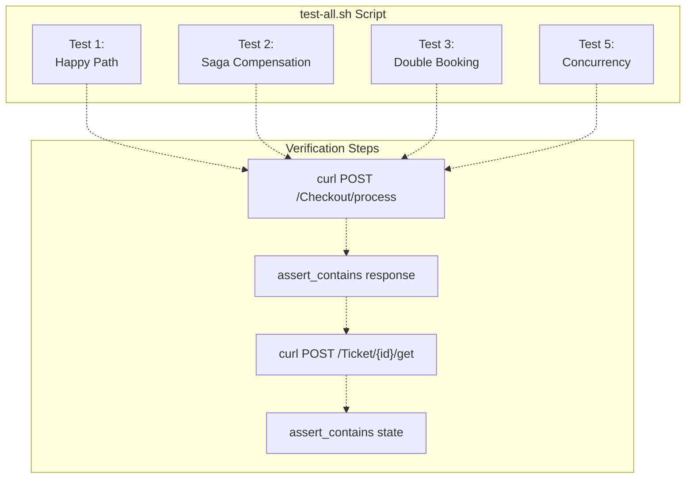
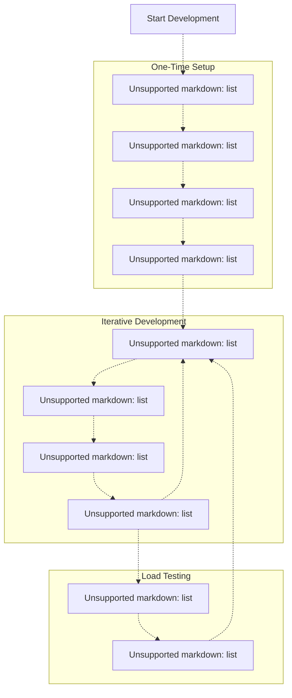

# Local Development Setup

> **Relevant source files**
> * [README.md](https://github.com/philipz/restate-cloudflare-workers-poc/blob/513fd0f5/README.md)
> * [package.json](https://github.com/philipz/restate-cloudflare-workers-poc/blob/513fd0f5/package.json)
> * [test-all.sh](https://github.com/philipz/restate-cloudflare-workers-poc/blob/513fd0f5/test-all.sh)
> * [wrangler.toml](https://github.com/philipz/restate-cloudflare-workers-poc/blob/513fd0f5/wrangler.toml)

This document provides instructions for configuring and running the nexus-poc system on a local development machine. It covers the setup of the local Restate server, Cloudflare Workers development environment, service registration, and local testing. For deployment to production environments, see [Cloud Deployment](/philipz/restate-cloudflare-workers-poc/6.2-cloud-deployment). For comprehensive testing strategies beyond local execution, see [Testing Strategy](/philipz/restate-cloudflare-workers-poc/5-testing-strategy).

---

## Prerequisites

The following tools must be installed before setting up the local development environment:

| Tool | Purpose | Installation |
| --- | --- | --- |
| **Node.js** (v18+) and npm | JavaScript runtime and package manager | [nodejs.org](https://nodejs.org) |
| **Docker** | Container runtime for local Restate server | [docker.com](https://docker.com) |
| **Restate CLI** | Command-line tool for Restate operations | `brew install restatedev/tap/restate` |
| **wrangler** | Cloudflare Workers CLI (installed via npm) | Included in `devDependencies` |

**Sources:** [README.md L26-L29](https://github.com/philipz/restate-cloudflare-workers-poc/blob/513fd0f5/README.md#L26-L29)

 [package.json L10-L17](https://github.com/philipz/restate-cloudflare-workers-poc/blob/513fd0f5/package.json#L10-L17)

---

## Local Restate Server Setup

The local development environment uses a Dockerized Restate server that provides durable execution capabilities without requiring cloud authentication.

### Starting the Restate Server

```
docker run --name restate_dev -d \
  -p 8080:8080 \
  -p 9070:9070 \
  -p 9090:9090 \
  docker.io/restatedev/restate:latest
```

### Port Mapping

The Restate server exposes three ports with distinct purposes:



**Port Reference:**

| Port | API Type | Usage | Example |
| --- | --- | --- | --- |
| `8080` | Ingress | Client requests to services | `http://localhost:8080/Checkout/process` |
| `9070` | Admin | Deployment registration, service management | `http://localhost:9070/deployments` |
| `9090` | Metrics | Prometheus metrics endpoint | `http://localhost:9090/metrics` |

**Sources:** [README.md L31-L34](https://github.com/philipz/restate-cloudflare-workers-poc/blob/513fd0f5/README.md#L31-L34)

 [test-all.sh L8](https://github.com/philipz/restate-cloudflare-workers-poc/blob/513fd0f5/test-all.sh#L8-L8)

---

## Worker Development Workflow

The project uses `wrangler` for local Cloudflare Workers development. The workflow supports two modes: local development with miniflare and cloud deployment.

### Installing Dependencies

```
npm install
```

This installs:

* `@restatedev/restate-sdk-cloudflare-workers@^1.0.0` (runtime)
* `wrangler@^4.51.0` (development CLI)
* `typescript@^5.4.5` (type checking)
* `@cloudflare/workers-types@^4.20240405.0` (type definitions)

**Sources:** [package.json L15-L17](https://github.com/philipz/restate-cloudflare-workers-poc/blob/513fd0f5/package.json#L15-L17)

### Development Mode: wrangler dev

```markdown
npm run dev
# or
npx wrangler dev
```

The `wrangler dev` command starts a local development server using `miniflare`, which simulates the Cloudflare Workers runtime environment. The configuration is defined in [wrangler.toml L1-L7](https://github.com/philipz/restate-cloudflare-workers-poc/blob/513fd0f5/wrangler.toml#L1-L7)

:

| Configuration | Value | Purpose |
| --- | --- | --- |
| `name` | `"nexus-poc"` | Worker identifier |
| `main` | `"src/index.ts"` | Entry point for request handling |
| `compatibility_date` | `"2024-04-01"` | Cloudflare Workers API version |
| `compatibility_flags` | `["nodejs_compat"]` | Enable Node.js compatibility layer |

The `nodejs_compat` flag is critical for the Restate SDK, which requires Node.js APIs not available in the standard Workers runtime.

### Local Development Architecture



**Sources:** [package.json L6-L8](https://github.com/philipz/restate-cloudflare-workers-poc/blob/513fd0f5/package.json#L6-L8)

 [wrangler.toml L1-L7](https://github.com/philipz/restate-cloudflare-workers-poc/blob/513fd0f5/wrangler.toml#L1-L7)

 [test-all.sh L1-L8](https://github.com/philipz/restate-cloudflare-workers-poc/blob/513fd0f5/test-all.sh#L1-L8)

---

## Service Registration

After starting the local Restate server and deploying the Worker, services must be registered with Restate to enable invocation.

### Deploy Worker to Cloudflare

```markdown
npm run deploy
# or
npx wrangler deploy
```

This deploys the Worker to Cloudflare's network, typically at `https://nexus-poc.<your-subdomain>.workers.dev`. The deployment is necessary because the local Restate server invokes the Worker via HTTP.

### Register Services with Local Restate

```
curl -X POST http://localhost:9070/deployments \
  -H "Content-Type: application/json" \
  -d '{"uri": "https://nexus-poc.philipz.workers.dev"}'
```

This command:

1. Contacts the Restate Admin API at port `9070`
2. Registers the deployment endpoint (Worker URL)
3. Restate introspects the Worker to discover available services (`Ticket`, `SeatMap`, `Checkout`)
4. Makes services available at `http://localhost:8080/<ServiceName>/<key>/<method>`

### Service Discovery Flow

```mermaid
sequenceDiagram
  participant Developer
  participant Restate Admin API
  participant localhost:9070
  participant Restate Ingress
  participant localhost:8080
  participant Cloudflare Worker
  participant nexus-poc.workers.dev

  Developer->>Restate Admin API: POST /deployments
  Restate Admin API->>Cloudflare Worker: {"uri": "https://nexus-poc...workers.dev"}
  Cloudflare Worker-->>Restate Admin API: GET /discover (introspection)
  Restate Admin API->>Restate Admin API: Service manifest:
  Restate Admin API-->>Developer: Ticket, SeatMap, Checkout
  note over Restate Ingress,localhost:8080: Services now available
  Developer->>Restate Ingress: Register services
  Restate Ingress->>Cloudflare Worker: 200 OK
  Cloudflare Worker-->>Restate Ingress: POST /Checkout/process
  Restate Ingress-->>Developer: Invoke Checkout.process()
```

**Sources:** [README.md L36-L48](https://github.com/philipz/restate-cloudflare-workers-poc/blob/513fd0f5/README.md#L36-L48)

---

## Running Tests Locally

The project includes a comprehensive test suite designed for local execution against `localhost:8080`.

### test-all.sh Script

The [test-all.sh L1-L226](https://github.com/philipz/restate-cloudflare-workers-poc/blob/513fd0f5/test-all.sh#L1-L226)

 script validates all core functionality:

```
./test-all.sh
```

**Test Coverage:**

| Test # | Scenario | Input | Expected Outcome |
| --- | --- | --- | --- |
| 1 | Happy path booking | `paymentMethodId: "card_success"` | `"Booking Confirmed"`, state → `SOLD` |
| 2 | Payment failure compensation | `paymentMethodId: "card_decline"` | `"Payment failed"`, state → `AVAILABLE` |
| 3 | Double booking prevention | 2× requests for same seat | 2nd request fails: `"already sold"` |
| 4 | Ticket state query | GET `/Ticket/{id}/get` | Returns current state |
| 5 | Concurrency control | 3× concurrent requests | Only 1 succeeds, state → `SOLD` |
| 6 | Gateway timeout | `paymentMethodId: "card_error"` | `"Gateway timeout"`, state → `AVAILABLE` |
| 7 | Bulk booking | 5× sequential requests | All 5 succeed |

### Test Execution Flow



**Key Helper Functions:**

* `print_test()` [test-all.sh L21-L26](https://github.com/philipz/restate-cloudflare-workers-poc/blob/513fd0f5/test-all.sh#L21-L26) : Formats test headers with color output
* `assert_contains()` [test-all.sh L29-L45](https://github.com/philipz/restate-cloudflare-workers-poc/blob/513fd0f5/test-all.sh#L29-L45) : Validates response content and increments pass/fail counters
* `wait_a_bit()` [test-all.sh L48-L50](https://github.com/philipz/restate-cloudflare-workers-poc/blob/513fd0f5/test-all.sh#L48-L50) : Adds delay for state propagation

### Load Testing Locally

The [load-test-local.js](https://github.com/philipz/restate-cloudflare-workers-poc/blob/513fd0f5/load-test-local.js)

 script tests high-concurrency scenarios against the local Restate server:

```markdown
# Default: 5 VUs, 30s duration
k6 run load-test-local.js

# Custom parameters
k6 run -e VUS=10 -e DURATION=60s load-test-local.js
```

This script differs from the cloud version by:

* Targeting `http://localhost:8080` (no authentication required)
* Using the same randomized seat selection (1-50) and payment outcome distribution (80% success, 10% decline, 10% error)

**Sources:** [test-all.sh L1-L226](https://github.com/philipz/restate-cloudflare-workers-poc/blob/513fd0f5/test-all.sh#L1-L226)

 [README.md L130-L143](https://github.com/philipz/restate-cloudflare-workers-poc/blob/513fd0f5/README.md#L130-L143)

---

## Environment Configuration

### TypeScript Configuration

The [tsconfig.json](https://github.com/philipz/restate-cloudflare-workers-poc/blob/513fd0f5/tsconfig.json)

 defines compiler settings optimized for Cloudflare Workers:

* `"target": "ES2022"` - Modern JavaScript syntax
* `"module": "ES2022"` - ESM module system
* `"lib": ["ES2022"]` - Standard library APIs
* `"types": ["@cloudflare/workers-types"]` - Workers runtime types
* `"strict": true` - Enables all strict type checking

### Wrangler Configuration

The [wrangler.toml L1-L7](https://github.com/philipz/restate-cloudflare-workers-poc/blob/513fd0f5/wrangler.toml#L1-L7)

 file configures the local development environment:

* `compatibility_flags = ["nodejs_compat"]` - **Critical:** Enables Node.js APIs required by Restate SDK
* `[observability] enabled = true` - Enables OpenTelemetry tracing and metrics

### Environment Variables

Unlike cloud deployment (see [Cloud Deployment](/philipz/restate-cloudflare-workers-poc/6.2-cloud-deployment)), local development does **not** require authentication tokens. The local Restate server at `localhost:8080` accepts unauthenticated requests.

**Sources:** [wrangler.toml L1-L7](https://github.com/philipz/restate-cloudflare-workers-poc/blob/513fd0f5/wrangler.toml#L1-L7)

 [README.md L97-L101](https://github.com/philipz/restate-cloudflare-workers-poc/blob/513fd0f5/README.md#L97-L101)

---

## Development Workflow Summary

The complete local development cycle:



**Sources:** [README.md L24-L48](https://github.com/philipz/restate-cloudflare-workers-poc/blob/513fd0f5/README.md#L24-L48)

 [package.json L5-L8](https://github.com/philipz/restate-cloudflare-workers-poc/blob/513fd0f5/package.json#L5-L8)

---

## Troubleshooting Common Issues

### Service Registration Fails

**Symptom:** `curl POST /deployments` returns error

**Solution:**

1. Verify Worker is accessible: `curl https://nexus-poc.philipz.workers.dev`
2. Check Docker container is running: `docker ps | grep restate_dev`
3. Ensure port 9070 is not blocked

### Wrangler Dev Port Conflicts

**Symptom:** `wrangler dev` fails to start

**Solution:**

* Wrangler typically uses port `8787` for local Workers
* This is separate from Restate's port `8080`
* Check for conflicts: `lsof -i :8787`

### Tests Fail with "Connection Refused"

**Symptom:** `test-all.sh` cannot connect to `localhost:8080`

**Solution:**

1. Verify Restate container: `docker logs restate_dev`
2. Ensure services are registered: `curl http://localhost:9070/deployments`
3. Check RESTATE_URL variable in [test-all.sh L8](https://github.com/philipz/restate-cloudflare-workers-poc/blob/513fd0f5/test-all.sh#L8-L8)  matches your setup

**Sources:** [test-all.sh L8](https://github.com/philipz/restate-cloudflare-workers-poc/blob/513fd0f5/test-all.sh#L8-L8)

 [README.md L31-L48](https://github.com/philipz/restate-cloudflare-workers-poc/blob/513fd0f5/README.md#L31-L48)