# Local Testing

> **Relevant source files**
> * [README.md](https://github.com/philipz/restate-cloudflare-workers-poc/blob/513fd0f5/README.md)
> * [src/checkout.ts](https://github.com/philipz/restate-cloudflare-workers-poc/blob/513fd0f5/src/checkout.ts)
> * [src/game.ts](https://github.com/philipz/restate-cloudflare-workers-poc/blob/513fd0f5/src/game.ts)
> * [test-all.sh](https://github.com/philipz/restate-cloudflare-workers-poc/blob/513fd0f5/test-all.sh)

## Purpose and Scope

This document describes the local testing setup for the nexus-poc system using the `test-all.sh` automated test suite. Local testing validates all core functionalities against a locally-running Restate server (Docker-based) at `http://localhost:8080` without requiring cloud deployment or authentication tokens.

For cloud environment testing with Restate Cloud authentication, see [Cloud Validation](/philipz/restate-cloudflare-workers-poc/5.2-cloud-validation). For performance and load testing scenarios, see [Load Testing](/philipz/restate-cloudflare-workers-poc/5.3-load-testing).

**Sources:** [test-all.sh L1-L226](https://github.com/philipz/restate-cloudflare-workers-poc/blob/513fd0f5/test-all.sh#L1-L226)

 [README.md L66-L93](https://github.com/philipz/restate-cloudflare-workers-poc/blob/513fd0f5/README.md#L66-L93)

---

## Prerequisites

The local testing environment requires the following components to be running:

| Component | Requirement | Purpose |
| --- | --- | --- |
| **Docker** | Restate server container | Provides durable execution runtime at `localhost:8080` |
| **Deployed Worker** | Cloudflare Worker accessible via URL | Hosts the business logic services (Ticket, SeatMap, Checkout) |
| **curl** | Command-line HTTP client | Executes test requests against Restate endpoints |
| **Registered Services** | Worker URL registered with local Restate | Enables Restate to invoke Worker handlers |

The local Restate server must be started before running tests:

```
docker run --name restate_dev -d -p 8080:8080 -p 9070:9070 -p 9090:9090 docker.io/restatedev/restate:latest
```

The Worker must be deployed and registered with the local Restate instance:

```
curl -X POST http://localhost:9070/deployments \
  -H "Content-Type: application/json" \
  -d '{"uri": "https://nexus-poc.philipz.workers.dev"}'
```

**Sources:** [README.md L31-L48](https://github.com/philipz/restate-cloudflare-workers-poc/blob/513fd0f5/README.md#L31-L48)

 [test-all.sh L8](https://github.com/philipz/restate-cloudflare-workers-poc/blob/513fd0f5/test-all.sh#L8-L8)

---

## Test Architecture

The following diagram illustrates how the local testing infrastructure interacts with the system components:

**Diagram: Local Testing Architecture**


**Sources:** [test-all.sh L1-L226](https://github.com/philipz/restate-cloudflare-workers-poc/blob/513fd0f5/test-all.sh#L1-L226)

 [src/checkout.ts L1-L51](https://github.com/philipz/restate-cloudflare-workers-poc/blob/513fd0f5/src/checkout.ts#L1-L51)

 [src/game.ts L1-L141](https://github.com/philipz/restate-cloudflare-workers-poc/blob/513fd0f5/src/game.ts#L1-L141)

---

## Test Script Structure

The `test-all.sh` script implements a comprehensive test framework with the following components:

**Diagram: Test Script Components**


**Sources:** [test-all.sh L1-L226](https://github.com/philipz/restate-cloudflare-workers-poc/blob/513fd0f5/test-all.sh#L1-L226)

---

## Test Scenarios

The local test suite validates seven distinct scenarios covering all critical system behaviors:

### Test 1: Happy Path (Successful Booking)

**Endpoint:** `POST /Checkout/process`
**Request Payload:**

```json
{
  "ticketId": "test-seat-1",
  "userId": "test-user-1", 
  "paymentMethodId": "card_success"
}
```

**Validation Steps:**

1. Assert response contains `"Booking Confirmed"`
2. Query ticket state via `POST /Ticket/test-seat-1/get`
3. Assert state contains `"SOLD"` and `"test-user-1"`

**Code Location:** [test-all.sh L58-L74](https://github.com/philipz/restate-cloudflare-workers-poc/blob/513fd0f5/test-all.sh#L58-L74)

---

### Test 2: Saga Compensation (Payment Failure)

**Endpoint:** `POST /Checkout/process`
**Request Payload:**

```json
{
  "ticketId": "test-seat-2",
  "userId": "test-user-2",
  "paymentMethodId": "card_decline"
}
```

**Validation Steps:**

1. Assert response contains `"Payment failed"` and `"Payment declined"`
2. Query ticket state via `POST /Ticket/test-seat-2/get`
3. Assert state contains `"AVAILABLE"` (compensation executed)

**Code Location:** [test-all.sh L78-L94](https://github.com/philipz/restate-cloudflare-workers-poc/blob/513fd0f5/test-all.sh#L78-L94)

This test validates the Saga pattern implementation in [src/checkout.ts L29-L35](https://github.com/philipz/restate-cloudflare-workers-poc/blob/513fd0f5/src/checkout.ts#L29-L35)

 ensuring that ticket reservations are properly released when payment processing fails.

---

### Test 3: Double Booking Prevention

**Endpoint:** `POST /Checkout/process` (invoked twice sequentially)

**Validation Steps:**

1. First request with `userId: "test-user-3a"` → Assert `"Booking Confirmed"`
2. Second request with `userId: "test-user-3b"` to same seat → Assert `"already sold"`

**Code Location:** [test-all.sh L98-L115](https://github.com/philipz/restate-cloudflare-workers-poc/blob/513fd0f5/test-all.sh#L98-L115)

This test validates the Virtual Object serialization guarantee provided by Restate, ensuring the second request sees the updated state from [src/game.ts L25-L27](https://github.com/philipz/restate-cloudflare-workers-poc/blob/513fd0f5/src/game.ts#L25-L27)

 that throws `TerminalError` for sold tickets.

---

### Test 4: Ticket State Query

**Endpoint:** `POST /Ticket/test-seat-4/get`
**Request Payload:** `{}`

**Validation Steps:**

1. Assert state contains `"AVAILABLE"`
2. Assert state contains `"null"` for `reservedBy` field

**Code Location:** [test-all.sh L119-L127](https://github.com/philipz/restate-cloudflare-workers-poc/blob/513fd0f5/test-all.sh#L119-L127)

This test validates the `get` handler from [src/game.ts L76-L82](https://github.com/philipz/restate-cloudflare-workers-poc/blob/513fd0f5/src/game.ts#L76-L82)

 ensuring state queries return correct default values for uninitialized tickets.

---

### Test 5: Concurrency Control

**Endpoint:** `POST /Checkout/process` (invoked 3 times concurrently)

**Test Flow:**

```mermaid
sequenceDiagram
  participant test-all.sh
  participant curl & (PID1)
  participant curl & (PID2)
  participant curl & (PID3)
  participant Restate Server
  participant Ticket Object (test-seat-5)

  test-all.sh->>curl & (PID1): Launch background request
  test-all.sh->>curl & (PID2): userId: concurrent-user-1
  test-all.sh->>curl & (PID3): Launch background request
  note over curl & (PID1),curl & (PID3): All 3 requests sent simultaneously
  curl & (PID1)->>Restate Server: userId: concurrent-user-2
  curl & (PID2)->>Restate Server: Launch background request
  curl & (PID3)->>Restate Server: userId: concurrent-user-3
  note over Restate Server: Serializes requests by Virtual Object key
  Restate Server->>Ticket Object (test-seat-5): POST /Checkout/process
  Ticket Object (test-seat-5)-->>Restate Server: POST /Checkout/process
  Restate Server-->>curl & (PID1): POST /Checkout/process
  Restate Server->>Ticket Object (test-seat-5): Process Request 1 (reserve)
  Ticket Object (test-seat-5)-->>Restate Server: SUCCESS (AVAILABLE → RESERVED)
  Restate Server-->>curl & (PID2): Continue workflow (payment, confirm)
  Restate Server->>Ticket Object (test-seat-5): Process Request 2 (reserve)
  Ticket Object (test-seat-5)-->>Restate Server: FAIL (already RESERVED)
  Restate Server-->>curl & (PID3): TerminalError
  test-all.sh->>test-all.sh: Process Request 3 (reserve)
  test-all.sh->>test-all.sh: FAIL (already RESERVED)
  test-all.sh->>Restate Server: TerminalError
  Restate Server-->>test-all.sh: wait PID1, PID2, PID3
```



**Validation Steps:**

1. Launch 3 concurrent requests using background processes (`&`)
2. Wait for all processes to complete (`wait $PID1`, `wait $PID2`, `wait $PID3`)
3. Sleep 2 seconds for state convergence
4. Assert final state is `"SOLD"` (exactly one success)

**Code Location:** [test-all.sh L131-L163](https://github.com/philipz/restate-cloudflare-workers-poc/blob/513fd0f5/test-all.sh#L131-L163)

This test validates Restate's serialization guarantee for Virtual Objects, ensuring only one concurrent request succeeds despite no explicit locking code.

---

### Test 6: Gateway Timeout Handling

**Endpoint:** `POST /Checkout/process`
**Request Payload:**

```json
{
  "ticketId": "test-seat-6",
  "userId": "test-user-6",
  "paymentMethodId": "card_error"
}
```

**Validation Steps:**

1. Assert response contains `"Payment failed"` and `"Gateway timeout"`
2. Query ticket state → Assert `"AVAILABLE"` (compensation executed)

**Code Location:** [test-all.sh L167-L183](https://github.com/philipz/restate-cloudflare-workers-poc/blob/513fd0f5/test-all.sh#L167-L183)

This test validates error handling for the `card_error` payment method defined in the payment simulation utility.

---

### Test 7: Bulk Sequential Booking

**Endpoint:** `POST /Checkout/process` (invoked 5 times in loop)

**Validation Steps:**

1. Loop through seats `bulk-seat-1` to `bulk-seat-5`
2. Count successful responses (`Booking Confirmed`)
3. Assert `SUCCESS_COUNT == 5`

**Code Location:** [test-all.sh L187-L208](https://github.com/philipz/restate-cloudflare-workers-poc/blob/513fd0f5/test-all.sh#L187-L208)

This test validates system stability under sequential high-volume requests, with 500ms delays between iterations.

---

## Assertion Framework

The test script implements a custom assertion mechanism:

**Diagram: Assertion Flow**


**Key Implementation Details:**

| Function | Parameters | Behavior |
| --- | --- | --- |
| `assert_contains()` | `$1` = response, `$2` = expected substring, `$3` = test name | Uses `grep -q` to check if response contains expected string. Increments `PASSED_TESTS` or `FAILED_TESTS`. |
| `print_test()` | `$1` = test number, `$2` = test description | Prints formatted test header and increments `TOTAL_TESTS` |
| `wait_a_bit()` | None | Sleeps for 1 second to allow state convergence |

**Sources:** [test-all.sh L21-L50](https://github.com/philipz/restate-cloudflare-workers-poc/blob/513fd0f5/test-all.sh#L21-L50)

---

## Test Execution

To run the complete local test suite:

```
./test-all.sh
```

**Execution Flow:**

```mermaid
flowchart TD

Start["Start test-all.sh"]
Init["Initialize Counters<br>TOTAL_TESTS=0<br>PASSED_TESTS=0<br>FAILED_TESTS=0"]
Test1["Execute Test 1<br>Happy Path"]
Test2["Execute Test 2<br>Saga Compensation"]
Test3["Execute Test 3<br>Double Booking"]
Test4["Execute Test 4<br>Query Handler"]
Test5["Execute Test 5<br>Concurrency"]
Test6["Execute Test 6<br>Gateway Timeout"]
Test7["Execute Test 7<br>Bulk Booking"]
Summary["Print Summary<br>Total: TOTAL_TESTS<br>Passed: PASSED_TESTS<br>Failed: FAILED_TESTS"]
CheckFailed["FAILED_TESTS == 0?"]
ExitSuccess["Exit 0<br>🎉 All tests passed"]
ExitFail["Exit 1<br>❌ Tests failed"]

Start --> Init
Init --> Test1
Test1 --> Test2
Test2 --> Test3
Test3 --> Test4
Test4 --> Test5
Test5 --> Test6
Test6 --> Test7
Test7 --> Summary
Summary --> CheckFailed
CheckFailed -->|"Yes"| ExitSuccess
CheckFailed -->|"No"| ExitFail
```



**Sources:** [test-all.sh L1-L226](https://github.com/philipz/restate-cloudflare-workers-poc/blob/513fd0f5/test-all.sh#L1-L226)

---

## Results and Reporting

The test script outputs color-coded results using ANSI escape codes:

| Color | Code | Usage |
| --- | --- | --- |
| Green (`\033<FileRef file-url="https://github.com/philipz/restate-cloudflare-workers-poc/blob/513fd0f5/0;32m`) | `COLOR_GREEN` | Passed tests and success messages |

---

## Test Coverage Summary

The local test suite provides comprehensive validation across all system layers:

| Layer | Component | Tests Validating |
| --- | --- | --- |
| **Workflow** | `Checkout.process` | Tests 1, 2, 3, 5, 6, 7 |
| **Virtual Object** | `Ticket.reserve` | Tests 1, 2, 3, 5, 6, 7 |
| **Virtual Object** | `Ticket.confirm` | Tests 1, 7 |
| **Virtual Object** | `Ticket.release` | Tests 2, 6 |
| **Virtual Object** | `Ticket.get` | Tests 1, 2, 3, 4, 5, 6 |
| **Virtual Object** | `SeatMap.set` | Tests 1, 2, 3, 7 (implicit) |
| **Utility** | `processPayment` | Tests 1, 2, 6 |
| **Restate Feature** | Serialization | Test 5 |
| **Restate Feature** | Saga Compensation | Tests 2, 6 |
| **Restate Feature** | Durable State | Tests 1, 2, 3, 4, 5, 6, 7 |

**Sources:** [test-all.sh L1-L226](https://github.com/philipz/restate-cloudflare-workers-poc/blob/513fd0f5/test-all.sh#L1-L226)

 [src/game.ts L1-L141](https://github.com/philipz/restate-cloudflare-workers-poc/blob/513fd0f5/src/game.ts#L1-L141)

 [src/checkout.ts L1-L51](https://github.com/philipz/restate-cloudflare-workers-poc/blob/513fd0f5/src/checkout.ts#L1-L51)