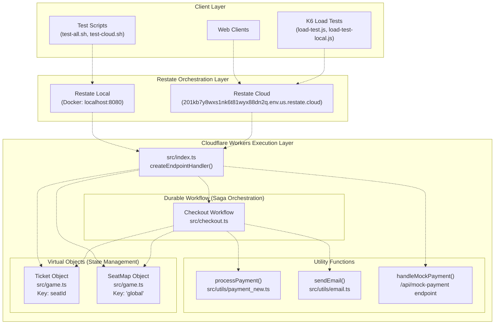
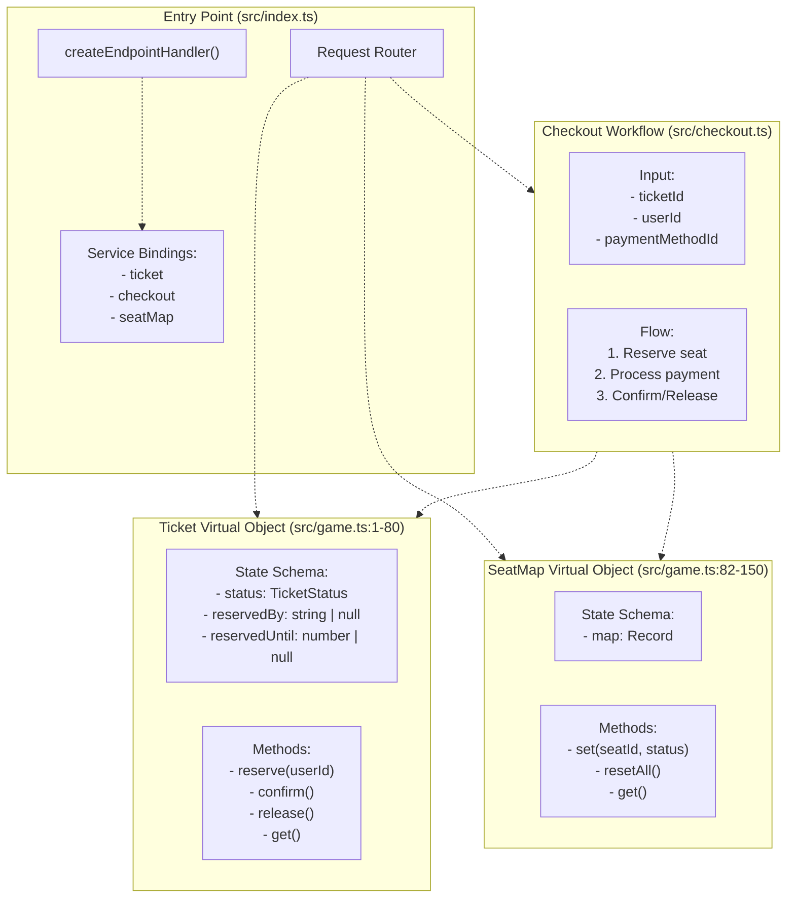

# Overview

> **Relevant source files**
> * [PoC.md](https://github.com/philipz/restate-cloudflare-workers-poc/blob/513fd0f5/PoC.md)
> * [README.md](https://github.com/philipz/restate-cloudflare-workers-poc/blob/513fd0f5/README.md)
> * [package.json](https://github.com/philipz/restate-cloudflare-workers-poc/blob/513fd0f5/package.json)

## Purpose and Scope

This document provides a technical overview of the `nexus-poc` system, a Proof of Concept (PoC) demonstrating the integration of **Restate** durable execution engine with **Cloudflare Workers** serverless platform to build a high-concurrency ticket booking system. The system showcases how to handle race conditions, implement distributed transactions using the Saga pattern, and achieve exactly-once semantics for external API calls in a stateless edge computing environment.

For detailed information about individual services (Ticket object, SeatMap object, Checkout workflow), see [Core Services](/philipz/restate-cloudflare-workers-poc/2-core-services). For deployment procedures, see [Development & Deployment](/philipz/restate-cloudflare-workers-poc/6-development-and-deployment). For conceptual background on Virtual Objects and durable execution, see [Key Concepts](/philipz/restate-cloudflare-workers-poc/8-key-concepts).

---

## System Purpose

The `nexus-poc` system simulates a ticket booking scenario with the following characteristics:

* **High-concurrency seat reservation**: Multiple users attempting to reserve the same seat simultaneously
* **Multi-step transaction flow**: Reserve → Payment → Confirmation with compensation logic
* **Fault tolerance**: Automatic recovery from Worker crashes, network failures, and payment gateway timeouts
* **Strong consistency**: Prevention of double-booking without explicit database locks

The system manages 50 seat inventory with automatic reset functionality for demonstration purposes.

**Sources:** [README.md L1-L17](https://github.com/philipz/restate-cloudflare-workers-poc/blob/513fd0f5/README.md#L1-L17)

 [PoC.md L1-L22](https://github.com/philipz/restate-cloudflare-workers-poc/blob/513fd0f5/PoC.md#L1-L22)

---

## System Architecture Overview



**Figure 1: High-Level System Architecture**

The system consists of three primary layers:

1. **Client Layer**: Test scripts, load testing tools, and web clients that initiate booking requests
2. **Restate Orchestration Layer**: Manages durable execution state, request serialization, and failure recovery
3. **Cloudflare Workers Execution Layer**: Hosts the business logic implementing Virtual Objects and Durable Workflows

**Sources:** [README.md L5-L23](https://github.com/philipz/restate-cloudflare-workers-poc/blob/513fd0f5/README.md#L5-L23)

 [PoC.md L23-L54](https://github.com/philipz/restate-cloudflare-workers-poc/blob/513fd0f5/PoC.md#L23-L54)

 High-level diagrams provided

---

## Core Component Mapping



**Figure 2: Code Entity Architecture**

This diagram maps natural language concepts to actual code entities in the repository:

| Component | File Location | Key Exports |
| --- | --- | --- |
| Entry Point | [src/index.ts](https://github.com/philipz/restate-cloudflare-workers-poc/blob/513fd0f5/src/index.ts) | `export default { fetch: ... }` |
| Ticket Object | [src/game.ts L1-L80](https://github.com/philipz/restate-cloudflare-workers-poc/blob/513fd0f5/src/game.ts#L1-L80) | `ticket` object definition |
| SeatMap Object | [src/game.ts L82-L150](https://github.com/philipz/restate-cloudflare-workers-poc/blob/513fd0f5/src/game.ts#L82-L150) | `seatMap` object definition |
| Checkout Workflow | [src/checkout.ts](https://github.com/philipz/restate-cloudflare-workers-poc/blob/513fd0f5/src/checkout.ts) | `checkout` workflow definition |
| Payment Utility | [src/utils/payment_new.ts](https://github.com/philipz/restate-cloudflare-workers-poc/blob/513fd0f5/src/utils/payment_new.ts) | `processPayment()` function |
| Email Utility | [src/utils/email.ts](https://github.com/philipz/restate-cloudflare-workers-poc/blob/513fd0f5/src/utils/email.ts) | `sendEmail()` function |

**Sources:** [README.md L145-L153](https://github.com/philipz/restate-cloudflare-workers-poc/blob/513fd0f5/README.md#L145-L153)

 [PoC.md L75-L89](https://github.com/philipz/restate-cloudflare-workers-poc/blob/513fd0f5/PoC.md#L75-L89)

 [package.json L1-L18](https://github.com/philipz/restate-cloudflare-workers-poc/blob/513fd0f5/package.json#L1-L18)

---

## Architectural Patterns

The system implements two primary Restate patterns:

### Virtual Objects (Actor Model)

Virtual Objects provide isolated, single-threaded execution contexts keyed by a unique identifier. The `Ticket` object uses `seatId` as its key (e.g., `"seat-1"`, `"seat-42"`). Restate guarantees that all requests targeting the same key are serialized, eliminating race conditions without explicit locks.

**Example:** When 1000 concurrent requests attempt to reserve `"seat-1"`:

* Restate enqueues all requests in a per-key queue
* Each request executes sequentially against the object's state
* The first request transitions state from `AVAILABLE` → `RESERVED` and succeeds
* All subsequent requests see the `RESERVED` state and fail with `TerminalError`

The `SeatMap` object uses a singleton pattern with key `"global"` to maintain aggregate seat availability across all seats.

### Durable Workflows (Saga Pattern)

The `Checkout` workflow implements a distributed transaction using the Saga pattern with compensating actions:

1. **Reserve Step**: Call `Ticket.reserve()` via RPC
2. **Payment Step**: Execute `processPayment()` wrapped in `ctx.run()` for exactly-once semantics
3. **Decision Point**: * **Success Path**: Call `Ticket.confirm()` and `SeatMap.set()` * **Failure Path**: Execute compensation by calling `Ticket.release()` and `SeatMap.set()`

The workflow survives Worker crashes, network failures, and payment gateway timeouts through Restate's journaling mechanism. If a Worker crashes mid-execution, Restate replays the workflow from the journal, skipping already-completed steps.

**Sources:** [README.md L11-L16](https://github.com/philipz/restate-cloudflare-workers-poc/blob/513fd0f5/README.md#L11-L16)

 [PoC.md L58-L89](https://github.com/philipz/restate-cloudflare-workers-poc/blob/513fd0f5/PoC.md#L58-L89)

 [PoC.md L160-L213](https://github.com/philipz/restate-cloudflare-workers-poc/blob/513fd0f5/PoC.md#L160-L213)

---

## Request Flow Example

```mermaid
sequenceDiagram
  participant Client
  participant Restate Server
  participant Worker (src/index.ts)
  participant Checkout Workflow
  participant Ticket Object
  participant SeatMap Object
  participant processPayment()

  Client->>Restate Server: POST /Checkout/process
  Restate Server->>Worker (src/index.ts): {ticketId: "seat-1", userId: "user-1", paymentMethodId: "card_success"}
  Worker (src/index.ts)->>Checkout Workflow: Invoke via createEndpointHandler()
  Checkout Workflow->>Ticket Object: Route to checkout.process()
  note over Ticket Object: Serialized access<br/>State: AVAILABLE → RESERVED
  Ticket Object-->>Checkout Workflow: ctx.objectClient.reserve("user-1")
  Checkout Workflow->>SeatMap Object: Success
  SeatMap Object-->>Checkout Workflow: ctx.objectClient.set("seat-1", "RESERVED")
  Checkout Workflow->>processPayment(): Success
  note over processPayment(): Exactly-once execution<br/>500ms simulated delay
  processPayment()-->>Checkout Workflow: ctx.run("process-payment", () => processPayment(...))
  Checkout Workflow->>Ticket Object: Success
  note over Ticket Object: State: RESERVED → SOLD
  Ticket Object-->>Checkout Workflow: ctx.objectClient.confirm()
  Checkout Workflow->>SeatMap Object: Success
  SeatMap Object-->>Checkout Workflow: ctx.objectClient.set("seat-1", "SOLD")
  Checkout Workflow->>Checkout Workflow: Success
  Checkout Workflow-->>Restate Server: ctx.run("send-email", () => sendEmail(...))
  Restate Server-->>Client: Return "Booking Confirmed"
```

**Figure 3: Successful Booking Request Flow**

This sequence demonstrates the happy path where:

* The `Ticket` object serializes concurrent access by `seatId` key
* The `processPayment()` call is wrapped in `ctx.run()` for idempotency
* The `SeatMap` maintains a global view of all seat statuses
* All state transitions are durably recorded in Restate's journal

**Sources:** High-level diagrams provided, [README.md L72-L83](https://github.com/philipz/restate-cloudflare-workers-poc/blob/513fd0f5/README.md#L72-L83)

 [PoC.md L160-L213](https://github.com/philipz/restate-cloudflare-workers-poc/blob/513fd0f5/PoC.md#L160-L213)

---

## Technology Stack

### Core Dependencies

| Dependency | Version | Purpose |
| --- | --- | --- |
| `@restatedev/restate-sdk-cloudflare-workers` | ^1.0.0 | Restate SDK for Cloudflare Workers runtime |
| `@cloudflare/workers-types` | ^4.20240405.0 | TypeScript type definitions for Workers API |
| `typescript` | ^5.4.5 | Type checking and compilation |
| `wrangler` | ^4.51.0 | Cloudflare Workers CLI for deployment |

**Sources:** [package.json L10-L17](https://github.com/philipz/restate-cloudflare-workers-poc/blob/513fd0f5/package.json#L10-L17)

### Runtime Environment

* **Execution Platform**: Cloudflare Workers (V8 Isolate)
* **Orchestration Engine**: Restate Server (Docker for local, Restate Cloud for production)
* **Language**: TypeScript (ES Module syntax)
* **Configuration**: [wrangler.toml](https://github.com/philipz/restate-cloudflare-workers-poc/blob/513fd0f5/wrangler.toml)  for Worker settings, [tsconfig.json](https://github.com/philipz/restate-cloudflare-workers-poc/blob/513fd0f5/tsconfig.json)  for TypeScript compiler options

**Sources:** [README.md L26-L48](https://github.com/philipz/restate-cloudflare-workers-poc/blob/513fd0f5/README.md#L26-L48)

 [PoC.md L23-L46](https://github.com/philipz/restate-cloudflare-workers-poc/blob/513fd0f5/PoC.md#L23-L46)

### Deployment Targets

| Environment | Restate Instance | Worker URL | Authentication |
| --- | --- | --- | --- |
| **Local** | Docker (localhost:8080) | localhost via `wrangler dev` | None |
| **Cloud** | Restate Cloud (201kb7y8wxs1nk6t81wyx88dn2q.env.us.restate.cloud) | nexus-poc.philipz.workers.dev | RESTATE_AUTH_TOKEN required |

**Sources:** [README.md L50-L64](https://github.com/philipz/restate-cloudflare-workers-poc/blob/513fd0f5/README.md#L50-L64)

 [README.md L97-L101](https://github.com/philipz/restate-cloudflare-workers-poc/blob/513fd0f5/README.md#L97-L101)

---

## Key Capabilities

The `nexus-poc` system demonstrates the following capabilities:

### Concurrency Control Without Locks

Virtual Objects eliminate the need for database-level locking. The Ticket object's serialization guarantee ensures that concurrent requests for the same seat execute sequentially, preventing race conditions inherently.

**Test Coverage**: The load testing scripts ([load-test.js](https://github.com/philipz/restate-cloudflare-workers-poc/blob/513fd0f5/load-test.js)

 [load-test-local.js](https://github.com/philipz/restate-cloudflare-workers-poc/blob/513fd0f5/load-test-local.js)

) simulate high-concurrency scenarios with randomized seat selection (1-50) to validate this behavior.

### Exactly-Once Semantics for External Calls

The `ctx.run()` API in the Checkout workflow ensures that payment processing occurs exactly once, even if the Worker crashes mid-execution. Restate's journal records the completion of each `ctx.run()` block, and on replay, returns the cached result instead of re-executing the payment call.

**Implementation**: [src/checkout.ts](https://github.com/philipz/restate-cloudflare-workers-poc/blob/513fd0f5/src/checkout.ts)

 wraps `processPayment()` in `ctx.run("process-payment", ...)` to prevent duplicate charges.

### Automatic State Recovery

When a Worker crashes or is forcibly terminated, Restate automatically:

1. Detects the disconnection
2. Spawns a new Worker instance
3. Replays the execution journal to restore state
4. Continues execution from the suspension point

This mechanism enables workflows that span minutes, hours, or days to run reliably on ephemeral Workers with strict CPU time limits.

### Saga Compensation Logic

The Checkout workflow implements compensating transactions. If payment fails (e.g., `paymentMethodId: "card_decline"`), the workflow automatically calls `Ticket.release()` to rollback the reservation, ensuring consistency across distributed state.

**Test Coverage**: [test-all.sh L70-L77](https://github.com/philipz/restate-cloudflare-workers-poc/blob/513fd0f5/test-all.sh#L70-L77)

 and [test-cloud.sh](https://github.com/philipz/restate-cloudflare-workers-poc/blob/513fd0f5/test-cloud.sh)

 validate this behavior with dedicated test scenarios.

**Sources:** [README.md L1-L23](https://github.com/philipz/restate-cloudflare-workers-poc/blob/513fd0f5/README.md#L1-L23)

 [PoC.md L12-L22](https://github.com/philipz/restate-cloudflare-workers-poc/blob/513fd0f5/PoC.md#L12-L22)

 [README.md L66-L143](https://github.com/philipz/restate-cloudflare-workers-poc/blob/513fd0f5/README.md#L66-L143)

---

## System Constraints and Assumptions

### Inventory Size

The system manages a fixed inventory of 50 seats (`"seat-1"` through `"seat-50"`). When 50 seats are sold, the SeatMap object automatically triggers a reset via `resetAll()`, which releases all tickets back to `AVAILABLE` state.

**Implementation**: [src/game.ts L82-L150](https://github.com/philipz/restate-cloudflare-workers-poc/blob/513fd0f5/src/game.ts#L82-L150)

 contains the auto-reset logic in the `set()` handler.

### Payment Simulation

To avoid external dependencies during testing, the system uses a simulated payment gateway ([src/utils/payment_new.ts](https://github.com/philipz/restate-cloudflare-workers-poc/blob/513fd0f5/src/utils/payment_new.ts)

) that supports three outcomes based on the `paymentMethodId`:

* `"card_success"`: Succeeds after 500ms delay
* `"card_decline"`: Throws terminal error (triggers Saga compensation)
* `"card_error"`: Throws retryable error (triggers Restate retry mechanism)

This allows comprehensive testing of all code paths without requiring real payment gateway credentials.

### Reservation Expiration

While the Ticket object's state schema includes a `reservedUntil` field, automatic time-based expiration is not currently implemented in this PoC. Seats remain reserved until explicitly confirmed or released by the Checkout workflow.

**Sources:** [README.md L18-L22](https://github.com/philipz/restate-cloudflare-workers-poc/blob/513fd0f5/README.md#L18-L22)

 [PoC.md L58-L71](https://github.com/philipz/restate-cloudflare-workers-poc/blob/513fd0f5/PoC.md#L58-L71)

---

## Related Documentation

* **[System Architecture](/philipz/restate-cloudflare-workers-poc/1.1-system-architecture)**: Detailed breakdown of the multi-tier architecture
* **[Technology Stack](/philipz/restate-cloudflare-workers-poc/1.2-technology-stack)**: Complete dependency and configuration reference
* **[Core Services](/philipz/restate-cloudflare-workers-poc/2-core-services)**: In-depth documentation of Ticket, SeatMap, and Checkout services
* **[Request Routing & Entry Point](/philipz/restate-cloudflare-workers-poc/3-request-routing-and-entry-point)**: How `src/index.ts` handles service binding and routing
* **[Testing Strategy](/philipz/restate-cloudflare-workers-poc/5-testing-strategy)**: Comprehensive testing approach including load tests
* **[Development & Deployment](/philipz/restate-cloudflare-workers-poc/6-development-and-deployment)**: Setup instructions for local and cloud environments
* **[Key Concepts](/philipz/restate-cloudflare-workers-poc/8-key-concepts)**: Conceptual foundation for Virtual Objects, durable execution, and Saga patterns