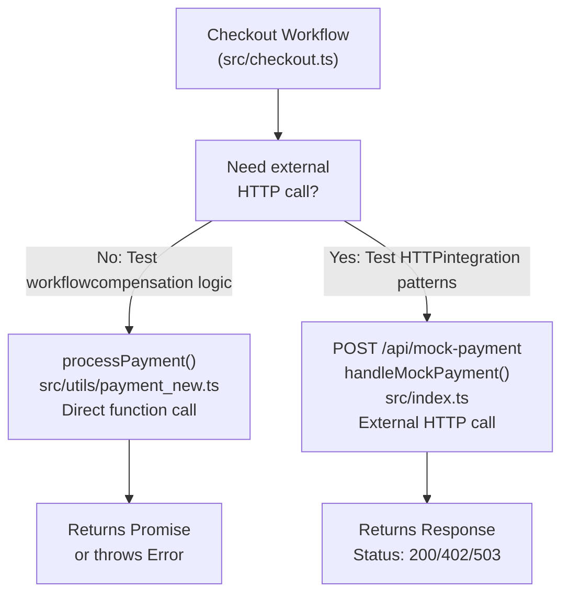
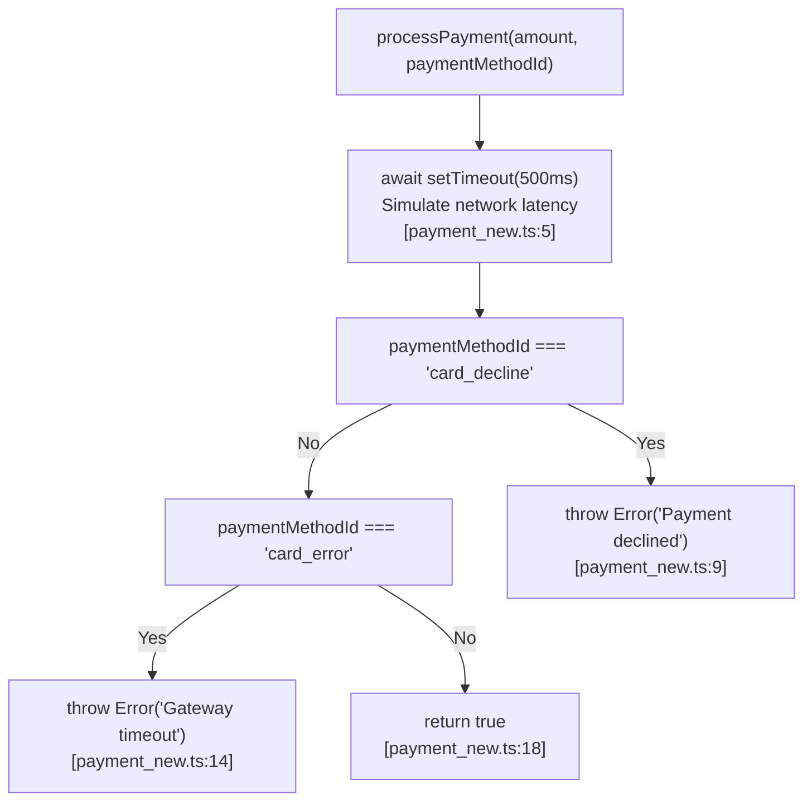
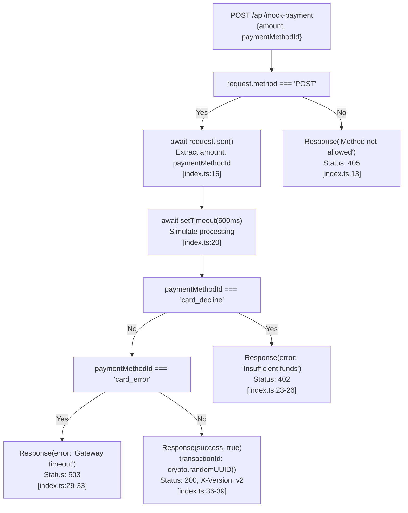
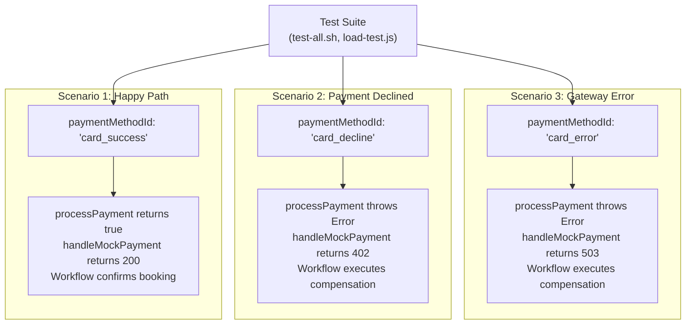

# Payment Simulation

> **Relevant source files**
> * [src/checkout.ts](https://github.com/philipz/restate-cloudflare-workers-poc/blob/513fd0f5/src/checkout.ts)
> * [src/index.ts](https://github.com/philipz/restate-cloudflare-workers-poc/blob/513fd0f5/src/index.ts)
> * [src/utils/payment_new.ts](https://github.com/philipz/restate-cloudflare-workers-poc/blob/513fd0f5/src/utils/payment_new.ts)

## Purpose and Scope

This document details the payment simulation system used for testing and development in the nexus-poc ticketing application. The system provides two complementary simulation mechanisms: a `processPayment` utility function and a mock payment gateway endpoint. These components allow the Checkout workflow to test payment processing logic, error handling, and saga compensation patterns without requiring integration with real payment providers.

For information about how payment simulation integrates into the booking flow, see [Checkout Workflow](/philipz/restate-cloudflare-workers-poc/2.3-checkout-workflow). For testing strategies that utilize these simulations, see [Testing Strategy](/philipz/restate-cloudflare-workers-poc/5-testing-strategy).

---

## Architecture Overview

The payment simulation system consists of two independent components that can be used separately or together:

| Component | Location | Purpose | Invocation Method |
| --- | --- | --- | --- |
| `processPayment` Function | `src/utils/payment_new.ts` | In-process payment simulation for workflow testing | Direct function call within `ctx.run` |
| `handleMockPayment` Endpoint | `src/index.ts` | HTTP endpoint simulating external payment gateway | HTTP POST to `/api/mock-payment` |

### Component Selection Diagram



**Sources:** [src/checkout.ts L22-L28](https://github.com/philipz/restate-cloudflare-workers-poc/blob/513fd0f5/src/checkout.ts#L22-L28)

 [src/utils/payment_new.ts L1-L19](https://github.com/philipz/restate-cloudflare-workers-poc/blob/513fd0f5/src/utils/payment_new.ts#L1-L19)

 [src/index.ts L11-L40](https://github.com/philipz/restate-cloudflare-workers-poc/blob/513fd0f5/src/index.ts#L11-L40)

---

## processPayment Function

The `processPayment` function provides in-process payment simulation. It is invoked directly within the Checkout workflow's `ctx.run` block to ensure exactly-once execution semantics.

### Function Signature

```
processPayment(amount: number, paymentMethodId: string): Promise<boolean>
```

**Location:** [src/utils/payment_new.ts L1](https://github.com/philipz/restate-cloudflare-workers-poc/blob/513fd0f5/src/utils/payment_new.ts#L1-L1)

### Payment Method Behaviors

The function simulates three distinct payment outcomes based on the `paymentMethodId` parameter:

| Payment Method ID | Behavior | Latency | Return Value | Error Type |
| --- | --- | --- | --- | --- |
| `card_success` | Payment succeeds | 500ms | `true` | None |
| `card_decline` | Payment declined by gateway | 500ms | N/A | `Error("Payment declined (Method: card_decline)")` |
| `card_error` | Gateway timeout/unavailable | 500ms | N/A | `Error("Gateway timeout")` |
| Any other value | Treated as success | 500ms | `true` | None |

### Decision Flow Diagram



**Sources:** [src/utils/payment_new.ts L1-L19](https://github.com/philipz/restate-cloudflare-workers-poc/blob/513fd0f5/src/utils/payment_new.ts#L1-L19)

### Latency Simulation

All payment outcomes include a consistent 500ms delay to simulate realistic network latency:

```javascript
await new Promise(resolve => setTimeout(resolve, 500)); // Simulate 500ms latency
```

**Location:** [src/utils/payment_new.ts L5](https://github.com/philipz/restate-cloudflare-workers-poc/blob/513fd0f5/src/utils/payment_new.ts#L5-L5)

This delay is critical for testing:

* Workflow idempotency during replay scenarios
* Timeout handling in concurrent operations
* User experience under load conditions

### Integration with Checkout Workflow

The Checkout workflow invokes `processPayment` within a `ctx.run` block to ensure exactly-once execution:

```javascript
await ctx.run("process-payment", async () => {
    try {
        return await processPayment(100, paymentMethodId);
    } catch (e) {
        throw new restate.TerminalError(`Payment declined: ${(e as Error).message}`);
    }
});
```

**Location:** [src/checkout.ts L22-L28](https://github.com/philipz/restate-cloudflare-workers-poc/blob/513fd0f5/src/checkout.ts#L22-L28)

Key architectural points:

* `ctx.run` provides idempotent execution—if the workflow crashes after payment succeeds, replay will skip re-executing the payment
* Exceptions are caught and wrapped in `TerminalError` to trigger saga compensation
* The `amount` is hardcoded to `100` in the workflow, representing ticket price

**Sources:** [src/checkout.ts L22-L28](https://github.com/philipz/restate-cloudflare-workers-poc/blob/513fd0f5/src/checkout.ts#L22-L28)

 [src/utils/payment_new.ts L1-L19](https://github.com/philipz/restate-cloudflare-workers-poc/blob/513fd0f5/src/utils/payment_new.ts#L1-L19)

---

## handleMockPayment HTTP Endpoint

The `handleMockPayment` function provides an HTTP endpoint that simulates an external payment gateway. This allows testing HTTP integration patterns and external service invocation.

### Endpoint Specification

| Property | Value |
| --- | --- |
| Path | `/api/mock-payment` |
| Method | `POST` |
| Content-Type | `application/json` |
| Request Body | `{ amount: number, paymentMethodId: string }` |
| Handler Function | `handleMockPayment` |
| Location | [src/index.ts L11-L40](https://github.com/philipz/restate-cloudflare-workers-poc/blob/513fd0f5/src/index.ts#L11-L40) |

### Request Routing

The endpoint is routed before Restate handler invocation:

```javascript
export default {
    fetch: async (request: Request, env: any, ctx: any) => {
        const url = new URL(request.url);
        if (url.pathname === "/api/mock-payment") {
            return handleMockPayment(request);
        }
        return restateHandler(request, env, ctx);
    },
};
```

**Location:** [src/index.ts L42-L50](https://github.com/philipz/restate-cloudflare-workers-poc/blob/513fd0f5/src/index.ts#L42-L50)

This routing pattern ensures mock payment requests bypass Restate's durable execution engine entirely.

### Response Status Codes

The endpoint returns different HTTP status codes based on `paymentMethodId`:

| Payment Method ID | HTTP Status | Response Body | Headers |
| --- | --- | --- | --- |
| `card_success` | `200 OK` | `{ success: true, transactionId: <uuid> }` | `X-Version: v2` |
| `card_decline` | `402 Payment Required` | `{ error: "Insufficient funds" }` | Standard |
| `card_error` | `503 Service Unavailable` | `{ error: "Gateway timeout" }` | Standard |

### Response Generation Flow



**Sources:** [src/index.ts L11-L40](https://github.com/philipz/restate-cloudflare-workers-poc/blob/513fd0f5/src/index.ts#L11-L40)

### Transaction ID Generation

Successful payments generate a unique transaction identifier using the Web Crypto API:

```
{ success: true, transactionId: crypto.randomUUID() }
```

**Location:** [src/index.ts L36](https://github.com/philipz/restate-cloudflare-workers-poc/blob/513fd0f5/src/index.ts#L36-L36)

This simulates real payment gateway behavior where each successful transaction receives a unique tracking identifier.

### HTTP Method Validation

The endpoint enforces POST-only access:

```
if (request.method !== "POST") {
    return new Response("Method not allowed", { status: 405 });
}
```

**Location:** [src/index.ts L12-L14](https://github.com/philipz/restate-cloudflare-workers-poc/blob/513fd0f5/src/index.ts#L12-L14)

**Sources:** [src/index.ts L11-L40](https://github.com/philipz/restate-cloudflare-workers-poc/blob/513fd0f5/src/index.ts#L11-L40)

---

## Testing Payment Outcomes

Both simulation components support three deterministic test scenarios controlled by the `paymentMethodId` parameter.

### Test Scenario Mapping



**Sources:** [src/utils/payment_new.ts L7-L14](https://github.com/philipz/restate-cloudflare-workers-poc/blob/513fd0f5/src/utils/payment_new.ts#L7-L14)

 [src/index.ts L22-L34](https://github.com/philipz/restate-cloudflare-workers-poc/blob/513fd0f5/src/index.ts#L22-L34)

### Load Test Distribution

The K6 load testing scripts use a probabilistic distribution of payment outcomes:

| Payment Method | Probability | Purpose |
| --- | --- | --- |
| `card_success` | 80% | Validate happy path performance |
| `card_decline` | 10% | Exercise compensation logic under load |
| `card_error` | 10% | Test error handling and retry behavior |

This distribution is configured in the load test scripts (see [Load Testing](/philipz/restate-cloudflare-workers-poc/5.3-load-testing) for implementation details).

**Sources:** [src/utils/payment_new.ts L1-L19](https://github.com/philipz/restate-cloudflare-workers-poc/blob/513fd0f5/src/utils/payment_new.ts#L1-L19)

 [src/index.ts L11-L40](https://github.com/philipz/restate-cloudflare-workers-poc/blob/513fd0f5/src/index.ts#L11-L40)

---

## Error Handling Patterns

### Terminal vs Retriable Errors

The Checkout workflow wraps payment errors in `TerminalError` to prevent automatic retries:

```
catch (e) {
    throw new restate.TerminalError(`Payment declined: ${(e as Error).message}`);
}
```

**Location:** [src/checkout.ts L26](https://github.com/philipz/restate-cloudflare-workers-poc/blob/513fd0f5/src/checkout.ts#L26-L26)

This pattern ensures that:

* Declined payments (`card_decline`) do not retry infinitely
* Gateway timeouts (`card_error`) trigger immediate compensation
* The saga pattern executes cleanup logic (ticket release) exactly once

### Compensation Trigger Flow

```mermaid
sequenceDiagram
  participant Checkout Workflow
  participant processPayment()
  participant Ticket Object
  participant SeatMap Object

  note over Checkout Workflow,SeatMap Object: Scenario: card_decline
  Checkout Workflow->>Ticket Object: reserve(userId)
  Ticket Object-->>Checkout Workflow: Success (RESERVED)
  Checkout Workflow->>SeatMap Object: set(seatId, RESERVED)
  SeatMap Object-->>Checkout Workflow: Success
  Checkout Workflow->>processPayment(): processPayment(100, "card_decline")
  note over processPayment(): await setTimeout(500ms)
  processPayment()->>processPayment(): Check: paymentMethodId === "card_decline"
  processPayment()-->>Checkout Workflow: throw Error("Payment declined")
  note over Checkout Workflow: catch block triggered
  Checkout Workflow->>Ticket Object: release()
  Ticket Object-->>Checkout Workflow: Success (AVAILABLE)
  Checkout Workflow->>SeatMap Object: set(seatId, AVAILABLE)
  SeatMap Object-->>Checkout Workflow: Success
  Checkout Workflow-->>Checkout Workflow: throw TerminalError("Payment failed")
```

**Sources:** [src/checkout.ts L20-L35](https://github.com/philipz/restate-cloudflare-workers-poc/blob/513fd0f5/src/checkout.ts#L20-L35)

 [src/utils/payment_new.ts L7-L14](https://github.com/philipz/restate-cloudflare-workers-poc/blob/513fd0f5/src/utils/payment_new.ts#L7-L14)

---

## Logging and Observability

Both simulation components include structured logging for debugging and monitoring.

### processPayment Logging

```javascript
console.log(`[DEBUG] Processing payment of $${amount} with method: ${paymentMethodId}`);
// ... later ...
console.log("Payment declined by gateway");
// or
console.log("Payment gateway timeout");
// or
console.log("Payment successful");
```

**Locations:** [src/utils/payment_new.ts L2](https://github.com/philipz/restate-cloudflare-workers-poc/blob/513fd0f5/src/utils/payment_new.ts#L2-L2)

 [src/utils/payment_new.ts L8](https://github.com/philipz/restate-cloudflare-workers-poc/blob/513fd0f5/src/utils/payment_new.ts#L8-L8)

 [src/utils/payment_new.ts L13](https://github.com/philipz/restate-cloudflare-workers-poc/blob/513fd0f5/src/utils/payment_new.ts#L13-L13)

 [src/utils/payment_new.ts L17](https://github.com/philipz/restate-cloudflare-workers-poc/blob/513fd0f5/src/utils/payment_new.ts#L17-L17)

### handleMockPayment Logging

```javascript
console.log(`[MockGateway] Processing payment: $${body.amount} via ${body.paymentMethodId}`);
```

**Location:** [src/index.ts L17](https://github.com/philipz/restate-cloudflare-workers-poc/blob/513fd0f5/src/index.ts#L17-L17)

These logs enable correlation between:

* Checkout workflow invocations
* Payment processing attempts
* Compensation execution
* Load test results

**Sources:** [src/utils/payment_new.ts L1-L19](https://github.com/philipz/restate-cloudflare-workers-poc/blob/513fd0f5/src/utils/payment_new.ts#L1-L19)

 [src/index.ts L11-L40](https://github.com/philipz/restate-cloudflare-workers-poc/blob/513fd0f5/src/index.ts#L11-L40)

---

## Design Rationale

### Why Two Simulation Mechanisms?

The dual-component design serves distinct testing purposes:

| Aspect | `processPayment` | `handleMockPayment` |
| --- | --- | --- |
| **Execution Context** | In-process, synchronous | External HTTP, asynchronous |
| **Restate Integration** | Wrapped in `ctx.run` | Bypasses Restate entirely |
| **Testing Focus** | Workflow idempotency, saga patterns | HTTP client behavior, network errors |
| **Performance** | Minimal overhead (500ms delay only) | Includes HTTP serialization/deserialization |
| **Deployment** | Always available | Requires Worker deployment |

### Why 500ms Latency?

The fixed 500ms delay simulates realistic payment gateway response times while remaining fast enough for rapid test execution. This value:

* Matches typical credit card authorization latencies (200-800ms)
* Is long enough to expose race conditions during concurrent testing
* Is short enough to complete 1000+ load test requests within reasonable time frames

### Why Hardcoded Amount?

The Checkout workflow hardcodes the payment amount to `100`:

```
return await processPayment(100, paymentMethodId);
```

**Location:** [src/checkout.ts L24](https://github.com/philipz/restate-cloudflare-workers-poc/blob/513fd0f5/src/checkout.ts#L24-L24)

This simplification is appropriate for the proof-of-concept because:

* Ticket prices are uniform in the demo system
* The focus is testing concurrency and saga patterns, not pricing logic
* Production systems would retrieve amount from ticket state or external pricing service

**Sources:** [src/utils/payment_new.ts L1-L19](https://github.com/philipz/restate-cloudflare-workers-poc/blob/513fd0f5/src/utils/payment_new.ts#L1-L19)

 [src/index.ts L11-L40](https://github.com/philipz/restate-cloudflare-workers-poc/blob/513fd0f5/src/index.ts#L11-L40)

 [src/checkout.ts L22-L28](https://github.com/philipz/restate-cloudflare-workers-poc/blob/513fd0f5/src/checkout.ts#L22-L28)