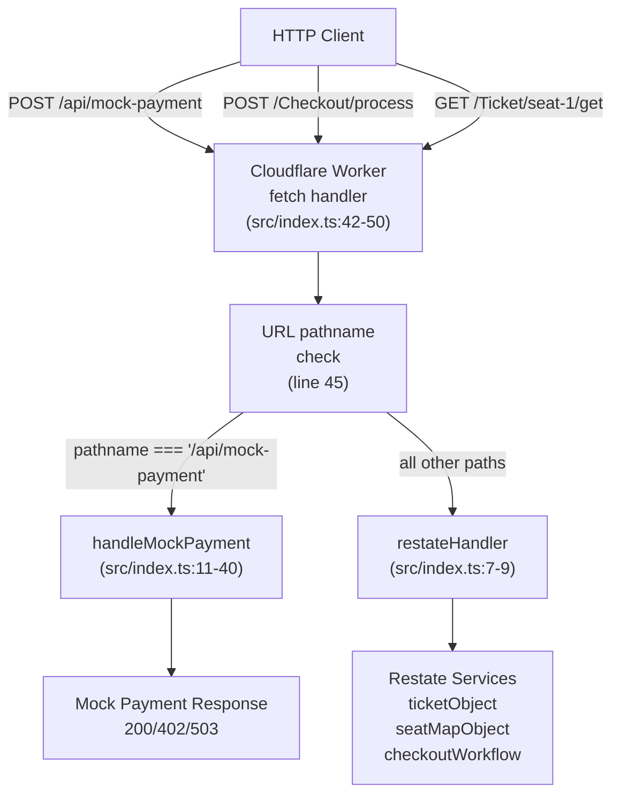
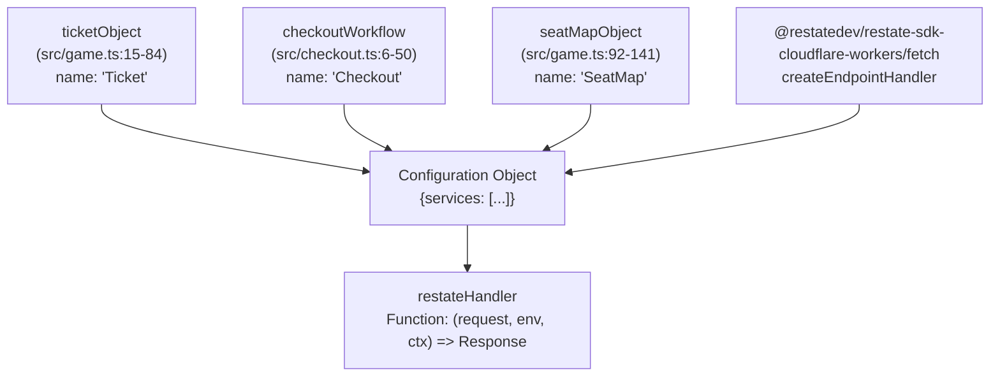
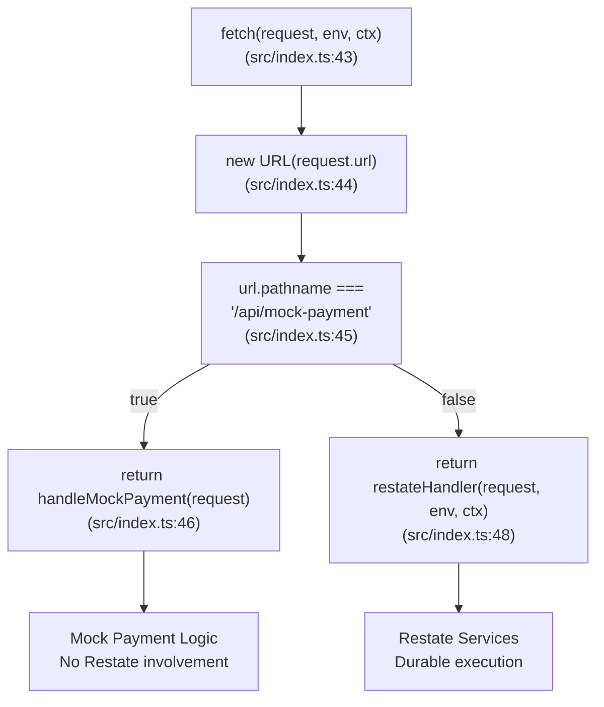
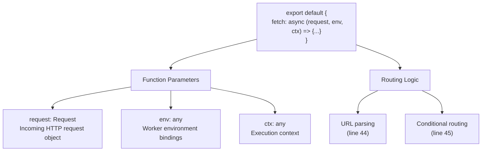
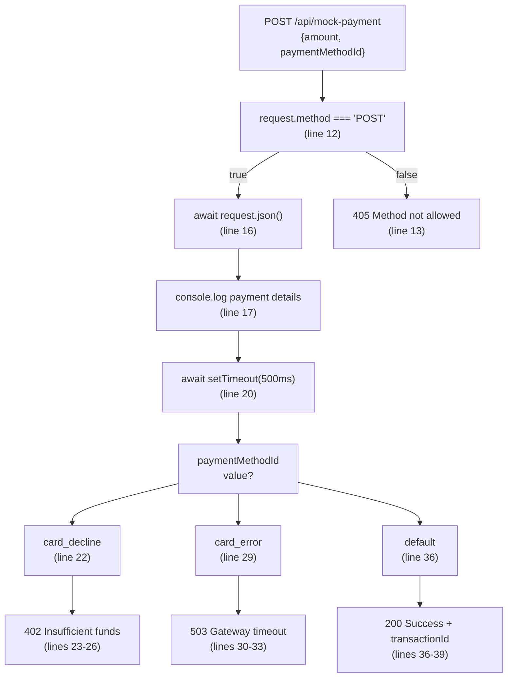

# Request Routing & Entry Point

> **Relevant source files**
> * [src/checkout.ts](https://github.com/philipz/restate-cloudflare-workers-poc/blob/513fd0f5/src/checkout.ts)
> * [src/game.ts](https://github.com/philipz/restate-cloudflare-workers-poc/blob/513fd0f5/src/game.ts)
> * [src/index.ts](https://github.com/philipz/restate-cloudflare-workers-poc/blob/513fd0f5/src/index.ts)

## Purpose and Scope

This document explains how HTTP requests enter the Cloudflare Worker and get routed to the appropriate handlers. It covers the `src/index.ts` file, which serves as the application's entry point, and details:

* The Worker's `fetch` handler that receives all incoming requests
* Service binding via `createEndpointHandler`
* Routing logic for both Restate-managed services and direct endpoints
* The `/api/mock-payment` endpoint for payment simulation

For details on individual services (Ticket, SeatMap, Checkout), see [Core Services](/philipz/restate-cloudflare-workers-poc/2-core-services). For deployment configuration, see [Wrangler Configuration](/philipz/restate-cloudflare-workers-poc/7.2-wrangler-configuration).

---

## Entry Point Architecture

The Worker's entry point is defined in [src/index.ts L1-L51](https://github.com/philipz/restate-cloudflare-workers-poc/blob/513fd0f5/src/index.ts#L1-L51)

 which exports a default object with a `fetch` method conforming to Cloudflare Workers' execution model. This handler implements a dual-routing strategy: direct routing for testing endpoints and Restate-managed routing for all durable services.

### Request Flow Overview



**Sources:** [src/index.ts L42-L50](https://github.com/philipz/restate-cloudflare-workers-poc/blob/513fd0f5/src/index.ts#L42-L50)

---

## Service Binding with createEndpointHandler

The `createEndpointHandler` function from the Restate SDK creates a request handler that binds Restate services to HTTP endpoints. This is invoked at [src/index.ts L7-L9](https://github.com/philipz/restate-cloudflare-workers-poc/blob/513fd0f5/src/index.ts#L7-L9)

### Service Binding Configuration



**Sources:** [src/index.ts L1-L9](https://github.com/philipz/restate-cloudflare-workers-poc/blob/513fd0f5/src/index.ts#L1-L9)

 [src/game.ts L15-L84](https://github.com/philipz/restate-cloudflare-workers-poc/blob/513fd0f5/src/game.ts#L15-L84)

 [src/game.ts L92-L141](https://github.com/philipz/restate-cloudflare-workers-poc/blob/513fd0f5/src/game.ts#L92-L141)

 [src/checkout.ts L6-L50](https://github.com/philipz/restate-cloudflare-workers-poc/blob/513fd0f5/src/checkout.ts#L6-L50)

### Bound Services Table

| Service Object | Type | Name | Source File | Endpoints Generated |
| --- | --- | --- | --- | --- |
| `ticketObject` | Virtual Object | `"Ticket"` | [src/game.ts L15](https://github.com/philipz/restate-cloudflare-workers-poc/blob/513fd0f5/src/game.ts#L15-L15) | `/Ticket/{key}/reserve``/Ticket/{key}/confirm``/Ticket/{key}/release``/Ticket/{key}/get` |
| `seatMapObject` | Virtual Object | `"SeatMap"` | [src/game.ts L92](https://github.com/philipz/restate-cloudflare-workers-poc/blob/513fd0f5/src/game.ts#L92-L92) | `/SeatMap/{key}/set``/SeatMap/{key}/resetAll``/SeatMap/{key}/get` |
| `checkoutWorkflow` | Service | `"Checkout"` | [src/checkout.ts L6](https://github.com/philipz/restate-cloudflare-workers-poc/blob/513fd0f5/src/checkout.ts#L6-L6) | `/Checkout/process` |

The services array at [src/index.ts L8](https://github.com/philipz/restate-cloudflare-workers-poc/blob/513fd0f5/src/index.ts#L8-L8)

 determines which Restate services are exposed by the Worker. Each service's `name` property defines the base path for its endpoints.

**Sources:** [src/index.ts L8](https://github.com/philipz/restate-cloudflare-workers-poc/blob/513fd0f5/src/index.ts#L8-L8)

 [src/game.ts L15](https://github.com/philipz/restate-cloudflare-workers-poc/blob/513fd0f5/src/game.ts#L15-L15)

 [src/game.ts L92](https://github.com/philipz/restate-cloudflare-workers-poc/blob/513fd0f5/src/game.ts#L92-L92)

 [src/checkout.ts L6](https://github.com/philipz/restate-cloudflare-workers-poc/blob/513fd0f5/src/checkout.ts#L6-L6)

---

## Request Routing Logic

The `fetch` handler at [src/index.ts L42-L50](https://github.com/philipz/restate-cloudflare-workers-poc/blob/513fd0f5/src/index.ts#L42-L50)

 implements a conditional routing strategy based on the request's URL pathname.

### Routing Decision Tree



**Sources:** [src/index.ts L42-L50](https://github.com/philipz/restate-cloudflare-workers-poc/blob/513fd0f5/src/index.ts#L42-L50)

### Routing Rules

| Path Pattern | Handler | Restate Managed | Purpose |
| --- | --- | --- | --- |
| `/api/mock-payment` | `handleMockPayment` | No | Direct endpoint for payment gateway simulation |
| `/Checkout/process` | `restateHandler` → `checkoutWorkflow.process` | Yes | Durable checkout saga orchestration |
| `/Ticket/{key}/{method}` | `restateHandler` → `ticketObject.{method}` | Yes | Virtual object handler with serialization |
| `/SeatMap/{key}/{method}` | `restateHandler` → `seatMapObject.{method}` | Yes | Virtual object handler with serialization |
| All other paths | `restateHandler` | Yes | Delegated to Restate runtime |

The routing logic ensures that the mock payment endpoint bypasses Restate's durable execution layer, allowing for fast, synchronous testing without journaling overhead.

**Sources:** [src/index.ts L42-L50](https://github.com/philipz/restate-cloudflare-workers-poc/blob/513fd0f5/src/index.ts#L42-L50)

---

## The fetch Handler Implementation

The default export at [src/index.ts L42-L50](https://github.com/philipz/restate-cloudflare-workers-poc/blob/513fd0f5/src/index.ts#L42-L50)

 conforms to the Cloudflare Workers API specification, which expects an object with a `fetch` method.



**Sources:** [src/index.ts L42-L50](https://github.com/philipz/restate-cloudflare-workers-poc/blob/513fd0f5/src/index.ts#L42-L50)

### Handler Parameters

* **`request: Request`** - Standard Web API Request object containing headers, method, URL, and body
* **`env: any`** - Cloudflare Workers environment bindings (not utilized in this implementation)
* **`ctx: any`** - Execution context for background tasks and waitUntil (passed through to `restateHandler`)

The handler delegates to `restateHandler` for all Restate-managed requests, passing all three parameters to ensure proper context propagation.

**Sources:** [src/index.ts L43](https://github.com/philipz/restate-cloudflare-workers-poc/blob/513fd0f5/src/index.ts#L43-L43)

 [src/index.ts L48](https://github.com/philipz/restate-cloudflare-workers-poc/blob/513fd0f5/src/index.ts#L48-L48)

---

## Mock Payment Endpoint

The `handleMockPayment` function at [src/index.ts L11-L40](https://github.com/philipz/restate-cloudflare-workers-poc/blob/513fd0f5/src/index.ts#L11-L40)

 provides a synchronous, non-durable endpoint for testing payment scenarios without involving the Restate runtime.

### Mock Payment Request Flow



**Sources:** [src/index.ts L11-L40](https://github.com/philipz/restate-cloudflare-workers-poc/blob/513fd0f5/src/index.ts#L11-L40)

### Payment Method Outcomes

| `paymentMethodId` | HTTP Status | Response Body | Use Case |
| --- | --- | --- | --- |
| `"card_success"` | 200 | `{success: true, transactionId: <uuid>}` | Happy path testing |
| `"card_decline"` | 402 | `{error: "Insufficient funds"}` | Saga compensation testing |
| `"card_error"` | 503 | `{error: "Gateway timeout"}` | Timeout/retry testing |

The 500ms delay at [src/index.ts L20](https://github.com/philipz/restate-cloudflare-workers-poc/blob/513fd0f5/src/index.ts#L20-L20)

 simulates network latency to payment gateways. The `crypto.randomUUID()` call at [src/index.ts L36](https://github.com/philipz/restate-cloudflare-workers-poc/blob/513fd0f5/src/index.ts#L36-L36)

 generates unique transaction IDs for successful payments.

**Sources:** [src/index.ts L11-L40](https://github.com/philipz/restate-cloudflare-workers-poc/blob/513fd0f5/src/index.ts#L11-L40)

### Why Direct Routing?

The mock payment endpoint bypasses Restate for several reasons:

1. **No durability needed** - Payment simulation is stateless and does not require journaling
2. **Testing isolation** - Allows testing payment gateway behavior without Restate infrastructure
3. **Performance** - Eliminates overhead of durable execution for a simple synchronous operation
4. **Development velocity** - Enables rapid iteration on payment scenarios without Restate server dependency

For production payment processing within the durable Checkout workflow, see the `processPayment` utility at [src/utils/payment_new.ts](https://github.com/philipz/restate-cloudflare-workers-poc/blob/513fd0f5/src/utils/payment_new.ts)

 and its integration at [src/checkout.ts L22-L28](https://github.com/philipz/restate-cloudflare-workers-poc/blob/513fd0f5/src/checkout.ts#L22-L28)

**Sources:** [src/index.ts L11-L46](https://github.com/philipz/restate-cloudflare-workers-poc/blob/513fd0f5/src/index.ts#L11-L46)

 [src/checkout.ts L22-L28](https://github.com/philipz/restate-cloudflare-workers-poc/blob/513fd0f5/src/checkout.ts#L22-L28)

---

## Initialization and Logging

The entry point includes a console log at [src/index.ts L5](https://github.com/philipz/restate-cloudflare-workers-poc/blob/513fd0f5/src/index.ts#L5-L5)

 that executes when the Worker script is first loaded:

```
"Starting worker script with createEndpointHandler..."
```

This log confirms that the module has been evaluated and the `createEndpointHandler` is being invoked. It appears in the Wrangler dev console and Cloudflare Workers logs during deployment.

**Sources:** [src/index.ts L5](https://github.com/philipz/restate-cloudflare-workers-poc/blob/513fd0f5/src/index.ts#L5-L5)

---

## Summary

The request routing architecture in `src/index.ts` implements a clean separation between:

1. **Restate-managed services** - Routed through `restateHandler`, providing durable execution, state management, and workflow orchestration
2. **Direct endpoints** - Routed to local handlers like `handleMockPayment`, providing fast, synchronous responses for testing utilities

The `createEndpointHandler` function abstracts the complexity of HTTP-to-service routing, automatically generating RESTful endpoints for each service's handlers based on their names and method signatures. This allows the Worker to expose Restate's Virtual Objects and Services as standard HTTP endpoints while maintaining the framework's durability and consistency guarantees.

**Sources:** [src/index.ts L1-L51](https://github.com/philipz/restate-cloudflare-workers-poc/blob/513fd0f5/src/index.ts#L1-L51)