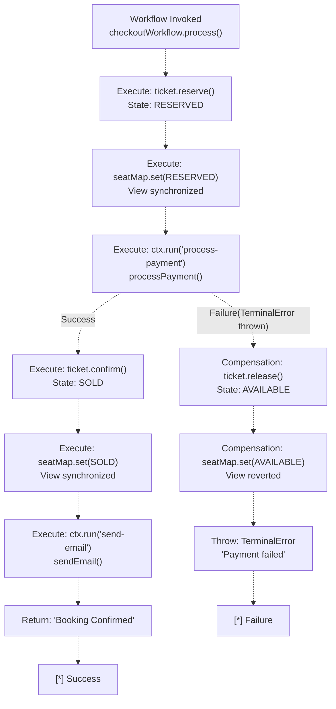

# Saga Pattern & Compensation

> **Relevant source files**
> * [README.md](https://github.com/philipz/restate-cloudflare-workers-poc/blob/513fd0f5/README.md)
> * [src/checkout.ts](https://github.com/philipz/restate-cloudflare-workers-poc/blob/513fd0f5/src/checkout.ts)
> * [src/game.ts](https://github.com/philipz/restate-cloudflare-workers-poc/blob/513fd0f5/src/game.ts)

## Purpose and Scope

This page details the Saga pattern implementation in the nexus-poc system, focusing on how distributed transactions are coordinated across Virtual Objects without traditional two-phase commit protocols. The Saga pattern enables the system to maintain consistency in multi-step booking operations while providing automatic compensation logic when failures occur.

For information about the Virtual Objects that the Saga orchestrates, see [Virtual Objects & Serialization](/philipz/restate-cloudflare-workers-poc/8.1-virtual-objects-and-serialization). For details on how the Saga achieves idempotency and replay safety, see [Durable Execution & ctx.run](/philipz/restate-cloudflare-workers-poc/8.2-durable-execution-and-ctx.run). For the complete workflow implementation, see [Checkout Workflow](/philipz/restate-cloudflare-workers-poc/2.3-checkout-workflow).

---

## Saga Pattern Overview

The nexus-poc system implements the **Saga pattern** through the `Checkout` workflow service, which orchestrates a multi-step ticket booking transaction. Unlike traditional ACID transactions that use locks across distributed systems, the Saga pattern breaks the operation into a sequence of local transactions, each with a corresponding compensation action to undo the operation if subsequent steps fail.

### Saga Structure in Nexus-PoC

The booking saga consists of the following steps:

| Step | Action | Virtual Object | Success State | Compensation Action |
| --- | --- | --- | --- | --- |
| 1 | Reserve seat | `Ticket` | `RESERVED` | Release seat → `AVAILABLE` |
| 2 | Update aggregate view | `SeatMap` | `RESERVED` | Revert view → `AVAILABLE` |
| 3 | Process payment | External gateway | Payment confirmed | N/A (already compensated by step 1) |
| 4 | Confirm booking | `Ticket` | `SOLD` | N/A (success path) |
| 5 | Update aggregate view | `SeatMap` | `SOLD` | N/A (success path) |
| 6 | Send confirmation email | Email service | Email sent | N/A (fire-and-forget) |

The critical compensation boundary exists between steps 1-2 (reservation) and step 3 (payment). If payment fails, the saga must revert the reservation to maintain system consistency.

**Sources:** [src/checkout.ts L1-L50](https://github.com/philipz/restate-cloudflare-workers-poc/blob/513fd0f5/src/checkout.ts#L1-L50)

---

## Transaction Flow

### Happy Path: Successful Booking

```mermaid
sequenceDiagram
  participant Checkout Workflow
  participant (checkoutWorkflow)
  participant Ticket Virtual Object
  participant (ticketObject)
  participant SeatMap Virtual Object
  participant (seatMapObject)
  participant Payment Gateway
  participant (processPayment)
  participant Email Service
  participant (sendEmail)

  note over Checkout Workflow,(checkoutWorkflow): "ctx.objectClient<br/>(ticketObject, ticketId)"
  Checkout Workflow->>Ticket Virtual Object: "reserve(userId)"
  Ticket Virtual Object->>Ticket Virtual Object: "state.status = 'RESERVED'
  Ticket Virtual Object-->>Checkout Workflow: state.reservedBy = userId
  Checkout Workflow->>SeatMap Virtual Object: state.reservedUntil = now + 15min"
  SeatMap Virtual Object->>SeatMap Virtual Object: "true"
  SeatMap Virtual Object-->>Checkout Workflow: "set({seatId, status: 'RESERVED'})"
  note over Checkout Workflow,(checkoutWorkflow): "ctx.run('process-payment', ...)"
  Checkout Workflow->>Payment Gateway: "map[seatId] = 'RESERVED'"
  Payment Gateway-->>Checkout Workflow: "true"
  Checkout Workflow->>Ticket Virtual Object: "processPayment(100, paymentMethodId)"
  Ticket Virtual Object->>Ticket Virtual Object: "Payment successful"
  Ticket Virtual Object-->>Checkout Workflow: "confirm()"
  Checkout Workflow->>SeatMap Virtual Object: "state.status = 'SOLD'
  SeatMap Virtual Object->>SeatMap Virtual Object: state.reservedUntil = null"
  SeatMap Virtual Object-->>Checkout Workflow: "true"
  note over Checkout Workflow,(checkoutWorkflow): "ctx.run('send-email', ...)"
  Checkout Workflow->>Email Service: "set({seatId, status: 'SOLD'})"
  Email Service-->>Checkout Workflow: "map[seatId] = 'SOLD'"
  Checkout Workflow-->>Checkout Workflow: "true"
```

**Sources:** [src/checkout.ts L9-L48](https://github.com/philipz/restate-cloudflare-workers-poc/blob/513fd0f5/src/checkout.ts#L9-L48)

 [src/game.ts L18-L42](https://github.com/philipz/restate-cloudflare-workers-poc/blob/513fd0f5/src/game.ts#L18-L42)

 [src/game.ts L45-L59](https://github.com/philipz/restate-cloudflare-workers-poc/blob/513fd0f5/src/game.ts#L45-L59)

### Failure Path: Payment Declined with Compensation

```mermaid
sequenceDiagram
  participant Checkout Workflow
  participant (checkoutWorkflow)
  participant Ticket Virtual Object
  participant (ticketObject)
  participant SeatMap Virtual Object
  participant (seatMapObject)
  participant Payment Gateway
  participant (processPayment)

  Checkout Workflow->>Ticket Virtual Object: "reserve(userId)"
  Ticket Virtual Object->>Ticket Virtual Object: "state.status = 'RESERVED'"
  Ticket Virtual Object-->>Checkout Workflow: "true"
  Checkout Workflow->>SeatMap Virtual Object: "set({seatId, status: 'RESERVED'})"
  SeatMap Virtual Object-->>Checkout Workflow: "true"
  note over Checkout Workflow,(checkoutWorkflow): "ctx.run('process-payment', ...)"
  Checkout Workflow->>Payment Gateway: "processPayment(100, 'card_decline')"
  Payment Gateway-->>Checkout Workflow: "Error: Payment declined"
  note over Checkout Workflow,(checkoutWorkflow): "catch block triggered<br/>Begin compensation"
  Checkout Workflow->>Ticket Virtual Object: "release()"
  Ticket Virtual Object->>Ticket Virtual Object: "state.status = 'AVAILABLE'
  Ticket Virtual Object-->>Checkout Workflow: state.reservedBy = null
  Checkout Workflow->>SeatMap Virtual Object: state.reservedUntil = null"
  SeatMap Virtual Object->>SeatMap Virtual Object: "true"
  SeatMap Virtual Object-->>Checkout Workflow: "set({seatId, status: 'AVAILABLE'})"
  Checkout Workflow-->>Checkout Workflow: "map[seatId] = 'AVAILABLE'"
```

**Sources:** [src/checkout.ts L20-L35](https://github.com/philipz/restate-cloudflare-workers-poc/blob/513fd0f5/src/checkout.ts#L20-L35)

 [src/game.ts L62-L74](https://github.com/philipz/restate-cloudflare-workers-poc/blob/513fd0f5/src/game.ts#L62-L74)

---

## Compensation Logic Implementation

### Code Structure

The compensation logic is implemented in the `Checkout.process` handler using a try-catch block that wraps the payment step. The structure ensures that reservation is always reverted if payment fails:

```sql
// Pseudo-code representation of src/checkout.ts:15-35
Step 1: Reserve ticket (local transaction)
Step 2: Update SeatMap view (local transaction)

try {
    Step 3: Process payment (external operation, wrapped in ctx.run)
} catch (error) {
    // COMPENSATION PATH
    Step 3a: Release ticket (undo Step 1)
    Step 3b: Revert SeatMap (undo Step 2)
    Step 3c: Throw TerminalError (signal permanent failure)
}

// If payment succeeds, continue with confirmation
Step 4: Confirm ticket as SOLD
Step 5: Update SeatMap to SOLD
Step 6: Send confirmation email
```

**Sources:** [src/checkout.ts L15-L40](https://github.com/philipz/restate-cloudflare-workers-poc/blob/513fd0f5/src/checkout.ts#L15-L40)

### Compensation Actions

The system implements two compensation actions when payment fails:

#### 1. Ticket Release

The `ticket.release()` method resets the Ticket Virtual Object to its initial state:

* **State Transition:** `RESERVED` → `AVAILABLE`
* **Field Resets:** `reservedBy` and `reservedUntil` set to `null`
* **Implementation:** [src/game.ts L62-L74](https://github.com/philipz/restate-cloudflare-workers-poc/blob/513fd0f5/src/game.ts#L62-L74)

```
// Ticket.release implementation structure
state.status = "AVAILABLE"
state.reservedBy = null
state.reservedUntil = null
ctx.set("state", state)
```

#### 2. SeatMap Reversion

The `seatMap.set()` method is called a second time to revert the aggregate view:

* **State Transition:** `map[seatId]` changes from `"RESERVED"` to `"AVAILABLE"`
* **Purpose:** Ensures the global seat availability view reflects the compensation
* **Implementation:** [src/checkout.ts L33](https://github.com/philipz/restate-cloudflare-workers-poc/blob/513fd0f5/src/checkout.ts#L33-L33)  [src/game.ts L95-L98](https://github.com/philipz/restate-cloudflare-workers-poc/blob/513fd0f5/src/game.ts#L95-L98)

**Sources:** [src/checkout.ts L29-L34](https://github.com/philipz/restate-cloudflare-workers-poc/blob/513fd0f5/src/checkout.ts#L29-L34)

 [src/game.ts L62-L74](https://github.com/philipz/restate-cloudflare-workers-poc/blob/513fd0f5/src/game.ts#L62-L74)

 [src/game.ts L95-L98](https://github.com/philipz/restate-cloudflare-workers-poc/blob/513fd0f5/src/game.ts#L95-L98)

---

## Terminal Errors and Error Propagation

### TerminalError Usage

The Saga pattern in this system uses Restate's `TerminalError` to distinguish between retriable failures (transient errors) and permanent failures that require immediate abortion. `TerminalError` signals to Restate that:

1. The workflow has permanently failed
2. No automatic retries should be attempted
3. The error should be propagated to the caller immediately

### Error Wrapping Strategy

The checkout workflow implements a two-tier error wrapping strategy:

#### Tier 1: Payment Processing (Inner Wrap)

```javascript
// src/checkout.ts:22-28
await ctx.run("process-payment", async () => {
    try {
        return await processPayment(100, paymentMethodId);
    } catch (e) {
        throw new restate.TerminalError(`Payment declined: ${(e as Error).message}`);
    }
});
```

* **Purpose:** Convert payment gateway exceptions into `TerminalError` within the durable execution context
* **Effect:** Ensures payment failures are not automatically retried by Restate

#### Tier 2: Compensation Execution (Outer Wrap)

```
// src/checkout.ts:29-35
} catch (error) {
    // Execute compensation actions
    await ticket.release();
    await seatMap.set({ seatId: ticketId, status: "AVAILABLE" });
    
    // Throw terminal error after cleanup
    throw new restate.TerminalError(`Payment failed: ${(error as Error).message}`);
}
```

* **Purpose:** Execute compensation logic before propagating the terminal error
* **Effect:** Guarantees that compensation completes before the workflow terminates

**Sources:** [src/checkout.ts L20-L35](https://github.com/philipz/restate-cloudflare-workers-poc/blob/513fd0f5/src/checkout.ts#L20-L35)

### Error Categories

The payment simulation system supports three error scenarios, each handled differently by the Saga:

| Payment Method | Error Type | Saga Behavior | Restate Action |
| --- | --- | --- | --- |
| `card_success` | None | Continue to confirmation | N/A |
| `card_decline` | `TerminalError` | Execute compensation | Abort immediately, no retry |
| `card_error` | Generic `Error` (converted to `TerminalError`) | Execute compensation | Abort immediately, no retry |

**Note:** The inner try-catch in [src/checkout.ts L23-L27](https://github.com/philipz/restate-cloudflare-workers-poc/blob/513fd0f5/src/checkout.ts#L23-L27)

 ensures that all payment errors are converted to `TerminalError`, making all payment failures non-retriable. In production systems, this design choice may differ—some payment errors (e.g., network timeouts) might warrant automatic retries before triggering compensation.

**Sources:** [src/checkout.ts L22-L28](https://github.com/philipz/restate-cloudflare-workers-poc/blob/513fd0f5/src/checkout.ts#L22-L28)

 [README.md L18-L22](https://github.com/philipz/restate-cloudflare-workers-poc/blob/513fd0f5/README.md#L18-L22)

---

## State Transition Model

### Ticket State Machine

The Saga orchestrates state transitions in the Ticket Virtual Object according to the following state machine:

```

```

**Sources:** [src/game.ts L7-L13](https://github.com/philipz/restate-cloudflare-workers-poc/blob/513fd0f5/src/game.ts#L7-L13)

 [src/game.ts L18-L74](https://github.com/philipz/restate-cloudflare-workers-poc/blob/513fd0f5/src/game.ts#L18-L74)

### Saga Execution States

The Checkout workflow progresses through the following execution states:



**Sources:** [src/checkout.ts L9-L48](https://github.com/philipz/restate-cloudflare-workers-poc/blob/513fd0f5/src/checkout.ts#L9-L48)

---

## Saga Guarantees and Limitations

### Atomicity Guarantees

The Saga pattern in this system provides **eventual consistency** with the following guarantees:

1. **Single-Seat Atomicity:** Each Ticket Virtual Object's state transitions are atomic due to Restate's serialization (see [Virtual Objects & Serialization](/philipz/restate-cloudflare-workers-poc/8.1-virtual-objects-and-serialization))
2. **Compensation Completeness:** If payment fails, compensation actions (`release()` and `set(AVAILABLE)`) always execute before the workflow terminates
3. **Idempotent Compensation:** The `release()` operation is idempotent—it can safely execute multiple times without side effects [src/game.ts L62-L74](https://github.com/philipz/restate-cloudflare-workers-poc/blob/513fd0f5/src/game.ts#L62-L74)

### Non-Guarantees

The system does **not** provide:

1. **Transactional Isolation:** Between the `reserve()` and `confirm()` steps, the seat is in the `RESERVED` state and visible to other operations (e.g., queries)
2. **Immediate Consistency:** The SeatMap view is updated separately from Ticket state, creating a brief window where the two may be inconsistent
3. **Distributed Rollback:** If the compensation step itself fails (e.g., network partition during `release()`), Restate will retry, but there's no transactional rollback across all affected objects

### Compensation Ordering

The compensation logic executes in **reverse order** of the forward operations:

```yaml
Forward:  reserve() → seatMap.set(RESERVED) → payment
Backward:            release() ← seatMap.set(AVAILABLE)
```

This ordering ensures that:

* The source of truth (`Ticket` state) is reverted first
* The aggregate view (`SeatMap`) is updated second to reflect the new truth

**Sources:** [src/checkout.ts L15-L35](https://github.com/philipz/restate-cloudflare-workers-poc/blob/513fd0f5/src/checkout.ts#L15-L35)

 [src/game.ts L62-L74](https://github.com/philipz/restate-cloudflare-workers-poc/blob/513fd0f5/src/game.ts#L62-L74)

---

## Comparison: Saga vs. Two-Phase Commit

The following table contrasts the Saga pattern implementation in nexus-poc with traditional two-phase commit (2PC) approaches:

| Aspect | Saga Pattern (nexus-poc) | Two-Phase Commit |
| --- | --- | --- |
| **Coordination** | Choreography via workflow steps | Central coordinator with prepare/commit phases |
| **Failure Handling** | Explicit compensation logic in code | Automatic rollback via transaction manager |
| **Isolation** | No isolation—states visible during execution | Full isolation until commit |
| **Performance** | High—no locks held across steps | Lower—requires distributed locks |
| **Complexity** | Developer implements compensation | Transaction manager handles rollback |
| **Implementation** | [src/checkout.ts L29-L34](https://github.com/philipz/restate-cloudflare-workers-poc/blob/513fd0f5/src/checkout.ts#L29-L34) | N/A (not used) |
| **Use Case Fit** | High-concurrency ticketing with eventual consistency | Banking systems requiring strong consistency |

The nexus-poc system intentionally uses Sagas instead of 2PC to optimize for:

* **High throughput:** No distributed locks during the 15-minute reservation window
* **Partial failure resilience:** Individual ticket reservations don't block others
* **Cloudflare Workers compatibility:** Stateless execution model aligns with Saga choreography

**Sources:** [src/checkout.ts L1-L50](https://github.com/philipz/restate-cloudflare-workers-poc/blob/513fd0f5/src/checkout.ts#L1-L50)

 [README.md L3-L16](https://github.com/philipz/restate-cloudflare-workers-poc/blob/513fd0f5/README.md#L3-L16)