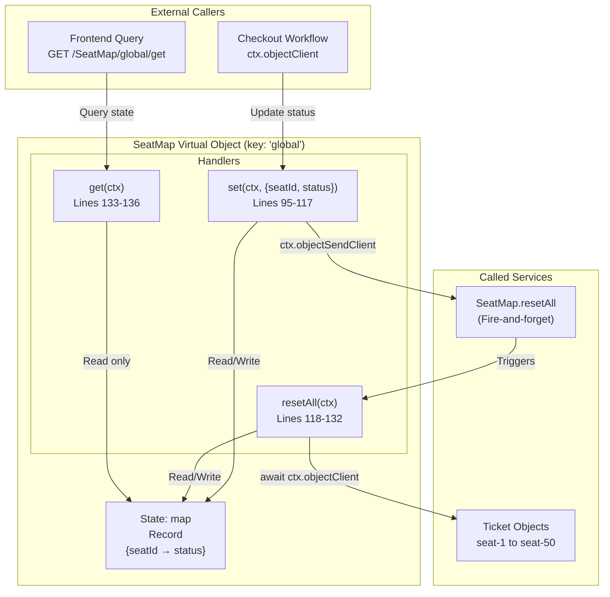
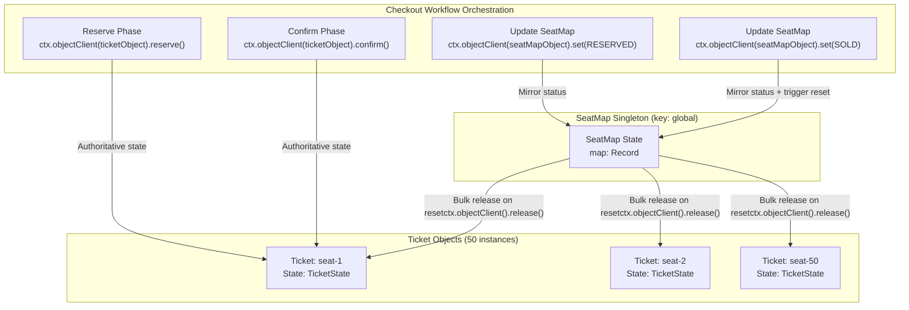
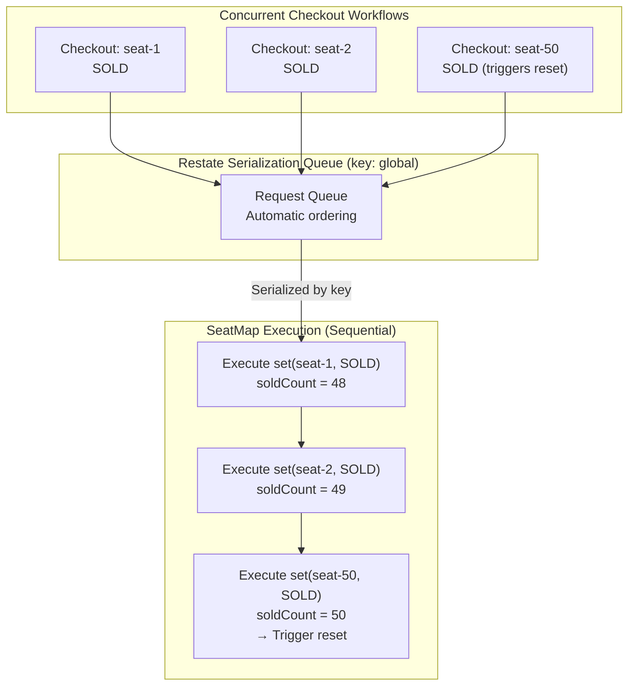

# SeatMap Virtual Object

> **Relevant source files**
> * [README.md](https://github.com/philipz/restate-cloudflare-workers-poc/blob/513fd0f5/README.md)
> * [src/game.ts](https://github.com/philipz/restate-cloudflare-workers-poc/blob/513fd0f5/src/game.ts)

## Purpose and Scope

The **SeatMap Virtual Object** provides aggregate state management for all seats in the ticketing system. It maintains a global view of seat statuses and implements an automatic reset mechanism to restart the booking cycle when all seats are sold.

This document covers the SeatMap's state structure, handler methods, and the sophisticated auto-reset mechanism. For individual seat state management and serialization guarantees, see [Ticket Virtual Object](/philipz/restate-cloudflare-workers-poc/2.1-ticket-virtual-object). For how the Checkout workflow interacts with SeatMap, see [Checkout Workflow](/philipz/restate-cloudflare-workers-poc/2.3-checkout-workflow).

**Sources:** [src/game.ts L88-L140](https://github.com/philipz/restate-cloudflare-workers-poc/blob/513fd0f5/src/game.ts#L88-L140)

 [README.md L1-L154](https://github.com/philipz/restate-cloudflare-workers-poc/blob/513fd0f5/README.md#L1-L154)

---

## Virtual Object Architecture

The SeatMap is implemented as a Restate Virtual Object using the singleton pattern. Unlike the Ticket object which has one instance per seat (keyed by `seatId`), the SeatMap has a single global instance keyed by `"global"`.

### Object Definition

```yaml
Object Name: "SeatMap"
Key: "global" (singleton)
State: map: Record<string, string>
```

The object is defined using `restate.object()` at [src/game.ts L92-L138](https://github.com/philipz/restate-cloudflare-workers-poc/blob/513fd0f5/src/game.ts#L92-L138)

 and exposes three handlers: `set`, `resetAll`, and `get`.

**Sources:** [src/game.ts L92-L140](https://github.com/philipz/restate-cloudflare-workers-poc/blob/513fd0f5/src/game.ts#L92-L140)

---

## State Structure

The SeatMap maintains a single state variable called `map` that aggregates the status of all seats.

| State Key | Type | Description |
| --- | --- | --- |
| `map` | `Record<string, string>` | Key-value pairs where keys are seat IDs (e.g., `"seat-1"`) and values are status strings (`"AVAILABLE"`, `"RESERVED"`, `"SOLD"`) |

### State Access Pattern

```javascript
const map = (await ctx.get<Record<string, string>>("map")) || {};
```

The state is retrieved using `ctx.get()` with a default empty object if no state exists yet. This pattern appears in all three handlers at [src/game.ts L96](https://github.com/philipz/restate-cloudflare-workers-poc/blob/513fd0f5/src/game.ts#L96-L96)

 [src/game.ts L122](https://github.com/philipz/restate-cloudflare-workers-poc/blob/513fd0f5/src/game.ts#L122-L122)

 and [src/game.ts L134](https://github.com/philipz/restate-cloudflare-workers-poc/blob/513fd0f5/src/game.ts#L134-L134)

**Sources:** [src/game.ts L96](https://github.com/philipz/restate-cloudflare-workers-poc/blob/513fd0f5/src/game.ts#L96-L96)

 [src/game.ts L122](https://github.com/philipz/restate-cloudflare-workers-poc/blob/513fd0f5/src/game.ts#L122-L122)

 [src/game.ts L134](https://github.com/philipz/restate-cloudflare-workers-poc/blob/513fd0f5/src/game.ts#L134-L134)

---

## Handler Methods

### Diagram: SeatMap Handlers and Data Flow



**Sources:** [src/game.ts L92-L138](https://github.com/philipz/restate-cloudflare-workers-poc/blob/513fd0f5/src/game.ts#L92-L138)

---

### set Handler

The `set` handler updates a single seat's status in the aggregate map and triggers the auto-reset mechanism when necessary.

**Signature:** `set(ctx: restate.ObjectContext, data: { seatId: string, status: string })`

**Implementation Flow:**

1. Retrieve current map state [src/game.ts L96](https://github.com/philipz/restate-cloudflare-workers-poc/blob/513fd0f5/src/game.ts#L96-L96)
2. Update the specified seat's status [src/game.ts L97](https://github.com/philipz/restate-cloudflare-workers-poc/blob/513fd0f5/src/game.ts#L97-L97)
3. Persist updated map [src/game.ts L98](https://github.com/philipz/restate-cloudflare-workers-poc/blob/513fd0f5/src/game.ts#L98-L98)
4. Count sold seats by filtering map values [src/game.ts L101](https://github.com/philipz/restate-cloudflare-workers-poc/blob/513fd0f5/src/game.ts#L101-L101)
5. If `soldCount >= 50`, trigger auto-reset [src/game.ts L102-L114](https://github.com/philipz/restate-cloudflare-workers-poc/blob/513fd0f5/src/game.ts#L102-L114)
6. Return `true` [src/game.ts L116](https://github.com/philipz/restate-cloudflare-workers-poc/blob/513fd0f5/src/game.ts#L116-L116)

**Auto-Reset Trigger Logic:**
When 50 seats reach `SOLD` status, the handler executes a two-phase reset:

* **Phase 1 (Synchronous):** Immediately update local map state to `AVAILABLE` for all 50 seats [src/game.ts L106-L109](https://github.com/philipz/restate-cloudflare-workers-poc/blob/513fd0f5/src/game.ts#L106-L109)
* **Phase 2 (Asynchronous):** Fire-and-forget call to `resetAll()` handler using `ctx.objectSendClient` [src/game.ts L113](https://github.com/philipz/restate-cloudflare-workers-poc/blob/513fd0f5/src/game.ts#L113-L113)

This design prioritizes fast response times—the client receives success immediately after the local map update, while the Ticket object cleanup happens asynchronously.

**Sources:** [src/game.ts L95-L117](https://github.com/philipz/restate-cloudflare-workers-poc/blob/513fd0f5/src/game.ts#L95-L117)

---

### resetAll Handler

The `resetAll` handler performs the complete asynchronous reset of all seats, including both the SeatMap state and all individual Ticket objects.

**Signature:** `resetAll(ctx: restate.ObjectContext)`

**Implementation Flow:**

1. Log reset execution [src/game.ts L119](https://github.com/philipz/restate-cloudflare-workers-poc/blob/513fd0f5/src/game.ts#L119-L119)
2. Retrieve current map state [src/game.ts L122](https://github.com/philipz/restate-cloudflare-workers-poc/blob/513fd0f5/src/game.ts#L122-L122)
3. Reset all 50 seat entries in local map to `AVAILABLE` [src/game.ts L123-L125](https://github.com/philipz/restate-cloudflare-workers-poc/blob/513fd0f5/src/game.ts#L123-L125)
4. Persist updated map [src/game.ts L126](https://github.com/philipz/restate-cloudflare-workers-poc/blob/513fd0f5/src/game.ts#L126-L126)
5. Iterate through seats 1-50, calling `release()` on each Ticket object [src/game.ts L129-L131](https://github.com/philipz/restate-cloudflare-workers-poc/blob/513fd0f5/src/game.ts#L129-L131)

**Ticket Release Pattern:**

```javascript
for (let i = 1; i <= 50; i++) {
    await ctx.objectClient(ticketObject, `seat-${i}`).release();
}
```

Each `ctx.objectClient()` call is awaited, ensuring all Ticket objects are successfully released before the handler completes. This differs from the fire-and-forget `ctx.objectSendClient()` used to trigger `resetAll` itself.

**Sources:** [src/game.ts L118-L132](https://github.com/philipz/restate-cloudflare-workers-poc/blob/513fd0f5/src/game.ts#L118-L132)

---

### get Handler

The `get` handler provides read-only access to the current seat map for frontend queries.

**Signature:** `get(ctx: restate.ObjectContext)`

**Return Type:** `Array<{ id: string, status: string }>`

**Implementation:**

1. Retrieve map state [src/game.ts L134](https://github.com/philipz/restate-cloudflare-workers-poc/blob/513fd0f5/src/game.ts#L134-L134)
2. Transform object entries to array format using `Object.entries().map()` [src/game.ts L135](https://github.com/philipz/restate-cloudflare-workers-poc/blob/513fd0f5/src/game.ts#L135-L135)

**Example Response:**

```json
[
  { "id": "seat-1", "status": "AVAILABLE" },
  { "id": "seat-2", "status": "RESERVED" },
  { "id": "seat-3", "status": "SOLD" }
]
```

**Sources:** [src/game.ts L133-L136](https://github.com/philipz/restate-cloudflare-workers-poc/blob/513fd0f5/src/game.ts#L133-L136)

---

## Auto-Reset Mechanism

The auto-reset mechanism is a sophisticated orchestration pattern that coordinates state updates across the SeatMap singleton and 50 individual Ticket objects.

### Diagram: Auto-Reset Sequence Flow

```mermaid
sequenceDiagram
  participant Checkout Workflow
  participant SeatMap.set()
  participant (key: global)
  participant SeatMap State
  participant (map)
  participant SeatMap.resetAll()
  participant (async invocation)
  participant Ticket: seat-1
  participant Ticket: seat-50

  note over Checkout Workflow,Ticket: seat-50: Seat 50 Gets Sold (Triggering Reset)
  Checkout Workflow->>SeatMap.set(): set({seatId: "seat-50", status: "SOLD"})
  SeatMap.set()->>SeatMap State: Read map
  SeatMap.set()->>SeatMap State: map["seat-50"] = "SOLD"
  SeatMap.set()->>SeatMap State: Write map
  SeatMap.set()->>SeatMap.set(): Count SOLD: 50 seats
  note over SeatMap.set(),(key: global): soldCount >= 50 detected
  SeatMap.set()->>SeatMap State: Reset map["seat-1" to "seat-50"] = "AVAILABLE"
  SeatMap.set()->>SeatMap State: Write map
  SeatMap.set()->>SeatMap.resetAll(): ctx.objectSendClient().resetAll()
  SeatMap.set()-->>Checkout Workflow: (Fire-and-forget)
  note over SeatMap.resetAll(),Ticket: seat-50: Asynchronous Cleanup Phase
  SeatMap.resetAll()->>SeatMap State: Return true (immediate response)
  SeatMap.resetAll()->>SeatMap State: Read map
  SeatMap.resetAll()->>SeatMap State: Reset all entries to "AVAILABLE"
  loop For i = 1 to 50
    SeatMap.resetAll()->>Ticket: seat-1: Write map
    Ticket: seat-1->>Ticket: seat-1: ctx.objectClient().release()
    Ticket: seat-1-->>SeatMap.resetAll(): (Awaited RPC)
  end
  SeatMap.resetAll()->>Ticket: seat-50: Set status = "AVAILABLE"
  Ticket: seat-50->>Ticket: seat-50: Clear reservedBy, reservedUntil
  Ticket: seat-50-->>SeatMap.resetAll(): Success
```

**Sources:** [src/game.ts L100-L114](https://github.com/philipz/restate-cloudflare-workers-poc/blob/513fd0f5/src/game.ts#L100-L114)

 [src/game.ts L118-L132](https://github.com/philipz/restate-cloudflare-workers-poc/blob/513fd0f5/src/game.ts#L118-L132)

---

### Reset Phase Breakdown

| Phase | Execution Model | Location | Purpose |
| --- | --- | --- | --- |
| **Phase 1: Immediate Map Update** | Synchronous | [src/game.ts L106-L109](https://github.com/philipz/restate-cloudflare-workers-poc/blob/513fd0f5/src/game.ts#L106-L109) | Update SeatMap state before returning to client; ensures frontend immediately sees available seats |
| **Phase 2: Fire-and-Forget Trigger** | Asynchronous | [src/game.ts L113](https://github.com/philipz/restate-cloudflare-workers-poc/blob/513fd0f5/src/game.ts#L113-L113) | Invoke `resetAll()` handler without blocking client response |
| **Phase 3: Ticket Cleanup** | Asynchronous (awaited internally) | [src/game.ts L129-L131](https://github.com/philipz/restate-cloudflare-workers-poc/blob/513fd0f5/src/game.ts#L129-L131) | Release all 50 Ticket objects sequentially using awaited RPC calls |

### Fire-and-Forget vs Awaited Calls

The reset mechanism uses two different invocation patterns:

**ctx.objectSendClient (Fire-and-Forget):**

```
ctx.objectSendClient(seatMapObject, "global").resetAll();
```

Used at [src/game.ts L113](https://github.com/philipz/restate-cloudflare-workers-poc/blob/513fd0f5/src/game.ts#L113-L113)

 to trigger `resetAll()` without waiting for completion. The `set` handler returns immediately, providing fast response to the client.

**ctx.objectClient (Awaited RPC):**

```
await ctx.objectClient(ticketObject, `seat-${i}`).release();
```

Used at [src/game.ts L130](https://github.com/philipz/restate-cloudflare-workers-poc/blob/513fd0f5/src/game.ts#L130-L130)

 within `resetAll()` to ensure each Ticket's state is successfully reset before proceeding. This guarantees consistency between SeatMap and Ticket states.

**Sources:** [src/game.ts L113](https://github.com/philipz/restate-cloudflare-workers-poc/blob/513fd0f5/src/game.ts#L113-L113)

 [src/game.ts L130](https://github.com/philipz/restate-cloudflare-workers-poc/blob/513fd0f5/src/game.ts#L130-L130)

---

## Integration with Ticket Objects

The SeatMap maintains aggregate state but does not directly control individual seat reservations. It coordinates with Ticket objects through defined interaction patterns.

### Diagram: SeatMap-Ticket Interaction Model



**Sources:** [src/game.ts L129-L131](https://github.com/philipz/restate-cloudflare-workers-poc/blob/513fd0f5/src/game.ts#L129-L131)

---

### Relationship Principles

1. **Ticket Objects are Authoritative:** The Ticket object holds the source of truth for individual seat state (see [Ticket Virtual Object](/philipz/restate-cloudflare-workers-poc/2.1-ticket-virtual-object)). The SeatMap mirrors this state for aggregate queries.
2. **Checkout Workflow Orchestrates Updates:** The Checkout workflow is responsible for calling both `Ticket.reserve()`/`Ticket.confirm()` and `SeatMap.set()` in sequence (see [Checkout Workflow](/philipz/restate-cloudflare-workers-poc/2.3-checkout-workflow)).
3. **SeatMap Initiates Bulk Operations:** The only exception is the auto-reset mechanism, where SeatMap calls `Ticket.release()` on all 50 seats [src/game.ts L130](https://github.com/philipz/restate-cloudflare-workers-poc/blob/513fd0f5/src/game.ts#L130-L130)
4. **No Direct Ticket-to-SeatMap Communication:** Ticket objects never call SeatMap handlers. Updates flow unidirectionally from Checkout → Ticket → SeatMap (via Checkout).

**Sources:** [src/game.ts L129-L131](https://github.com/philipz/restate-cloudflare-workers-poc/blob/513fd0f5/src/game.ts#L129-L131)

---

## Concurrency and Serialization

The SeatMap uses the singleton pattern with key `"global"`, which means all requests to the SeatMap handlers are automatically serialized by Restate.

### Serialization Guarantee

```
All concurrent requests to SeatMap handlers execute sequentially against the same instance.
```

This serialization provides:

* **Read-Modify-Write Safety:** The `set` handler's read-update-write operation on the map [src/game.ts L96-L98](https://github.com/philipz/restate-cloudflare-workers-poc/blob/513fd0f5/src/game.ts#L96-L98)  is atomic without explicit locks.
* **Consistent Sold Count:** The filter operation counting sold seats [src/game.ts L101](https://github.com/philipz/restate-cloudflare-workers-poc/blob/513fd0f5/src/game.ts#L101-L101)  always sees a consistent snapshot of the map.
* **Deterministic Reset Trigger:** Only one request can detect `soldCount >= 50` and trigger the reset.

### Diagram: Concurrent Set Requests Serialization



**Sources:** [src/game.ts L92](https://github.com/philipz/restate-cloudflare-workers-poc/blob/513fd0f5/src/game.ts#L92-L92)

 [src/game.ts L101-L102](https://github.com/philipz/restate-cloudflare-workers-poc/blob/513fd0f5/src/game.ts#L101-L102)

---

## Performance Considerations

### Fast Client Response

The two-phase reset design prioritizes client experience:

* **Client Wait Time:** Only includes map update operation [src/game.ts L106-L109](https://github.com/philipz/restate-cloudflare-workers-poc/blob/513fd0f5/src/game.ts#L106-L109)  and fire-and-forget invocation [src/game.ts L113](https://github.com/philipz/restate-cloudflare-workers-poc/blob/513fd0f5/src/game.ts#L113-L113)
* **Background Processing:** Bulk Ticket release happens asynchronously in `resetAll()` [src/game.ts L129-L131](https://github.com/philipz/restate-cloudflare-workers-poc/blob/513fd0f5/src/game.ts#L129-L131)

### Bulk Operation Cost

The `resetAll()` handler makes 50 sequential RPC calls to Ticket objects. Each call:

* Uses `await ctx.objectClient()`, waiting for completion before proceeding
* Is durably recorded in Restate's journal for replay safety
* May experience varying latency based on Ticket object state

**Total Reset Time:** `O(50 × average_ticket_release_time)`

This sequential approach ensures consistency but trades throughput for safety. Parallel releases could be implemented using `ctx.objectSendClient()` if eventual consistency is acceptable.

**Sources:** [src/game.ts L129-L131](https://github.com/philipz/restate-cloudflare-workers-poc/blob/513fd0f5/src/game.ts#L129-L131)

---

## Type Exports

The SeatMap object is exported with a TypeScript type for use in other modules:

```javascript
export type SeatMapObject = typeof seatMapObject;
```

This type is used by the Checkout workflow and index router to obtain properly-typed client references when invoking SeatMap handlers via `ctx.objectClient(seatMapObject, "global")`.

**Sources:** [src/game.ts L140](https://github.com/philipz/restate-cloudflare-workers-poc/blob/513fd0f5/src/game.ts#L140-L140)