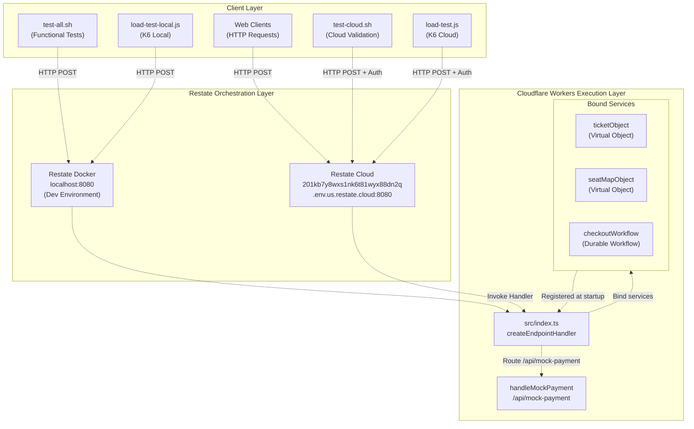
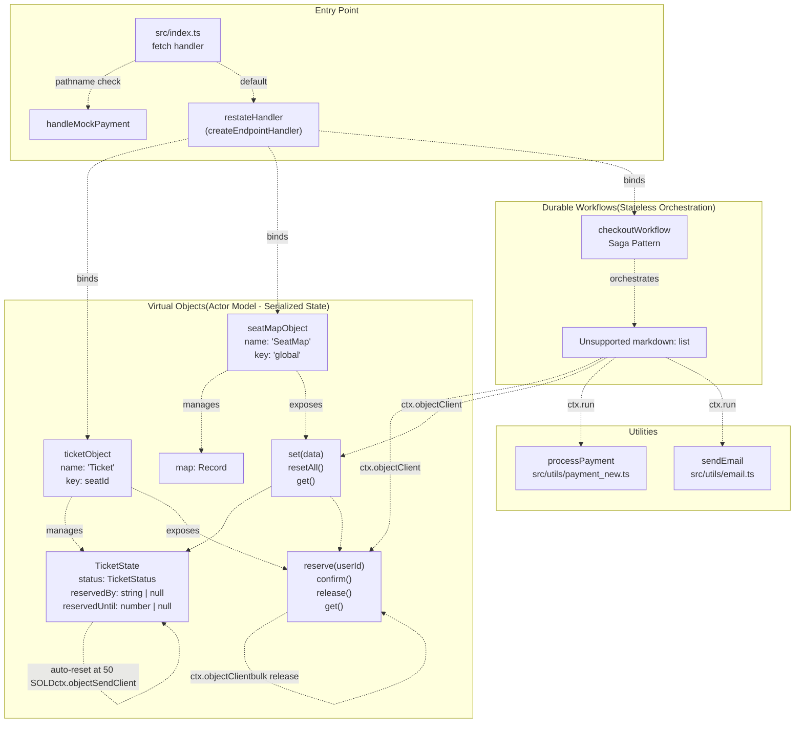
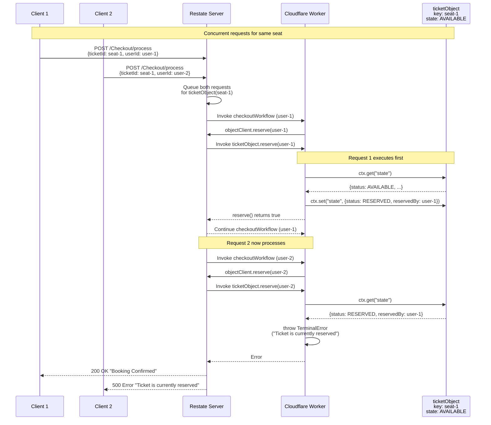

# System Architecture

> **Relevant source files**
> * [PoC.md](https://github.com/philipz/restate-cloudflare-workers-poc/blob/513fd0f5/PoC.md)
> * [README.md](https://github.com/philipz/restate-cloudflare-workers-poc/blob/513fd0f5/README.md)
> * [src/game.ts](https://github.com/philipz/restate-cloudflare-workers-poc/blob/513fd0f5/src/game.ts)
> * [src/index.ts](https://github.com/philipz/restate-cloudflare-workers-poc/blob/513fd0f5/src/index.ts)

## Purpose and Scope

This document describes the multi-tier architecture of the nexus-poc system, explaining how Restate's orchestration layer integrates with Cloudflare Workers to enable durable execution of ticketing workflows. The architecture is organized into three primary layers: the client layer, the Restate orchestration layer, and the Cloudflare Workers execution layer.

This page focuses on the structural organization and communication patterns between these layers. For details on the specific technologies and frameworks used, see [Technology Stack](/philipz/restate-cloudflare-workers-poc/1.2-technology-stack). For implementation details of individual services, see [Core Services](/philipz/restate-cloudflare-workers-poc/2-core-services).

## Architectural Overview

The nexus-poc system implements a serverless architecture where Cloudflare Workers provide stateless compute and Restate provides stateful orchestration. The separation of concerns follows this pattern:

| Layer | Responsibility | Persistence | Scalability Model |
| --- | --- | --- | --- |
| **Client Layer** | Request initiation, testing, load generation | None | Client-controlled concurrency |
| **Restate Orchestration** | Request routing, state management, execution journaling, retry coordination | Durable (RocksDB-backed) | Horizontal (cluster sharding by key) |
| **Cloudflare Workers** | Business logic execution, service handlers | Ephemeral (context only) | Automatic (edge distribution) |

Sources: [README.md L5-L17](https://github.com/philipz/restate-cloudflare-workers-poc/blob/513fd0f5/README.md#L5-L17)

 [PoC.md L11-L13](https://github.com/philipz/restate-cloudflare-workers-poc/blob/513fd0f5/PoC.md#L11-L13)

## Three-Layer Architecture



**Architecture Diagram: Client to Worker Flow**

This diagram shows how client requests flow through the Restate orchestration layer before reaching the Cloudflare Worker. The `createEndpointHandler` in `src/index.ts` binds three services (`ticketObject`, `seatMapObject`, `checkoutWorkflow`) and routes mock payment requests locally.

Sources: [src/index.ts L1-L50](https://github.com/philipz/restate-cloudflare-workers-poc/blob/513fd0f5/src/index.ts#L1-L50)

 [README.md L24-L48](https://github.com/philipz/restate-cloudflare-workers-poc/blob/513fd0f5/README.md#L24-L48)

## Client Layer

The client layer consists of multiple request sources:

* **Web Clients**: End-user HTTP clients making booking requests to the Restate ingress URL
* **Functional Tests**: `test-all.sh` and `test-cloud.sh` scripts that execute scenario-based validation
* **Load Tests**: K6 scripts (`load-test-local.js`, `load-test.js`) that simulate concurrent user traffic with configurable VUs and duration

All client requests target Restate endpoints, not the Cloudflare Worker directly. The Worker is invoked only by Restate's orchestration engine.

Sources: [README.md L66-L144](https://github.com/philipz/restate-cloudflare-workers-poc/blob/513fd0f5/README.md#L66-L144)

## Restate Orchestration Layer

The Restate layer serves as the system's control plane, providing:

### Local Development Mode

* **Deployment**: Docker container running Restate server
* **Endpoint**: `localhost:8080` (HTTP), `localhost:9070` (Admin API)
* **Authentication**: None required
* **Use Case**: Development and local testing

### Cloud Production Mode

* **Deployment**: Managed Restate Cloud service
* **Environment ID**: `nexus-poc`
* **Endpoint**: `https://201kb7y8wxs1nk6t81wyx88dn2q.env.us.restate.cloud:8080`
* **Authentication**: Required via `RESTATE_AUTH_TOKEN` environment variable
* **Use Case**: Production deployment and load testing

### Service Registration

After deploying a Cloudflare Worker, it must be registered with Restate:

```css
# Local registration
curl -X POST http://localhost:9070/deployments \
  -H "Content-Type: application/json" \
  -d '{"uri": "https://nexus-poc.philipz.workers.dev"}'

# Cloud registration
restate -e nexus-poc deployments register https://nexus-poc.philipz.workers.dev
```

The registration process causes Restate to query the Worker's discovery endpoint and store the service definitions (names, handlers, schemas).

Sources: [README.md L31-L64](https://github.com/philipz/restate-cloudflare-workers-poc/blob/513fd0f5/README.md#L31-L64)

 [PoC.md L296-L304](https://github.com/philipz/restate-cloudflare-workers-poc/blob/513fd0f5/PoC.md#L296-L304)

## Cloudflare Workers Execution Layer

The execution layer hosts all business logic within a single Cloudflare Worker. The worker is structured as follows:

### Entry Point: src/index.ts

The `fetch` handler in [src/index.ts L42-L50](https://github.com/philipz/restate-cloudflare-workers-poc/blob/513fd0f5/src/index.ts#L42-L50)

 implements request routing:

```javascript
export default {
    fetch: async (request: Request, env: any, ctx: any) => {
        const url = new URL(request.url);
        if (url.pathname === "/api/mock-payment") {
            return handleMockPayment(request);
        }
        return restateHandler(request, env, ctx);
    },
};
```

This routing logic separates:

* **Direct routes**: `/api/mock-payment` handled by `handleMockPayment` function [src/index.ts L11-L40](https://github.com/philipz/restate-cloudflare-workers-poc/blob/513fd0f5/src/index.ts#L11-L40)
* **Restate routes**: All other paths handled by `restateHandler` created via `createEndpointHandler`

### Service Binding

The `restateHandler` binds three Restate services [src/index.ts L7-L9](https://github.com/philipz/restate-cloudflare-workers-poc/blob/513fd0f5/src/index.ts#L7-L9)

:

```javascript
const restateHandler = createEndpointHandler({
    services: [ticketObject, checkoutWorkflow, seatMapObject],
});
```

These services are imported from:

* `ticketObject` from [src/game.ts L15-L84](https://github.com/philipz/restate-cloudflare-workers-poc/blob/513fd0f5/src/game.ts#L15-L84)
* `seatMapObject` from [src/game.ts L92-L138](https://github.com/philipz/restate-cloudflare-workers-poc/blob/513fd0f5/src/game.ts#L92-L138)
* `checkoutWorkflow` (referenced but source file not shown in provided files)

Sources: [src/index.ts L1-L50](https://github.com/philipz/restate-cloudflare-workers-poc/blob/513fd0f5/src/index.ts#L1-L50)

## Service Architecture and Component Interaction



**Service Component Diagram**

This diagram maps the code structure to runtime behavior. Virtual Objects (`ticketObject`, `seatMapObject`) maintain durable state and expose handlers that the `checkoutWorkflow` orchestrates using `ctx.objectClient` for RPC calls and `ctx.run` for side effects.

Sources: [src/index.ts L1-L50](https://github.com/philipz/restate-cloudflare-workers-poc/blob/513fd0f5/src/index.ts#L1-L50)

 [src/game.ts L1-L141](https://github.com/philipz/restate-cloudflare-workers-poc/blob/513fd0f5/src/game.ts#L1-L141)

 [README.md L145-L154](https://github.com/philipz/restate-cloudflare-workers-poc/blob/513fd0f5/README.md#L145-L154)

## Virtual Objects vs Durable Workflows

The architecture distinguishes between two Restate service types:

### Virtual Objects

Defined using `restate.object()` [src/game.ts L15](https://github.com/philipz/restate-cloudflare-workers-poc/blob/513fd0f5/src/game.ts#L15-L15)

 [src/game.ts L92](https://github.com/philipz/restate-cloudflare-workers-poc/blob/513fd0f5/src/game.ts#L92-L92)

**Characteristics**:

* **State management**: Each object instance (identified by a unique key) has durable state accessed via `ctx.get()` and `ctx.set()`
* **Concurrency control**: Requests to the same object key are automatically serialized by Restate, preventing race conditions
* **Actor model**: Each seat ID gets its own `Ticket` instance; the `SeatMap` uses a singleton key `"global"`

**Example - Ticket Object**:

* State schema: `TicketState` with fields `status`, `reservedBy`, `reservedUntil` [src/game.ts L9-L13](https://github.com/philipz/restate-cloudflare-workers-poc/blob/513fd0f5/src/game.ts#L9-L13)
* Handlers: `reserve`, `confirm`, `release`, `get` [src/game.ts L18-L83](https://github.com/philipz/restate-cloudflare-workers-poc/blob/513fd0f5/src/game.ts#L18-L83)
* Key: Individual seat IDs (e.g., `"seat-1"`, `"seat-42"`)

**Example - SeatMap Object**:

* State schema: `map: Record<string, string>` [src/game.ts L96](https://github.com/philipz/restate-cloudflare-workers-poc/blob/513fd0f5/src/game.ts#L96-L96)
* Handlers: `set`, `resetAll`, `get` [src/game.ts L95-L137](https://github.com/philipz/restate-cloudflare-workers-poc/blob/513fd0f5/src/game.ts#L95-L137)
* Key: Single global key `"global"`
* Special behavior: Auto-reset mechanism at 50 sold tickets [src/game.ts L101-L114](https://github.com/philipz/restate-cloudflare-workers-poc/blob/513fd0f5/src/game.ts#L101-L114)

### Durable Workflows

Defined using `restate.workflow()` or `restate.service()` (imported as `checkoutWorkflow`)

**Characteristics**:

* **Stateless orchestration**: No persistent state beyond the execution journal
* **Saga pattern**: Coordinates multi-step transactions with compensation logic
* **Idempotent execution**: Uses `ctx.run()` to wrap non-deterministic operations

**Workflow Pattern**:

1. Call `ctx.objectClient(ticketObject, seatId).reserve(userId)` - RPC to Virtual Object
2. Execute `ctx.run("process-payment", () => processPayment(...))` - Wrapped side effect
3. On success: Call `ctx.objectClient(ticketObject, seatId).confirm()`
4. On failure: Call `ctx.objectClient(ticketObject, seatId).release()` - Compensation

Sources: [src/game.ts L1-L141](https://github.com/philipz/restate-cloudflare-workers-poc/blob/513fd0f5/src/game.ts#L1-L141)

 [README.md L11-L17](https://github.com/philipz/restate-cloudflare-workers-poc/blob/513fd0f5/README.md#L11-L17)

 [PoC.md L76-L90](https://github.com/philipz/restate-cloudflare-workers-poc/blob/513fd0f5/PoC.md#L76-L90)

## Request Flow Architecture

### Successful Booking Flow

| Step | Component | Operation | Restate Mechanism |
| --- | --- | --- | --- |
| 1 | Client | POST to `/Checkout/process` with ticketId, userId, paymentMethodId | Ingress routing |
| 2 | Restate | Route to `checkoutWorkflow`, create invocation ID | Journal initialization |
| 3 | `checkoutWorkflow` | `ctx.objectClient(ticketObject, ticketId).reserve(userId)` | RPC call, journaled |
| 4 | `ticketObject` | Check state, transition AVAILABLE→RESERVED, `ctx.set("state", ...)` | Serialized execution |
| 5 | `checkoutWorkflow` | `ctx.objectClient(seatMapObject, "global").set({seatId, status: "RESERVED"})` | RPC call |
| 6 | `seatMapObject` | Update map, check soldCount | Aggregate state update |
| 7 | `checkoutWorkflow` | `ctx.run("process-payment", () => processPayment(...))` | Idempotent wrapper |
| 8 | `processPayment` | Simulate payment delay, return success/failure | External side effect |
| 9 | `checkoutWorkflow` | `ctx.objectClient(ticketObject, ticketId).confirm()` | RPC call |
| 10 | `ticketObject` | Transition RESERVED→SOLD | State finalization |
| 11 | `checkoutWorkflow` | `ctx.run("send-email", () => sendEmail(...))` | Fire-and-forget |
| 12 | Restate | Return response to client | Invocation completion |

### Failure and Compensation Flow

When payment fails (e.g., `paymentMethodId: "card_decline"`):

1. Step 8 throws an error after `processPayment` returns 402
2. `checkoutWorkflow` catches the error
3. Compensation: `ctx.objectClient(ticketObject, ticketId).release()`
4. Ticket state transitions RESERVED→AVAILABLE
5. `seatMapObject.set({seatId, status: "AVAILABLE"})` updates aggregate
6. `checkoutWorkflow` throws `TerminalError` to signal permanent failure

Sources: [README.md L66-L84](https://github.com/philipz/restate-cloudflare-workers-poc/blob/513fd0f5/README.md#L66-L84)

 [PoC.md L162-L212](https://github.com/philipz/restate-cloudflare-workers-poc/blob/513fd0f5/PoC.md#L162-L212)

## Concurrency Control and Serialization



**Concurrency Control Diagram**

This diagram shows how Restate's Virtual Object serialization prevents race conditions. Requests for the same `ticketObject` key are queued and executed sequentially, ensuring the second request sees the state changes from the first.

Sources: [src/game.ts L18-L43](https://github.com/philipz/restate-cloudflare-workers-poc/blob/513fd0f5/src/game.ts#L18-L43)

 [PoC.md L94-L131](https://github.com/philipz/restate-cloudflare-workers-poc/blob/513fd0f5/PoC.md#L94-L131)

## Mock Payment Endpoint

The worker includes a special endpoint `handleMockPayment` [src/index.ts L11-L40](https://github.com/philipz/restate-cloudflare-workers-poc/blob/513fd0f5/src/index.ts#L11-L40)

 that simulates payment gateway behavior without going through Restate. This endpoint:

* Accepts POST requests to `/api/mock-payment`
* Takes `{amount: number, paymentMethodId: string}` as input
* Simulates 500ms processing delay
* Returns different responses based on payment method: * `card_success`: 200 OK with transaction ID * `card_decline`: 402 Payment Required * `card_error`: 503 Service Unavailable

This endpoint exists for testing purposes and demonstrates that the Worker can handle both Restate-orchestrated requests and direct HTTP requests using path-based routing.

Sources: [src/index.ts L11-L50](https://github.com/philipz/restate-cloudflare-workers-poc/blob/513fd0f5/src/index.ts#L11-L50)

## Deployment Topology

The system supports two deployment configurations:

### Local Development

```
[Developer Machine]
  ├─ Docker: Restate Server (localhost:8080)
  ├─ npm: wrangler dev or miniflare
  └─ Test Scripts: test-all.sh, load-test-local.js
```

Wrangler can be configured to serve the Worker locally, but it must register its public URL (from `wrangler deploy` or a tunnel) with Restate for proper integration.

### Cloud Production

```
[Cloudflare Global Network]
  └─ Worker: nexus-poc.philipz.workers.dev
       ↓
[Restate Cloud]
  └─ Environment: nexus-poc
       └─ Ingress: 201kb7y8wxs1nk6t81wyx88dn2q.env.us.restate.cloud:8080
```

The Worker is deployed to Cloudflare's edge network and registered with Restate Cloud. All client traffic goes through the Restate Cloud ingress URL, which then invokes the Worker.

Sources: [README.md L24-L64](https://github.com/philipz/restate-cloudflare-workers-poc/blob/513fd0f5/README.md#L24-L64)

## State Persistence Model

| Component | State Location | Persistence Mechanism | Consistency Guarantee |
| --- | --- | --- | --- |
| `ticketObject` | Restate KV Store | Written on handler completion via `ctx.set()` | Serializable per key |
| `seatMapObject` | Restate KV Store | Written on handler completion via `ctx.set()` | Serializable (singleton key) |
| `checkoutWorkflow` | Execution Journal | Appended on each `ctx.run()`, `ctx.objectClient()` call | Replay-safe (deterministic) |
| Cloudflare Worker | None (stateless) | Execution context only, discarded after response | Ephemeral |

The Restate orchestration layer provides durability. Even if the Cloudflare Worker crashes mid-execution, Restate will replay the workflow from the journal, skipping already-completed steps.

Sources: [PoC.md L15-L18](https://github.com/philipz/restate-cloudflare-workers-poc/blob/513fd0f5/PoC.md#L15-L18)

 [PoC.md L152-L156](https://github.com/philipz/restate-cloudflare-workers-poc/blob/513fd0f5/PoC.md#L152-L156)