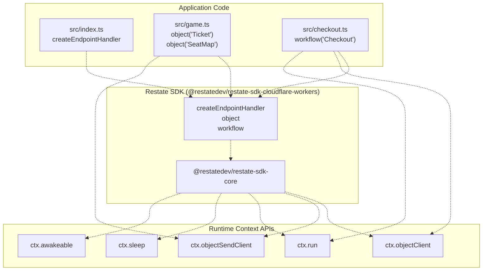
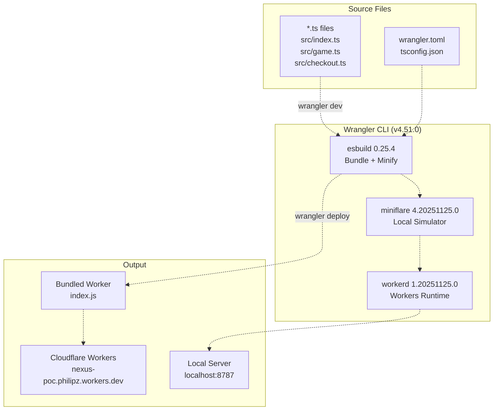
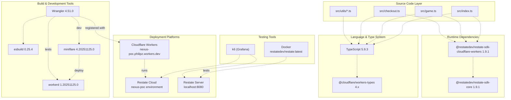

# Technology Stack

> **Relevant source files**
> * [README.md](https://github.com/philipz/restate-cloudflare-workers-poc/blob/513fd0f5/README.md)
> * [package-lock.json](https://github.com/philipz/restate-cloudflare-workers-poc/blob/513fd0f5/package-lock.json)
> * [package.json](https://github.com/philipz/restate-cloudflare-workers-poc/blob/513fd0f5/package.json)
> * [wrangler.toml](https://github.com/philipz/restate-cloudflare-workers-poc/blob/513fd0f5/wrangler.toml)

This document details the core technologies, dependencies, and tooling used in the nexus-poc system. It covers the runtime dependencies required for durable execution, development tools for building and deploying the Cloudflare Worker, and the platforms that host the services.

For information about system architecture and how these technologies fit together, see [System Architecture](/philipz/restate-cloudflare-workers-poc/1.1-system-architecture). For deployment procedures using these technologies, see [Development & Deployment](/philipz/restate-cloudflare-workers-poc/6-development-and-deployment).

---

## Overview

The technology stack is built on three foundational layers:

| Layer | Technologies | Purpose |
| --- | --- | --- |
| **Runtime** | Restate SDK for Cloudflare Workers | Durable execution, state management, workflow orchestration |
| **Development** | TypeScript, Wrangler, esbuild | Type safety, local development, bundling, deployment |
| **Platforms** | Cloudflare Workers, Restate Cloud, Docker | Serverless compute, managed orchestration, local testing |

---

## Runtime Dependencies

### Restate SDK for Cloudflare Workers

**Package**: `@restatedev/restate-sdk-cloudflare-workers`
**Version**: `^1.0.0` (resolves to `1.9.1`)
**Core Dependency**: `@restatedev/restate-sdk-core` `^1.9.1`

The Restate SDK is the **only runtime dependency** of the application, as specified in [package.json L15-L17](https://github.com/philipz/restate-cloudflare-workers-poc/blob/513fd0f5/package.json#L15-L17)

 It provides:

* **Virtual Objects API**: `object()` for creating actor-based stateful services
* **Workflow API**: `workflow()` for saga orchestration with compensation logic
* **Durable Execution Context**: `ctx.run()`, `ctx.sleep()`, `ctx.awakeable()` for deterministic replay
* **Client APIs**: `ctx.objectClient()`, `ctx.objectSendClient()` for inter-service communication
* **Endpoint Handler**: `createEndpointHandler()` for request routing

**Engine Requirements**: Node.js `>= 20.19` as specified in [package-lock.json L1035](https://github.com/philipz/restate-cloudflare-workers-poc/blob/513fd0f5/package-lock.json#L1035-L1035)



**Title**: Restate SDK Dependency Structure and API Usage

Sources: [package.json L15-L17](https://github.com/philipz/restate-cloudflare-workers-poc/blob/513fd0f5/package.json#L15-L17)

 [package-lock.json L1026-L1046](https://github.com/philipz/restate-cloudflare-workers-poc/blob/513fd0f5/package-lock.json#L1026-L1046)

 [src/index.ts](https://github.com/philipz/restate-cloudflare-workers-poc/blob/513fd0f5/src/index.ts)

 [src/game.ts](https://github.com/philipz/restate-cloudflare-workers-poc/blob/513fd0f5/src/game.ts)

 [src/checkout.ts](https://github.com/philipz/restate-cloudflare-workers-poc/blob/513fd0f5/src/checkout.ts)

---

## Development Dependencies

### TypeScript

**Package**: `typescript`
**Version**: `^5.4.5` (resolves to `5.9.3`)
**Engine**: Node.js `>= 14.17`

TypeScript provides static type checking and enables modern ECMAScript features. The compiler configuration is defined in `tsconfig.json` (see [TypeScript Configuration](/philipz/restate-cloudflare-workers-poc/7.1-typescript-configuration)).

**Key Features Used**:

* Strict mode for maximum type safety
* ES2022 module resolution
* Cloudflare Workers types via `@cloudflare/workers-types`

Sources: [package.json L12](https://github.com/philipz/restate-cloudflare-workers-poc/blob/513fd0f5/package.json#L12-L12)

 [package-lock.json L1418-L1431](https://github.com/philipz/restate-cloudflare-workers-poc/blob/513fd0f5/package-lock.json#L1418-L1431)

---

### Wrangler

**Package**: `wrangler`
**Version**: `^4.51.0`
**Purpose**: Cloudflare Workers CLI for development, deployment, and local testing

Wrangler is the official development toolkit for Cloudflare Workers. It provides:

| Command | Purpose | Configuration Source |
| --- | --- | --- |
| `wrangler dev` | Local development server with hot reload | [package.json L7-L8](https://github.com/philipz/restate-cloudflare-workers-poc/blob/513fd0f5/package.json#L7-L8) |
| `wrangler deploy` | Deploy to Cloudflare Workers production | [package.json L6](https://github.com/philipz/restate-cloudflare-workers-poc/blob/513fd0f5/package.json#L6-L6) |
| `wrangler` (general) | CLI for account management, KV, D1, etc. | N/A |

**Dependencies**: Wrangler bundles several critical tools internally:

* **esbuild** `0.25.4`: JavaScript/TypeScript bundler and minifier
* **miniflare** `4.20251125.0`: Local Cloudflare Workers simulator
* **workerd** `1.20251125.0`: Cloudflare's open-source Workers runtime

Sources: [package.json L6-L13](https://github.com/philipz/restate-cloudflare-workers-poc/blob/513fd0f5/package.json#L6-L13)

 [package-lock.json L1473-L1507](https://github.com/philipz/restate-cloudflare-workers-poc/blob/513fd0f5/package-lock.json#L1473-L1507)

 [wrangler.toml L1-L8](https://github.com/philipz/restate-cloudflare-workers-poc/blob/513fd0f5/wrangler.toml#L1-L8)

---

### Build Toolchain



**Title**: Wrangler Build and Deployment Pipeline

Sources: [package-lock.json L1176-L1507](https://github.com/philipz/restate-cloudflare-workers-poc/blob/513fd0f5/package-lock.json#L1176-L1507)

 [wrangler.toml L1-L8](https://github.com/philipz/restate-cloudflare-workers-poc/blob/513fd0f5/wrangler.toml#L1-L8)

---

## Platform Dependencies

### Cloudflare Workers

**Platform**: Cloudflare's edge compute platform
**Runtime**: V8 JavaScript engine
**Configuration**: [wrangler.toml L1-L8](https://github.com/philipz/restate-cloudflare-workers-poc/blob/513fd0f5/wrangler.toml#L1-L8)

**Key Configuration Settings**:

* **Name**: `nexus-poc` - Worker identifier
* **Entry Point**: `src/index.ts` - Main module with `fetch` handler
* **Compatibility Date**: `2024-04-01` - API version lock
* **Compatibility Flags**: `nodejs_compat` - Enables Node.js APIs (e.g., `process.env`)
* **Observability**: Enabled for logging and tracing

**Deployment Target**: `https://nexus-poc.philipz.workers.dev`

**Type Definitions**: `@cloudflare/workers-types` `^4.20240405.0` provides TypeScript definitions for:

* `Request`, `Response`, `fetch` APIs
* Cloudflare-specific bindings (KV, Durable Objects, etc.)
* Service Worker `FetchEvent` types

Sources: [wrangler.toml L1-L8](https://github.com/philipz/restate-cloudflare-workers-poc/blob/513fd0f5/wrangler.toml#L1-L8)

 [package.json L11](https://github.com/philipz/restate-cloudflare-workers-poc/blob/513fd0f5/package.json#L11-L11)

 [package-lock.json L133-L139](https://github.com/philipz/restate-cloudflare-workers-poc/blob/513fd0f5/package-lock.json#L133-L139)

 [README.md L41](https://github.com/philipz/restate-cloudflare-workers-poc/blob/513fd0f5/README.md#L41-L41)

---

### Restate Cloud

**Platform**: Managed Restate orchestration service
**Environment**: `nexus-poc`
**Ingress URL**: `https://201kb7y8wxs1nk6t81wyx88dn2q.env.us.restate.cloud:8080`

Restate Cloud provides:

* **Durable Execution Engine**: Journaling, replay, state persistence
* **Service Registry**: Discovery and routing for Virtual Objects and Workflows
* **Admin API**: Deployment registration at port `:9070`
* **Invocation API**: Client requests at port `:8080`

**Authentication**: Requires `RESTATE_AUTH_TOKEN` for cloud environment (see [test-cloud.sh](https://github.com/philipz/restate-cloudflare-workers-poc/blob/513fd0f5/test-cloud.sh)

 [load-test.js](https://github.com/philipz/restate-cloudflare-workers-poc/blob/513fd0f5/load-test.js)

)

Sources: [README.md L50-L65](https://github.com/philipz/restate-cloudflare-workers-poc/blob/513fd0f5/README.md#L50-L65)

 [test-cloud.sh](https://github.com/philipz/restate-cloudflare-workers-poc/blob/513fd0f5/test-cloud.sh)

 [load-test.js](https://github.com/philipz/restate-cloudflare-workers-poc/blob/513fd0f5/load-test.js)

---

### Docker (Local Development)

**Image**: `restatedev/restate:latest`
**Purpose**: Local Restate Server for development and testing

**Container Configuration**:

```markdown
docker run --name restate_dev -d \
  -p 8080:8080 \   # Invocation API
  -p 9070:9070 \   # Admin/Deployment API
  -p 9090:9090 \   # Metrics API
  docker.io/restatedev/restate:latest
```

This provides a local equivalent of Restate Cloud for:

* Running functional tests via [test-all.sh](https://github.com/philipz/restate-cloudflare-workers-poc/blob/513fd0f5/test-all.sh)
* Local load testing via [load-test-local.js](https://github.com/philipz/restate-cloudflare-workers-poc/blob/513fd0f5/load-test-local.js)
* Development without cloud dependency

Sources: [README.md L31-L34](https://github.com/philipz/restate-cloudflare-workers-poc/blob/513fd0f5/README.md#L31-L34)

 [test-all.sh](https://github.com/philipz/restate-cloudflare-workers-poc/blob/513fd0f5/test-all.sh)

 [load-test-local.js](https://github.com/philipz/restate-cloudflare-workers-poc/blob/513fd0f5/load-test-local.js)

---

## Testing Tools

### K6 (Load Testing)

**Tool**: Grafana k6 - Open-source load testing framework
**Test Scripts**:

* `load-test.js` - Cloud environment load testing with authentication
* `load-test-local.js` - Local environment load testing

**Test Configuration**:

* Virtual Users (VUs): Configurable via `VUS` env var (default: 5)
* Duration: Configurable via `DURATION` env var (default: 30s)
* Payment Distribution: 80% success, 10% decline, 10% error (gateway timeout)

**Execution**:

```markdown
# Cloud testing
k6 run -e RESTATE_AUTH_TOKEN=$TOKEN load-test.js

# Local testing
k6 run load-test-local.js
```

Sources: [README.md L108-L143](https://github.com/philipz/restate-cloudflare-workers-poc/blob/513fd0f5/README.md#L108-L143)

 [load-test.js](https://github.com/philipz/restate-cloudflare-workers-poc/blob/513fd0f5/load-test.js)

 [load-test-local.js](https://github.com/philipz/restate-cloudflare-workers-poc/blob/513fd0f5/load-test-local.js)

---

## Technology Stack Summary Diagram



**Title**: Complete Technology Stack and Dependency Relationships

Sources: [package.json L1-L18](https://github.com/philipz/restate-cloudflare-workers-poc/blob/513fd0f5/package.json#L1-L18)

 [package-lock.json L1-L1567](https://github.com/philipz/restate-cloudflare-workers-poc/blob/513fd0f5/package-lock.json#L1-L1567)

 [wrangler.toml L1-L8](https://github.com/philipz/restate-cloudflare-workers-poc/blob/513fd0f5/wrangler.toml#L1-L8)

 [README.md L1-L154](https://github.com/philipz/restate-cloudflare-workers-poc/blob/513fd0f5/README.md#L1-L154)

---

## Version Summary Table

| Technology | Package/Image | Version | Purpose |
| --- | --- | --- | --- |
| **Restate SDK** | `@restatedev/restate-sdk-cloudflare-workers` | 1.9.1 | Durable execution runtime |
| **TypeScript** | `typescript` | 5.9.3 | Type safety and compilation |
| **Wrangler** | `wrangler` | 4.51.0 | CLI for Workers development |
| **esbuild** | `esbuild` (via wrangler) | 0.25.4 | JavaScript bundler |
| **miniflare** | `miniflare` (via wrangler) | 4.20251125.0 | Local Workers simulator |
| **workerd** | `workerd` (via wrangler) | 1.20251125.0 | Workers runtime engine |
| **Workers Types** | `@cloudflare/workers-types` | 4.20251128.0 | TypeScript definitions |
| **Restate Server** | `restatedev/restate` (Docker) | `latest` | Local orchestration server |
| **k6** | External binary | N/A | Load testing |
| **Node.js** | Runtime requirement | >= 20.19 | Development environment |

Sources: [package.json L1-L18](https://github.com/philipz/restate-cloudflare-workers-poc/blob/513fd0f5/package.json#L1-L18)

 [package-lock.json L1-L1567](https://github.com/philipz/restate-cloudflare-workers-poc/blob/513fd0f5/package-lock.json#L1-L1567)

 [README.md L24-L143](https://github.com/philipz/restate-cloudflare-workers-poc/blob/513fd0f5/README.md#L24-L143)

---

## Configuration Files

The technology stack is configured through three primary files:

1. **package.json** ([package.json L1-L18](https://github.com/philipz/restate-cloudflare-workers-poc/blob/513fd0f5/package.json#L1-L18) ): Defines runtime and development dependencies, npm scripts
2. **wrangler.toml** ([wrangler.toml L1-L8](https://github.com/philipz/restate-cloudflare-workers-poc/blob/513fd0f5/wrangler.toml#L1-L8) ): Configures Cloudflare Workers deployment settings
3. **tsconfig.json**: Configures TypeScript compiler options (see [TypeScript Configuration](/philipz/restate-cloudflare-workers-poc/7.1-typescript-configuration))

For detailed configuration reference, see [Configuration Reference](/philipz/restate-cloudflare-workers-poc/7-configuration-reference).

Sources: [package.json L1-L18](https://github.com/philipz/restate-cloudflare-workers-poc/blob/513fd0f5/package.json#L1-L18)

 [wrangler.toml L1-L8](https://github.com/philipz/restate-cloudflare-workers-poc/blob/513fd0f5/wrangler.toml#L1-L8)