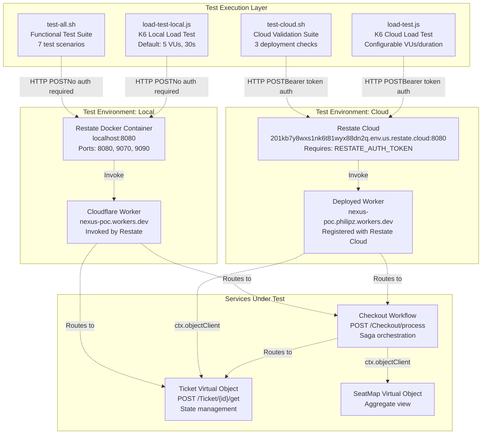
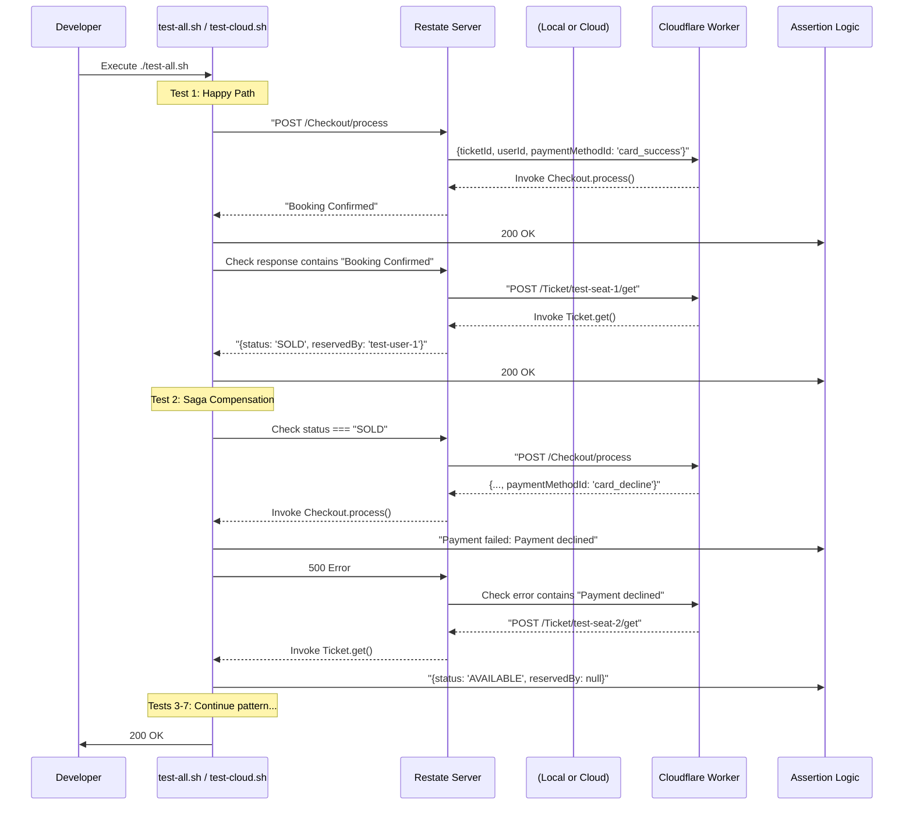
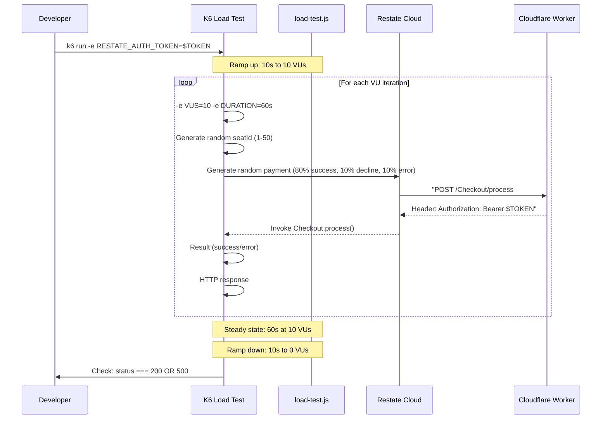
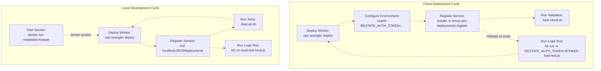

# Testing Strategy

> **Relevant source files**
> * [README.md](https://github.com/philipz/restate-cloudflare-workers-poc/blob/513fd0f5/README.md)
> * [load-test.js](https://github.com/philipz/restate-cloudflare-workers-poc/blob/513fd0f5/load-test.js)
> * [test-all.sh](https://github.com/philipz/restate-cloudflare-workers-poc/blob/513fd0f5/test-all.sh)
> * [test-cloud.sh](https://github.com/philipz/restate-cloudflare-workers-poc/blob/513fd0f5/test-cloud.sh)

## Purpose and Scope

This document describes the comprehensive testing strategy for the nexus-poc ticketing system. The testing approach validates both functional correctness (state consistency, saga compensation, concurrency control) and performance characteristics (throughput, latency, contention handling) across two deployment environments: local Docker-based development and Restate Cloud production.

The testing strategy consists of three primary components:

* **Functional Tests**: Validate business logic, state transitions, and error handling ([5.1](/philipz/restate-cloudflare-workers-poc/5.1-local-testing))
* **Cloud Validation**: Verify deployment correctness in managed Restate Cloud ([5.2](/philipz/restate-cloudflare-workers-poc/5.2-cloud-validation))
* **Load Testing**: Measure system behavior under concurrent load and contention ([5.3](/philipz/restate-cloudflare-workers-poc/5.3-load-testing))

For information about the core services being tested, see [Core Services](/philipz/restate-cloudflare-workers-poc/2-core-services). For deployment procedures, see [Development & Deployment](/philipz/restate-cloudflare-workers-poc/6-development-and-deployment).

---

## Testing Architecture

The testing infrastructure spans multiple layers, from HTTP clients to the Restate orchestration layer, through to the Cloudflare Workers execution environment.

### Test Layers and Tools



**Sources**: [test-all.sh L1-L226](https://github.com/philipz/restate-cloudflare-workers-poc/blob/513fd0f5/test-all.sh#L1-L226)

 [test-cloud.sh L1-L78](https://github.com/philipz/restate-cloudflare-workers-poc/blob/513fd0f5/test-cloud.sh#L1-L78)

 [load-test.js L1-L72](https://github.com/philipz/restate-cloudflare-workers-poc/blob/513fd0f5/load-test.js#L1-L72)

 [README.md L24-L154](https://github.com/philipz/restate-cloudflare-workers-poc/blob/513fd0f5/README.md#L24-L154)

---

## Test Scenario Coverage

The testing strategy validates seven critical scenarios that exercise all code paths in the system. Each scenario targets specific system behaviors and failure modes.

### Scenario-to-Component Mapping

```mermaid
flowchart TD

S1["Scenario 1:<br>Happy Path<br>card_success"]
S2["Scenario 2:<br>Saga Compensation<br>card_decline"]
S3["Scenario 3:<br>Double Booking<br>Prevention"]
S4["Scenario 4:<br>State Query<br>GET handler"]
S5["Scenario 5:<br>Concurrency<br>3 parallel requests"]
S6["Scenario 6:<br>Gateway Timeout<br>card_error"]
S7["Scenario 7:<br>Bulk Booking<br>5 sequential requests"]
Reserve["Ticket.reserve()<br>src/game.ts:22-47"]
Confirm["Ticket.confirm()<br>src/game.ts:49-62"]
Release["Ticket.release()<br>src/game.ts:64-76"]
GetState["Ticket.get()<br>src/game.ts:78-87"]
ProcessPayment["processPayment()<br>src/utils/payment_new.ts"]
CheckoutProcess["Checkout.process()<br>src/checkout.ts:26-88"]

S1 -.->|"Tests state check in"| Reserve
S1 -.->|"Triggers"| ProcessPayment
S1 -.->|"Tests concurrency in"| Confirm
S2 -.->|"Tests serialization in"| Reserve
S2 -.->|"Triggers"| ProcessPayment
S2 -.->|"Validates"| Release
S2 -.->|"Validates"| CheckoutProcess
S3 -.->|"Validates"| Reserve
S3 -.-> Reserve
S4 -.->|"Validates"| GetState
S5 -.-> Reserve
S5 -.->|"Validates error handling in"| CheckoutProcess
S6 -.->|"Tests compensation in"| ProcessPayment
S6 -.->|"Validates"| Release
S7 -.->|"Stress tests"| CheckoutProcess

subgraph subGraph1 ["System Components"]
    Reserve
    Confirm
    Release
    GetState
    ProcessPayment
    CheckoutProcess
end

subgraph subGraph0 ["Test Scenarios"]
    S1
    S2
    S3
    S4
    S5
    S6
    S7
end
```



**Sources**: [test-all.sh L56-L208](https://github.com/philipz/restate-cloudflare-workers-poc/blob/513fd0f5/test-all.sh#L56-L208)

 [README.md L70-L84](https://github.com/philipz/restate-cloudflare-workers-poc/blob/513fd0f5/README.md#L70-L84)

### Test Scenario Reference Table

| Scenario | Payment Method | Expected Outcome | Validated Components | Test File Location |
| --- | --- | --- | --- | --- |
| **Happy Path** | `card_success` | `"Booking Confirmed"`, seat → `SOLD` | `Checkout.process()`, `Ticket.reserve()`, `Ticket.confirm()`, `processPayment()` | [test-all.sh L56-L74](https://github.com/philipz/restate-cloudflare-workers-poc/blob/513fd0f5/test-all.sh#L56-L74) |
| **Saga Compensation** | `card_decline` | `"Payment failed"`, seat → `AVAILABLE` | Compensation logic in `Checkout.process()`, `Ticket.release()` | [test-all.sh L76-L94](https://github.com/philipz/restate-cloudflare-workers-poc/blob/513fd0f5/test-all.sh#L76-L94) |
| **Double Booking** | `card_success` (2x) | 1st succeeds, 2nd fails with `"already sold"` | State validation in `Ticket.reserve()`, Restate serialization | [test-all.sh L96-L115](https://github.com/philipz/restate-cloudflare-workers-poc/blob/513fd0f5/test-all.sh#L96-L115) |
| **State Query** | N/A (GET request) | Returns current seat state | `Ticket.get()` handler | [test-all.sh L117-L127](https://github.com/philipz/restate-cloudflare-workers-poc/blob/513fd0f5/test-all.sh#L117-L127) |
| **Concurrency** | `card_success` (3 parallel) | Only 1 succeeds, others fail | Virtual Object serialization, concurrent request handling | [test-all.sh L129-L163](https://github.com/philipz/restate-cloudflare-workers-poc/blob/513fd0f5/test-all.sh#L129-L163) |
| **Gateway Timeout** | `card_error` | `"Gateway timeout"`, seat → `AVAILABLE` | Error handling in `processPayment()`, compensation | [test-all.sh L165-L183](https://github.com/philipz/restate-cloudflare-workers-poc/blob/513fd0f5/test-all.sh#L165-L183) |
| **Bulk Booking** | `card_success` (5 sequential) | All 5 succeed independently | Throughput, sequential consistency | [test-all.sh L185-L208](https://github.com/philipz/restate-cloudflare-workers-poc/blob/513fd0f5/test-all.sh#L185-L208) |

**Sources**: [test-all.sh L56-L208](https://github.com/philipz/restate-cloudflare-workers-poc/blob/513fd0f5/test-all.sh#L56-L208)

 [README.md L72-L84](https://github.com/philipz/restate-cloudflare-workers-poc/blob/513fd0f5/README.md#L72-L84)

---

## Test Execution Workflow

### Functional Test Flow



**Sources**: [test-all.sh L56-L226](https://github.com/philipz/restate-cloudflare-workers-poc/blob/513fd0f5/test-all.sh#L56-L226)

 [test-cloud.sh L29-L78](https://github.com/philipz/restate-cloudflare-workers-poc/blob/513fd0f5/test-cloud.sh#L29-L78)

### Load Test Flow



**Sources**: [load-test.js L1-L72](https://github.com/philipz/restate-cloudflare-workers-poc/blob/513fd0f5/load-test.js#L1-L72)

 [README.md L108-L143](https://github.com/philipz/restate-cloudflare-workers-poc/blob/513fd0f5/README.md#L108-L143)

---

## Test Environment Comparison

The system supports two distinct test environments with different characteristics and purposes.

### Environment Configuration Matrix

| Aspect | Local Environment | Cloud Environment |
| --- | --- | --- |
| **Restate URL** | `http://localhost:8080` | `https://201kb7y8wxs1nk6t81wyx88dn2q.env.us.restate.cloud:8080` |
| **Authentication** | None required | `Authorization: Bearer $RESTATE_AUTH_TOKEN` required |
| **Worker Deployment** | `nexus-poc.philipz.workers.dev` (registered locally) | `nexus-poc.philipz.workers.dev` (registered with cloud) |
| **Restate Setup** | Docker container: `restatedev/restate:latest` | Managed Restate Cloud service |
| **Test Scripts** | `test-all.sh`, `load-test-local.js` | `test-cloud.sh`, `load-test.js` |
| **Service Registration** | `curl -X POST localhost:9070/deployments` | `restate -e nexus-poc deployments register` |
| **Purpose** | Fast iteration, comprehensive functional testing | Deployment validation, production-like load testing |
| **Startup Time** | ~10 seconds (Docker start) | Instant (always available) |
| **State Persistence** | Container-local, lost on restart | Durable, persisted across sessions |
| **Cost** | Free (local resources) | Billed by Restate Cloud usage |

**Sources**: [README.md L24-L49](https://github.com/philipz/restate-cloudflare-workers-poc/blob/513fd0f5/README.md#L24-L49)

 [README.md L50-L65](https://github.com/philipz/restate-cloudflare-workers-poc/blob/513fd0f5/README.md#L50-L65)

 [test-all.sh L8](https://github.com/philipz/restate-cloudflare-workers-poc/blob/513fd0f5/test-all.sh#L8-L8)

 [test-cloud.sh L17](https://github.com/philipz/restate-cloudflare-workers-poc/blob/513fd0f5/test-cloud.sh#L17-L17)

 [load-test.js L20-L21](https://github.com/philipz/restate-cloudflare-workers-poc/blob/513fd0f5/load-test.js#L20-L21)

### Environment-Specific Test Execution



**Sources**: [README.md L31-L48](https://github.com/philipz/restate-cloudflare-workers-poc/blob/513fd0f5/README.md#L31-L48)

 [README.md L57-L65](https://github.com/philipz/restate-cloudflare-workers-poc/blob/513fd0f5/README.md#L57-L65)

 [README.md L87-L143](https://github.com/philipz/restate-cloudflare-workers-poc/blob/513fd0f5/README.md#L87-L143)

---

## Test Assertions and Success Criteria

### Response Validation Strategy

The test scripts use pattern matching on HTTP responses to validate system behavior. The assertion logic differs based on whether testing against local or cloud environments.

**Assertion Function** ([test-all.sh L28-L45](https://github.com/philipz/restate-cloudflare-workers-poc/blob/513fd0f5/test-all.sh#L28-L45)

):

```php
assert_contains() {
    local response="$1"
    local expected="$2"
    local test_name="$3"
    
    if echo "$response" | grep -q "$expected"; then
        echo "✓ PASS: $test_name"
        PASSED_TESTS=$((PASSED_TESTS + 1))
    else
        echo "✗ FAIL: $test_name"
        echo "Expected: $expected"
        echo "Actual: $response"
        FAILED_TESTS=$((FAILED_TESTS + 1))
    fi
}
```

### Expected Response Patterns

| Test Scenario | HTTP Status | Response Body Pattern | Validation Purpose |
| --- | --- | --- | --- |
| Successful booking | `200` | `"Booking Confirmed"` | Workflow completed successfully |
| Payment declined | `500` | `"Payment failed"` AND `"Payment declined"` | TerminalError thrown, saga compensated |
| Double booking | `500` | `"already sold"` OR `"already reserved"` | State validation prevented overselling |
| Gateway timeout | `500` | `"Gateway timeout"` | Error handling triggered compensation |
| Query available seat | `200` | `"AVAILABLE"` AND `"null"` (reservedBy) | Correct initial state |
| Query sold seat | `200` | `"SOLD"` AND `"test-user-X"` | Correct post-booking state |
| Query reserved seat | `200` | `"RESERVED"` AND `"reservedUntil"` | Temporary reservation recorded |

**Sources**: [test-all.sh L28-L226](https://github.com/philipz/restate-cloudflare-workers-poc/blob/513fd0f5/test-all.sh#L28-L226)

 [test-cloud.sh L29-L78](https://github.com/philipz/restate-cloudflare-workers-poc/blob/513fd0f5/test-cloud.sh#L29-L78)

### Load Test Thresholds

The K6 load tests define performance thresholds that must be met for the test to pass ([load-test.js L14-L17](https://github.com/philipz/restate-cloudflare-workers-poc/blob/513fd0f5/load-test.js#L14-L17)

):

```yaml
thresholds: {
    http_req_duration: ['p(95)<5000'], // 95% of requests under 5s
    http_req_failed: ['rate<0.1'],     // Failure rate < 10%
}
```

**Load Test Success Criteria**:

* **Latency**: 95th percentile request duration must be under 5 seconds
* **Reliability**: Failure rate must be below 10% (excluding expected business logic errors like "already sold")
* **Correctness**: All responses must match one of four patterns: booking confirmed, already sold, payment declined, or gateway timeout

**Sources**: [load-test.js L14-L17](https://github.com/philipz/restate-cloudflare-workers-poc/blob/513fd0f5/load-test.js#L14-L17)

 [load-test.js L52-L70](https://github.com/philipz/restate-cloudflare-workers-poc/blob/513fd0f5/load-test.js#L52-L70)

 [README.md L112-L115](https://github.com/philipz/restate-cloudflare-workers-poc/blob/513fd0f5/README.md#L112-L115)

---

## Load Test Configuration

The load testing scripts support environment-based configuration for flexible performance testing.

### Configurable Parameters

| Parameter | Environment Variable | Default Value | Purpose |
| --- | --- | --- | --- |
| Virtual Users (VUs) | `VUS` | `5` | Number of concurrent users simulating requests |
| Test Duration | `DURATION` | `30s` | Length of steady-state load phase |
| Seat Range | N/A (hardcoded) | `1-50` | Random seat selection range for contention testing |
| Payment Distribution | N/A (hardcoded) | 80% success, 10% decline, 10% error | Probabilistic payment outcome simulation |

**Execution Examples**:

```markdown
# Default execution (5 VUs, 30s)
k6 run -e RESTATE_AUTH_TOKEN=$TOKEN load-test.js

# High concurrency test (20 VUs, 2 minutes)
k6 run -e RESTATE_AUTH_TOKEN=$TOKEN -e VUS=20 -e DURATION=120s load-test.js

# Local environment test (no authentication)
k6 run -e VUS=10 -e DURATION=60s load-test-local.js
```

**Sources**: [load-test.js L5-L18](https://github.com/philipz/restate-cloudflare-workers-poc/blob/513fd0f5/load-test.js#L5-L18)

 [README.md L117-L143](https://github.com/philipz/restate-cloudflare-workers-poc/blob/513fd0f5/README.md#L117-L143)

### Payment Outcome Distribution

The load tests simulate realistic traffic patterns with probabilistic payment outcomes ([load-test.js L28-L35](https://github.com/philipz/restate-cloudflare-workers-poc/blob/513fd0f5/load-test.js#L28-L35)

):

```javascript
const rand = Math.random();
let paymentMethod = 'card_success';  // Default: 80%
if (rand > 0.9) {
    paymentMethod = 'card_error';    // 10%
} else if (rand > 0.8) {
    paymentMethod = 'card_decline';  // 10%
}
```

This distribution exercises:

* **Happy path** (80%): Full checkout flow with successful payment and confirmation
* **Saga compensation** (10%): Payment decline triggering seat release
* **Error handling** (10%): Gateway timeout triggering compensation with potential retries

**Sources**: [load-test.js L28-L35](https://github.com/philipz/restate-cloudflare-workers-poc/blob/513fd0f5/load-test.js#L28-L35)

 [README.md L114-L115](https://github.com/philipz/restate-cloudflare-workers-poc/blob/513fd0f5/README.md#L114-L115)

---

## Test Output and Reporting

### Functional Test Output Format

The `test-all.sh` script provides detailed, color-coded output with per-test results and a final summary ([test-all.sh L210-L225](https://github.com/philipz/restate-cloudflare-workers-poc/blob/513fd0f5/test-all.sh#L210-L225)

):

```
========================================
测试摘要
========================================
总测试数: 7
通过: 7
失败: 0

🎉 所有测试通过！
```

Each test includes:

1. Test number and description
2. HTTP request details (endpoint, payload)
3. Response validation (✓ PASS or ✗ FAIL)
4. State verification (querying seat status after operation)

**Sources**: [test-all.sh L19-L226](https://github.com/philipz/restate-cloudflare-workers-poc/blob/513fd0f5/test-all.sh#L19-L226)

### Load Test Metrics

K6 provides comprehensive performance metrics at the end of each load test run:

* **HTTP Request Duration**: Min, max, avg, median, p90, p95, p99
* **HTTP Request Failed**: Count and rate of failed requests
* **Iterations**: Total number of test iterations completed
* **Virtual Users (VUs)**: Min, max, and current VU count
* **Data Received/Sent**: Network traffic statistics

The thresholds defined in [load-test.js L14-L17](https://github.com/philipz/restate-cloudflare-workers-poc/blob/513fd0f5/load-test.js#L14-L17)

 are evaluated against these metrics to determine pass/fail status.

**Sources**: [load-test.js L8-L18](https://github.com/philipz/restate-cloudflare-workers-poc/blob/513fd0f5/load-test.js#L8-L18)

 [README.md L108-L143](https://github.com/philipz/restate-cloudflare-workers-poc/blob/513fd0f5/README.md#L108-L143)

---

## Summary

The nexus-poc testing strategy provides multi-layered validation:

1. **Functional Coverage**: Seven test scenarios validate all code paths including happy path, saga compensation, concurrency control, and error handling
2. **Environment Parity**: Identical test scenarios execute against both local (Docker) and cloud (managed) deployments
3. **Performance Validation**: K6 load tests with configurable concurrency and duration verify system behavior under contention
4. **Realistic Traffic Simulation**: Probabilistic payment outcomes and random seat selection create production-like test conditions

The combination of fast local iteration (`test-all.sh`) and production-like validation (`test-cloud.sh`, `load-test.js`) ensures confidence in both development and deployment phases.

**Related Pages**:

* [5.1 Local Testing](/philipz/restate-cloudflare-workers-poc/5.1-local-testing) - Detailed coverage of test-all.sh scenarios
* [5.2 Cloud Validation](/philipz/restate-cloudflare-workers-poc/5.2-cloud-validation) - Cloud deployment verification procedures
* [5.3 Load Testing](/philipz/restate-cloudflare-workers-poc/5.3-load-testing) - In-depth load testing configuration and analysis

**Sources**: [README.md L66-L154](https://github.com/philipz/restate-cloudflare-workers-poc/blob/513fd0f5/README.md#L66-L154)

 [test-all.sh L1-L226](https://github.com/philipz/restate-cloudflare-workers-poc/blob/513fd0f5/test-all.sh#L1-L226)

 [test-cloud.sh L1-L78](https://github.com/philipz/restate-cloudflare-workers-poc/blob/513fd0f5/test-cloud.sh#L1-L78)

 [load-test.js L1-L72](https://github.com/philipz/restate-cloudflare-workers-poc/blob/513fd0f5/load-test.js#L1-L72)