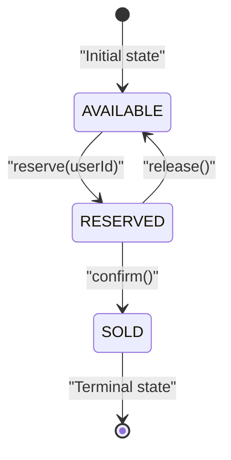
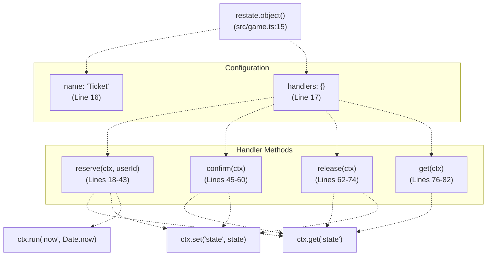
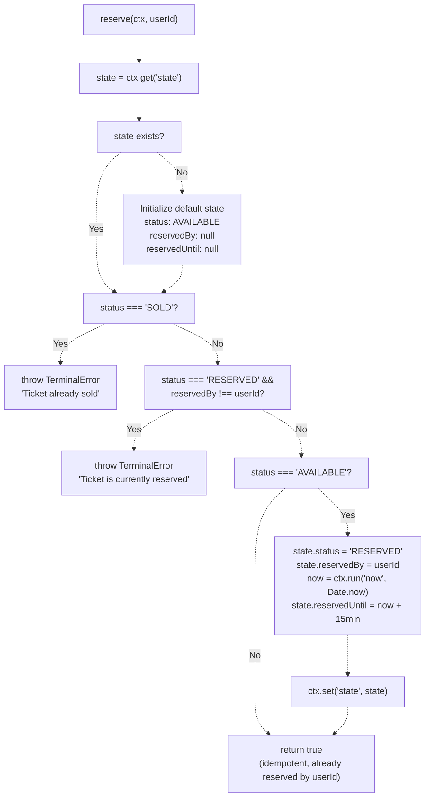
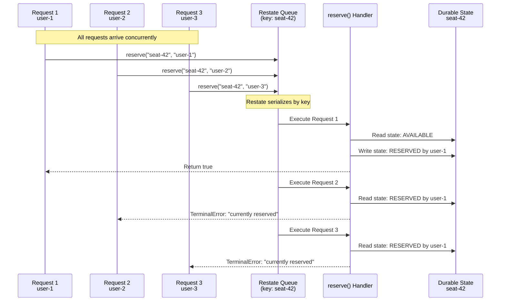
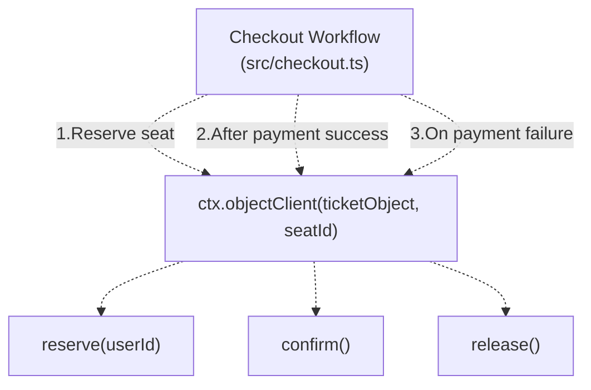

# Ticket Virtual Object

> **Relevant source files**
> * [README.md](https://github.com/philipz/restate-cloudflare-workers-poc/blob/513fd0f5/README.md)
> * [src/game.ts](https://github.com/philipz/restate-cloudflare-workers-poc/blob/513fd0f5/src/game.ts)

## Purpose and Scope

This document provides a detailed explanation of the `Ticket` Virtual Object, which manages individual seat state in the ticketing system. The Ticket object implements a state machine with three states (`AVAILABLE`, `RESERVED`, `SOLD`) and provides methods for state transitions with automatic serialization guarantees to prevent race conditions.

For information about the aggregate seat view and auto-reset mechanism, see [SeatMap Virtual Object](/philipz/restate-cloudflare-workers-poc/2.2-seatmap-virtual-object). For the complete booking workflow that orchestrates Ticket operations, see [Checkout Workflow](/philipz/restate-cloudflare-workers-poc/2.3-checkout-workflow). For general concepts about Virtual Objects and serialization, see [Virtual Objects & Serialization](/philipz/restate-cloudflare-workers-poc/8.1-virtual-objects-and-serialization).

**Sources**: [src/game.ts L1-L87](https://github.com/philipz/restate-cloudflare-workers-poc/blob/513fd0f5/src/game.ts#L1-L87)

---

## State Structure

The Ticket Virtual Object maintains durable state for each seat using a strongly-typed state interface. Each Ticket instance is keyed by a `seatId` (e.g., `"seat-1"`, `"seat-42"`), and Restate ensures that all operations on the same seat are automatically serialized.

### TicketState Interface

| Field | Type | Description |
| --- | --- | --- |
| `status` | `TicketStatus` | Current seat state: `"AVAILABLE"`, `"RESERVED"`, or `"SOLD"` |
| `reservedBy` | `string \| null` | User ID who reserved the ticket; `null` when not reserved |
| `reservedUntil` | `number \| null` | Unix timestamp (ms) when reservation expires; `null` when not reserved |

The `TicketStatus` type is defined as a union of three literal strings, providing compile-time type safety for state transitions.

**Sources**: [src/game.ts L7-L13](https://github.com/philipz/restate-cloudflare-workers-poc/blob/513fd0f5/src/game.ts#L7-L13)

---

## State Machine

The Ticket object implements a finite state machine with three states and controlled transitions. The following diagram illustrates all valid state transitions and the methods that trigger them:



### State Transition Rules

1. **AVAILABLE → RESERVED**: Triggered by `reserve(userId)`. Sets `reservedBy` to the user ID and calculates `reservedUntil` as 15 minutes from the current time.
2. **RESERVED → SOLD**: Triggered by `confirm()`. Only valid when status is `RESERVED`. Clears the `reservedUntil` field as the reservation is now permanent.
3. **RESERVED → AVAILABLE**: Triggered by `release()`. Resets all fields to their default state, making the seat available for new reservations.
4. **SOLD**: Terminal state with no outbound transitions (except during auto-reset by SeatMap).

**Sources**: [src/game.ts L18-L74](https://github.com/philipz/restate-cloudflare-workers-poc/blob/513fd0f5/src/game.ts#L18-L74)

---

## Virtual Object Definition

The Ticket Virtual Object is created using the Restate SDK's `object()` function, which provides automatic serialization of concurrent requests by the object key.



**Key Characteristics**:

* **Object Name**: `"Ticket"` - This is the service identifier used when invoking the object via Restate APIs.
* **Object Context**: All handlers receive a `restate.ObjectContext` as the first parameter, providing access to state operations and durable execution features.
* **State Persistence**: State is accessed via `ctx.get<TicketState>("state")` and persisted via `ctx.set("state", state)`.
* **Default State**: If no state exists, handlers initialize with `{ status: "AVAILABLE", reservedBy: null, reservedUntil: null }`.

**Sources**: [src/game.ts L15-L84](https://github.com/philipz/restate-cloudflare-workers-poc/blob/513fd0f5/src/game.ts#L15-L84)

---

## Handler Methods

### reserve(ctx, userId)

Attempts to reserve a ticket for the specified user. This method implements the core concurrency control logic by checking current state and only allowing transitions from `AVAILABLE` to `RESERVED`.

**Parameters**:

* `ctx`: `restate.ObjectContext` - Provides access to state and durable operations
* `userId`: `string` - Identifier of the user attempting to reserve the ticket

**Behavior**:



**Key Implementation Details**:

* **Idempotency**: If the ticket is already reserved by the same `userId`, the method returns `true` without modification (lines 29-31).
* **Durable Timestamp**: Uses `ctx.run("now", () => Date.now())` to capture the current time durably, ensuring consistent replay after failures (lines 37-38).
* **Reservation Window**: Sets `reservedUntil` to 15 minutes (900,000 milliseconds) from the current time (line 38).
* **Terminal Errors**: Uses `restate.TerminalError` for business logic failures, signaling that retries will not succeed (lines 26, 30).

**Sources**: [src/game.ts L18-L43](https://github.com/philipz/restate-cloudflare-workers-poc/blob/513fd0f5/src/game.ts#L18-L43)

---

### confirm(ctx)

Transitions a reserved ticket to the `SOLD` state. This method is called after successful payment processing by the Checkout workflow.

**Parameters**:

* `ctx`: `restate.ObjectContext`

**Behavior**:

| Current Status | Action | New Status |
| --- | --- | --- |
| `RESERVED` | Set `status = "SOLD"`, clear `reservedUntil`, persist state | `SOLD` |
| `AVAILABLE` | Throw `TerminalError("Ticket is not reserved, cannot confirm")` | No change |
| `SOLD` | Throw `TerminalError("Ticket is not reserved, cannot confirm")` | No change |

The method enforces a strict precondition: only tickets in the `RESERVED` state can be confirmed. This prevents accidental double-confirmation or confirmation of unsold tickets.

**Implementation**:

1. Retrieve current state with default initialization (lines 46-50)
2. Validate that `state.status === "RESERVED"` (lines 52-54)
3. Update state: `status = "SOLD"`, `reservedUntil = null` (lines 56-57)
4. Persist state via `ctx.set("state", state)` (line 58)
5. Return `true` (line 59)

**Sources**: [src/game.ts L45-L60](https://github.com/philipz/restate-cloudflare-workers-poc/blob/513fd0f5/src/game.ts#L45-L60)

---

### release(ctx)

Resets the ticket to the `AVAILABLE` state, clearing all reservation metadata. This method is used in two scenarios:

1. **Compensation**: Called by the Checkout workflow when payment fails (Saga pattern)
2. **Auto-reset**: Called by the SeatMap object when all 50 seats are sold

**Parameters**:

* `ctx`: `restate.ObjectContext`

**Behavior**:

The method unconditionally resets the ticket state, regardless of the current status:

```
status         → "AVAILABLE"
reservedBy     → null
reservedUntil  → null
```

This is an **idempotent** operation—calling `release()` multiple times has the same effect as calling it once.

**Implementation**:

1. Retrieve current state with default initialization (lines 63-67)
2. Reset all fields to available state (lines 69-71)
3. Persist state via `ctx.set("state", state)` (line 72)
4. Return `true` (line 73)

**Sources**: [src/game.ts L62-L74](https://github.com/philipz/restate-cloudflare-workers-poc/blob/513fd0f5/src/game.ts#L62-L74)

---

### get(ctx)

Retrieves the current state of the ticket without modification. This is a read-only query operation.

**Parameters**:

* `ctx`: `restate.ObjectContext`

**Return Value**: `TicketState` - The current state, or the default state if no state exists

**Use Cases**:

* Frontend queries to display seat availability
* Testing and validation
* Debugging state transitions

**Implementation**: Single line retrieval with default initialization (lines 77-81).

**Sources**: [src/game.ts L76-L82](https://github.com/philipz/restate-cloudflare-workers-poc/blob/513fd0f5/src/game.ts#L76-L82)

---

## Concurrency Control and Serialization

The Ticket Virtual Object relies on Restate's automatic serialization to prevent race conditions. When multiple concurrent requests target the same seat, Restate queues them by object key and executes handlers sequentially.

### Serialization Mechanism



**Key Properties**:

1. **No Explicit Locks**: Developers do not manage locks, mutexes, or transactions.
2. **Automatic Ordering**: Restate deterministically orders requests by arrival time.
3. **State Isolation**: Each `seatId` has its own isolated state; requests for `seat-1` and `seat-2` execute in parallel.
4. **Race Condition Prevention**: Only the first request in the queue sees `AVAILABLE` status; subsequent requests see `RESERVED`.

**Sources**: [src/game.ts L18-L43](https://github.com/philipz/restate-cloudflare-workers-poc/blob/513fd0f5/src/game.ts#L18-L43)

 High-level architecture diagrams

---

## Error Handling

The Ticket object uses Restate's `TerminalError` class to signal business logic failures that should not be retried. This distinguishes permanent failures from transient infrastructure errors.

### Terminal Error Scenarios

| Scenario | Error Message | Trigger Condition |
| --- | --- | --- |
| Already Sold | `"Ticket already sold"` | `status === "SOLD"` when calling `reserve()` |
| Already Reserved | `"Ticket is currently reserved"` | `status === "RESERVED"` by different user when calling `reserve()` |
| Not Reserved | `"Ticket is not reserved, cannot confirm"` | `status !== "RESERVED"` when calling `confirm()` |

**Behavior**:

* `TerminalError` signals to Restate that the operation has **permanently failed** due to business logic constraints.
* Restate will **not automatically retry** the invocation.
* The error propagates back to the caller (typically the Checkout workflow), which can implement compensation logic.

**Sources**: [src/game.ts L26-L30](https://github.com/philipz/restate-cloudflare-workers-poc/blob/513fd0f5/src/game.ts#L26-L30)

 [src/game.ts L52-L54](https://github.com/philipz/restate-cloudflare-workers-poc/blob/513fd0f5/src/game.ts#L52-L54)

---

## Integration with Checkout Workflow

The Ticket object is invoked by the Checkout workflow using `ctx.objectClient()`, which provides type-safe RPC-style invocations with automatic durability.

### Example Invocation Pattern

From the Checkout workflow perspective:



The workflow uses `await` to wait for each RPC call to complete, ensuring that state transitions happen in the correct order. If the workflow crashes mid-execution, Restate replays it from the last durable checkpoint, ensuring exactly-once semantics for all Ticket operations.

**Sources**: High-level architecture diagrams, inferred from [src/game.ts L15-L84](https://github.com/philipz/restate-cloudflare-workers-poc/blob/513fd0f5/src/game.ts#L15-L84)

---

## Type Export

The Ticket Virtual Object type is exported for use in other modules, enabling type-safe client creation:

```javascript
export type TicketObject = typeof ticketObject;
```

This allows the Checkout workflow and other services to create strongly-typed clients:

```
ctx.objectClient(ticketObject, seatId).reserve(userId)
```

The TypeScript compiler enforces that:

* The correct object is passed to `ctx.objectClient()`
* Only valid methods are invoked
* Method parameters match the expected types

**Sources**: [src/game.ts L86](https://github.com/philipz/restate-cloudflare-workers-poc/blob/513fd0f5/src/game.ts#L86-L86)

---

## Summary

The Ticket Virtual Object implements a simple but robust state machine for individual seat management. Its key strengths are:

1. **Automatic Serialization**: Eliminates race conditions without explicit locking
2. **Type Safety**: Strong typing for state and method signatures
3. **Clear State Transitions**: Three-state machine with explicit transition rules
4. **Error Signaling**: Uses `TerminalError` to distinguish business failures from infrastructure failures
5. **Durable Time Handling**: Uses `ctx.run()` to ensure consistent timestamp generation across retries
6. **Idempotency**: Methods can be safely retried without unintended side effects

The object is designed to work in concert with the SeatMap object (aggregate view) and the Checkout workflow (orchestration), forming a complete ticketing system with strong consistency guarantees.

**Sources**: [src/game.ts L1-L87](https://github.com/philipz/restate-cloudflare-workers-poc/blob/513fd0f5/src/game.ts#L1-L87)

 High-level architecture diagrams