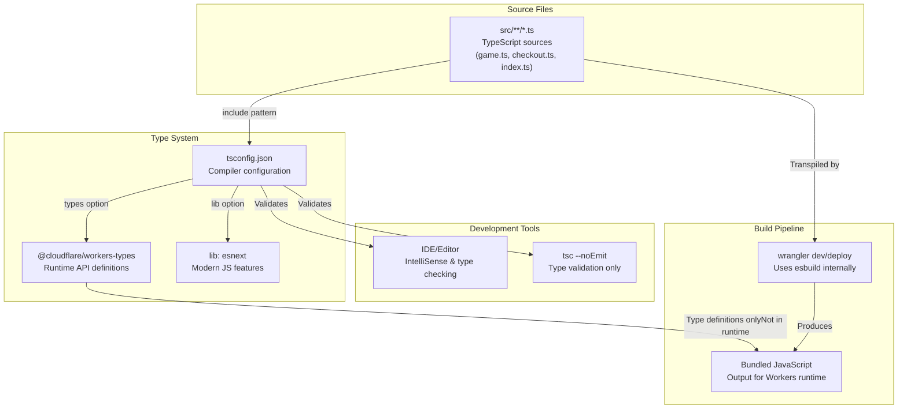
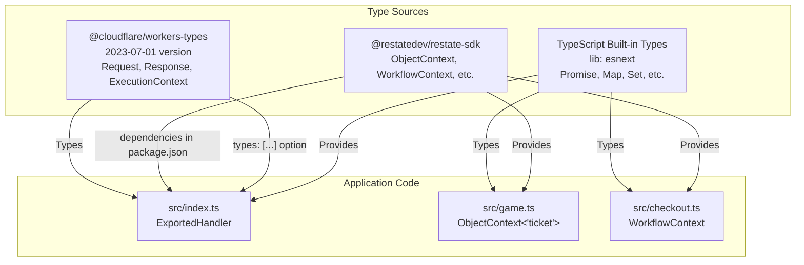
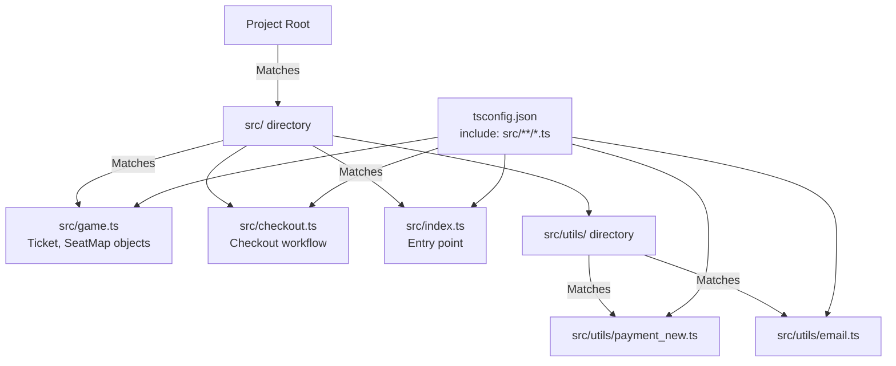

# TypeScript Configuration

> **Relevant source files**
> * [package.json](https://github.com/philipz/restate-cloudflare-workers-poc/blob/513fd0f5/package.json)
> * [tsconfig.json](https://github.com/philipz/restate-cloudflare-workers-poc/blob/513fd0f5/tsconfig.json)

## Purpose and Scope

This page documents the TypeScript compiler configuration defined in [tsconfig.json L1-L19](https://github.com/philipz/restate-cloudflare-workers-poc/blob/513fd0f5/tsconfig.json#L1-L19)

 The configuration establishes compiler settings optimized for the Cloudflare Workers runtime environment and integrates with the Wrangler build pipeline. For information about Wrangler's build and deployment configuration, see [Wrangler Configuration](/philipz/restate-cloudflare-workers-poc/7.2-wrangler-configuration). For details on TypeScript package dependencies, see [Dependencies](/philipz/restate-cloudflare-workers-poc/7.3-dependencies).

**Sources:** [tsconfig.json L1-L19](https://github.com/philipz/restate-cloudflare-workers-poc/blob/513fd0f5/tsconfig.json#L1-L19)

---

## Configuration Overview

The TypeScript configuration serves two primary functions in this codebase:

1. **Development-time type checking** - Provides IntelliSense and compile-time error detection in editors
2. **Runtime API type definitions** - Integrates Cloudflare Workers-specific types for `Request`, `Response`, `ExecutionContext`, and other runtime APIs

The configuration does **not** perform compilation - Wrangler uses its own bundler (esbuild) to transpile TypeScript source files. The `"noEmit": true` setting at [tsconfig.json L14](https://github.com/philipz/restate-cloudflare-workers-poc/blob/513fd0f5/tsconfig.json#L14-L14)

 explicitly disables TypeScript's compilation output.

**Sources:** [tsconfig.json L1-L19](https://github.com/philipz/restate-cloudflare-workers-poc/blob/513fd0f5/tsconfig.json#L1-L19)

 [package.json L5-L8](https://github.com/philipz/restate-cloudflare-workers-poc/blob/513fd0f5/package.json#L5-L8)

---

## TypeScript Compilation Pipeline



**Diagram: TypeScript Configuration in Build Pipeline**

This diagram illustrates how `tsconfig.json` integrates with both development-time type checking and the Wrangler build process. TypeScript compiler validates types but does not emit JavaScript - Wrangler's internal esbuild bundler performs the actual transpilation.

**Sources:** [tsconfig.json L1-L19](https://github.com/philipz/restate-cloudflare-workers-poc/blob/513fd0f5/tsconfig.json#L1-L19)

 [package.json L5-L8](https://github.com/philipz/restate-cloudflare-workers-poc/blob/513fd0f5/package.json#L5-L8)

 [package.json L10-L13](https://github.com/philipz/restate-cloudflare-workers-poc/blob/513fd0f5/package.json#L10-L13)

---

## Compiler Options Breakdown

The `compilerOptions` object at [tsconfig.json L2-L14](https://github.com/philipz/restate-cloudflare-workers-poc/blob/513fd0f5/tsconfig.json#L2-L14)

 configures the TypeScript compiler behavior. The following table documents each option and its purpose in the Cloudflare Workers context:

| Option | Value | Purpose | Rationale |
| --- | --- | --- | --- |
| `target` | `"esnext"` | Output modern JavaScript syntax | Cloudflare Workers runtime supports latest ECMAScript features; no need for downleveling |
| `module` | `"esnext"` | Use ES modules | Cloudflare Workers uses ES module format; aligns with `import`/`export` syntax |
| `moduleResolution` | `"bundler"` | Module resolution for bundlers | Optimized for Wrangler's esbuild bundler; handles bare specifiers and package.json exports |
| `lib` | `["esnext"]` | Include modern JS standard library types | Provides types for `Promise`, `Map`, `Set`, and other modern APIs used in [src/game.ts](https://github.com/philipz/restate-cloudflare-workers-poc/blob/513fd0f5/src/game.ts) <br>  and [src/checkout.ts](https://github.com/philipz/restate-cloudflare-workers-poc/blob/513fd0f5/src/checkout.ts) |
| `types` | `["@cloudflare/workers-types/2023-07-01"]` | Include Cloudflare Workers runtime types | Provides `Request`, `Response`, `ExecutionContext`, `ExportedHandler` types used in [src/index.ts](https://github.com/philipz/restate-cloudflare-workers-poc/blob/513fd0f5/src/index.ts) |
| `strict` | `true` | Enable all strict type checking | Enforces `strictNullChecks`, `strictFunctionTypes`, etc. for type safety |
| `skipLibCheck` | `true` | Skip type checking in .d.ts files | Speeds up compilation; only checks application code |
| `noEmit` | `true` | Disable JavaScript output | TypeScript validates types only; Wrangler handles transpilation |

**Sources:** [tsconfig.json L2-L14](https://github.com/philipz/restate-cloudflare-workers-poc/blob/513fd0f5/tsconfig.json#L2-L14)

---

## Module System Configuration

### Target and Module Format

The combination of `"target": "esnext"` and `"module": "esnext"` at [tsconfig.json L3-L4](https://github.com/philipz/restate-cloudflare-workers-poc/blob/513fd0f5/tsconfig.json#L3-L4)

 configures TypeScript to emit modern ES module syntax. This aligns with Cloudflare Workers' native module support:

* **ES Modules (`import`/`export`)** - All source files use ES module syntax, as seen in [src/index.ts](https://github.com/philipz/restate-cloudflare-workers-poc/blob/513fd0f5/src/index.ts)  with `import { api } from "@restatedev/restate-sdk-cloudflare-workers"`
* **Top-level `await`** - Supported by both the TypeScript configuration and Workers runtime
* **Dynamic imports** - Available for code splitting (not currently used in this codebase)

### Module Resolution Strategy

The `"moduleResolution": "bundler"` setting at [tsconfig.json L5](https://github.com/philipz/restate-cloudflare-workers-poc/blob/513fd0f5/tsconfig.json#L5-L5)

 uses TypeScript 5.0+'s bundler resolution strategy, which:

1. Resolves bare module specifiers like `"@restatedev/restate-sdk-cloudflare-workers"` using `package.json` dependencies
2. Respects `package.json` `exports` fields for modern package entry points
3. Allows extensionless imports (e.g., `"./game"` instead of `"./game.ts"`)

This strategy is optimized for Wrangler's esbuild-based bundler, which performs identical resolution logic during the build process.

**Sources:** [tsconfig.json L3-L5](https://github.com/philipz/restate-cloudflare-workers-poc/blob/513fd0f5/tsconfig.json#L3-L5)

---

## Type System Integration



**Diagram: Type Definition Flow**

This diagram shows how type definitions from three sources flow into application code. Cloudflare Workers types are explicitly configured via the `types` option, while Restate SDK types are automatically discovered through package dependencies.

**Sources:** [tsconfig.json L9-L11](https://github.com/philipz/restate-cloudflare-workers-poc/blob/513fd0f5/tsconfig.json#L9-L11)

 [package.json L15-L17](https://github.com/philipz/restate-cloudflare-workers-poc/blob/513fd0f5/package.json#L15-L17)

### Cloudflare Workers Types

The `"types": ["@cloudflare/workers-types/2023-07-01"]` configuration at [tsconfig.json L9-L11](https://github.com/philipz/restate-cloudflare-workers-poc/blob/513fd0f5/tsconfig.json#L9-L11)

 explicitly includes type definitions for the Cloudflare Workers runtime environment. The version specifier `2023-07-01` corresponds to a specific Workers runtime version, providing types for:

| Type/Interface | Usage in Codebase | File Reference |
| --- | --- | --- |
| `ExportedHandler<Env>` | Worker entry point interface | [src/index.ts](https://github.com/philipz/restate-cloudflare-workers-poc/blob/513fd0f5/src/index.ts) |
| `Request` | HTTP request object | [src/index.ts](https://github.com/philipz/restate-cloudflare-workers-poc/blob/513fd0f5/src/index.ts) |
| `Response` | HTTP response object | [src/index.ts](https://github.com/philipz/restate-cloudflare-workers-poc/blob/513fd0f5/src/index.ts) |
| `ExecutionContext` | Worker execution context | [src/index.ts](https://github.com/philipz/restate-cloudflare-workers-poc/blob/513fd0f5/src/index.ts) |
| `Env` | Environment bindings interface | [src/index.ts](https://github.com/philipz/restate-cloudflare-workers-poc/blob/513fd0f5/src/index.ts) |

The Cloudflare Workers types package is installed as a dev dependency at [package.json L11](https://github.com/philipz/restate-cloudflare-workers-poc/blob/513fd0f5/package.json#L11-L11)

 with version `^4.20240405.0`, which includes the `2023-07-01` runtime version.

**Sources:** [tsconfig.json L9-L11](https://github.com/philipz/restate-cloudflare-workers-poc/blob/513fd0f5/tsconfig.json#L9-L11)

 [package.json L11](https://github.com/philipz/restate-cloudflare-workers-poc/blob/513fd0f5/package.json#L11-L11)

### Library Types

The `"lib": ["esnext"]` setting at [tsconfig.json L6-L8](https://github.com/philipz/restate-cloudflare-workers-poc/blob/513fd0f5/tsconfig.json#L6-L8)

 includes TypeScript's standard library type definitions for modern JavaScript features. This provides types for:

* **Promises and async/await** - Used extensively in [src/checkout.ts](https://github.com/philipz/restate-cloudflare-workers-poc/blob/513fd0f5/src/checkout.ts)  for async workflow orchestration
* **Collections** - `Map`, `Set`, `Record` types used in [src/game.ts](https://github.com/philipz/restate-cloudflare-workers-poc/blob/513fd0f5/src/game.ts)  for seat state management
* **Iterators and generators** - Available for use in saga compensation logic
* **Modern string/array methods** - `includes()`, `startsWith()`, etc.

The `"esnext"` library includes all stable ECMAScript features without requiring separate lib entries like `"es2015"`, `"es2016"`, etc.

**Sources:** [tsconfig.json L6-L8](https://github.com/philipz/restate-cloudflare-workers-poc/blob/513fd0f5/tsconfig.json#L6-L8)

---

## Strict Type Checking

The `"strict": true` flag at [tsconfig.json L12](https://github.com/philipz/restate-cloudflare-workers-poc/blob/513fd0f5/tsconfig.json#L12-L12)

 enables all strict type-checking options, which collectively enforce:

| Strict Option | Behavior | Impact on Codebase |
| --- | --- | --- |
| `strictNullChecks` | `null` and `undefined` are not assignable to other types | Forces explicit null handling in reservation logic |
| `strictFunctionTypes` | Function parameter contravariance checking | Ensures type safety in Restate callback handlers |
| `strictBindCallApply` | Type-checks `bind`, `call`, `apply` | Validates method binding in utility functions |
| `strictPropertyInitialization` | Class properties must be initialized | N/A - codebase uses functions, not classes |
| `noImplicitThis` | `this` requires explicit type | Prevents implicit `this` in utility functions |
| `alwaysStrict` | Parse in strict mode and emit `"use strict"` | Enforces strict mode in all files |

Strict mode is critical for this codebase because:

1. **State management correctness** - Null checks prevent invalid state transitions in the Ticket state machine
2. **Restate API contracts** - Strict function types ensure correct usage of `ctx.objectClient`, `ctx.run`, etc.
3. **Saga compensation** - Explicit error handling required for compensation logic in [src/checkout.ts](https://github.com/philipz/restate-cloudflare-workers-poc/blob/513fd0f5/src/checkout.ts)

**Sources:** [tsconfig.json L12](https://github.com/philipz/restate-cloudflare-workers-poc/blob/513fd0f5/tsconfig.json#L12-L12)

---

## Compilation Optimization

### Skip Library Checking

The `"skipLibCheck": true` setting at [tsconfig.json L13](https://github.com/philipz/restate-cloudflare-workers-poc/blob/513fd0f5/tsconfig.json#L13-L13)

 instructs TypeScript to skip type-checking of `.d.ts` declaration files in `node_modules`. This optimization:

* **Reduces compilation time** - Does not validate third-party type definitions
* **Avoids transitive type errors** - Prevents errors from dependencies' dependencies
* **Focuses validation on application code** - Only checks files in `src/**/*.ts`

This is safe because:

1. The Restate SDK and Cloudflare Workers types are well-tested by their maintainers
2. Any actual runtime errors will still be caught during development and testing
3. TypeScript still validates application code's usage of library APIs

**Sources:** [tsconfig.json L13](https://github.com/philipz/restate-cloudflare-workers-poc/blob/513fd0f5/tsconfig.json#L13-L13)

### No Emit Mode

The `"noEmit": true` setting at [tsconfig.json L14](https://github.com/philipz/restate-cloudflare-workers-poc/blob/513fd0f5/tsconfig.json#L14-L14)

 disables TypeScript's code generation. This is required because:

1. **Wrangler handles transpilation** - The build pipeline at [package.json L6-L8](https://github.com/philipz/restate-cloudflare-workers-poc/blob/513fd0f5/package.json#L6-L8)  uses `wrangler deploy` and `wrangler dev`, which internally use esbuild
2. **Type checking only** - `tsconfig.json` serves purely for IDE integration and `tsc --noEmit` validation
3. **Single source of truth** - Avoids conflicts between TypeScript's compiler and Wrangler's bundler

Developers can run `tsc --noEmit` to validate types without producing output files. Wrangler's bundler respects TypeScript syntax but performs its own transpilation with different settings optimized for Workers runtime.

**Sources:** [tsconfig.json L14](https://github.com/philipz/restate-cloudflare-workers-poc/blob/513fd0f5/tsconfig.json#L14-L14)

 [package.json L5-L8](https://github.com/philipz/restate-cloudflare-workers-poc/blob/513fd0f5/package.json#L5-L8)

---

## File Inclusion Rules



**Diagram: File Inclusion Pattern**

This diagram illustrates how the `include` pattern matches all TypeScript source files in the `src/` directory tree.

**Sources:** [tsconfig.json L16-L18](https://github.com/philipz/restate-cloudflare-workers-poc/blob/513fd0f5/tsconfig.json#L16-L18)

### Include Pattern

The `"include": ["src/**/*.ts"]` array at [tsconfig.json L16-L18](https://github.com/philipz/restate-cloudflare-workers-poc/blob/513fd0f5/tsconfig.json#L16-L18)

 specifies which files TypeScript should process. The pattern breakdown:

* `src/` - Root source directory
* `**/` - Matches any directory depth (recursive)
* `*.ts` - Matches all TypeScript files

This pattern includes:

* Top-level service files: `src/game.ts`, `src/checkout.ts`, `src/index.ts`
* Utility modules: `src/utils/payment_new.ts`, `src/utils/email.ts`
* Any future TypeScript files added to `src/` or subdirectories

Files **excluded** from type checking:

* `node_modules/` (default exclusion)
* Test scripts: `test-all.sh`, `test-cloud.sh` (shell scripts, not TypeScript)
* Load test files: `load-test.js`, `load-test-local.js` (JavaScript, not `.ts`)
* Configuration files: `wrangler.toml`, `package.json` (not TypeScript)

**Sources:** [tsconfig.json L16-L18](https://github.com/philipz/restate-cloudflare-workers-poc/blob/513fd0f5/tsconfig.json#L16-L18)

---

## Integration with Development Workflow

The TypeScript configuration integrates with the development workflow as follows:

### IDE Integration

Modern IDEs (VS Code, WebStorm, etc.) automatically detect `tsconfig.json` and provide:

1. **IntelliSense** - Auto-completion for Restate SDK APIs (`ctx.objectClient`, `ctx.run`, etc.)
2. **Type errors** - Real-time validation of null checks, function signatures, property access
3. **Go-to-definition** - Navigation from application code to type definitions in `@restatedev/restate-sdk-cloudflare-workers`
4. **Refactoring support** - Safe rename and extract operations

### Manual Type Checking

Developers can validate types without running Wrangler:

```markdown
# Type check only (no compilation)
npx tsc --noEmit
```

This command reads `tsconfig.json` and reports type errors across all files matching `src/**/*.ts` without producing output files.

### Wrangler Integration

When running [package.json L7](https://github.com/philipz/restate-cloudflare-workers-poc/blob/513fd0f5/package.json#L7-L7)

 (`npm run dev`) or [package.json L6](https://github.com/philipz/restate-cloudflare-workers-poc/blob/513fd0f5/package.json#L6-L6)

 (`npm run deploy`), Wrangler:

1. Reads TypeScript source files from `src/`
2. Transpiles using internal esbuild (ignoring `tsconfig.json` compiler options)
3. Bundles for Cloudflare Workers runtime
4. Preserves source maps for debugging

The `tsconfig.json` settings do **not** affect Wrangler's build output - they only control development-time type validation.

**Sources:** [tsconfig.json L1-L19](https://github.com/philipz/restate-cloudflare-workers-poc/blob/513fd0f5/tsconfig.json#L1-L19)

 [package.json L5-L8](https://github.com/philipz/restate-cloudflare-workers-poc/blob/513fd0f5/package.json#L5-L8)

---

## Configuration Compatibility Matrix

| Configuration Aspect | TypeScript Setting | Cloudflare Workers Runtime | Wrangler Build Tool | Compatibility Status |
| --- | --- | --- | --- | --- |
| Module format | `module: "esnext"` | ES modules | ES modules | ✓ Aligned |
| JavaScript features | `target: "esnext"` | V8 latest | Transpiles to Workers target | ✓ Compatible |
| Module resolution | `moduleResolution: "bundler"` | N/A | esbuild bundler | ✓ Aligned |
| Runtime APIs | `types: ["@cloudflare/workers-types/..."]` | Workers runtime | N/A | ✓ Types match runtime |
| Compilation | `noEmit: true` | N/A | esbuild compiles | ✓ No conflict |

This table demonstrates that `tsconfig.json` is optimized for the Cloudflare Workers + Wrangler environment, with all settings aligned to the runtime capabilities and build toolchain.

**Sources:** [tsconfig.json L1-L19](https://github.com/philipz/restate-cloudflare-workers-poc/blob/513fd0f5/tsconfig.json#L1-L19)