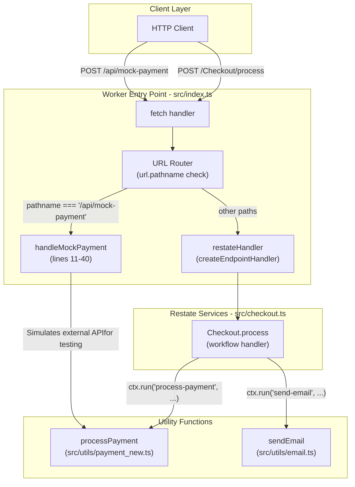
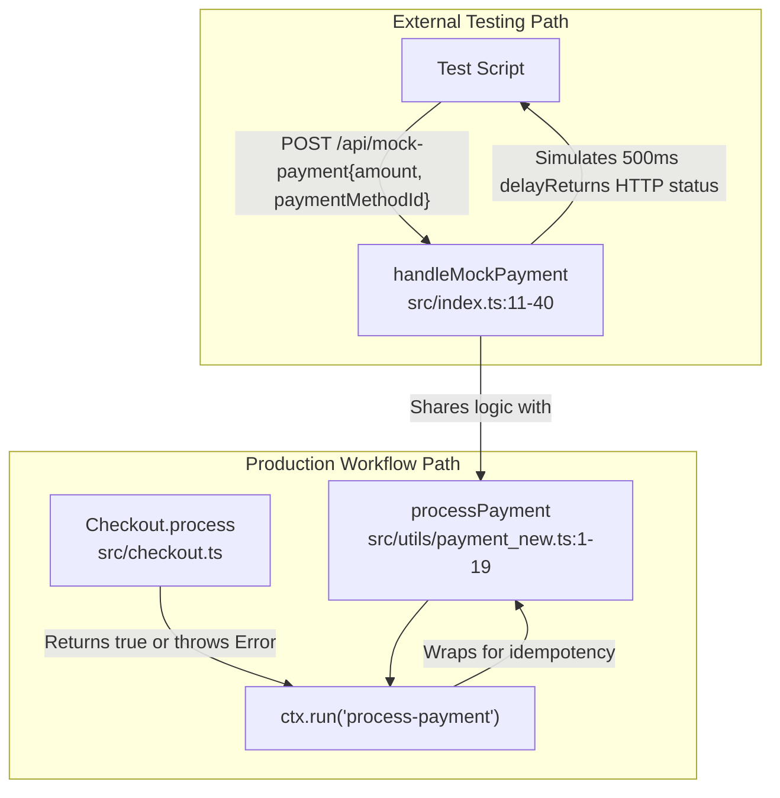
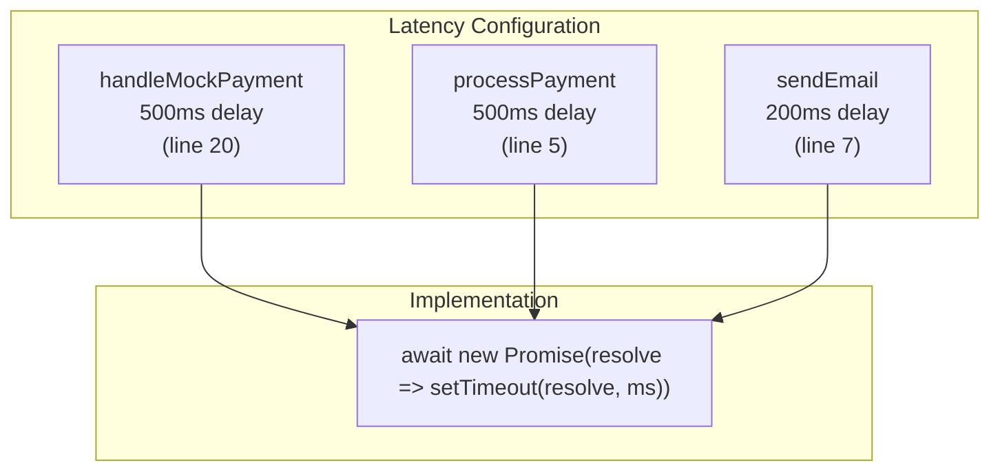

# Utilities & Supporting Services

> **Relevant source files**
> * [src/index.ts](https://github.com/philipz/restate-cloudflare-workers-poc/blob/513fd0f5/src/index.ts)
> * [src/utils/email.ts](https://github.com/philipz/restate-cloudflare-workers-poc/blob/513fd0f5/src/utils/email.ts)
> * [src/utils/payment_new.ts](https://github.com/philipz/restate-cloudflare-workers-poc/blob/513fd0f5/src/utils/payment_new.ts)

## Purpose and Scope

This section documents the utility modules and supporting services that enable the ticketing system to operate independently of external dependencies during development and testing. The utilities simulate payment processing and email delivery, allowing the system to demonstrate full end-to-end workflows without requiring real payment gateways or email service providers.

This page provides an overview of the utility layer. For detailed information:

* Payment simulation architecture: [Payment Simulation](/philipz/restate-cloudflare-workers-poc/4.1-payment-simulation)
* Email notification system: [Email Service](/philipz/restate-cloudflare-workers-poc/4.2-email-service)
* Core service orchestration: [Core Services](/philipz/restate-cloudflare-workers-poc/2-core-services)
* Checkout workflow integration: [Checkout Workflow](/philipz/restate-cloudflare-workers-poc/2.3-checkout-workflow)

---

## Utility Module Overview

The system implements three distinct utility components, each serving a specific role in simulating external dependencies:

| Utility | Location | Function Name | Purpose | Integration Point |
| --- | --- | --- | --- | --- |
| Mock Payment Gateway | [src/index.ts L11-L40](https://github.com/philipz/restate-cloudflare-workers-poc/blob/513fd0f5/src/index.ts#L11-L40) | `handleMockPayment` | HTTP endpoint simulating external payment API | Direct HTTP route `/api/mock-payment` |
| Payment Processor | [src/utils/payment_new.ts L1-L19](https://github.com/philipz/restate-cloudflare-workers-poc/blob/513fd0f5/src/utils/payment_new.ts#L1-L19) | `processPayment` | Simulate payment logic with configurable outcomes | Called via `ctx.run()` in Checkout workflow |
| Email Sender | [src/utils/email.ts L1-L10](https://github.com/philipz/restate-cloudflare-workers-poc/blob/513fd0f5/src/utils/email.ts#L1-L10) | `sendEmail` | Simulate email notification delivery | Called via `ctx.run()` in Checkout workflow |

**Sources:** [src/index.ts L11-L40](https://github.com/philipz/restate-cloudflare-workers-poc/blob/513fd0f5/src/index.ts#L11-L40)

 [src/utils/payment_new.ts L1-L19](https://github.com/philipz/restate-cloudflare-workers-poc/blob/513fd0f5/src/utils/payment_new.ts#L1-L19)

 [src/utils/email.ts L1-L10](https://github.com/philipz/restate-cloudflare-workers-poc/blob/513fd0f5/src/utils/email.ts#L1-L10)

---

## System Integration Architecture

The following diagram illustrates how utility modules integrate with the core Restate services and the request routing layer:



**Sources:** [src/index.ts L1-L51](https://github.com/philipz/restate-cloudflare-workers-poc/blob/513fd0f5/src/index.ts#L1-L51)

 [src/utils/payment_new.ts L1-L19](https://github.com/philipz/restate-cloudflare-workers-poc/blob/513fd0f5/src/utils/payment_new.ts#L1-L19)

 [src/utils/email.ts L1-L10](https://github.com/philipz/restate-cloudflare-workers-poc/blob/513fd0f5/src/utils/email.ts#L1-L10)

---

## Dual Payment Simulation Architecture

The system implements two distinct payment simulation mechanisms serving different purposes:

### Mock Payment Gateway Endpoint

The `handleMockPayment` function at [src/index.ts L11-L40](https://github.com/philipz/restate-cloudflare-workers-poc/blob/513fd0f5/src/index.ts#L11-L40)

 operates as a standalone HTTP endpoint at `/api/mock-payment`. This endpoint simulates an **external payment gateway API** that could be called by external systems or used for integration testing.

**Key characteristics:**

* **Direct HTTP access** - Bypasses Restate entirely
* **Synchronous response** - Returns immediately after 500ms delay
* **Three outcome scenarios** based on `paymentMethodId` parameter: * `card_decline` → HTTP 402 with error message * `card_error` → HTTP 503 (gateway timeout) * Any other value → HTTP 200 with transaction ID

### Payment Processing Function

The `processPayment` function at [src/utils/payment_new.ts L1-L19](https://github.com/philipz/restate-cloudflare-workers-poc/blob/513fd0f5/src/utils/payment_new.ts#L1-L19)

 provides **internal payment logic** called by the Checkout workflow through `ctx.run()`. This ensures exactly-once execution semantics within Restate's durable execution framework.

**Key characteristics:**

* **Wrapped in ctx.run()** - Provides idempotency and replay safety
* **Exception-based signaling** - Throws errors for failures
* **Same outcome logic** as mock gateway for consistency

The following diagram shows the parallel architectures:



**Sources:** [src/index.ts L11-L40](https://github.com/philipz/restate-cloudflare-workers-poc/blob/513fd0f5/src/index.ts#L11-L40)

 [src/utils/payment_new.ts L1-L19](https://github.com/philipz/restate-cloudflare-workers-poc/blob/513fd0f5/src/utils/payment_new.ts#L1-L19)

---

## Outcome Simulation Logic

All utility functions implement deterministic outcome logic based on input parameters, enabling comprehensive testing of all code paths:

### Payment Outcomes

Both payment utilities recognize three special `paymentMethodId` values:

| Payment Method ID | Behavior | HTTP Status (Mock) | Exception (Process) | Use Case |
| --- | --- | --- | --- | --- |
| `card_success` | Success after 500ms | 200 OK | Returns `true` | Happy path testing |
| `card_decline` | Declined payment | 402 Payment Required | Throws `"Payment declined"` | Saga compensation testing |
| `card_error` | Gateway timeout | 503 Service Unavailable | Throws `"Gateway timeout"` | Error handling testing |

Implementation references:

* Mock gateway: [src/index.ts L22-L34](https://github.com/philipz/restate-cloudflare-workers-poc/blob/513fd0f5/src/index.ts#L22-L34)
* Processing function: [src/utils/payment_new.ts L7-L15](https://github.com/philipz/restate-cloudflare-workers-poc/blob/513fd0f5/src/utils/payment_new.ts#L7-L15)

### Email Outcomes

The `sendEmail` function at [src/utils/email.ts L1-L10](https://github.com/philipz/restate-cloudflare-workers-poc/blob/513fd0f5/src/utils/email.ts#L1-L10)

 always succeeds after a 200ms simulated network delay. It logs the email details to the console for development verification.

**Sources:** [src/index.ts L22-L34](https://github.com/philipz/restate-cloudflare-workers-poc/blob/513fd0f5/src/index.ts#L22-L34)

 [src/utils/payment_new.ts L7-L15](https://github.com/philipz/restate-cloudflare-workers-poc/blob/513fd0f5/src/utils/payment_new.ts#L7-L15)

 [src/utils/email.ts L1-L10](https://github.com/philipz/restate-cloudflare-workers-poc/blob/513fd0f5/src/utils/email.ts#L1-L10)

---

## Timing and Latency Simulation

All utilities introduce artificial delays to simulate real-world network latency:



These delays serve two purposes:

1. **Realistic testing** - Simulates actual API call latency
2. **Race condition validation** - Ensures asynchronous handling works correctly

**Sources:** [src/index.ts L20](https://github.com/philipz/restate-cloudflare-workers-poc/blob/513fd0f5/src/index.ts#L20-L20)

 [src/utils/payment_new.ts L5](https://github.com/philipz/restate-cloudflare-workers-poc/blob/513fd0f5/src/utils/payment_new.ts#L5-L5)

 [src/utils/email.ts L7](https://github.com/philipz/restate-cloudflare-workers-poc/blob/513fd0f5/src/utils/email.ts#L7-L7)

---

## Integration with Durable Execution

The payment and email utilities integrate with Restate's durable execution framework through `ctx.run()` wrappers in the Checkout workflow. This integration provides critical guarantees:

### Exactly-Once Execution

When the Checkout workflow calls `ctx.run("process-payment", () => processPayment(...))`, Restate journals the function invocation and result. If the workflow is interrupted after the payment succeeds but before confirmation, replay will skip re-executing the payment function and use the journaled result instead.

### Non-Determinism Isolation

Since `processPayment` and `sendEmail` contain non-deterministic operations (`setTimeout`, `crypto.randomUUID` in mock gateway), they must be wrapped in `ctx.run()`. Restate treats these as side-effects, executing them only once and storing the result for deterministic replay.

### Error Propagation

Exceptions thrown by utility functions (e.g., `"Payment declined"`) propagate through `ctx.run()` to the workflow, triggering compensation logic as documented in [Checkout Workflow](/philipz/restate-cloudflare-workers-poc/2.3-checkout-workflow).

**Sources:** [src/utils/payment_new.ts L1-L19](https://github.com/philipz/restate-cloudflare-workers-poc/blob/513fd0f5/src/utils/payment_new.ts#L1-L19)

 [src/utils/email.ts L1-L10](https://github.com/philipz/restate-cloudflare-workers-poc/blob/513fd0f5/src/utils/email.ts#L1-L10)

---

## Testing and Development Usage

### Local Development

During local development with `test-all.sh`, utilities enable testing without external dependencies:

```css
# Example test using payment simulation
curl -X POST http://localhost:8080/Checkout/process \
  -H "Content-Type: application/json" \
  -d '{"ticketId": "seat-1", "userId": "user-1", "paymentMethodId": "card_success"}'
```

### Load Testing

The K6 load tests (`load-test.js`, `load-test-local.js`) leverage the configurable payment outcomes to create realistic traffic patterns:

* 80% requests use `card_success`
* 10% use `card_decline` (triggers compensation)
* 10% use `card_error` (tests timeout handling)

This distribution ensures all code paths receive coverage during load testing. See [Load Testing](/philipz/restate-cloudflare-workers-poc/5.3-load-testing) for details.

**Sources:** [src/index.ts L11-L40](https://github.com/philipz/restate-cloudflare-workers-poc/blob/513fd0f5/src/index.ts#L11-L40)

 [src/utils/payment_new.ts L1-L19](https://github.com/philipz/restate-cloudflare-workers-poc/blob/513fd0f5/src/utils/payment_new.ts#L1-L19)

---

## Mock Gateway Endpoint Details

The `/api/mock-payment` endpoint at [src/index.ts L11-L40](https://github.com/philipz/restate-cloudflare-workers-poc/blob/513fd0f5/src/index.ts#L11-L40)

 implements a minimal payment gateway API:

### Request Format

```
POST /api/mock-payment
Content-Type: application/json

{
  "amount": 100,
  "paymentMethodId": "card_success"
}
```

### Response Format

**Success (200):**

```json
{
  "success": true,
  "transactionId": "550e8400-e29b-41d4-a716-446655440000"
}
```

**Decline (402):**

```json
{
  "error": "Insufficient funds"
}
```

**Gateway Error (503):**

```json
{
  "error": "Gateway timeout"
}
```

### Method Validation

The endpoint returns HTTP 405 for non-POST requests at [src/index.ts L12-L14](https://github.com/philipz/restate-cloudflare-workers-poc/blob/513fd0f5/src/index.ts#L12-L14)

**Sources:** [src/index.ts L11-L40](https://github.com/philipz/restate-cloudflare-workers-poc/blob/513fd0f5/src/index.ts#L11-L40)

---

## Utility Function Signatures

### processPayment

```javascript
async function processPayment(
  amount: number,
  paymentMethodId: string
): Promise<boolean>
```

**Parameters:**

* `amount`: Transaction amount (not validated, used for logging)
* `paymentMethodId`: Controls outcome (`card_success`/`card_decline`/`card_error`)

**Returns:** `true` on success

**Throws:** `Error` with message describing failure

**Location:** [src/utils/payment_new.ts L1-L19](https://github.com/philipz/restate-cloudflare-workers-poc/blob/513fd0f5/src/utils/payment_new.ts#L1-L19)

### sendEmail

```javascript
async function sendEmail(
  to: string,
  subject: string,
  body: string
): Promise<void>
```

**Parameters:**

* `to`: Recipient email address (logged, not sent)
* `subject`: Email subject line
* `body`: Email body content

**Returns:** `void` (always succeeds)

**Location:** [src/utils/email.ts L1-L10](https://github.com/philipz/restate-cloudflare-workers-poc/blob/513fd0f5/src/utils/email.ts#L1-L10)

### handleMockPayment

```javascript
async function handleMockPayment(
  request: Request
): Promise<Response>
```

**Parameters:**

* `request`: Cloudflare Workers Request object

**Returns:** Cloudflare Workers Response object with JSON body

**Location:** [src/index.ts L11-L40](https://github.com/philipz/restate-cloudflare-workers-poc/blob/513fd0f5/src/index.ts#L11-L40)

**Sources:** [src/utils/payment_new.ts L1-L19](https://github.com/philipz/restate-cloudflare-workers-poc/blob/513fd0f5/src/utils/payment_new.ts#L1-L19)

 [src/utils/email.ts L1-L10](https://github.com/philipz/restate-cloudflare-workers-poc/blob/513fd0f5/src/utils/email.ts#L1-L10)

 [src/index.ts L11-L40](https://github.com/philipz/restate-cloudflare-workers-poc/blob/513fd0f5/src/index.ts#L11-L40)

---

## Design Rationale

### Why Two Payment Mechanisms?

The dual implementation serves distinct purposes:

1. **Mock Gateway Endpoint** (`handleMockPayment`): * Simulates external API for integration tests * Allows testing HTTP client code * Provides realistic multi-service architecture for demos
2. **Payment Function** (`processPayment`): * Integrates with Restate's durable execution * Provides exactly-once semantics * Enables saga compensation patterns

This separation follows the principle of **simulating both internal and external interfaces** to enable comprehensive testing scenarios.

### Why Hardcoded Delays?

The fixed delays (500ms for payment, 200ms for email) provide:

* Consistent timing across test runs
* Sufficient latency to expose async bugs
* Fast enough for rapid local testing
* Realistic enough to validate timeout handling

**Sources:** [src/index.ts L11-L40](https://github.com/philipz/restate-cloudflare-workers-poc/blob/513fd0f5/src/index.ts#L11-L40)

 [src/utils/payment_new.ts L1-L19](https://github.com/philipz/restate-cloudflare-workers-poc/blob/513fd0f5/src/utils/payment_new.ts#L1-L19)

 [src/utils/email.ts L1-L10](https://github.com/philipz/restate-cloudflare-workers-poc/blob/513fd0f5/src/utils/email.ts#L1-L10)