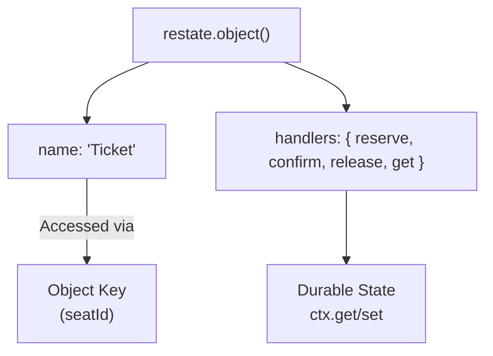
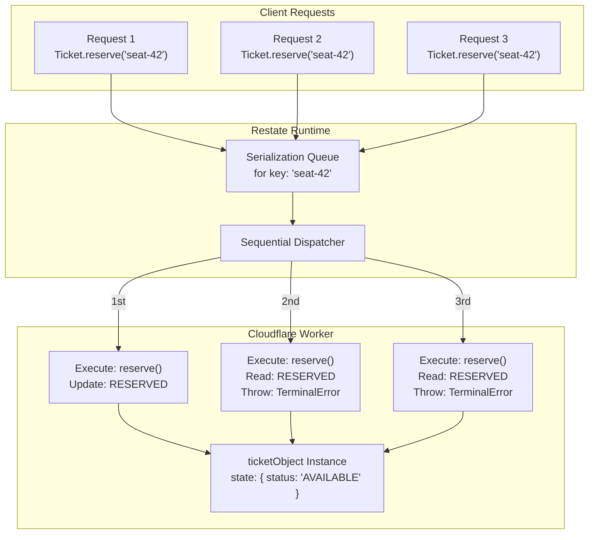
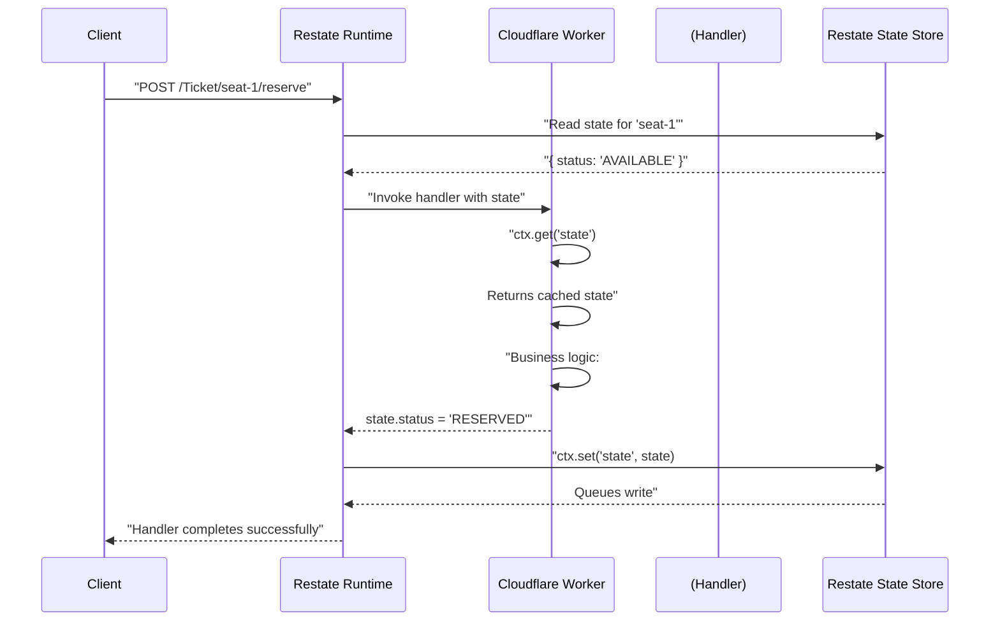
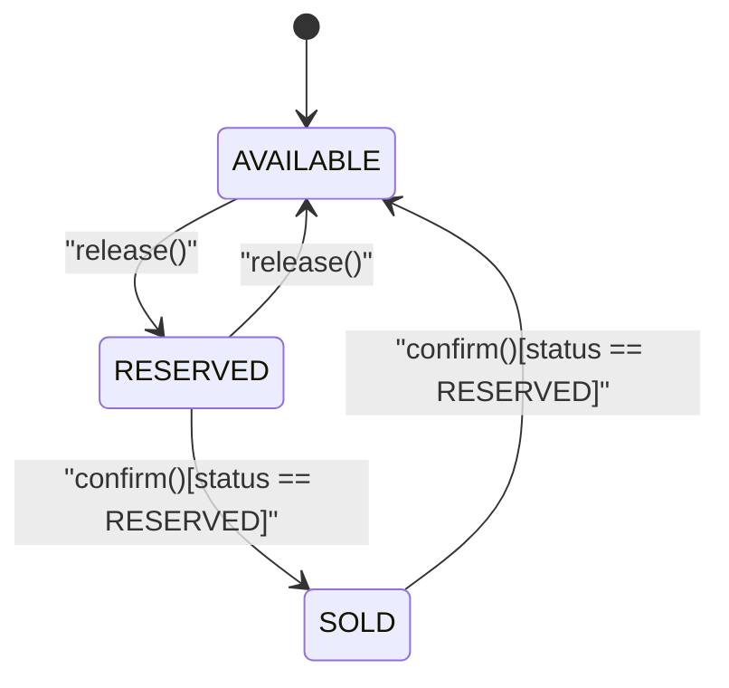
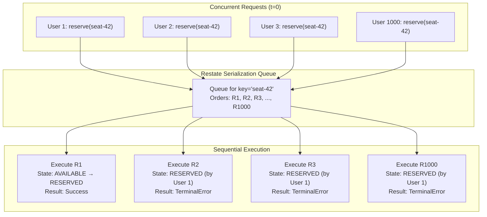
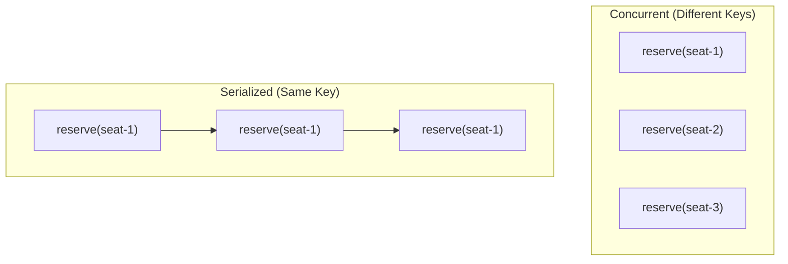

# Virtual Objects & Serialization

> **Relevant source files**
> * [PoC.md](https://github.com/philipz/restate-cloudflare-workers-poc/blob/513fd0f5/PoC.md)
> * [README.md](https://github.com/philipz/restate-cloudflare-workers-poc/blob/513fd0f5/README.md)
> * [src/game.ts](https://github.com/philipz/restate-cloudflare-workers-poc/blob/513fd0f5/src/game.ts)

## Purpose and Scope

This document explains Restate's Virtual Objects pattern and automatic serialization mechanism as implemented in the nexus-poc ticketing system. Virtual Objects provide stateful, concurrent-safe actors that eliminate race conditions in high-contention scenarios without requiring explicit locks or database transactions.

For information about how Virtual Objects are orchestrated within multi-step business processes, see [Durable Execution & ctx.run](/philipz/restate-cloudflare-workers-poc/8.2-durable-execution-and-ctx.run). For the Saga pattern implementation that uses Virtual Objects as transactional units, see [Saga Pattern & Compensation](/philipz/restate-cloudflare-workers-poc/8.3-saga-pattern-and-compensation). For specific implementation details of the Ticket and SeatMap objects, see [Ticket Virtual Object](/philipz/restate-cloudflare-workers-poc/2.1-ticket-virtual-object) and [SeatMap Virtual Object](/philipz/restate-cloudflare-workers-poc/2.2-seatmap-virtual-object).

---

## Virtual Objects: Actor Model Implementation

Virtual Objects are Restate's implementation of the Actor Model pattern. Each Virtual Object instance is identified by a unique key and maintains its own isolated state. Unlike stateless services, Virtual Objects provide durable, mutable state that survives process restarts and infrastructure failures.

### Key Characteristics

| Characteristic | Description | Implementation Detail |
| --- | --- | --- |
| **Keyed Isolation** | Each object instance is identified by a unique key (e.g., `"seat-1"`, `"seat-42"`) | Key is passed as the second parameter to `ctx.objectClient()` |
| **State Durability** | State persists in Restate's key-value store | Accessed via `ctx.get()` and `ctx.set()` |
| **Serialized Access** | Concurrent requests to the same key execute sequentially | Automatic - enforced by Restate runtime |
| **Independent Instances** | Different keys execute concurrently | `seat-1` and `seat-2` process requests in parallel |

### Virtual Objects in the Codebase

The system defines two Virtual Objects using `restate.object()`:

```
ticketObject     - Key: seatId (e.g., "seat-1", "seat-42")
                   State: { status, reservedBy, reservedUntil }
                   
seatMapObject    - Key: "global" (singleton)
                   State: { map: Record<seatId, status> }
```

**Virtual Object Definition Pattern**



Sources: [src/game.ts L15-L84](https://github.com/philipz/restate-cloudflare-workers-poc/blob/513fd0f5/src/game.ts#L15-L84)

 [README.md L11-L13](https://github.com/philipz/restate-cloudflare-workers-poc/blob/513fd0f5/README.md#L11-L13)

---

## Automatic Serialization by Key

Restate's core guarantee for Virtual Objects is **automatic serialization**: all requests targeting the same object key are processed sequentially, even when they arrive concurrently from thousands of clients.

### Serialization Mechanism

When multiple requests target the same Virtual Object instance (same key), Restate maintains an internal queue and ensures handlers execute one at a time against that instance's state.



### Race Condition Prevention

The serialization guarantee eliminates classic race conditions without requiring developers to implement locking mechanisms.

**Concurrent Booking Scenario**

| Timeline | Request 1 (user-1) | Request 2 (user-2) | Ticket State |
| --- | --- | --- | --- |
| T0 | Arrives | Arrives | `AVAILABLE` |
| T1 | Enters handler | Queued | `AVAILABLE` |
| T2 | Reads state: `AVAILABLE` | Queued | `AVAILABLE` |
| T3 | Sets state: `RESERVED` by user-1 | Queued | `RESERVED` |
| T4 | Exits handler | Enters handler | `RESERVED` |
| T5 | - | Reads state: `RESERVED` | `RESERVED` |
| T6 | - | Throws `TerminalError` | `RESERVED` |

**Key Implementation Details**

The `reserve` handler in [src/game.ts L18-L43](https://github.com/philipz/restate-cloudflare-workers-poc/blob/513fd0f5/src/game.ts#L18-L43)

 demonstrates this pattern:

1. **Read Current State**: `const state = await ctx.get<TicketState>("state")`
2. **Check Preconditions**: * If `status === "SOLD"` → throw error * If `status === "RESERVED" && reservedBy !== userId` → throw error
3. **Conditional Update**: Only update to `RESERVED` if `status === "AVAILABLE"`
4. **Persist State**: `ctx.set("state", state)`

Because Restate serializes execution, Request 2 always sees the updated state written by Request 1, preventing double-booking.

Sources: [src/game.ts L18-L43](https://github.com/philipz/restate-cloudflare-workers-poc/blob/513fd0f5/src/game.ts#L18-L43)

 [README.md L11-L13](https://github.com/philipz/restate-cloudflare-workers-poc/blob/513fd0f5/README.md#L11-L13)

 [PoC.md L96-L98](https://github.com/philipz/restate-cloudflare-workers-poc/blob/513fd0f5/PoC.md#L96-L98)

---

## State Persistence and Lifecycle

### State Access Primitives

Virtual Objects interact with durable state through two core context methods:

| Method | Signature | Behavior | Durability |
| --- | --- | --- | --- |
| `ctx.get<T>()` | `await ctx.get<T>(key: string): Promise<T \| undefined>` | Retrieves state value by key; returns `undefined` if not set | Read from Restate's KV store |
| `ctx.set()` | `ctx.set(key: string, value: any): void` | Queues state update; not immediately persisted | Written atomically on handler success |

**State Lifecycle Diagram**



### Write Batching and Atomicity

State updates via `ctx.set()` are **batched and written atomically** only when the handler completes successfully:

* **Success**: All `ctx.set()` calls in the handler are written atomically to Restate's state store
* **Failure**: If the handler throws an error or crashes, no state changes are persisted
* **Idempotency**: On retry/replay, Restate replays the handler with the original state, ensuring exactly-once state semantics

**Example from Ticket Object**

```javascript
// src/game.ts:33-40
if (state.status === "AVAILABLE") {
    state.status = "RESERVED";
    state.reservedBy = userId;
    const now = await ctx.run("now", () => Date.now());
    state.reservedUntil = now + 15 * 60 * 1000;
    ctx.set("state", state);  // ← Queued, not yet persisted
}
// State persists only if handler completes without throwing
```

If the Worker crashes between setting `state.status` and `ctx.set()`, the entire handler is retried from the beginning with the original `AVAILABLE` state.

Sources: [src/game.ts L33-L40](https://github.com/philipz/restate-cloudflare-workers-poc/blob/513fd0f5/src/game.ts#L33-L40)

 [PoC.md L153-L156](https://github.com/philipz/restate-cloudflare-workers-poc/blob/513fd0f5/PoC.md#L153-L156)

---

## Ticket Object: Serialization in Practice

The `ticketObject` is defined in [src/game.ts L15-L84](https://github.com/philipz/restate-cloudflare-workers-poc/blob/513fd0f5/src/game.ts#L15-L84)

 and manages individual seat inventory using the Virtual Object pattern.

### Object Structure

```yaml
Object Name:    "Ticket"
Key:            seatId (e.g., "seat-1", "seat-42", "seat-50")
State Schema:   TicketState {
                  status: "AVAILABLE" | "RESERVED" | "SOLD"
                  reservedBy: string | null
                  reservedUntil: number | null
                }
```

### Handler Methods

| Handler | Purpose | State Transitions | Error Conditions |
| --- | --- | --- | --- |
| `reserve(userId)` | Lock seat for user | `AVAILABLE` → `RESERVED` | Throws if `SOLD` or already `RESERVED` by different user |
| `confirm()` | Finalize purchase | `RESERVED` → `SOLD` | Throws if not currently `RESERVED` |
| `release()` | Free seat | Any → `AVAILABLE` | Never fails |
| `get()` | Query state | No change | Never fails |

**State Machine**



### Serialization Example: High Concurrency

**Scenario**: 1000 concurrent requests attempt to reserve `seat-42`



**Handler Code: Reserve Logic**

The critical section in [src/game.ts L25-L40](https://github.com/philipz/restate-cloudflare-workers-poc/blob/513fd0f5/src/game.ts#L25-L40)

:

```sql
Lines 25-27: Check if already SOLD
Lines 29-31: Check if RESERVED by different user
Lines 33-40: Update state only if AVAILABLE
```

Because Restate guarantees that only one handler executes at a time for `seat-42`, the first request successfully transitions to `RESERVED`, and all subsequent requests see the updated state and fail with `TerminalError("Ticket is currently reserved")`.

Sources: [src/game.ts L15-L84](https://github.com/philipz/restate-cloudflare-workers-poc/blob/513fd0f5/src/game.ts#L15-L84)

 [README.md L81-L84](https://github.com/philipz/restate-cloudflare-workers-poc/blob/513fd0f5/README.md#L81-L84)

---

## SeatMap Object: Singleton Pattern with Bulk Operations

The `seatMapObject` defined in [src/game.ts L92-L141](https://github.com/philipz/restate-cloudflare-workers-poc/blob/513fd0f5/src/game.ts#L92-L141)

 demonstrates a different Virtual Object usage pattern: a singleton object coordinating multiple other objects.

### Singleton Key Strategy

```yaml
Object Name:    "SeatMap"
Key:            "global" (always the same - single instance)
State Schema:   { map: Record<seatId, status> }
                e.g., { "seat-1": "SOLD", "seat-2": "AVAILABLE", ... }
```

By using a constant key `"global"`, all requests to SeatMap route to the same Virtual Object instance, providing a centralized coordination point.

### Cross-Object Communication

The `resetAll` handler in [src/game.ts L118-L132](https://github.com/philipz/restate-cloudflare-workers-poc/blob/513fd0f5/src/game.ts#L118-L132)

 demonstrates how one Virtual Object can invoke methods on other Virtual Objects:

```mermaid
sequenceDiagram
  participant Client
  participant SeatMap
  participant (key: 'global')
  participant Ticket
  participant (key: 'seat-1')
  participant (key: 'seat-2')
  participant (key: 'seat-50')

  Client->>SeatMap: "resetAll()"
  note over SeatMap,(key: 'global'): "Reset local map state
  SeatMap->>SeatMap: "map[seat-1] = AVAILABLE
  note over SeatMap,(key: 'global'): "Release all Ticket objects
  SeatMap->>Ticket: ...
  Ticket-->>SeatMap: map[seat-50] = AVAILABLE"
  SeatMap->>(key: 'seat-2'): "ctx.objectClient(ticketObject, 'seat-1').release()"
  (key: 'seat-2')-->>SeatMap: "Success"
  SeatMap->>(key: 'seat-50'): "ctx.objectClient(ticketObject, 'seat-2').release()"
  (key: 'seat-50')-->>SeatMap: "Success"
  SeatMap-->>Client: "ctx.objectClient(ticketObject, 'seat-50').release()"
```

**Code Implementation**

[src/game.ts L129-L131](https://github.com/philipz/restate-cloudflare-workers-poc/blob/513fd0f5/src/game.ts#L129-L131)

 shows the bulk operation:

```javascript
for (let i = 1; i <= 50; i++) {
    await ctx.objectClient(ticketObject, `seat-${i}`).release();
}
```

Each `ctx.objectClient()` call creates a typed client for a different Ticket instance. Restate routes each call to the appropriate instance based on the key (`seat-1`, `seat-2`, etc.), and because each Ticket has a different key, these can execute in parallel.

### Fire-and-Forget with objectSendClient

The auto-reset mechanism in [src/game.ts L113](https://github.com/philipz/restate-cloudflare-workers-poc/blob/513fd0f5/src/game.ts#L113-L113)

 demonstrates asynchronous invocation:

```
ctx.objectSendClient(seatMapObject, "global").resetAll();
```

`objectSendClient` returns immediately without waiting for `resetAll()` to complete. This prevents blocking the current handler while the background reset operation processes.

Sources: [src/game.ts L92-L141](https://github.com/philipz/restate-cloudflare-workers-poc/blob/513fd0f5/src/game.ts#L92-L141)

 [src/game.ts L113](https://github.com/philipz/restate-cloudflare-workers-poc/blob/513fd0f5/src/game.ts#L113-L113)

 [src/game.ts L129-L131](https://github.com/philipz/restate-cloudflare-workers-poc/blob/513fd0f5/src/game.ts#L129-L131)

---

## Serialization vs Concurrency Trade-offs

### When Serialization Helps

Virtual Object serialization is ideal for:

1. **Inventory Management**: Preventing double-booking, overselling (Ticket objects)
2. **Sequential Workflows**: Ensuring state transitions happen in order
3. **Conflict-Free Updates**: Avoiding lost updates in read-modify-write cycles

### Concurrency Across Keys

While requests to the **same key** serialize, requests to **different keys** execute concurrently:



This design allows the system to handle thousands of concurrent bookings across different seats while maintaining perfect consistency for each individual seat.

### Comparison to Traditional Approaches

| Approach | Concurrency Control | State Durability | Code Complexity |
| --- | --- | --- | --- |
| **Virtual Objects** | Automatic serialization by key | Built-in (Restate KV store) | Low - no locks needed |
| **Database Row Locks** | `SELECT FOR UPDATE` + transactions | Database persistence | Medium - explicit lock management |
| **Optimistic Locking** | Version numbers + retry loops | Database persistence | High - retry logic, version tracking |
| **Distributed Locks (Redis)** | Manual lock acquisition/release | Separate from locks | High - deadlock prevention, TTL management |

Sources: [README.md L11-L13](https://github.com/philipz/restate-cloudflare-workers-poc/blob/513fd0f5/README.md#L11-L13)

 [PoC.md L96-L131](https://github.com/philipz/restate-cloudflare-workers-poc/blob/513fd0f5/PoC.md#L96-L131)

---

## Summary

Virtual Objects in Restate provide a powerful abstraction for building stateful, concurrent-safe applications in serverless environments:

* **Actor Model**: Each object instance (keyed by unique identifier) owns isolated state
* **Automatic Serialization**: Concurrent requests to the same key execute sequentially without explicit locks
* **Durable State**: `ctx.get()` and `ctx.set()` provide persistent, atomic state management
* **Race-Free**: Eliminates classic concurrency bugs (double-booking, lost updates) by design
* **Horizontal Scalability**: Different keys execute concurrently across the Worker fleet

The Ticket and SeatMap objects demonstrate two patterns:

1. **Ticket**: Many instances (one per seat) with independent state
2. **SeatMap**: Singleton instance coordinating bulk operations across multiple Ticket objects

This architecture enables the nexus-poc system to handle high-concurrency ticket sales with strong consistency guarantees while maintaining simple, sequential code logic.

Sources: [src/game.ts L1-L141](https://github.com/philipz/restate-cloudflare-workers-poc/blob/513fd0f5/src/game.ts#L1-L141)

 [README.md L11-L16](https://github.com/philipz/restate-cloudflare-workers-poc/blob/513fd0f5/README.md#L11-L16)

 [PoC.md L94-L166](https://github.com/philipz/restate-cloudflare-workers-poc/blob/513fd0f5/PoC.md#L94-L166)