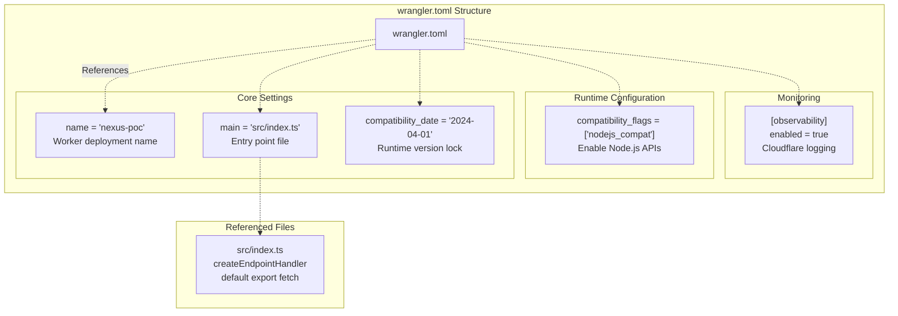
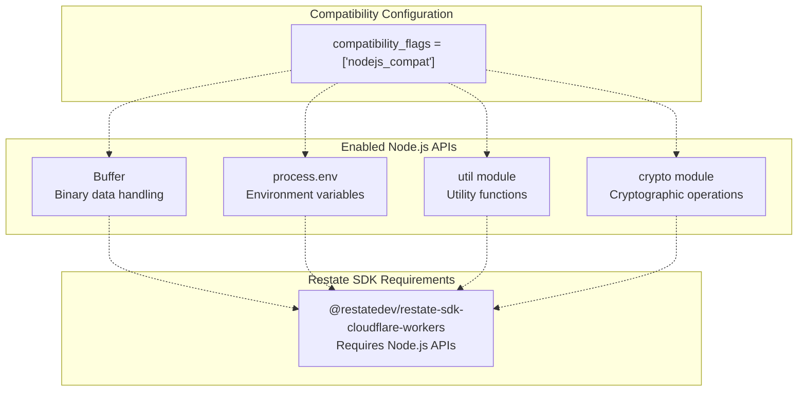
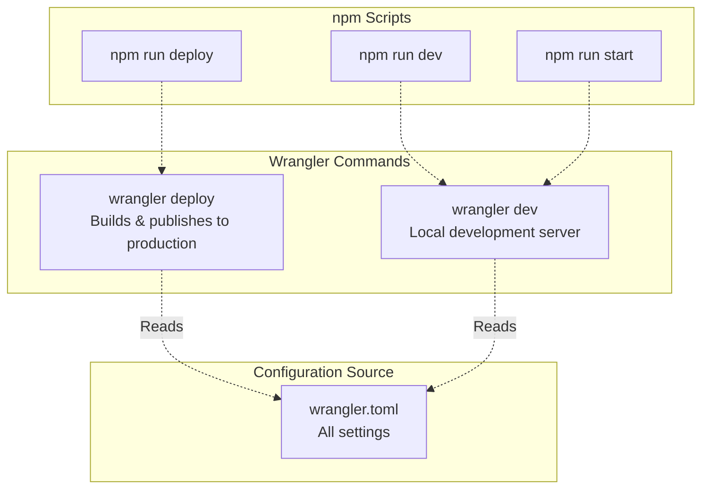
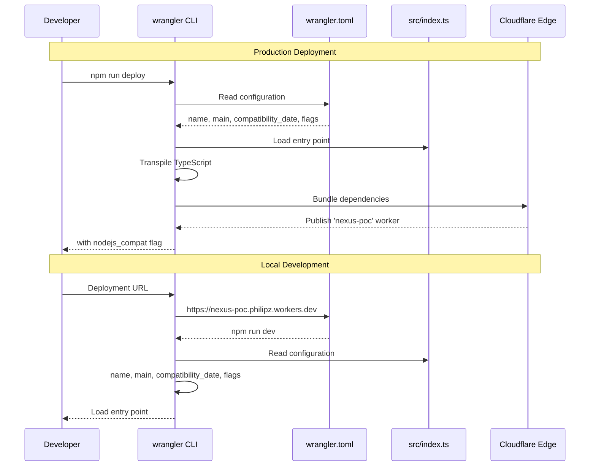

# Wrangler Configuration

> **Relevant source files**
> * [package.json](https://github.com/philipz/restate-cloudflare-workers-poc/blob/513fd0f5/package.json)
> * [wrangler.toml](https://github.com/philipz/restate-cloudflare-workers-poc/blob/513fd0f5/wrangler.toml)

## Purpose and Scope

This document details the `wrangler.toml` configuration file, which defines the deployment settings, runtime compatibility, and observability options for the `nexus-poc` Cloudflare Worker. The configuration specifies the worker name, entry point, Node.js compatibility flags, and monitoring settings required for both local development and production deployment.

For information about the worker's entry point implementation, see [Request Routing & Entry Point](/philipz/restate-cloudflare-workers-poc/3-request-routing-and-entry-point). For deployment procedures using this configuration, see [Cloud Deployment](/philipz/restate-cloudflare-workers-poc/6.2-cloud-deployment). For local development setup, see [Local Development Setup](/philipz/restate-cloudflare-workers-poc/6.1-local-development-setup).

---

## Configuration File Overview

The `wrangler.toml` file is located at the project root and contains all settings required by the Wrangler CLI to build, deploy, and run the Cloudflare Worker. It uses TOML (Tom's Obvious, Minimal Language) format for configuration.

### Configuration File Structure

**Sources:** [wrangler.toml L1-L8](https://github.com/philipz/restate-cloudflare-workers-poc/blob/513fd0f5/wrangler.toml#L1-L8)

---

## Core Configuration Settings

The following table describes the fundamental configuration options that define the worker's identity and entry point:

| Setting | Value | Description |
| --- | --- | --- |
| `name` | `"nexus-poc"` | The unique identifier for the deployed worker. This name appears in the Cloudflare dashboard and determines the worker's URL pattern (e.g., `nexus-poc.philipz.workers.dev`). |
| `main` | `"src/index.ts"` | The TypeScript entry point file containing the worker's `fetch` handler. This file must export a default object with a `fetch` method. |
| `compatibility_date` | `"2024-04-01"` | Locks the worker to the Cloudflare Workers runtime behavior as of April 1, 2024. This ensures consistent behavior across deployments and prevents breaking changes from automatic runtime updates. |

### Worker Name

The `name` field [wrangler.toml L1](https://github.com/philipz/restate-cloudflare-workers-poc/blob/513fd0f5/wrangler.toml#L1-L1)

 defines the deployment identifier. This value:

* Determines the subdomain for the default `workers.dev` deployment
* Acts as the primary key for the worker in the Cloudflare account
* Must be unique within the account

### Entry Point

The `main` field [wrangler.toml L2](https://github.com/philipz/restate-cloudflare-workers-poc/blob/513fd0f5/wrangler.toml#L2-L2)

 points to `src/index.ts`, which implements the `createEndpointHandler` from the Restate SDK and exports a `fetch` handler. The TypeScript file is transpiled during deployment.

### Compatibility Date

The `compatibility_date` field [wrangler.toml L3](https://github.com/philipz/restate-cloudflare-workers-poc/blob/513fd0f5/wrangler.toml#L3-L3)

 locks the runtime version to avoid unexpected behavior changes. Cloudflare continuously updates the Workers runtime, and this setting ensures the worker uses the API surface and behavior from the specified date.

**Sources:** [wrangler.toml L1-L3](https://github.com/philipz/restate-cloudflare-workers-poc/blob/513fd0f5/wrangler.toml#L1-L3)

---

## Compatibility Flags

The `compatibility_flags` array [wrangler.toml L4](https://github.com/philipz/restate-cloudflare-workers-poc/blob/513fd0f5/wrangler.toml#L4-L4)

 enables optional runtime features that modify the worker's execution environment.

### nodejs_compat Flag

The `nodejs_compat` flag [wrangler.toml L4](https://github.com/philipz/restate-cloudflare-workers-poc/blob/513fd0f5/wrangler.toml#L4-L4)

 is **required** for the Restate SDK to function correctly. It enables:

* **Buffer API**: Binary data manipulation required for Restate's serialization protocol
* **process.env**: Environment variable access for configuration (e.g., `RESTATE_AUTH_TOKEN`)
* **util module**: Utility functions used by the SDK's internal implementation
* **crypto module**: Cryptographic operations for secure communication with Restate servers

Without this flag, the worker would fail at runtime with errors related to missing Node.js globals.

**Sources:** [wrangler.toml L4](https://github.com/philipz/restate-cloudflare-workers-poc/blob/513fd0f5/wrangler.toml#L4-L4)

 [package.json L16](https://github.com/philipz/restate-cloudflare-workers-poc/blob/513fd0f5/package.json#L16-L16)

---

## Observability Configuration

The `[observability]` section [wrangler.toml L6-L7](https://github.com/philipz/restate-cloudflare-workers-poc/blob/513fd0f5/wrangler.toml#L6-L7)

 enables Cloudflare's built-in logging and monitoring infrastructure.

### Observability Settings

| Setting | Value | Effect |
| --- | --- | --- |
| `enabled` | `true` | Activates Cloudflare's observability features, including request logs, performance metrics, and error tracking accessible through the Cloudflare dashboard. |

When enabled, the following data is collected:

* **Request logs**: Timestamp, status code, response time, and origin information
* **Console output**: All `console.log`, `console.error`, and `console.warn` statements
* **Errors**: Unhandled exceptions and stack traces
* **Performance metrics**: CPU time, memory usage, and subrequest counts

This data is accessible via:

* Cloudflare Dashboard → Workers → Analytics
* Logpush (for export to external systems)
* Workers Logs API

**Sources:** [wrangler.toml L6-L7](https://github.com/philipz/restate-cloudflare-workers-poc/blob/513fd0f5/wrangler.toml#L6-L7)

---

## Integration with npm Scripts

The `package.json` file defines convenience scripts that invoke Wrangler with this configuration:

### Script Definitions

| Script | Command | Purpose |
| --- | --- | --- |
| `deploy` | `wrangler deploy` | Builds the TypeScript source, bundles dependencies, and publishes the worker to Cloudflare's global network using settings from `wrangler.toml`. |
| `dev` | `wrangler dev` | Starts a local development server using miniflare, enabling rapid iteration without deploying to production. |
| `start` | `wrangler dev` | Alias for `dev`, providing an alternative entry point for local development. |

All three commands automatically load configuration from `wrangler.toml` in the project root.

**Sources:** [package.json L5-L8](https://github.com/philipz/restate-cloudflare-workers-poc/blob/513fd0f5/package.json#L5-L8)

---

## Deployment Context

The following diagram illustrates how the Wrangler configuration fits into the deployment workflow:

### Deployment Process

When executing `wrangler deploy` [package.json L6](https://github.com/philipz/restate-cloudflare-workers-poc/blob/513fd0f5/package.json#L6-L6)

:

1. **Configuration Loading**: Wrangler reads `wrangler.toml` [wrangler.toml L1-L8](https://github.com/philipz/restate-cloudflare-workers-poc/blob/513fd0f5/wrangler.toml#L1-L8)
2. **Entry Point Resolution**: Loads `src/index.ts` [wrangler.toml L2](https://github.com/philipz/restate-cloudflare-workers-poc/blob/513fd0f5/wrangler.toml#L2-L2)
3. **TypeScript Compilation**: Transpiles TypeScript to JavaScript
4. **Bundling**: Includes `@restatedev/restate-sdk-cloudflare-workers` [package.json L16](https://github.com/philipz/restate-cloudflare-workers-poc/blob/513fd0f5/package.json#L16-L16)
5. **Runtime Settings**: Applies `compatibility_date` and `nodejs_compat` flag
6. **Upload**: Publishes to Cloudflare's global network
7. **Observability**: Enables logging if configured

### Local Development Process

When executing `wrangler dev` [package.json L7-L8](https://github.com/philipz/restate-cloudflare-workers-poc/blob/513fd0f5/package.json#L7-L8)

:

1. **Configuration Loading**: Reads `wrangler.toml`
2. **Miniflare Initialization**: Starts local Workers runtime emulator
3. **Compatibility Application**: Enables Node.js APIs via `nodejs_compat`
4. **Hot Reload**: Watches `src/index.ts` for changes
5. **Local Server**: Exposes worker at `http://localhost:8787`

**Sources:** [wrangler.toml L1-L8](https://github.com/philipz/restate-cloudflare-workers-poc/blob/513fd0f5/wrangler.toml#L1-L8)

 [package.json L5-L8](https://github.com/philipz/restate-cloudflare-workers-poc/blob/513fd0f5/package.json#L5-L8)

---

## Configuration Reference Table

The following table provides a complete reference of all settings in `wrangler.toml`:

| Section | Key | Value | Required | Purpose |
| --- | --- | --- | --- | --- |
| (root) | `name` | `"nexus-poc"` | Yes | Worker deployment identifier |
| (root) | `main` | `"src/index.ts"` | Yes | Entry point file path |
| (root) | `compatibility_date` | `"2024-04-01"` | Yes | Runtime version lock |
| (root) | `compatibility_flags` | `["nodejs_compat"]` | Yes* | Enable Node.js APIs for Restate SDK |
| `[observability]` | `enabled` | `true` | No | Enable Cloudflare logging and monitoring |

* Required for Restate SDK functionality

**Sources:** [wrangler.toml L1-L8](https://github.com/philipz/restate-cloudflare-workers-poc/blob/513fd0f5/wrangler.toml#L1-L8)

---

## Related Configuration Files

The Wrangler configuration interacts with other project configuration files:

* **TypeScript Configuration**: See [TypeScript Configuration](/philipz/restate-cloudflare-workers-poc/7.1-typescript-configuration) for compiler settings that work with Wrangler's build process
* **Dependencies**: See [Dependencies](/philipz/restate-cloudflare-workers-poc/7.3-dependencies) for the `wrangler` dev dependency version and Restate SDK compatibility
* **Local Development**: See [Local Development Setup](/philipz/restate-cloudflare-workers-poc/6.1-local-development-setup) for using `wrangler dev` with the local Restate server
* **Cloud Deployment**: See [Cloud Deployment](/philipz/restate-cloudflare-workers-poc/6.2-cloud-deployment) for deployment procedures using `wrangler deploy`

**Sources:** [wrangler.toml L1-L8](https://github.com/philipz/restate-cloudflare-workers-poc/blob/513fd0f5/wrangler.toml#L1-L8)

 [package.json L1-L18](https://github.com/philipz/restate-cloudflare-workers-poc/blob/513fd0f5/package.json#L1-L18)